::: columns
:::: {.column width=15%}

::::
:::: {.column width=75%}

\vspace{0.4cm}
\begingroup \large
UMD DATA605 - Big Data Systems
\endgroup
::::
:::

\vspace{1cm}

\begingroup \Large
$$\text{\blue{12.1: Streaming and Real-time Analytics}}$$
\endgroup

::: columns
:::: {.column width=75%}
- Instructor: Dr. GP Saggese, [gsaggese@umd.edu](gsaggese@umd.edu)
::::
:::: {.column width=20%}
::::
:::

* Motivation
- Big Data is frequently generated as a continuous, unbounded stream
- Applications generate data at high velocity
  - Financial transactions and market feeds
  - Sensor instrumentation, RFID, IoT telemetry
  - Network and system monitoring
  - Continuous media (video, audio)

- A data stream is a time-ordered sequence of events
- Stream processing treats streams as first-class computational objects

- Requirements
  - Ingest and handle high-throughput event streams
  - Low-latency, near-real-time operations (e.g., time-series analytics)
  - Efficient dissemination of relevant subsets to consumers
  - Distributed processing to scale beyond a single machine

* Examples of Data Stream Tasks
- Continuous queries (e.g., moving averages, window aggregations)
  - StreamSQL extends SQL with window semantics
- Event pattern recognition (e.g., detect sequence A→B within 10 minutes)
- Surveillance and anomaly detection
- Fraud detection and regulatory compliance
- Online financial modeling
- Online statistical tasks
  - Noise reduction, adaptive model updates
- Real-time multimedia processing
  - Object detection, scene understanding
- Correlation across multiple independent event streams

* Why Not Using the Usual RDBM?
:::columns
::::{.column width=60%}
- Example: compute moving average over last hour every 10 minutes
  - Insert arriving items into a relational table
  - Re-run query repeatedly
- Problems
  - Re-executes full query instead of leveraging incremental updates
  - Many streaming computations are recursive by nature
  - Complex computations may not be easily expressed incrementally
  - Real systems may need to run thousands of such continuous queries
::::
::::{.column width=40%}
\centering \tiny

{width=60%}

Computation

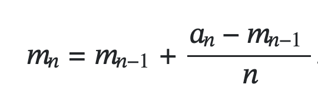{width=80%}
::::
:::

* Pub-Sub Systems
:::columns
::::{.column width=65%}
- Modern distributed systems use small, independent components
  - Serverless architectures, microservices (e.g., Uber)
  - Easier evolution, isolation, scalability
- Publish-subscribe (pub-sub) systems
  - Also called message queues or message brokers
  - Connect producers and consumers for event distribution
  - Topics cluster related messages
  - Typically provide lightweight dissemination rather than complex queries
  - Examples: AWS SQS, Kinesis, Kafka, RabbitMQ, Redis Streams, Celery, JBoss
::::
::::{.column width=35%}
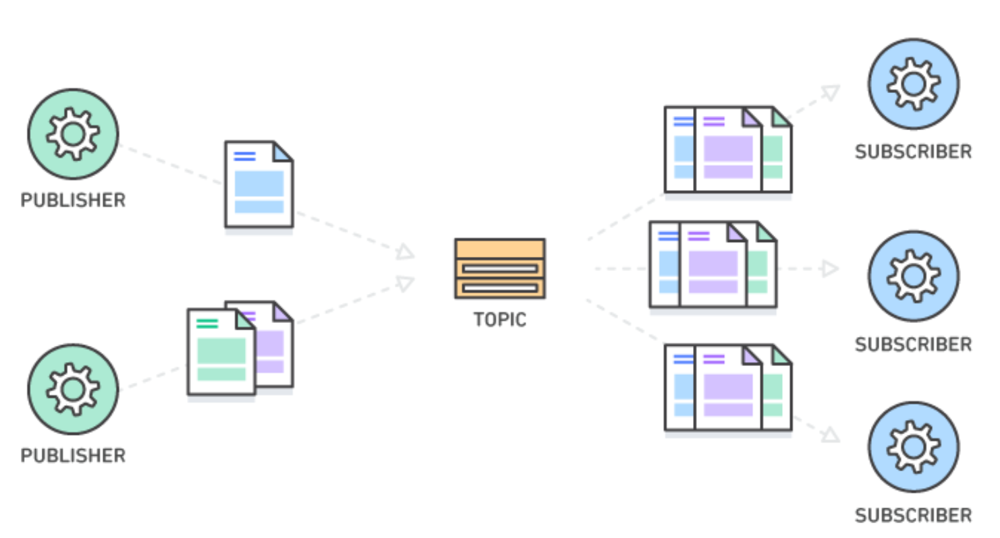
::::
:::

* Pub-Sub Systems
:::columns
::::{.column width=45%}
- Publishers send messages
- Subscribers consume messages
- Message broker routes events based on topics and subscriptions

- Key design considerations
  - Event distribution model (topics, filters)
  - Push vs pull consumption
  - Subscriber interest patterns
  - Delivery guarantees
    - At-most-once
    - At-least-once
    - Exactly-once
::::
::::{.column width=50%}
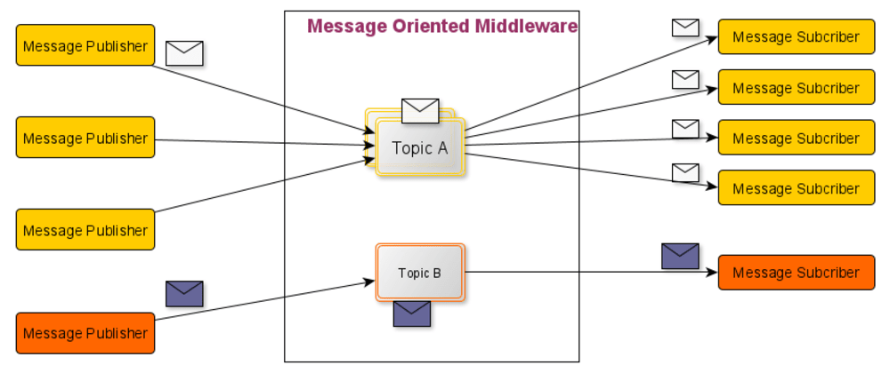
::::
:::

* Delivery Semantics
:::columns
::::{.column width=60%}
- At-most-once
  - Messages may be lost and not retried
  - High-performance and simple
  - Works when occasional loss is acceptable

- At-least-once
  - Messages retried until acknowledged
  - Ensures no loss but duplicates possible
  - Requires idempotent operations or deduplication

- Exactly-once
  - Each message processed once globally
  - Most consumer-friendly but hardest to guarantee
  - Used in financial and mission-critical systems
  - Complicated by distributed coordination limits
::::
::::{.column width=40%}
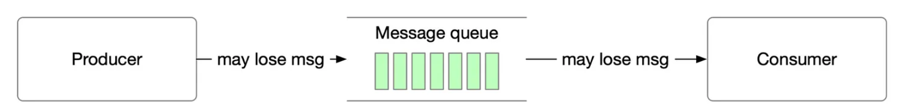

\vspace{1cm}

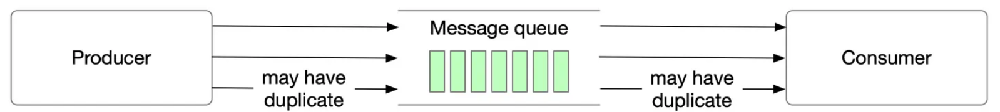

\vspace{1.5cm}

::::
:::

* Event vs Processing Time
:::columns
::::{.column width=60%}
- Event time: when the event occurred
- Processing time: when the system receives/processes it

- Common challenges
  - Events may arrive late or out of order
  - Determining how long to wait for stragglers is difficult
  - Systems set bounds on lateness; extremely late data may be dropped or trigger recomputation
::::
::::{.column width=50%}

::::
:::

* Apache Streaming Zoo
- Common frameworks: Apex, Beam, Flink, Kafka, Spark, Storm, NiFi
- Supports workloads such as:
  - Real-time analytics, continuous computation
  - Streaming ML, ETL pipelines
  - Messaging and log aggregation
- Differences arise in:
  - Batch vs streaming orientation
  - Delivery semantics
  - Compute vs pub-sub roles
  - Throughput, latency, fault tolerance
  - API and language support

* Apache Storm
- Distributed real-time computation engine (originated at Twitter)
- Horizontally scalable and fault-tolerant
- Uses DAGs: spouts (sources) and bolts (processing)
- Strong for multi-stage, low-latency workflows

* Apache Kafka
:::columns
::::{.column width=75%}
- Distributed streaming platform (originated at LinkedIn)
- Core components: producers, brokers, consumers, topics, partitions
- Persistent, replicated log storage
- High throughput, low latency
- Delivery: at-least-once, at-most-once, exactly-once
- Kafka Connect for integration with external systems
- Kafka Streams for native stream processing
::::
::::{.column width=25%}
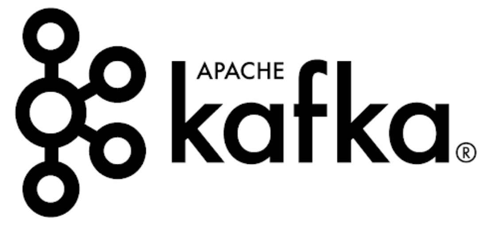{width=30%}

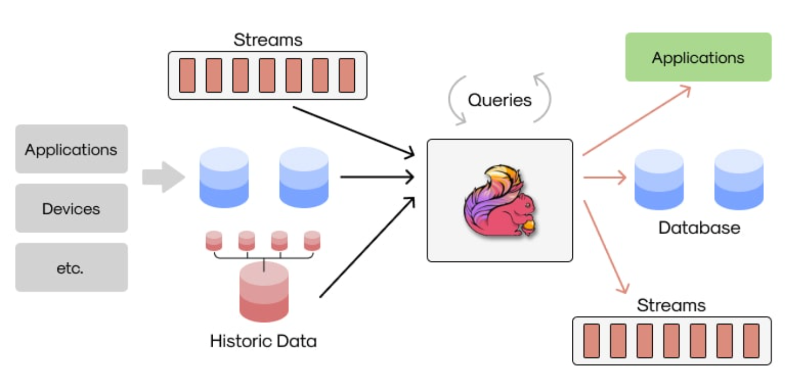
::::
:::

* Apache Flink
- Distributed processing engine with strong support for stateful streaming
- Exactly-once semantics via checkpointing and robust state management
- Unified API for batch and streaming
- Rich windowing functions
- Runs on standalone clusters, YARN, Mesos, Kubernetes, and cloud

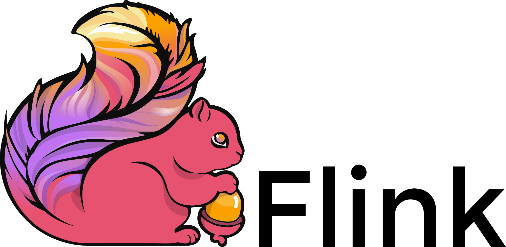

* Record-at-a-time Processing
:::columns
::::{.column width=60%}
- Used by Kafka Streams and similar engines
- Operates on each record individually through a DAG of nodes
- Pros
  - Extremely low latency (milliseconds)
- Cons
  - Expensive failure recovery
  - Sensitive to stragglers
::::
::::{.column width=35%}
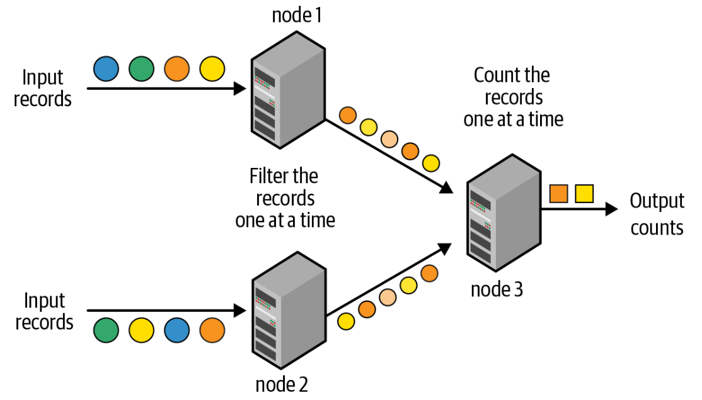
::::
:::

* Micro-Batch Stream Processing
:::columns
::::{.column width=60%}
- Used in Spark Streaming (DStreams)
- Break stream into small batches (e.g., 1-second windows)
- Pros
  - Strong fault tolerance and deterministic execution
  - Exactly-once guarantees via replay and scheduling
- Cons
  - Higher latency (seconds)
::::
::::{.column width=35%}
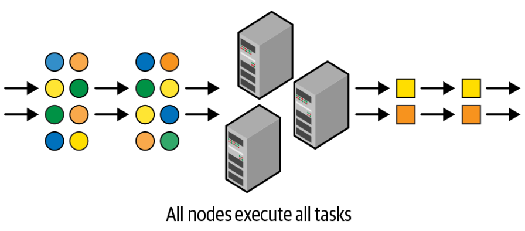
::::
:::

* Spark Micro-Batch Processing: Cons
- Boundary between batch and streaming can be unclear
- APIs largely similar but require separate abstractions
- Limited support for event-time windows in DStreams
- Structured Streaming replaces DStreams with unified semantics and support for both micro-batch and continuous execution

* Spark Structured Streaming
:::columns
::::{.column width=60%}
- Unified DataFrame/SQL-based model for both batch and streaming
- System manages state, faults, incremental computation, and late data
- Streaming table abstraction
  - Conceptually an unbounded table continuously appended with new rows
  - At time T, equivalent to a static DataFrame of all rows up to T
::::
::::{.column width=40%}

::::
:::

* Incrementalization
:::columns
::::{.column width=50%}
- Framework identifies necessary state across micro-batches
- Uses DAG analysis to compute updated results from prior state
- Developers specify trigger conditions for updates
- Results updated incrementally as events arrive
::::
::::{.column width=45%}
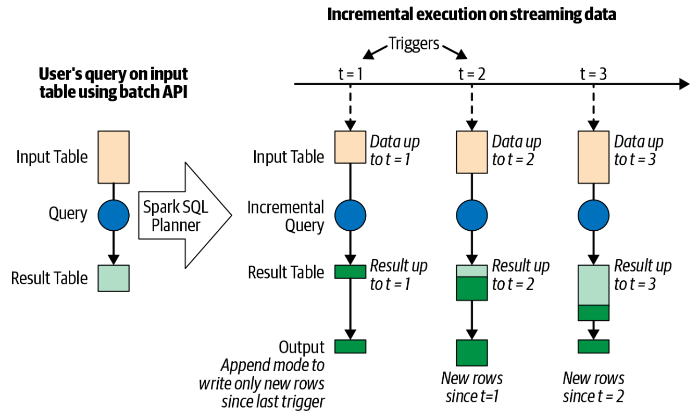
::::
:::

* Triggering Modes
- Default: process micro-batch immediately after previous completes
- Trigger interval: fixed-frequency execution (e.g., every 10 minutes)
- Once: external/manual trigger (e.g., end-of-day)
- Continuous (experimental): low-latency, limited operations

* Saving Data
- Output written to storage or databases each time the table updates
  - Append: new rows only, when existing rows are immutable
  - Update: update modified rows
  - Complete: rewrite full table (expensive)

* Spark Streaming "Hello world"
:::columns
::::{.column width=50%}
- lines is a DataStreamReader (unbounded DataFrame)
- words performs stateless transformations
- counts is a streaming DataFrame performing running aggregation
- Stateless ops: select, filter
- Stateful ops: count, aggregations
- Output requires specifying sink, mode, and trigger
- Checkpointing enables exactly-once guarantees and recovery
- start begins pipeline; awaitTermination blocks
::::
::::{.column width=50%}

::::
:::
