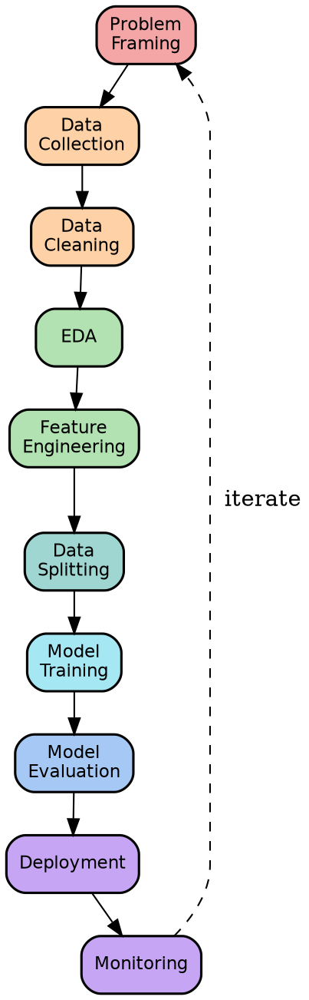
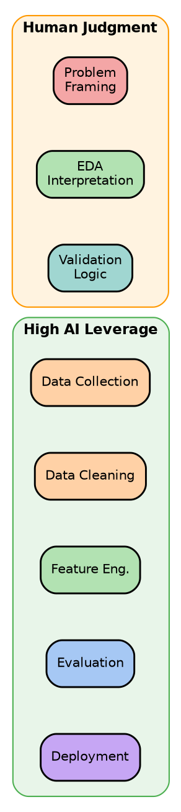
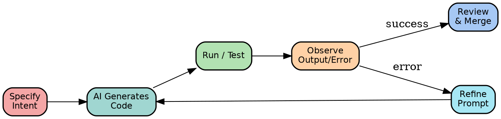
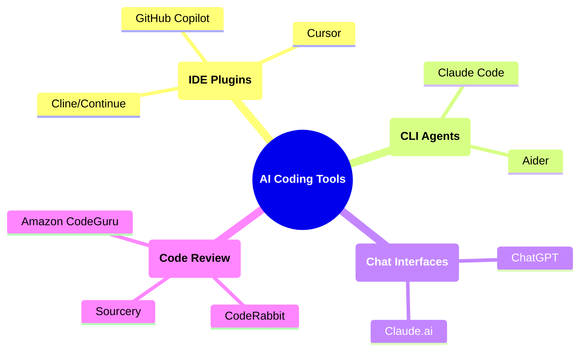
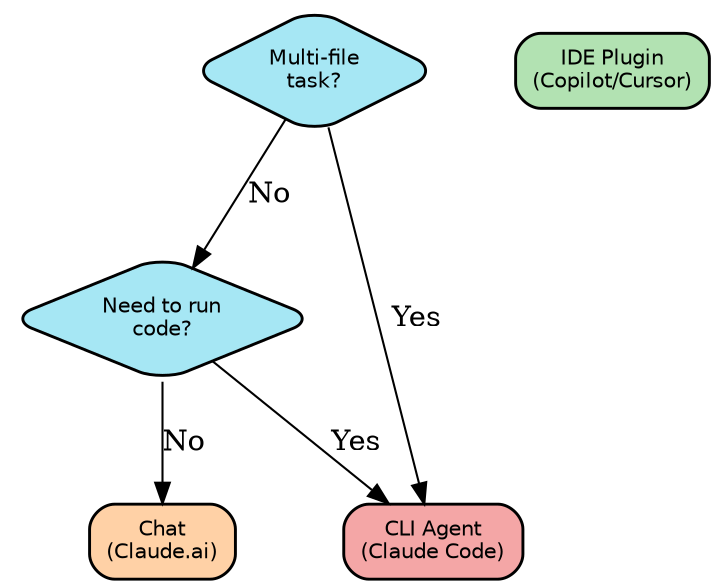

# Chapter 1: the AI Coding Revolution

## The ML Development Lifecycle

* Chapter 1: The AI Coding Revolution

- **Goal**: Understand how AI pair programming transforms ML development
  workflow and where AI assistance applies most effectively

- **Why this matters**:
  - ML projects are 80% engineering boilerplate, 20% judgment
  - AI tools now handle the 80%: freeing practitioners for the 20%
  - Developers who ignore these tools will be outpaced by those who use them

- **Roadmap**:
  1. ML development lifecycle and where AI fits
  2. Evolution of AI pair programming tools
  3. Tooling landscape and how to choose the right tool

* The ML Development Lifecycle: Overview

- @Definition@: The _ML development lifecycle_ is the sequence of steps from
  raw data to a deployed, monitored production model
::: columns
:::: {.column width=40%}
- Ten canonical stages:
  1. Problem framing
  2. Data collection
  3. Data cleaning
  4. EDA
  5. Feature engineering
  6. Data splitting
  7. Model training
  8. Model evaluation
  9. Deployment
  10. Monitoring
::::
:::: {.column width=60%}

::::
:::

* ML Lifecycle: Data Stages

- **Problem**: Raw data is messy, heterogeneous, and rarely model-ready
  - Source diversity: databases, APIs, streams, files, external datasets
  - Quality issues: nulls, duplicates, schema drift, encoding errors

- **Stage 1: Problem Framing**:
  - Convert _"we want to predict X"_ to precise problem specification
  - Define success metrics aligned to business impact

- **Stage 2: Data Collection**:
  - Ingest from multiple sources with retry/error handling
  - Enforce governance: GDPR, CCPA, audit trails

- **Stage 3: Data Cleaning**:
  - Handle missing values, outliers, duplicates, format inconsistencies
  - Cleaning decisions directly impact downstream model quality

* ML Lifecycle: Feature and Model Stages

- **Stage 4: EDA** (_exploratory data analysis_):
  - Univariate distributions, correlations, anomaly detection
  - Forms hypotheses that guide feature engineering

- **Stage 5: Feature Engineering**:
  - Create polynomial, lag, interaction, and domain-specific features
  - Encode categoricals; reduce dimensionality when needed

- **Stage 6: Data Splitting**:
  - Train / validation / test partitioning to prevent leakage
  - Stratified splits for imbalanced classes; time-series-aware splits

- **Stage 7: Model Training**:
  - Select algorithm family; tune hyperparameters; regularize
  - Track experiments with reproducible seeds and artifact versioning

- **Stage 8: Model Evaluation**:
  - Validate with business-aligned metrics (precision/recall/ROI)
  - Error analysis and ablation studies

* ML Lifecycle: Production Stages

- **Stage 9: Deployment**:
  - Package model into container; expose via REST API
  - A/B test with gradual rollout; maintain rollback capability

- **Stage 10: Monitoring**:
  - Track latency, throughput, data drift, concept drift
  - Trigger retraining when distribution shift detected

- **Key idea**: the lifecycle is a _loop_, not a pipeline
  - Monitoring insights flow back to problem framing
  - Each iteration incorporates new data and lessons learned

- **Example**: recommender system
  - Stage 10 reveals users click but not buy
    - $\to$ refine Stage 1 metric from Click-Through-Rate (CTR) to conversion
      rate
    - $\to$ re-engineer features and retrain

* AI in the ML Lifecycle: Where It Applies

- **Goal**: identify which stages benefit most from AI assistance
::: columns
:::: {.column width=55%}
- **High AI leverage** (repetitive, structured):
  - Data collection: query templates, API client boilerplate
  - Data cleaning: imputation scripts, format converters
  - Feature engineering: encoding pipelines, rolling windows
  - Evaluation harnesses: metric computation, report generation
  - Deployment configs: Dockerfile, FastAPI stubs

- **Lower AI leverage** (requires domain judgment):
  - Problem framing: defining what _success_ means
  - EDA interpretation: knowing which anomalies matter
  - Validation logic: catching subtle leakage patterns
::::
:::: {.column width=45%}

::::
:::

* The 80/20 Split: Boilerplate vs Judgment

- **Key idea**: In ML projects
  - 80% of code is _structural boilerplate_
  - 20% is _judgment-intensive logic_

- **The 80%: AI handles**:
  - Data loading and schema parsing
  - Standard preprocessing pipelines
  - Metric computation and report templates
  - Config files, Dockerfiles, API stubs
  - Logging, retry logic, error handlers

- **The 20%: Humans own**:
  - Choosing what to predict and why
  - Deciding which features capture domain knowledge
  - Interpreting ambiguous model failures
  - Setting risk thresholds for business impact
  - Validating correctness of evaluation logic

- **Remark**: AI frees developer attention for the judgment-intensive 20%
  - Not eliminating the developer: _amplifying_ the developer

* What AI Handles Well

- **Fact**: AI excels at tasks with clear patterns and abundant training signal

- **Pattern 1: Template instantiation**:
  - _"Write a pandas pipeline that reads CSV, drops nulls, scales numeric
    columns"_
  - High precision because training data contains thousands of such patterns

- **Pattern 2: Boilerplate from specification**:
  - Type hints + docstring $\to$ working implementation
  - Schema definition $\to$ API endpoint with validation

- **Pattern 3: Transformation and refactoring**:
  - Convert procedural code to vectorized operations
  - Apply linting rules across a file automatically

- **Pattern 4: Test scaffolding**:
  - Generate unit test stubs from function signatures
  - Parametrize test cases from edge-case descriptions

- **Example**: AI generates a complete `sklearn` preprocessing pipeline from a
  brief description in under 10 seconds; manual writing takes 5-10 minutes

* What Requires Human Judgment

- **Problem**: AI cannot substitute for domain expertise and contextual
  reasoning

- **Judgment 1: Problem framing**:
  - _"Should we minimize false positives or false negatives?"_ depends on
    business cost structure AI does not know
  - Defining the right success metric requires stakeholder alignment

- **Judgment 2: Data quality decisions**:
  - Is a missing value truly missing or _structurally absent_ (e.g., no purchase
    history means no history, not null)?
  - AI cannot distinguish without domain knowledge

- **Judgment 3: Leakage detection**:
  - A feature that correlates perfectly with the target may be a proxy for the
    label created _after_ prediction time
  - Requires timeline reasoning about data generation

- **Judgment 4: Interpreting failures**:
  - Model errors concentrated in a demographic slice $\to$ fairness issue or
    data artifact? Only a human can investigate

// TODO

## The Evolution of AI Pair Programming

* From Autocomplete to AI Agents

- @Definition@: _AI pair programming_ is the use of language models to assist
  software development tasks in real time

- **Key idea**: the unit of AI assistance has grown over time:

  $$
\text{token} \to \text{line} \to \text{function} \to \text{file} \to \text{project}
  $$

- **Three eras**:
  1. **Pre-2021**: autocomplete and linting: token-level suggestions
  2. **2021-2023**: function-level code generation via LLMs
  3. **2024+**: multi-file, context-aware agentic workflows

- **Why it matters**: each transition multiplies developer throughput
  - Token-level: saves keystrokes
  - Function-level: saves minutes
  - File-level: saves hours
  - Project-level: saves days

* Era 1: Autocomplete and Linting Tools (pre-2021)

- **Context**: before LLMs, developer assistance was rule-based and
  pattern-matching

- **Tools**:
  - Syntax completion: IDE tabs, `IntelliSense`, `jedi`
  - Linters: `flake8`, `pylint` -- flag style and errors
  - Type checkers: `mypy` -- catch type mismatches statically
  - Formatters: `black`, `isort` -- enforce consistent style

- **Capabilities**:
  - Suggest variable names from current scope
  - Complete method signatures from class definition
  - Flag undefined variables and unreachable code

- **Limitations**:
  - No understanding of _intent_; purely syntactic
  - Cannot generate novel code -- only complete known patterns
  - Cannot explain or refactor; only flag issues

- **Remark**: these tools remain valuable alongside LLMs as a first-pass quality
  gate after AI generation

* GitHub Copilot (2021): First Key Inflection Point

- **Context**: GitHub and OpenAI jointly released Copilot in June 2021, trained
  on public GitHub repositories using Codex (GPT-based)

- **Innovation**: first tool to suggest _entire functions_ from a docstring or
  comment describing intent

- **Example**:
  - Input: `# Compute rolling 7-day average of sales, excluding nulls`
  - Output: complete `pandas` implementation, correctly handling edge cases

- **Impact**:
  - Shifted the unit of AI assistance from _token_ to _function_
  - Demonstrated that LLMs trained on code could generalize across languages
  - Validated the IDE-integrated pair-programming paradigm

- **Pros**:
  - Low friction: inline suggestions inside existing IDE workflow
  - Handles boilerplate fast

- **Cons**:
  - No project context beyond the open file
  - Cannot run code or observe errors

* ChatGPT (2023): Conversational Coding Revolution

- **Context**: OpenAI released ChatGPT (GPT-3.5/4) in late 2022; by 2023 it
  became a primary coding assistant for millions of developers

- **Innovation**: conversational interface for iterative code generation and
  debugging

- **Workflow enabled**:
  1. Developer pastes error traceback
  2. Model explains root cause in plain language
  3. Developer asks for fix; model regenerates corrected code
  4. Repeat until working

- **Pros**:
  - Handles multi-turn context within a conversation
  - Can explain code, suggest architecture, review logic
  - No installation required; accessible via browser

- **Cons**:
  - Context is ephemeral; no persistent project knowledge
  - Cannot execute code or read files directly
  - Copy-paste friction slows the feedback loop

- **Key inflection**: proved LLMs could reason about _entire codebases_ if
  provided enough context

* Agentic CLI Tools (2024+): The Third Wave

- @Definition@: _agentic CLI tools_ are AI assistants that can read files, run
  shell commands, iterate on errors, and edit code autonomously within a project
  directory

- **Aka**: coding agents, CLI agents, autonomous coding assistants

- **Key capabilities** (beyond chat):
  - Read and edit arbitrary files in the project
  - Run tests, observe failures, and iterate
  - Execute shell commands and inspect output
  - Maintain project-level context across many files

- **Examples**: Claude Code, Cursor (agent mode), Cline/Continue, Aider

- **Innovation**: the unit shifts from _function_ to _file_ or _project_
  - Agent reads `CLAUDE.md` or similar context files
  - Can implement a feature across 5 files in one session

- **Cons**:
  - Higher failure rate on large, ambiguous tasks
  - Risk of cascading errors in multi-step edits
  - Requires careful review of AI-generated diffs

* The Unit of AI Assistance: Token to Project

- **Goal**: understand how the scope of AI assistance has expanded each era

\begingroup \scriptsize | **Era** | **Years** | **Unit** | **Key Tool** | **Time
Saved** | | ------------- | ------------ | ----------- | -------------------- |
--------------- | | Autocomplete | pre-2021 | Token/Line | IntelliSense, jedi |
Keystrokes | | LLM Copilot | 2021-2022 | Function | GitHub Copilot | Minutes | |
Chat | 2022-2023 | Session | ChatGPT, Claude | Hours | | Agent/CLI | 2024+ |
File/Project| Claude Code, Cursor | Days | \endgroup

- **Intuition**: each shift multiplies the "blast radius" of a single prompt
  - Copilot: one function per suggestion
  - Chat: multiple functions per conversation
  - Agent: multiple files per session

- **Key idea**: the developer role shifts from _writing_ code to _specifying_,
  _reviewing_, and _validating_ code

* Context Window as the Enabling Technology

- **Problem**: early LLMs had short context windows (2K-4K tokens), limiting how
  much code they could reason about at once

- **Solution**: context window expansion enabled project-scale assistance

- **Timeline**:
  - GPT-3 (2020): 4K tokens $\approx$ 3,000 words
  - GPT-4 (2023): 32K tokens $\approx$ 24,000 words
  - Claude 3 (2024): 200K tokens $\approx$ 150,000 words
  - Claude 4+ (2025): 1M+ tokens $\approx$ entire codebases

- **Implication for ML projects**:
  - Small context: can only see one function at a time
  - Large context: can see entire data pipeline, feature store, and model code
    simultaneously
  - Agent can reason about cross-file dependencies and architectural consistency

- **Remark**: context size is not sufficient alone -- models must also
  _retrieve_ and _weight_ the relevant parts of a large context efficiently

* The Shift in Developer Role

- **Problem**: as AI handles more implementation, what is the human's job?

- **Old model** (pre-AI):
  - Developer writes every line
  - Most time spent on syntax, boilerplate, lookup, and mechanical editing

- **New model** (AI-assisted):
  - Developer specifies intent, constraints, and requirements
  - AI generates first draft; developer reviews, tests, and refines
  - Developer owns architecture, validation, and domain logic

- **Analogy**: the shift is similar to moving from assembly code to high-level
  languages -- the abstraction level rises without eliminating the programmer

- **Key idea**: the most valuable developer skill is now _problem
  specification_: writing precise, unambiguous descriptions of desired behavior

- **Remark**: junior developers may struggle more -- the AI does not teach
  fundamentals; it assumes them

* AI-Assisted ML Development Workflow

- **Goal**: show how AI integrates into the iterative development cycle

- **Key idea**: treat AI output as a _draft_, not a solution
  - First generation: establish structure
  - Iterations: refine logic, fix edge cases, improve style
  - Human: reviews diff before merging

## Tooling Landscape

* Tooling Landscape: Overview

- **Goal**: map available AI coding tools and their best use cases

- **Two primary categories**:
  - _IDE plugins_: integrated into editor; low friction; limited autonomy
  - _CLI agents_: terminal-based; higher autonomy; can run commands and edit
    files

* IDE Integrations: GitHub Copilot

- @Definition@: _GitHub Copilot_ is an LLM-powered IDE plugin that suggests
  code completions inline as you type

- **How it works**:
  - Sends surrounding code (file prefix + suffix) as context
  - Returns single-line or multi-line completions
  - Tab to accept; Escape to reject

- **Strengths**:
  - Zero context-switching: stays inside the editor
  - Works across 30+ languages
  - Copilot Chat adds conversational Q&A within the IDE

- **Limitations**:
  - Context limited to open files (no cross-file project awareness by default)
  - Cannot run code or observe test results
  - Suggestions may silently hallucinate APIs

- **Best for**:
  - Boilerplate completion during active coding
  - Function-level generation from docstrings
  - Quick inline transformations

* IDE Integrations: Cursor and Cline/Continue

- **Cursor**:
  - Fork of VS Code with LLM deeply integrated
  - Codebase indexing: can reference any file in the project
  - Agent mode: autonomously edits multiple files per task
  - Inline diff review before accepting changes

- **Cline / Continue**:
  - Open-source VS Code extensions
  - Model-agnostic: works with Claude, GPT-4, local models
  - Cline adds agentic capabilities (file edit, terminal execution)
  - Continue focuses on inline chat and documentation lookup

- **Comparison**:
  - Cursor: polished, proprietary, better for teams already on VS Code
  - Cline: flexible, open-source, supports more backends

- **Key idea**: IDE-integrated agents reduce friction but still require the
  developer to be inside the editor workflow

* Claude Code: CLI Agent

- @Definition@: _Claude Code_ is Anthropic's CLI coding agent -- a terminal
  program that reads project files, writes code, and runs commands autonomously

- **Key capabilities**:
  - Reads and edits files across the project directory
  - Executes shell commands (tests, linters, build scripts)
  - Persists project context via `CLAUDE.md` configuration files
  - Supports skills: versioned, reusable prompt workflows

- **Workflow**:
  1. Navigate to project directory in terminal
  2. Invoke `claude` with a natural language task
  3. Agent reads relevant files, generates edits, runs tests
  4. Developer reviews diffs and approves

- **Example**:
  - _"Add input validation to all FastAPI endpoints and write unit tests"_
  - Agent reads all endpoint files, adds validation, generates tests, runs them

- **Best for**: multi-file tasks, project-spanning refactors, workflow
  automation

* CLI Agents vs IDE Plugins: Comparison

- **Goal**: choose between agent types based on task characteristics

\begingroup \scriptsize | **Dimension** | **IDE Plugin** (Copilot, Cursor) |
**CLI Agent** (Claude Code, Aider) | | -------------------- |
-------------------------------- | ----------------------------------- | |
Context scope | Open files only (or indexed) | Full project directory | | Code
execution | No (IDE plugin only) | Yes (runs shell commands) | | Autonomy level
| Low: suggests, human types | High: edits files, runs tests | | Feedback loop |
Instant, inline | Batch: review diffs after | | Best task size | Line to
function | Function to multi-file feature | | Risk of error | Low (small scope)
| Higher (multi-file cascade) | | Setup required | IDE extension install | CLI
install + `CLAUDE.md` config | \endgroup

- **Rule of thumb**:
  - Single-function task $\to$ IDE plugin
  - Multi-file feature or refactor $\to$ CLI agent
  - Cross-repo or deployment task $\to$ CLI agent with careful review

* LLM-Powered Code Review Tools

- @Definition@: _code review tools_ use LLMs to analyze diffs and flag bugs,
  security issues, and style violations automatically

- **Tools**:
  - **CodeRabbit**: reviews GitHub/GitLab PRs inline; comments on diffs
  - **Sourcery**: Python-focused; suggests refactors and simplifications
  - **Amazon CodeGuru**: AWS-integrated; profiling and security scanning

- **What they catch**:
  - Security vulnerabilities: SQL injection, open redirects, hardcoded secrets
  - Logic errors: off-by-one, null dereference, resource leaks
  - Style: naming inconsistencies, dead code, unnecessary complexity

- **What they miss**:
  - Business logic errors (no domain knowledge)
  - Incorrect test assumptions
  - Subtle data leakage in ML pipelines

- **Best practice**: use alongside human review, not as a replacement
  - AI review catches 60-70% of common issues; human review catches the rest

* Choosing the Right Tool for Your Task

- **Problem**: with many tools available, choosing incorrectly wastes time or
  leaves value on the table

- **Framework**:
  - _Scope_: how many files does the task touch?
  - _Iteration speed_: do I need instant feedback or can I review a batch diff?
  - _Execution_: does the task require running code (tests, linters, build)?
  - _Autonomy tolerance_: am I comfortable reviewing multi-file AI edits?

- **Decision rules**:
  1. Single-function completion $\to$ IDE plugin (Copilot, Cursor)
  2. Multi-turn debugging conversation $\to$ Chat (Claude.ai, ChatGPT)
  3. Multi-file feature implementation $\to$ CLI agent (Claude Code, Aider)
  4. PR review and security scan $\to$ code review tool (CodeRabbit)

- **Key idea**: the best workflow combines tools -- use an IDE plugin for active
  coding, CLI agent for larger tasks, and review tool for PRs

* Tool Selection: Decision Framework

::: columns
:::: {.column width=50%}
- **Question**: What is the task scope?

- **Answer: line/function** $\to$ IDE plugin
  - Low friction, instant
  - Copilot, Cursor inline

- **Answer: function/module** $\to$ Chat
  - Good for design discussion
  - Claude.ai, ChatGPT

- **Answer: multi-file feature** $\to$ CLI agent
  - Reads project, runs tests
  - Claude Code, Aider, Cline
::::
:::: {.column width=50%}

::::
:::

* Combining Tools in an ML Workflow

- **Goal**: show how multiple tools complement each other in a real project

- **Phase 1 -- Active coding** (IDE plugin):
  - Use Copilot/Cursor to write data loading, preprocessing functions
  - Inline suggestions for standard patterns

- **Phase 2 -- Design and debugging** (Chat):
  - Discuss architecture choices with Claude.ai
  - Paste tracebacks; iterate on explanations

- **Phase 3 -- Feature implementation** (CLI agent):
  - Task Claude Code to implement feature across 3-5 files
  - Agent runs tests, fixes failures, produces diff for review

- **Phase 4 -- PR review** (Code review tool):
  - Submit PR; CodeRabbit scans for security and logic issues
  - Human reviews remaining concerns

- **Example**: building a feature store
  - Copilot: individual transformation functions
  - Claude Code: wires transformations into full pipeline with tests
  - CodeRabbit: flags a SQL injection in a dynamic query

* Benefits of AI-Assisted Development

- **Benefit 1 -- Speed**:
  - Boilerplate that takes 30 minutes manually: 2 minutes with AI
  - Enables rapid prototyping and iteration

- **Benefit 2 -- Quality floor**:
  - AI-generated code includes docstrings, type hints, and error handling that
    developers often skip under time pressure
  - Consistent style from the start

- **Benefit 3 -- Knowledge access**:
  - AI knows best practices across thousands of libraries
  - _"What is the correct way to handle timezone-aware datetimes in pandas?"_
    answered in seconds

- **Benefit 4 -- Focus shift**:
  - Developers spend less time on syntax and more on design and validation
  - Higher-order thinking protected from mechanical interruptions

- **Benefit 5 -- Accessibility**:
  - Junior developers can implement complex patterns with AI guidance
  - Lowers the floor for contributing to production systems

* Limitations and Risks

- **Problem**: AI assistance introduces new failure modes that practitioners
  must understand

- **Risk 1 -- Confident errors**:
  - AI generates syntactically valid code that is logically wrong
  - No compiler error; fails only at runtime or in edge cases

- **Risk 2 -- Hallucinated APIs**:
  - AI invents function signatures for libraries it has seen in training
  - Code looks correct; crashes with `AttributeError` at runtime

- **Risk 3 -- Silent data leakage**:
  - AI-generated feature pipelines may leak target information
  - Produces optimistic metrics; fails in production

- **Risk 4 -- Security vulnerabilities**:
  - AI may generate SQL strings via f-string interpolation (injection risk)
  - Treat AI-generated code as _untrusted input_ requiring security review

- **Mitigation**:
  - Mandatory static analysis: `ruff`, `mypy`, `bandit` after every generation
  - Run tests before accepting any multi-file diff
  - Ask the model to explain its own code; gaps reveal correctness gaps

* The Future of AI Pair Programming

- **Trend 1 -- Longer context windows**:
  - Models that hold entire codebases in context simultaneously
  - Agent reasons about global consistency, not just local changes

- **Trend 2 -- Specialized ML models**:
  - Models fine-tuned on ML code (notebooks, `sklearn`, `torch` patterns)
  - Higher precision on data science tasks

- **Trend 3 -- Multi-agent workflows**:
  - Planner agent decomposes task; coder agents implement in parallel
  - Reviewer agent validates output before merging

- **Trend 4 -- Tighter feedback loops**:
  - Agent observes test results in real time and self-corrects
  - Approaching fully autonomous feature development for well-specified tasks

- **Key idea**: the practitioner's competitive advantage is not in writing code
  faster -- it is in _specifying_, _reviewing_, and _validating_ AI work better
  than peers

* Chapter Summary

- **The ML development lifecycle** has 10 stages from problem framing to
  monitoring; AI applies most powerfully in the 80% that is boilerplate

- **The 80/20 split**: AI handles repetitive structure; practitioners own
  problem framing, validation logic, and domain judgment

- **Three eras of AI pair programming**:
  1. Autocomplete (pre-2021): token-level
  2. LLM copilots (2021-2023): function-level
  3. Agentic CLI (2024+): file- and project-level

- **Tooling landscape**:
  - IDE plugins for inline, low-friction suggestions
  - CLI agents for multi-file autonomous tasks
  - Chat for design and debugging conversations
  - Code review tools for PR-time security and logic scanning

- **Key risks**: confident errors, hallucinated APIs, leakage, security flaws --
  mitigate with static analysis and mandatory test runs

- **Looking forward**: practitioners who master specification, review, and
  validation of AI-generated code will outpace those who do not
