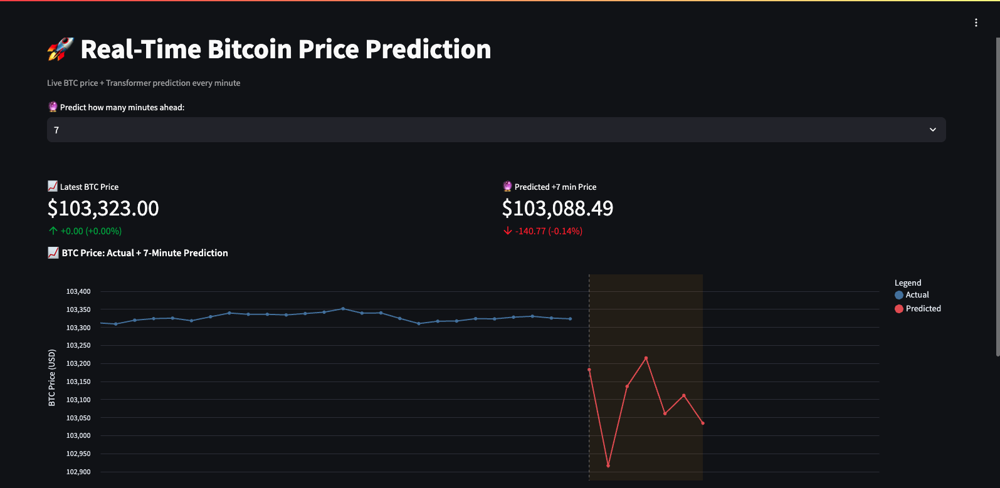
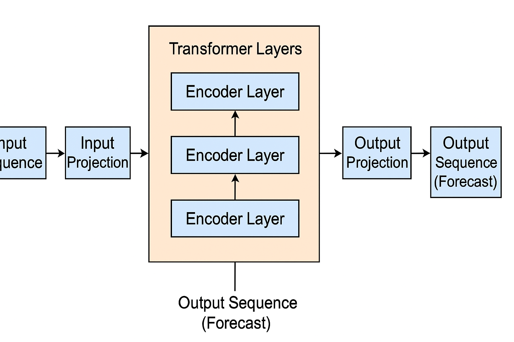

# 🧠 Real-Time Bitcoin Price Prediction using Transformers

This project demonstrates a real-time Bitcoin price forecasting system built using Transformer-based deep learning models. It fetches minute-level BTC/USD data, applies preprocessing, and predicts future prices using a fine-tuned Transformer. The results are visualized in an interactive Streamlit dashboard.

---

## 📦 Project Structure

```
.
├── btc.API.md                      # API documentation
├── btc.API.py                      # Main app script
├── docker_data605_style/           # Docker build environment and scripts
│   ├── Dockerfile
│   ├── requirements.txt
│   ├── run_jupyter.sh
│   ├── docker_run.sh
│   ├── docker_build.sh
│   ├── etc_sudoers
│   ├── version.sh
│   ├── ...
├── download_btc_data.sh            # Script to fetch BTC data
├── btc.training.ipynb             # Model training notebook
├── .env                            # API keys and secrets
├── .gitignore                      # Git ignored files
├── README.md                       # Project documentation
├── utils/                          # Utility modules and models
│   └── model.py
├── database/                       # Stores Training and session data
```

---

## 🚀 Features

- ✅ **Real-time prediction** with live BTC/USD data
- ✅ **Transformer-based model** trained on minute-resolution data
- ✅ **Streamlit dashboard** with interactive charts
- ✅ **Dockerized environment** for reproducibility
- ✅ **Auto-scaling axes, tooltips, and legends** for prediction vs actual

---

## 🔧 Getting Started

### 1. Clone the repository

```bash
git clone https://github.com/causify-ai/tutorials.git
cd DATA605/Spring2025/projects/TutorTask110_Spring2025_Real-Time_Bitcoin_Analysis_Using_Transformers/
```

### 🔐 API Key Setup

This project requires API access for live and historical Bitcoin data.

---

#### ✅ **1. CryptoCompare API (Required for Real-Time Forecasting)**

To fetch real-time Bitcoin price data, the app uses the [CryptoCompare API](https://min-api.cryptocompare.com/). You **must** provide a valid API key.

**How to get it:**

1. Go to [https://www.cryptocompare.com/](https://www.cryptocompare.com/)
2. Sign up or log in.
3. Navigate to **Dashboard → API Keys**
4. Create or copy an existing API key.

**How to set it:**

1. Create a `.env` file in the project root.
2. Add the following line:

   ```env
   CRYPTO_COMPARE_API_KEY=your_actual_api_key_here
   ```

3. Save the file. The app will automatically load it via `python-dotenv`.

> ⚠️ **Note:** Do not commit `.env` to Git — it's already listed in `.gitignore` for safety.

---

#### 🟡 **2. Kaggle API (Optional for Historical Data Download, SKIP THIS STEP IF YOU WANT TO USE PRETRAINED MODEL!!!)**

#####

The `download_btc_data.sh` script uses the [Kaggle API](https://www.kaggle.com/docs/api) to download historical 1-minute BTC data.

**To use it:**

1. Go to [https://www.kaggle.com/account](https://www.kaggle.com/account) and scroll to the API section.
2. Click **"Create New API Token"** — this will download a `kaggle.json` file.
3. Move `kaggle.json` to:

   - `~/.kaggle/` (Linux/macOS)
   - `%USERPROFILE%\.kaggle\` (Windows)

4. Make the script executable:

```bash
   chmod +x download_btc_data.sh
```

5. Run the script:

```bash
bash download_btc_data.sh
```

**Alternatively:**

You can manually download the dataset from Kaggle:  
📎 [Bitcoin Historical Data — mczielinski](https://www.kaggle.com/datasets/mczielinski/bitcoin-historical-data)

After download, place the CSV file in the database/btc_data directory to proceed with offline use.

## RUN THE APP

Make sure the docker software is installed and running in the background before running the below commands.

### 1. Build Docker image

```bash
cd docker_data605_style
./docker_build.sh
```

### 2. Run the container

```bash
./docker_run.sh
```

You are automatically redirected to the Streamlit dashboard for realtime bitcoin prediction. Open: [http://localhost:8501](http://localhost:8501) if it does not open automatically.

---

## 🔍 Forecast Dashboard

Below is a preview of the real-time BTC prediction dashboard:



## 🧠 Model Overview

- **Architecture:** Transformer Encoder with custom attention
- **Input:** 1-minute interval historical prices (OHLCV)
- **Output:** Next-minute price forecast
- **Trained using:** PyTorch

---

## 🧠 Transformer Architecture

The diagram below illustrates the structure of the multi-step Transformer model used for BTC price forecasting:



## ⚙️ Tech Stack

- Python 3.8+
- PyTorch
- Streamlit
- Docker
- Pandas, NumPy, Altair
- CryptoCompare API (or similar)

---

## 📈 Dashboard Preview

> 📉 Shows actual vs predicted prices  
> 🔁 Auto-refreshes with live data  
> 📍 Tooltip + zoom + line legend

---

## 📝 License

This project is licensed under the [MIT License](LICENSE).

---

## 🤝 Acknowledgments

- Transformer inspiration: Vaswani et al., _Attention is All You Need_
- Data source: [CryptoCompare](https://min-api.cryptocompare.com)
- Streamlit App Design: Inspired by community best practices

---

## 👨‍💻 Author

**Chanakya**  
Graduate Data Science Researcher  
_University of Maryland, College Park_
