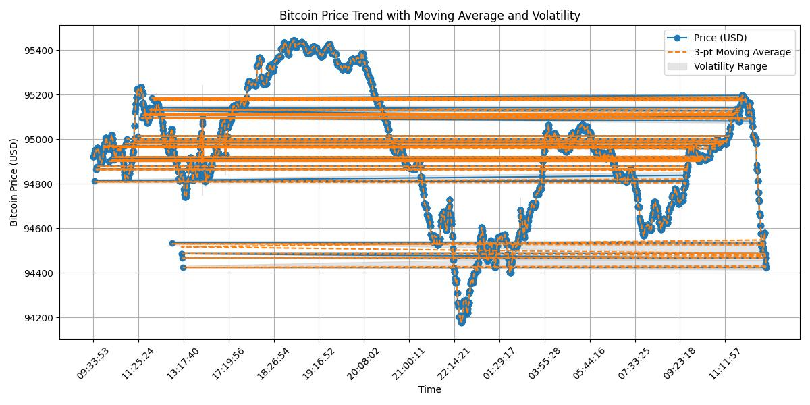
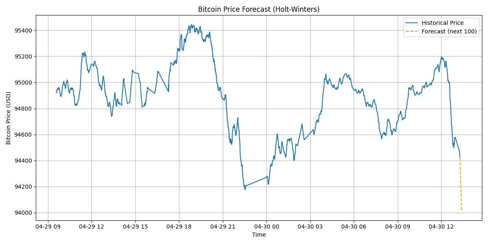

# Bitcoin Example Monitor — Advanced Validation & Time Series Analysis

## Table of Contents

- [Bitcoin Example Monitor — Advanced Validation & Time Series Analysis](#bitcoin-example-monitor--advanced-validation--time-series-analysis)
- [Purpose of this Document](#purpose-of-this-document)
- [Module Overview](#module-overview)
- [Detailed File Breakdown](#detailed-file-breakdown)
  - [Module: bitcoin.example.py](#module-bitcoinexamplepy)
  - [Module: bitcoin.example.ipynb](#module-bitcoinexampleipynb)
- [Conclusion](#conclusion)

---

## Purpose of this Document

This document explains how the extended monitoring and analysis module `bitcoin.example.py` expands upon the core ingestion pipeline to support iterative validation, alert logging, trend analysis, and volatility spike detection.

It also introduces the supporting notebook `bitcoin.example.ipynb`, which demonstrates how to use the monitor interactively.

---

## Module Overview

The `bitcoin.example.py` file defines the `BitcoinMonitor` class, which builds on top of the `BitcoinAPI` pipeline.  
It automates repeated data fetching and validation over time, logs failed validations, and includes tools to visualize price trends and volatility.  
It is designed for real-time monitoring and forecasting preparation.

---

## Detailed File Breakdown

The following two components work together to implement advanced monitoring, trend visualization, and forecasting on top of the validated data pipeline:

- **`bitcoin.example.py`**  
  Defines the `BitcoinMonitor` class, which extends the base ingestion and validation workflow by incorporating periodic data fetching, volatility spike detection, statistical summaries, and price forecasting using the Holt-Winters method.

- **`bitcoin.example.ipynb`**  
  A demonstration notebook that shows how to use the `BitcoinMonitor` class in practice.  
  It allows users to run the monitor, re-validate the CSV log, and visualize historical Bitcoin price trends and forecasts, including automatic plot saving.

---

### Module: bitcoin.example.py

This module defines the `BitcoinMonitor` class, which builds on the validated ingestion pipeline provided by `bitcoin.API.py`.  
It extends the system by introducing periodic monitoring, automated logging of validation failures,  
volatility spike detection, summary statistics, and future price forecasting using Holt-Winters exponential smoothing.  

This class is designed to simulate a real-world monitoring system for Bitcoin, where data quality is continuously assessed  
and anomalies or trends can be automatically detected and visualized.

---

### Class: BitcoinMonitor

---

#### Initialization

```python
BitcoinMonitor(interval_seconds=3, run_count=5, log_file="bitcoin_price_log.csv")
```

- **Purpose:**  
  Set up the monitoring frequency and log file for automated execution of the full pipeline.  
  This allows the system to fetch, validate, and log Bitcoin data in a loop, enabling continuous monitoring.  
  By default, the interval is set to 3 seconds and the loop runs 5 times, but both values can be freely adjusted to meet different use cases or durations.

- **Input Parameters:**
  - `interval_seconds`: Interval between each data fetch (in seconds).
  - `run_count`: How many times to fetch and validate.
  - `log_file`: CSV file to append data to.

- **Return Value:**  
  A `BitcoinMonitor` object ready to start a validation loop.

---

#### Method 1: run_loop()

```python
run_loop(verbose: bool = False) -> None
```

- **Purpose:**  
  Perform a repeated ingestion and validation loop based on the initialized settings.  
  This method ensures the system can continuously monitor and validate Bitcoin data in near real-time.

  1. If the API fails to return usable data (e.g., due to unstable network or API timeout), and all critical fields are missing (except timestamp), the system will classify this as a **fetch failure**. Such entries are skipped entirely and **not passed to the validation step**.
  
  2. For all successfully fetched data, a full validation is performed using the logic defined in the `BitcoinAPI` class (refer to `bitcoin.API.md` for detailed validation rules). If validation **fails**, the result is logged for alerting.

  3. Failed validations are recorded in a text file to support monitoring and diagnostics. The failure log is saved to:

     ```
     logs/validation_fail_log.txt
     ```

  This file accumulates all failure alerts in human-readable format and serves as an early warning mechanism for data issues.

- **Input Parameters:**
  - `verbose` (`bool`): If True, prints detailed validation logs to the console.

- **Return Value:**  
  None

---

#### Method 2: analyze_trend()

```python
analyze_trend() -> pd.DataFrame
```

- **Purpose:**  
  Load the historical Bitcoin price log from the CSV file and perform exploratory time-series analysis to visualize real-time market behavior.  
  The method includes multiple steps of analysis and statistical enhancements to provide a comprehensive view of the current price trends and potential anomalies:

  1. **Moving Average Calculation:**  
     A 3-point moving average is computed for `price_usd` to smooth out short-term fluctuations and reveal underlying trends. This helps identify the general direction of price changes across time.

  2. **Price Volatility Estimation:**  
     Rolling standard deviation is calculated over a 3-point window to estimate local volatility. This quantifies the degree of variability in price and is used to define expected fluctuation boundaries.

  3. **Anomaly Detection Using Z-Score:**  
     A z-score is calculated for the volatility column to detect statistically significant spikes.  
     Any data point where the absolute z-score exceeds 2 is flagged as a potential **volatility spike**, indicating a sudden change in price behavior that may warrant closer attention.

  4. **Trend Visualization:**  
     A comprehensive line chart is generated to illustrate:
     - Raw Bitcoin prices over time
     - Smoothed moving average trend
     - Shaded volatility bands (`price ± volatility`)
     - Highlighted timestamps where anomalies (volatility spikes) are detected

  5. **Summary Reporting:**  
     Key statistics such as average price, maximum and minimum price, and all detected volatility spikes (with timestamps and volatility values) are printed in the console to summarize the analysis.

  6. **Image Export:**  
     The resulting visualization is saved as a static image to the `./images/bitcoin_trend.jpg` path.  
     This plot serves as both a diagnostic tool and a potential artifact for reporting or presentation.

- **Input Parameters:**  
  None

- **Return Value:**  
  A processed `DataFrame` with added trend, difference, and volatility columns.

---

#### Method 3: generate_forecast()

```python
generate_forecast(df: pd.DataFrame) -> None
```

- **Purpose:**  
  Forecast Bitcoin prices for the next 100 time steps using Holt-Winters Exponential Smoothing.  
  This function is designed to extend the insight gained from real-time trend analysis by projecting future price movement based on historical data.  
  The method includes:

  1. **Time Delta Estimation:**  
     Automatically detects the typical time interval between two entries to ensure that forecast timestamps are aligned with real data intervals.

  2. **Model Fitting:**  
     Uses `statsmodels.tsa.holtwinters.ExponentialSmoothing` with an additive trend (no seasonality) to learn from the existing `price_usd` series.

  3. **Forecast Generation:**  
     Projects future price values (100 steps ahead), creating a time-indexed forecast series using the estimated interval.

  4. **Visualization:**  
     Generates a time-series plot showing:
     - Historical Bitcoin prices
     - Predicted prices for the next 100 intervals (shown as a dashed orange line)

  5. **Output Saving:**  
     The forecast image is saved to:
     ```
     ./images/bitcoin_forecast.jpg
     ```
     and also displayed inline for visual analysis.

- **Input Parameters:**
  - `df` (`pandas.DataFrame`): A historical dataset containing at least the `timestamp` and `price_usd` columns.

- **Return Value:**  
  None

---

### Module: bitcoin.example.ipynb

This notebook demonstrates the extended analytics phase **after real-time ingestion and validation**, leveraging the `BitcoinMonitor` class defined in `bitcoin.example.py`.

---

#### Notebook Workflow Summary

This Jupyter notebook (`bitcoin.example.ipynb`) showcases how to run the **post-validation monitoring and analytics pipeline** for Bitcoin price data using the `BitcoinMonitor` class.

Its main purpose is to demonstrate advanced capabilities **after** the core validation steps handled in `bitcoin.API.ipynb`. This notebook focuses on real-time analysis, anomaly detection, and short-term forecasting.

The workflow includes the following steps:

- **Import the `BitcoinMonitor` class**  
  Dynamically load the monitor class from `bitcoin.example.py`.

- **Create an instance of `BitcoinMonitor`**  
  Initialize the class using custom or default parameters. The default configuration fetches data every 3 seconds for 5 rounds.

- **Run the monitoring loop**  
  Execute `monitor.run_loop()` to repeatedly fetch and validate Bitcoin data in real time.  
  - If the data fetch fails due to API or network instability, the iteration is skipped automatically and not logged.  
  - If validation fails (according to the expectation suite in `bitcoin.API.py`), a timestamped warning is recorded in `logs/validation_fail_log.txt`.  
  This mechanism ensures that transient API issues are ignored, but structural data issues are systematically tracked for further investigation.

- **Analyze trend and volatility**  
  Use `monitor.analyze_trend()` to load and process historical data from `bitcoin_price_log.csv`.  
  This step helps assess short-term market patterns using techniques such as:  
  - 3-point moving averages to reveal recent price trends  
  - Rolling standard deviation to measure volatility  
  - Z-score anomaly detection to highlight sudden deviations from expected behavior  
  The resulting chart is saved to `./images/bitcoin_trend.jpg`, providing a fast visual summary of recent price dynamics.

- **Generate price forecast**  
  The `monitor.generate_forecast()` method applies the Holt-Winters Exponential Smoothing model (additive trend, no seasonality) to the historical data.  
  This method is chosen for its simplicity and effectiveness in modeling short-term non-seasonal trends, common in volatile assets like Bitcoin.  
  It forecasts the next 100 points using the time interval between the last two entries in the log.  
  The forecast plot is saved to `./images/bitcoin_forecast.jpg`, enabling early exploration of potential short-term price trajectories.

This notebook complements `bitcoin.API.ipynb` by extending the workflow with **visual insights**, **volatility diagnostics**, and **forecasting readiness**.

---

## Conclusion

The `bitcoin.example.py` module demonstrates how to apply the `BitcoinAPI` pipeline in a real-world continuous monitoring scenario.  
It showcases not only real-time ingestion and validation using Great Expectations, but also adds advanced analytical steps including:

- Trend visualization with moving averages  
- Volatility spike detection via Z-score  
- Holt-Winters forecasting for short-term Bitcoin price predictions  
- Automatic saving of plots to `./images` for reporting or presentation  

This comprehensive workflow ensures data quality, early anomaly detection, and actionable insights for cryptocurrency time-series analysis.  
Key outcomes of this implementation are summarized below:

1. **Large-Scale Data Collection**  
   To ensure sufficient data volume for meaningful time-series analysis and forecasting, we continuously ingested data using the monitor pipeline for over 24 hours.  
   The final dataset includes **6,030 records**, saved in:  
   `TutorTask127_Spring2025_Monitoring_Bitcoin_Prices_Using_Great_Expectations/bitcoin_price_log.csv`

2. **Validation Integrity**  
   All validation checks passed during the monitoring period.  
   We confirmed that **no failed records** were written to the log file:  
   `TutorTask127_Spring2025_Monitoring_Bitcoin_Prices_Using_Great_Expectations/logs/validation_fail_log.txt`  
   This confirms that our expectations suite is well-aligned with CoinGecko’s real-world data.

3. **Great Expectations Documentation**  
   Each validation cycle generated updated human-readable documentation, confirming expectation success rates and detailed schema checks.  
   The final documentation is saved as:  
   `TutorTask127_Spring2025_Monitoring_Bitcoin_Prices_Using_Great_Expectations/gx/uncommitted/data_docs/local_site/index.html`  
   This serves as an audit trail and visual summary of our data quality throughout the project.

4. **Volatility Analysis — Trend + Spike Detection**

<div style="margin-left: 2em">



</div>

- **Plot Description:**  
  - Blue line and dots: Real-time Bitcoin price.  
  - Orange dashed line: 3-point moving average to smooth short-term fluctuations.  
  - Gray shaded area: Volatility bounds based on moving standard deviation, used to detect anomalies.

- **Statistical Summary:**  
  - **Average Price**: 94,943.78 USD  
  - **Maximum Price**: 95,444.00 USD  
  - **Minimum Price**: 94,176.00 USD  

  This chart was generated based on the entire dataset of 6,030 Bitcoin price records collected over 24+ hours, ensuring statistical stability in the observed trends.

- **Analysis Highlights:**  
  1. The price demonstrates frequent short-term fluctuations, typical of the cryptocurrency market.  
  2. The volatility bounds effectively capture the acceptable price range; deviations beyond this range suggest potential anomalies.  
  3. Z-score filtering was applied to detect spikes, which can help in early warning systems or further modeling.  
  4. This chart is saved as `./images/bitcoin_trend.jpg` for future reporting or presentation.

5. **Price Forecast — Holt-Winters Method**

<div style="margin-left: 2em">



</div>

- **Plot Description:**  
  - Blue line: Historical Bitcoin price data.  
  - Orange dashed line: Forecasted prices using Holt-Winters Exponential Smoothing.  

- **Forecast Settings:**  
  - The forecast uses additive trend modeling with no seasonal component.  
  - 100 steps ahead are predicted using the most recent time interval inferred from the data.

- **Analysis Highlights:**  
  1. The forecast shows a continuation of the recent trend, supporting short-term decision-making.  
  2. The use of Holt-Winters smoothing is well-suited for fast-updating, non-seasonal financial time series like Bitcoin.  
  3. This plot is saved to `./images/bitcoin_forecast.jpg` and serves as a visual aid for future price trajectory assessments.

---