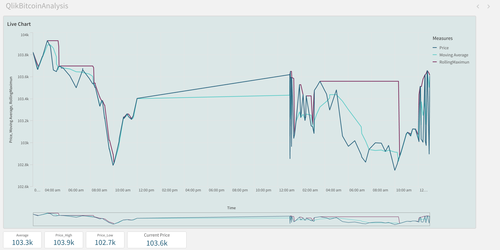
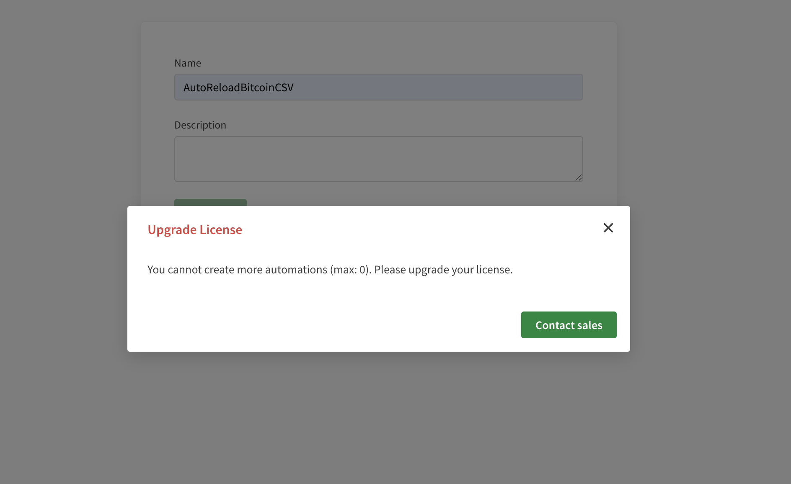
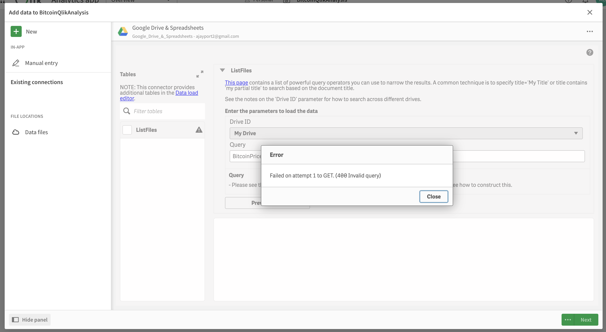

# Real-time Bitcoin Price Analytics with Qlik Sense

## Table of Contents
- [Project Overview](#project-overview)
- [Workflow & Architecture](#workflow--architecture)
- [Key Features](#key-features)
- [Implementation Details](#implementation-details)
- [Qlik Dashboard & Visualizations](#qlik-dashboard--visualizations)
- [Technical Stack](#technical-stack)
- [Challenges & Workarounds](#challenges--workarounds)
- [Future Improvements](#future-improvements)
- [Project Structure](#project-structure)
- [Installation Guide](#installation-guide)
- [Acknowledgments](#acknowledgments)

---

## Project Overview

This project delivers a **real-time Bitcoin price analytics and forecasting solution** by combining Python-based data ingestion, GitHub for data sync, and Qlik Sense for interactive visualization and analytics.  
The goal: **Create a semi-automated pipeline that fetches, processes, and visualizes Bitcoin price data in near real time—even within the constraints of a student/free-tier Qlik Sense account.**

---

## Workflow & Architecture

### High-Level Workflow

```mermaid
graph TD
    A[Python Script: Fetch Bitcoin Price via CoinGecko API] --> B[Write Data to CSV]
    B --> C[Push CSV Files to GitHub]
    C --> D[Qlik Sense REST Connector: Pull Latest CSV from GitHub]
    D --> E[Qlik Sense Dashboard: Visualize & Analyze Data]
    E --> F[User Exploration: Filtering, Analytics, Interactive Charts]
    style A fill:#bbf,stroke:#222,stroke-width:2px
    style E fill:#cfc,stroke:#222,stroke-width:2px
    style F fill:#ffe,stroke:#222,stroke-width:1px
````

#### **Workflow Steps**

1. **Data Fetching**:
   Python script regularly queries CoinGecko for the latest Bitcoin price.
2. **Local Storage**:
   Data appended to a CSV file (`bitcoin_realtime.csv`), with moving averages and rolling max/min analytics calculated in additional files.
3. **GitHub Sync**:
   Updated CSVs are automatically pushed to a public GitHub repo.
4. **Qlik Sense Integration**:
   Qlik REST Connector fetches the latest CSV directly from GitHub, ensuring the dashboard reflects new data upon reload.
5. **Visualization & Analytics**:
   Qlik dashboard displays real-time price charts, moving averages, and key metrics.
   Users can interact, filter by time, and explore trend/volatility analytics.

---

## Key Features

* **Automated Bitcoin Price Data Collection** via Python & CoinGecko API
* **Data Analytics**:

  * Moving averages, rolling max/min, and volatility metrics
  * CSV-based pipeline for maximum compatibility and reliability
* **GitHub Data Sync**:

  * Simple, version-controlled, and universally accessible
* **Interactive Qlik Sense Dashboard**:

  * Real-time charts
  * Summary statistics (average, high, low, current price)
  * Filter by time, metrics, and more

---

## Implementation Details

### 1. **Python Data Fetcher**

* Collects latest Bitcoin price from CoinGecko every 10 seconds (configurable)
* Calculates moving averages and volatility
* Writes/appends data to local CSV files

### 2. **GitHub Automation**

* Python/git automation pushes all CSV files (`bitcoin_realtime.csv`, `bitcoin_analytics.csv`, `bitcoin_forecast.csv`) to GitHub on a regular schedule
* Ensures that Qlik Sense always pulls the most recent data

### 3. **Qlik Sense Data Integration**

* REST connector fetches the latest CSV from the GitHub repo
* Data loaded directly into Qlik for live dashboard updates
* No manual downloads needed for regular analysis

---

## Qlik Dashboard & Visualizations

### **Live Analytics Dashboard Example**


*This dashboard shows the real-time Bitcoin price, moving average, and rolling maximum values, all interactively filterable by time. Key metrics are displayed below for fast insights.*

---

## Technical Stack

* **Python 3.x**: Data fetching, analytics, and CSV handling
* **CoinGecko API**: Real-time Bitcoin price source
* **Pandas**: Data manipulation and rolling analytics
* **Git & GitHub**: Automated data versioning and sync
* **Qlik Sense**: Interactive dashboard and analytics engine

---

## Challenges & Workarounds

While building a truly real-time, automated analytics solution on a free/student Qlik Sense account, several limitations were encountered and overcome:

### Qlik Cloud Student Tier Limitations

* **No background task scheduling / automation:**
  Qlik student/free accounts **do not allow automated reloads or scheduled automations**.
* **REST/Connector Limitations:**
  Sometimes, repeated data reloads would hit rate limits or API restrictions.



### External Data Source Errors

* Google Drive or Google Sheets integration was tested, but Qlik’s connectors frequently produced authentication or query errors for non-enterprise users.



---

### **Final Workaround**

> **Solution:**
>
> * All automation is handled **outside Qlik**:
>
>   * Python fetches and processes data
>   * GitHub acts as the “bridge” for fresh data
>   * Qlik Sense manually reloads from the latest CSV on GitHub (refresh as needed)
> * This workaround is reliable, transparent, and requires no paid features.

---

## Future Improvements

* **Full Automation:**
  If Qlik’s automation or webhook features become available, the entire pipeline could be fully scheduled and real-time.
* **Push-based Integration:**
  Potential upgrade to cloud services (AWS Lambda, Azure, etc.) for direct event-driven data sync to Qlik.
* **Expanded Analytics:**
  Extend dashboard with predictive analytics, custom alerting, and multi-currency support.

---

## Project Structure

```
.
├── Images/                            # Screenshots & error samples
│   ├── qlik_dashboard.png
│   ├── qlik_automation_error.png
│   └── qlik_gdrive_error.png
├── Analysis.py                       # Analytics and rolling calculations
├── bitcoin_analytics.csv             # Includes ma_6 and volatility_12
├── bitcoin_forecast.csv              # Placeholder for predictive analysis
├── bitcoin_realtime.csv              # Raw Bitcoin price log
├── datafetch.py                      # Real-time data collection from API
├── docker_bash.sh                    # Shell script for Docker bash entry
├── docker_build.sh                   # Shell script to build Docker image
├── Dockerfile                        # Build Docker container
├── gitpush.py                        # GitHub automation logic
├── QlikAnalysis_utils.py             # Shared utility functions
├── QlikAnalysis.API.json             # Qlik export
├── QlikAnalysis.export.json          # Exported configuration
├── QlikAnalysis.excel.xlsx           # Optional export format
├── Readme.md                         # Primary documentation
├── real.md                           # Backup notes
├── requirements.txt                  # Python dependencies
```

---

## Installation Guide

### **Prerequisites**

* Python 3.x installed
* Qlik Sense cloud (student or personal)
* Git and GitHub account

### **Quick Start**

1. **Clone the Repository:**

   ```bash
   git clone https://github.com/YOUR_USERNAME/bitcoin-qlik.git
   cd bitcoin-qlik
   ```

2. **Install Python Dependencies:**

   ```bash
   pip install -r requirements.txt
   ```

3. **Configure and Run Data Fetcher:**

   * Edit the fetch interval as needed in `datafetch.py`
   * Run:

     ```bash
     python datafetch.py
     ```

4. **Automate GitHub Push:**

   * Use `gitpush.py` or your preferred automation/scheduler.

5. **Set Up Qlik Sense Data Connection:**

   * Add a new REST connection to your public GitHub CSV URL.
   * Use your Qlik dashboard to visualize and analyze the latest data.

---

## Acknowledgments

* **CoinGecko** for public crypto APIs
* **Qlik Academic Program** for cloud analytics tools
* **Pandas, Prophet, Python** communities for open-source libraries

---

