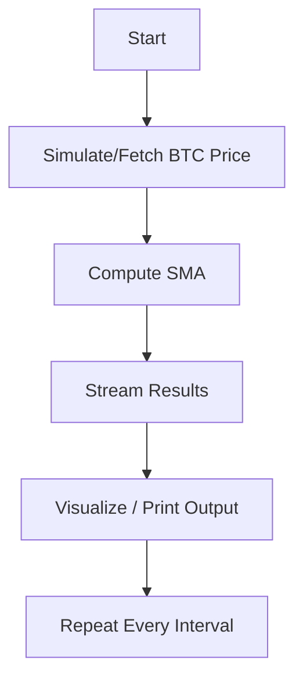

# Real-Time Bitcoin Data Processing using Socket.IO

This project demonstrates how to build a real-time data pipeline for simulating and analyzing Bitcoin price trends using `python-socketio`. It showcases a minimal, yet extendable architecture for streaming price data, computing simple moving averages, and visualizing trends—all in real time.

---

## 🚀 Project Objectives

* Simulate a live stream of Bitcoin prices.
* Compute real-time Simple Moving Averages (SMA).
* Visualize data flow using clean console output or extendable frontends.
* Demonstrate how Socket.IO can be used for real-time data tasks in Python.

---

## 🧱 Project Structure

```
📆 project/
├── socketio_utils.py                # Helper functions: simulation, SMA, real BTC fetch
├── socketio.API.ipynb              # Demonstrates individual API functions and usage
├── socketio.API.md                 # Markdown explanation of the API file
├── socketio.example.ipynb         # Full project workflow (end-to-end)
├── socketio.example.md            # Explanation of the example notebook
├── Dockerfile                      # Docker config to containerize the entire setup
```

---

## 🔄 Data Flow Diagram



---

## 🔧 Setup Instructions

### 🔹 Option 1: Run Locally

1. Install dependencies:

```bash
pip install numpy pandas requests python-socketio
```

2. Run scripts manually:

```bash
python socketio_utils.py  # Simulated streaming
```

---

### 🔹 Option 2: Run with Docker

1. Build the Docker image:

```bash
docker build -t realtime-btc-socketio .
```

2. Run the container:

```bash
docker run -p 8888:8888 realtime-btc-socketio
```

3. Open Jupyter in browser:

```
http://127.0.0.1:8888/?token=...
```

---

## 🧪 Components Explained

### socketio\_utils.py

* `fetch_btc_price()`: Pulls real BTC price from CoinCap.
* `simulate_fake_btc_stream()`: Simulates prices with random variation.
* `compute_sma(prices, window=5)`: Calculates SMA on live data.

### socketio.API.ipynb

* Imports and tests each utility.
* Helps verify function behavior independently.

### socketio.example.ipynb

* End-to-end simulated data stream.
* Demonstrates continuous output and moving average logic.

---

## 📌 Limitations

* Real BTC fetching may hit rate limits (HTTP 429).
* Only backend stream simulation—no frontend dashboard integration included.

---

## 📈 Future Improvements

* Integrate real-time frontend via React or Dash.
* Store data in TimescaleDB or InfluxDB for long-term trend tracking.
* Implement anomaly detection using ML.

---

## 👤 Author

**Shreya** — DATA605 | Spring 2025
Project: TutorTask175 — Real-Time Bitcoin Data Processing with Socket.IO

---

## 📌 License

This project is MIT licensed and built under the academic guidelines for the University of Maryland's DATA605 course.
