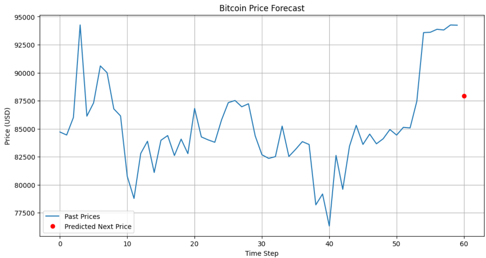

## `README.md` 

#  Real-Time Bitcoin Price Prediction with TensorFlow

This project demonstrates a real-time, LSTM-based forecasting system for Bitcoin prices. It leverages public data from the CoinGecko API and deep learning models built with TensorFlow/Keras. The project follows a modular structure using a reusable utility layer to support both Jupyter workflows and real-time inference.

---

##  Project Highlights

- ✅ Real-time data ingestion from CoinGecko
- ✅ Anomaly filtering for robust training
- ✅ Technical feature engineering (SMA, returns, volatility, lag)
- ✅ LSTM model with fine-tuning on latest data
- ✅ Prediction and visualization of the next price
- ✅ Real-time scheduler and Streamlit dashboard
- ✅ Docker-ready setup for reproducibility

---

## 📁 Project Structure

```bash
.
├── bitcoin_utils.py              # Utility module with all core logic
├── btc_scheduler.py              # Real-time updater: fetch → fine-tune → predict
├── btc_dashboard.py              # Streamlit dashboard for visualization
├── tensorflow.API.ipynb          # Minimal demo of API functions
├── tensorflow.API.md             # Documentation of the API layer
├── tensorflow.example.ipynb      # Full project notebook (EDA → prediction)
├── tensorflow.example.md         # Project report and rationale
├── models/
│   └── final_lstm_model.h5       # Trained LSTM model
├── data/
│   └── btc-usd-max.csv           # BTC-USD historical dataset
├── docker_data605_style/
│   ├── docker_bash.sh            # Docker startup script
│   ├── run_jupyter               # Script to launch Jupyter inside container
│   └── requirements/
│       └── requirements.txt      # All dependencies
````

---

## 📦 Setup Instructions

### 🔧 Install dependencies (non-Docker users)

If you're not using Docker, install the dependencies using:

```bash
pip install -r docker_data605_style/requirements/requirements.txt
```

Key packages include:

* `tensorflow`
* `keras-tuner`
* `pandas`, `numpy`, `matplotlib`
* `scikit-learn`
* `requests`
* `streamlit`

---

### 🐳 Docker-Based Setup (Recommended for Reproducibility)

This project includes a Docker image pre-configured with all dependencies.

####  Step 1: Navigate to your local project folder

```bash
cd ~/tutorials/DATA605/Spring2025/projects/TutorTask183_Spring2025_Real-time_Bitcoin_Price_Analysis_with_TensorFlow/docker_data605_style
```

####  Step 2: Start the Docker container

```bash
./docker_bash.sh
```

This script:

* Loads the image: `umd_data605/umd_data605_real_time_bitcoin_price_analysis_with_tensorflow`
* Mounts your full project into the container under `/data`
* Exposes ports for interactive tools like Jupyter and Streamlit

####  Step 3: Inside the Docker container

Once inside the container shell, navigate into the Jupyter start directory:

```bash
cd /data/docker_data605_style
./run_jupyter
```

Jupyter will be available at:

```
http://localhost:8888
```

---

##  Run the Project

### 1. Minimal API Demo

Open:

```bash
tensorflow.API.ipynb
```

* Demonstrates how to use each utility in `bitcoin_utils.py`
* No full model training or visualization

### 2. Full End-to-End Workflow

Open:

```bash
tensorflow.example.ipynb
```

* Full pipeline: data update → feature engineering → model training → prediction
* Includes EDA, fine-tuning, and forecast visualization

---

## 🖥️ Real-Time Components

### 📅 Scheduler: `btc_scheduler.py`

This script enables continuous real-time prediction. It:

* Fetches the latest Bitcoin price from CoinGecko
* Appends it to the dataset if new
* Fine-tunes the saved LSTM model
* Predicts the next price and logs it

Run it using:

```bash
python btc_scheduler.py
```

You can schedule this script with `cron` or run it in a loop for live predictions.

---

### 📊 Streamlit Dashboard: `btc_dashboard.py`

A dashboard to visualize the current model predictions and BTC price history.

To launch it:

```bash
# Inside Docker, from the root /data directory:
cd /data
streamlit run btc_dashboard.py
```

> ⚠️ The dashboard **must be run from `/data`** so it can correctly access the model, dataset, and logs.

---

##  Example Output
Predicted Next Price: $87,919.57



---

##  References

* [CoinGecko API Docs](https://www.coingecko.com/en/api/documentation)
* [TensorFlow LSTM](https://www.tensorflow.org/api_docs/python/tf/keras/layers/LSTM)
* [Causify Tutorial Format](https://github.com/causify-ai/helpers)

---

##  Author

**Ibrahim Ahmed Mohammed**
Graduate Student, MS in Data Science
University of Maryland, College Park

```