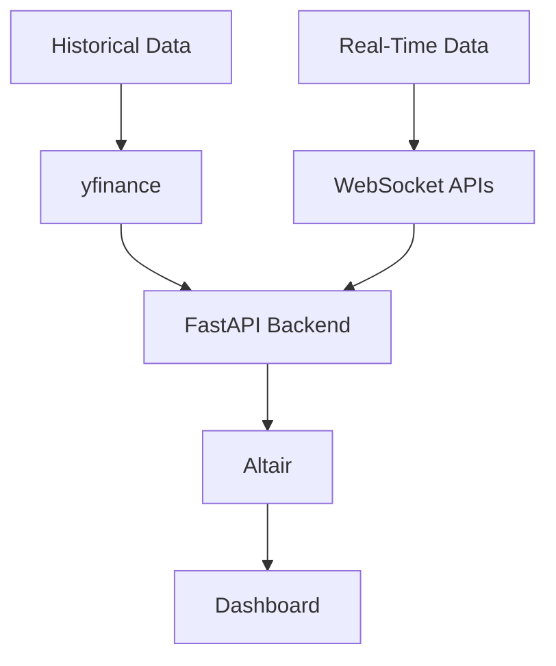

# Altair-Based Real-Time Bitcoin Dashboard

## Project Description

This project builds an interactive, real-time Bitcoin market dashboard using **FastAPI** and **Altair**. It integrates:
- Historical data from `yfinance`
- Real-time data via WebSocket APIs

The backend processes the data using FastAPI, and the frontend visualizes it using Altair charts. This enables high-quality, interactive financial dashboards rendered directly in the browser.

### Key Features
- 📈 Bitcoin price trends and technical indicators (e.g. RSI, Bollinger Bands)
- 🔥 Volatility surface visualizations
- ⛏ Miner reserve correlation insights
- 🚦 Mempool transaction size distribution
- ⚡ Real-time updates using WebSockets

---

## Flowchart



---

## Installation

Install dependencies using pip:

```bash
pip install -r requirements.txt
```

Or build via Docker:

```bash
docker build -t altair-dashboard .
docker run -it -p 8080:8080 altair-dashboard
```

---

## Running the App

### With Python
```bash
python3 Altair.example.py
```

### With Docker
```bash
docker run -it -p 8080:8080 altair-dashboard
```

---

## Project Structure

```
├── Altair_API.py         # FastAPI app with endpoints
├── Altair_utils.py       # Utility functions for data processing
├── Altair.example.py     # Entry point (Uvicorn launch)
├── requirements.txt      # Python dependencies
├── Dockerfile            # Docker config
└── README.md             # Project documentation
```

---

## License

MIT License — feel free to modify and build upon the project.
