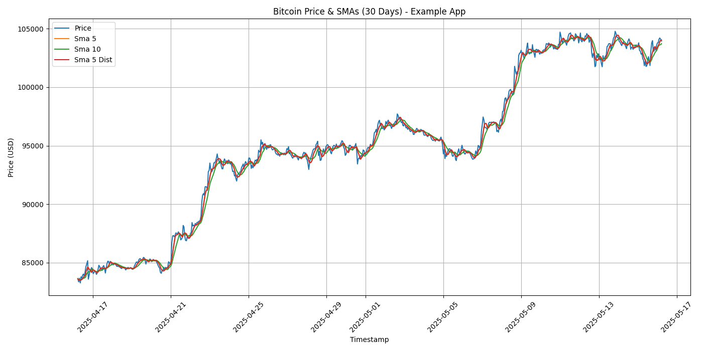

# Bitcoin Price Analysis Report (Example Application)

**Analysis Period:** Last 30 days (Data as of 2025-05-16 05:14 UTC)
**Currency:** usd

## Key Findings:
- **Data Points Analyzed:** 720
- **Simple Moving Averages (SMAs) Calculated:**
    - 5-day SMA (Standard Method)
    - 10-day SMA (Standard Method)
    - 5-day SMA (Simulated Distributed Method as 'sma_5_dist')
- **Overall Trend (30 days):** Simple Trend: Uptrend (Change: 24.29%)

## Visualization:

**Data Storage:**
- Raw fetched data serialized to: `raw_btc_data_30d_example.pkl`
- Final analyzed data (with SMAs) serialized to: `analyzed_btc_data_30d_example.pkl`

**Note on Cloudpickle & Distributed Processing:**
The calculation of one of the SMAs was performed using Python's `multiprocessing` module. `cloudpickle` was essential for this, as it allowed the serialization of the `calculate_moving_average` function and Pandas DataFrame chunks to be passed to, and results returned from, separate worker processes. This demonstrates `cloudpickle`'s utility in enabling more complex, distributed Python workflows.