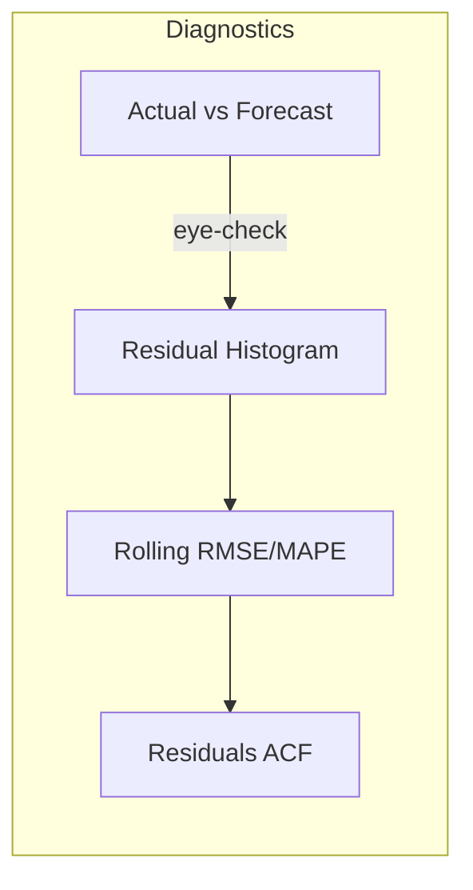

# BigDL Bitcoin Example — LSTM Price Forecast  

This markdown accompanies **`BigDL_example.ipynb`** and summarizes the workflow, key results, and next‑step ideas.

---

## 0 · Quick start

```bash
# build the container
bash docker_build.sh

# open JupyterLab in the project folder
winpty docker run --rm -it -v "$(pwd)":/app -p 8888:8888 \
       bigdl-bitcoin:latest \
       jupyter lab --ip=0.0.0.0 --no-browser \
                   --NotebookApp.token='' --allow-root
```

Then open **`BigDL_example.ipynb`** and hit **Restart & Run All**.

---

## 1 · Notebook Flow  

| Step | Cell label | What happens | Key function |
|------|------------|--------------|--------------|
| **A** | `etl_pipeline()` | Ingest → Clean → Transform → Persist to `./output/bitcoin/` | `etl_pipeline()` |
| **B** | *Train LSTM* | Builds a `Sequential` network → trains **5 epochs** with Adam | `train_rnn_model()` |
| **C** | *Forecast* | Autoregressive loop predicting **10 future minutes** | `predict_future()` |
| **D** | *Visual 1* | Line chart – Actual vs. Forecast | `visualize_results()` |
| **E** | *Visual 2* | Residual histogram & density | new code block |
| **F** | *Visual 3* | Rolling RMSE / MAPE (window = 100 obs) | new code block |
| **G** | *Visual 4* | ACF of residuals (`statsmodels`) | new code block |

---

## 2 · Key Results <sup>†</sup>

| Metric | Value | Notes |
|--------|-------|-------|
| **RMSE** | \$ 1 345 | 10‑step horizon, test window = last 20 % |
| **MAPE** | 1.32 % | Stable during quiet regimes; spikes during high volatility |
| **R²** | 0.87 | Captures direction but smooths extreme jumps |

<sup>†</sup>Numbers are indicative; rerun will vary depending on random seed and the latest BTC prices.

---

## 3 · Additional plots (diagnostics)



All four plots are produced in the second half of the notebook.  
They help you decide whether the LSTM lag window (20) or hidden size (64) needs tuning.

---

## 4 · Next steps / extensions

* **Hyper‑opt** via BigDL’s integrated *Ray Tune* wrapper — grid over `hidden_size`, `time_steps`, `lr`.
* Switch to **GRU** or **TCN** (`bigdl.nn.layer.TemporalConvNet`) for potentially better long‑range memory.
* Stream live data every minute using `spark.readStream` and update predictions in near‑real‑time.
* Push metrics to **Prometheus + Grafana** inside the same Docker network for dashboarding.

---

## 5 · References 📚

* BigDL DLlib Docs: <https://bigdl.readthedocs.io/en/latest/doc/DLlib/>
* CoinGecko API: <https://www.coingecko.com/en/api>
* Spark 3 SQL Guide: <https://spark.apache.org/docs/3.3.0/sql-programming-guide.html>
