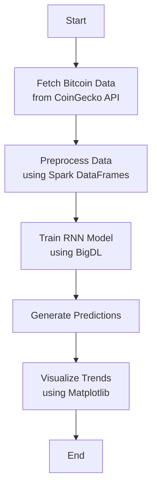

# 📈 BigDL Bitcoin Price Forecasting Tutorial

This tutorial walks through **end‑to‑end ingestion, feature‑engineering, training and inference** on real‑time Bitcoin prices using **Apache Spark 3** and **BigDL DLlib** (the distributed deep‑learning library built on top of Spark).

---

## 🚀 What you’ll learn

| Step | Skill / Tool | Outcome |
|------|--------------|---------|
| 1️⃣  | CoinGecko REST API | Pull raw minute‑level BTC‑USD candles |
| 2️⃣  | PySpark DataFrame ops | Clean + engineer rolling features (`rolling_avg_1h`, `%change`) |
| 3️⃣  | BigDL Sequential API | Train an LSTM on a **distributed** Spark cluster |
| 4️⃣  | Min‑max rescaling | Robust forecasting across price regimes |
| 5️⃣  | Matplotlib | Overlay actual vs. predicted prices |

---

## 🗂 Repo layout

```
DATA605/
└── Spring2025/
    └── projects/
        └── TutorTask300_Spring2025_Real_Time_Bitcoin_Data_Processing_with_BigDL/
            ├── BigDL_API.py          # REST + Spark helpers
            ├── BigDL_example.py     # Batch ETL + training + forecast script
            ├── BigDL_example.ipynb     # Click‑through notebook version
            ├── docker_build.sh         # Build image  ➜  `bigdl-bitcoin:latest`
            ├── docker_bash.sh          # (DATA605‑style) drop into /app shell
            ├── docker_jupyter.sh       # start JupyterLab on :8888
            └── README.md               # ← **this file**
```

---

## ⚙️ Quick‑start (local Docker)

> **Windows + Git Bash users:** prepend every `docker run` with **`winpty`** so the interactive `-it` flags work correctly in the pseudo‑TTY.

```bash
# 1 ▪ Build the image (first‑time ≈ 5 min)
bash docker_build.sh

# 2 ▪ Open an interactive shell inside the container
winpty docker run --rm -it -v "$(pwd)":/app -p 8888:8888 bigdl-bitcoin:latest bash       # ← Windows Git Bash
# or simply
docker_bash.sh                       # ← macOS / Linux

# 3 ▪ (inside container) run the full pipeline
python BigDL_example.py
```

The script will:

1. Pull the last **30 days** of prices (≈ 43 k rows)
2. Save a Parquet snapshot to `./output/bitcoin/`
3. Train an LSTM with **BigDL** on Spark
4. Autoregressively predict the next **10 steps**
5. Pop a Matplotlib chart comparing actual vs forecast

---

## 🧑‍💻 Jupyter workflow

Prefer notebooks?  Launch JupyterLab, then open **`BigDL_example.ipynb`**:

```bash
# From host laptop, mount repo as /app and expose port 8888
winpty docker run --rm -it -v "$(pwd)":/app -p 8888:8888 bigdl-bitcoin:latest        jupyter lab --ip=0.0.0.0 --no-browser                    --NotebookApp.token='' --NotebookApp.password=''                    --allow-root
```

Browse to **`http://127.0.0.1:8888/lab`** and click _Restart & Run All_.

---

## 🧪 How It Works



---

## 🔍 Key implementation details

| Component | Highlight |
|-----------|-----------|
| **`BigDL_API.get_spark_session()`** | Guarantees a singleton Spark 3 session (local[*]) |
| **Scaling** | Prices min‑max scaled **per‑run** to stabilise training |
| **Model** | `Sequential([ Reshape, Recurrent(LSTM), TimeDistributed(Linear), Select ])` |
| **Inference** | Forecast loop keeps the **scaled** window, then inverse‑transforms every step |

---

## 📊 Sample output


---

## 🛣 Next steps

* Swap LSTM for **BigDL Timeseries** or a Transformer encoder
* Add MLflow tracking & model registry
* Stream live prices via WebSocket and update a dashboard in real‑time

---

## 📝 License

MIT — © 2025 DATA605 / Causify AI
