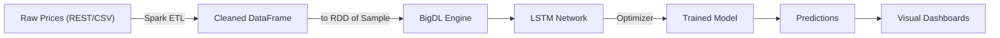

# BigDL API Reference 🧠📈

**Distributed Bitcoin Price‑Forecasting on Apache Spark**
This document is the *text‑only* reference for the backend utilities shipped with this project.  It explains **what each helper does, why it exists, and how it plugs into BigDL’s native API** – *without embedding any executable code*.  The companion notebooks (`bigdl.API.ipynb`, `bigdl.example.ipynb`) show the same workflow *in action*.

---

## Table of Contents

1. [Notebook Objectives](#notebook-objectives)
2. [Architecture & Data Flow](#architecture--data-flow)
3. [Environment & Setup](#environment--setup)
4. [Schema & Data Model](#schema--data-model)
5. [API Function Breakdown](#api-function-breakdown)
6. [Analysis Primitives](#analysis-primitives)
7. [Usage Instructions](#usage-instructions)
8. [Best‑Practices & Gotchas](#best‑practices--gotchas)
9. [References](#references)

---

## Notebook Objectives

* **Demonstrate** how BigDL’s native Python API (`bigdl.dllib`) can train a recurrent neural network on *time‑series* data.
* **Integrate** with Spark so that feature engineering, training, and prediction all run on the same distributed cluster.
* **Provide** a thin utility layer (see `template_utils.py`) that hides repetitive boilerplate such as engine initialisation and `Sample` conversion.

---

## Architecture & Data Flow



* **Spark** handles ingestion and transformation.
* **BigDL** attaches to the existing `SparkContext` and parallelises gradient computation.
* **Outputs** (model artefacts & predictions) stay inside the cluster or are exported as Parquet for downstream analytics.

---

## Environment & Setup

| Layer            | Version        | Notes                                   |
| ---------------- | -------------- | --------------------------------------- |
| Python           |  3.9           | Pinned in Dockerfile                    |
| Apache Spark     |  3.1.3         | BigDL 2.4 build expects this            |
| BigDL (DLlib)    |  2.4.0         | Spark‑3 artefact (`bigdl‑dllib‑spark3`) |
| Intel oneAPI/MKL | auto‑installed | CPU acceleration                        |

*The project ships a ready‑made container.*  Rebuild & run:

```bash
./docker_build.sh           # builds image `bigdl-bitcoin:latest`
winpty docker run --rm -it -v "$(pwd)":/app -p 8888:8888 bigdl-bitcoin:latest bash
python Bitcoin_pipeline.py  # executes full pipeline
```

---

## Schema & Data Model

Data never hits a relational DB – instead we keep it in Spark as a Parquet dataset (`output/bitcoin`):

| Column           | Type      | Description                          |
| ---------------- | --------- | ------------------------------------ |
| `time`           | timestamp | End‑of‑hour timestamp (UTC)          |
| `price`          | double    | Spot BTC price in USD                |
| `rolling_avg_1h` | double    | 1‑hour moving average (feature)      |
| `pct_change`     | double    | Percentage change from previous tick |

The trained model expects a **window tensor** of shape *(time\_steps, 1)* and outputs the **next point forecast**.

---

## API Function Breakdown

| Function                                          | Location              | Purpose                                                           |
| ------------------------------------------------- | --------------------- | ----------------------------------------------------------------- |
| `get_spark_session()`                             | `bitcoin_api.py`      | initialise or reuse a local SparkSession                          |
| `fetch_bitcoin_prices(days)`                      | ″                     | REST call to CoinGecko, returns raw JSON as Spark DF              |
| `process_bitcoin_data(df)`                        | ″                     | cleanse NA rows, enforce schema                                   |
| `transform_bitcoin_data(df)`                      | ″                     | add rolling mean & pct‑change features                            |
| `load_bitcoin_data(df, path)`                     | ″                     | write Parquet partition(s) to `path`                              |
| `prepare_sequences(prices, time_steps)`           | `Bitcoin_pipeline.py` | convert a list → NumPy windows + labels                           |
| `train_rnn_model(df, …)`                          | ″                     | orchestrate BigDL engine, convert to `Sample`s, spawn `Optimizer` |
| `predict_future(model, recent_seq, future_steps)` | ″                     | autoregressive inference loop                                     |
| `visualize_results(df, preds)`                    | ″                     | Matplotlib overlay of actual vs forecast                          |

> ⚙️  *All heavy lifting (e.g., `Sample.from_ndarray`, `Optimizer`) happens inside helpers so notebooks stay concise.*

---

## Analysis Primitives

The project illustrates several classic time‑series diagnostics:

* **Moving Averages** – 1 h window to smooth noise.
* **Rate of Change** – monitors momentum.
* **Volatility** – rolling standard deviation.
* **Prediction Overlay** – quick sanity‑check of model drift.
  These are implemented in pure pandas/Matplotlib for portability.

---

## Usage Instructions

1. **Build** the Docker image (`./docker_build.sh`).
2. **Launch** an interactive shell (or Jupyter) in the container.
3. **Run** `python Bitcoin_pipeline.py` to execute end‑to‑end.

   * The script will print Spark job logs and save Parquet + PNG chart.
4. **Inspect** results: `output/bitcoin/*.parquet` contains engineered features, and `predictions.png` shows forecast vs ground truth.

---

## Best‑Practices & Gotchas

* Call **`init_engine()` once** – multiple calls create conflicting thread‑pools.
* Ensure **Spark 3.1.x** compatibility; newer versions mismatch BigDL 2.4 wheels.
* For Windows + Git Bash use **`winpty`** when mapping interactive TTY (`docker run …`).
* Monitor **Spark UI (localhost:4040)** to catch skewed partitions.
* Persist models with `saveModel(path)` and reload via `loadModel` for inference‑only containers.

---

## References

* BigDL documentation – [https://bigdl.readthedocs.io](https://bigdl.readthedocs.io)
* Apache Spark Guide – [https://spark.apache.org/docs/3.1.3](https://spark.apache.org/docs/3.1.3)
* CoinGecko REST API – [https://www.coingecko.com/en/api](https://www.coingecko.com/en/api)
* Project rubric & templates – `DATA605/tutorial_template/`
