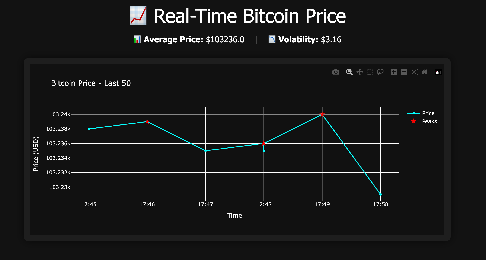

# Real-Time Bitcoin Analysis using Django ORM

## Overview

This project is a Django-based web application that fetches real-time Bitcoin prices from the CoinGecko API, stores them using Django ORM, and performs live data analysis and interactive time series visualization.

---

## Features

- ✅ Real-time Bitcoin price ingestion using CoinGecko API
- ✅ Django ORM model (`BitcoinPrice`) for database storage
- ✅ Interactive chart using **Plotly**
- ✅ Automatic peak detection using `scipy.signal.find_peaks`
- ✅ Volatility and average price calculations using NumPy
- ✅ Peaks annotated on the chart as red stars
- ✅ Clean web UI with Bootstrap (dark mode)
- ✅ Auto-scaling, mobile-responsive chart

---

## Live Dashboard

Available at: `http://127.0.0.1:8000/`

Displays:
- Real-time BTC price trend (last 50 records)
- Average price and volatility stats
- Red stars indicating local price peaks

---

## Technologies Used

- **Django ORM**: To define models and perform queries
- **SQLite**: Lightweight database backend
- **CoinGecko API**: Free API for real-time Bitcoin data
- **Plotly**: Interactive chart rendering
- **NumPy**: Statistical computation (mean, std)
- **SciPy**: Peak detection
- **Bootstrap 5**: UI styling

---

## File Structure

