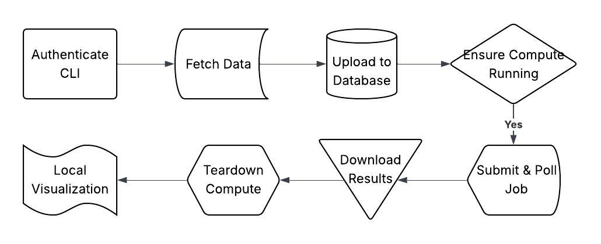

# Real-Time Bitcoin Price Analysis using Databricks CLI

**Author**: Ritik Pratap Singh  
**Date**: 2025-05-16  
**Course**: DATA605 — Spring 2025

---

## Table of Contents

- [1. Project Overview](#1-project-overview)
- [2. Project Files](#2-project-files)
- [3. Prerequisites & Setup](#3-prerequisites--setup)
- [4. Build & Run Docker (data605_style)](#4-build--run-docker-data605_style)
- [5. Prepare Databricks Workspace](#5-prepare-databricks-workspace)
- [6. Usage](#6-usage)
  - [6.1 Run the API demo script](#61-run-the-api-demo-script)
  - [6.2 Run the full pipeline script](#62-run-the-full-pipeline-script)
  - [6.3 Interactive Notebooks](#63-interactive-notebooks)
- [7. Batch Execution](#7-batch-execution)
- [8. Troubleshooting](#8-troubleshooting)
- [9. References](#9-references)

---

## 1. Project Overview

This project builds an automated pipeline to:

1. Fetch real-time Bitcoin prices from the CoinGecko API  
2. Upload data to Databricks DBFS  
3. Run a time-series forecast (ARIMA) on a Databricks cluster  
4. Download forecast results and visualize them locally  
5. Tear down cloud resources—all via the Databricks CLI

There are two primary entry points:

- **`databricks_cli.API.py`** — demo of core CLI commands  
- **`databricks_cli.example.py`** — end-to-end pipeline runner  

For interactive, cell-by-cell exploration, see the companion notebooks.

---

## 2. Project Files

```text
databricks_cli_utils.py         # shared helpers for CLI, data fetch, modeling, plotting
databricks_cli.API.py           # one-shot demo of all CLI wrappers
databricks_cli.API.ipynb        # interactive API walkthrough
databricks_cli.API.md           # markdown docs for API.py

databricks_cli.example.py       # one-shot pipeline runner (fetch→forecast→plot)
databricks_cli.example.ipynb    # interactive pipeline walkthrough
databricks_cli.example.md       # markdown docs for example.py

bitcoin_analysis.ipynb          # analysis notebook to upload into Databricks workspace

config/
  ├─ cluster_config.json     # JSON spec for creating a new cluster
  ├─ job_config.json         # JSON spec for submitting the notebook job
  ├─ cluster_id.txt          # Populated after cluster creation (ID only)
  ├─ settings.py             # Python constants (workspace URL, CoinGecko URL, etc.)
  └─ settings.sh             # Shell‐exportable equivalents of settings.py


data/
  ├─ bitcoin_price.json         # line‐delimited JSON of fetched bitcoin prices
  ├─ forecast_output.csv        # downloaded forecast results (predictions + CI)
  └─ metrics.json               # evaluation metrics (MAE, RMSE, MAPE)


output_plots/
  ├─ historical.png             # local historical plot
  └─ forecast.png               # local forecast plot


docker_data605_style/            # Docker image spec & helper scripts
  ├─ Dockerfile                  # Ubuntu + Python + Jupyter base image
  ├─ bashrc                      # Custom shell config for container
  ├─ docker_bash.sh              # Launch an interactive bash shell
  ├─ docker_build.sh             # Build the Docker image
  ├─ docker_clean.sh             # Remove dangling images/containers
  ├─ docker_exec.sh              # Run arbitrary commands in the image
  ├─ docker_jupyter.sh           # Start JupyterLab inside container
  ├─ docker_name.sh              # Helper to tag the image
  ├─ docker_push.sh              # Push image to remote registry
  ├─ etc_sudoers                 # Sudoers config for the container
  ├─ install_jupyter_extensions.sh  # Post-install Jupyter setup
  ├─ install_project_packages.sh    # Install extra pip/apt packages
  ├─ run_jupyter.sh              # Entrypoint script for Jupyter
  └─ version.sh                  # Logs package versions for reproducibility

scripts/                        # auxiliary shell scripts
requirements.txt                # Python dependencies
```

---

### Methodology Overview



## 3. Prerequisites & Setup

1. **Clone the repo & navigate**  
   ```bash
   git clone https://github.com/causify-ai/tutorials.git
   cd tutorials/DATA605/Spring2025/projects/TutorTask92_Spring2025_Real_Time_Bitcoin_Price_Analysis_with_Databricks_CLI
   ```
2. **Install Docker** (Desktop/Engine)  
3. **Generate a Databricks PAT** from User Settings → Access Tokens  
4. **(Local) Python 3.8+** for initial CLI configuration

---

## 4. Build & Run Docker (data605_style)

**Note**: I copied `install_jupyter_extensions.sh` and `.bashrc` from the `docker_common` directory into my local project folder. I also made slight modifications to the Docker-related scripts (`docker_bash.sh`, `docker_build.sh`, `docker_jupyter.sh`) and the `Dockerfile`.

1. **Configure & Authenticate Databricks CLI**

   ```bash
   pip install --upgrade databricks-cli
   databricks --version
   databricks configure --token
   # When prompted, enter:
   #   Databricks Host: https://<your-workspace>.cloud.databricks.com
   #   Token:           <your-PAT>
   ```

   **Note:** This writes your host and token to `~/.databrickscfg` (e.g. `C:\Users\<you>\.databrickscfg` on Windows).

   To verify:

   ```bash
   test -f ~/.databrickscfg \
     && echo "Databricks CLI config found" \
     || (echo "No config found—run 'databricks configure --token'" && exit 1)
   ```
  After you’ve verified your `~/.databrickscfg`, import your local notebooks into the workspace. In **PowerShell** (so that paths resolve correctly), run:

  ```powershell
  # Import your analysis notebook
  databricks workspace import `
    --format SOURCE `
    --language PYTHON `
    .\notebooks\bitcoin_analysis_test.ipynb `
    /Workspace/bitcoin_analysis.ipynb

  # Import your job‐test notebook
  databricks workspace import `
    --format SOURCE `
    --language PYTHON `
    .\notebooks\bitcoin_analysis_test.ipynb `
    /Workspace/api_test_job_notebook.ipynb
  ```

2. **Build the Docker image**

   ```bash
   chmod +x docker_data605_style/docker_*.sh
   ./docker_data605_style/docker_build.sh
   ```

3. **Option A: Interactive Bash Shell**

   * **Step 1:** Start the container and mount your CLI config.

     ```bash
     ./docker_data605_style/docker_bash.sh
     ```
   * **Step 2:** Inside the container at `root@…:/data#`, install deps and launch:
    **Note**" if not in `/data` do `cd data` 
     ```bash
     pip install -r requirements.txt
     jupyter notebook --no-browser --ip=0.0.0.0 --port=8888 --allow-root
     # or run any Python script:
     python your_script.py
     ```

4. **Option B: Direct JupyterLab**

   * **Step 1:** Launch Jupyter in one go:

     ```bash
     ./docker_data605_style/docker_jupyter.sh
     ```
   * **Step 2:** In a second terminal (or the same session), install deps:

     ```bash
     pip install -r /data/requirements.txt
     ```
   * Visit `http://localhost:8888/lab?token=…` in your browser.

> **Tip:** If you’d rather pass your host credentials as env-vars instead of mounting:
> ```bash
> docker run --rm -it \
>   -e DATABRICKS_HOST="https://<workspace>.cloud.databricks.com" \
>   -e DATABRICKS_TOKEN="dapiXXXX" \
>   -v "$(pwd)":/data -p 8888:8888 \
>   umd_data605/bitcoin_cli_project \
>   bash
> ```

---

## 5. Prepare Databricks Workspace

1. **Upload** `bitcoin_analysis.ipynb` into your workspace.  
2. **Copy its path** (e.g. `/Users/you@example.com/bitcoin_analysis`).  
3. **Set** `ANALYSIS_NOTEBOOK_PATH` in `databricks_cli.example.ipynb`.  
4. **Verify** `config/cluster_config.json` matches your workspace’s available versions.

---

## 6. Usage

### 6.1 Run the API demo script  
```bash
python databricks_cli.API.py
```  
This will:

- Create a cluster  
- Check status  
- Upload/download a test file  
- Submit and poll a job run  
- Delete the cluster  

### 6.2 Run the full pipeline script  
```bash
python databricks_cli.example.py
```  
This executes the entire fetch→forecast→plot flow and writes visuals to `output_plots/`.

### 6.3 Interactive Notebooks  
Open in JupyterLab and **Restart & Run All**:

- `databricks_cli.API.ipynb`  
- `databricks_cli.example.ipynb`

---

## 7. Batch Execution

```bash
docker run --rm -v "$(pwd)":/data umd_data605/bitcoin_cli_project \
  bash -c "cd /data && \
    jupyter nbconvert --to notebook --execute \
      databricks_cli.example.ipynb \
      --output executed_example.ipynb"
```

---

## 8. Troubleshooting

- **No `/data` dir**: Use Bash (Git Bash/WSL) not PowerShell.  
- **CLI failures**: Ensure `--mount-config` or env-vars are set correctly.  
- **Port conflicts**: Change `-p 8888:8888` in Docker run.

---

## 9. References

- [Databricks CLI Docs](https://docs.databricks.com/en/dev-tools/cli/index.html)  
- [CoinGecko API Docs](https://www.coingecko.com/en/api)  
- [Statsmodels ARIMA Docs](https://www.statsmodels.org/stable/generated/statsmodels.tsa.arima.model.ARIMA.html)