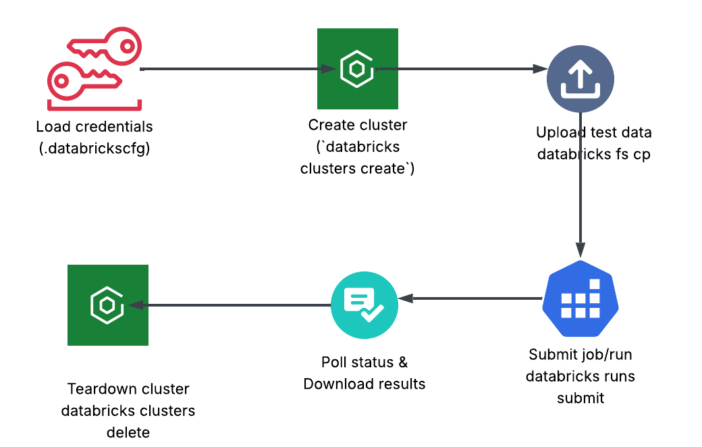
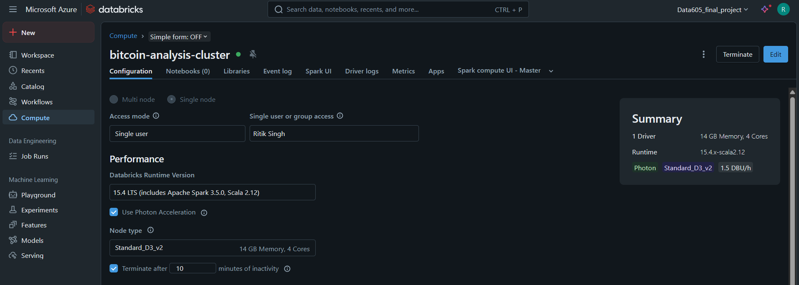
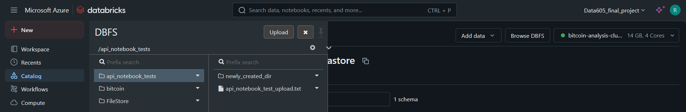
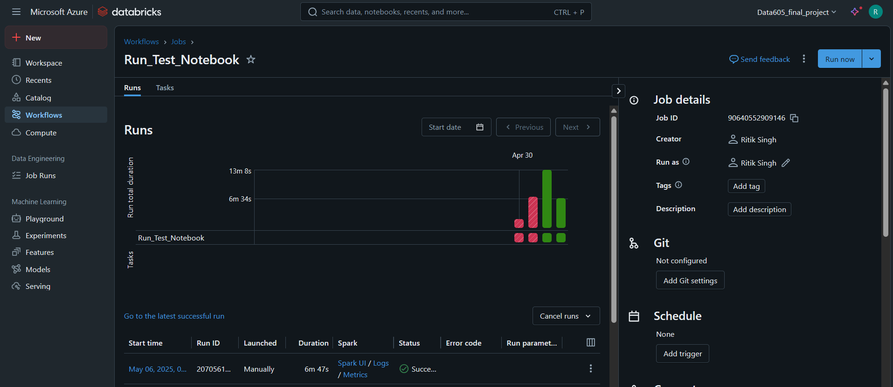
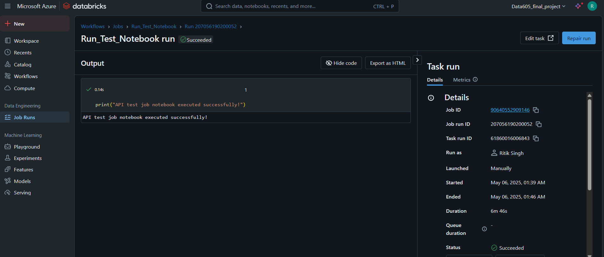
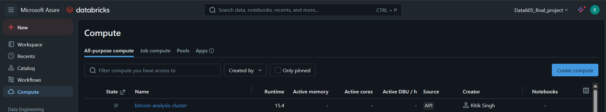

# Databricks CLI API Documentation

## Workflow Overview




## Table of Contents

- [Workflow Overview](#workflow-overview)
- [Project Files](#project-files)
- [1. Introduction](#1-introduction)
- [2. Prerequisites & Setup](#2-prerequisites--setup)
  - [2.1 Install the Databricks CLI](#21-install-the-databricks-cli)
  - [2.2 Authenticate](#22-authenticate)
- [3. Cluster Configuration](#3-cluster-configuration)
- [Create a Databricks Job via the UI](#create-a-databricks-job-via-the-ui)
- [4. Core Databricks CLI Commands](#4-core-databricks-cli-commands)
  - [4.1 Clusters](#41-clusters)
  - [4.2 File System (DBFS)](#42-file-system-dbfs)
  - [4.3 Jobs & Runs](#43-jobs--runs)
- [5. Python Wrappers (`databricks_cli_utils.py`)](#5-python-wrappers-databricks_cli_utilspy)
- [6. Demo Script: `databricks_cli.API.py`](#6-demo-script-databricks_cliapipy)
- [7. References](#7-references)


## Project Files

- **`databricks_cli_utils.py`**  
  Core library of all wrapper functions around the Databricks CLI, data fetching, modeling, and plotting.

- **`databricks_cli.API.py`**  
  **Your canonical CLI-demo script.** Run this to exercise every helper in a single, repeatable batch.

- **`databricks_cli.API.ipynb`**  
  Interactive notebook that also imports from `databricks_cli_utils.py`—great for step-by-step exploration, but not needed for automated runs.

- **`config/cluster_config.json`**  
  Sample JSON for creating clusters via CLI.

- **`config/cluster_id.txt`**  
  File where cluster IDs are saved.

---

## 1. Introduction

The Databricks Command Line Interface (CLI) provides a programmatic way to manage Databricks workspaces—clusters, file operations, jobs, runs—without using the web UI.  
This document covers:

1. Setting up the CLI  
2. The key commands used in our Bitcoin-analysis project  
3. How to call them from Python via `databricks_cli_utils.py`  
4. A step-by-step demo in `databricks_cli.API.py` and its companion notebook  

---

## 2. Prerequisites & Setup

### 2.1 Install the Databricks CLI

```bash
pip install databricks-cli
databricks --version
```

### 2.2 Authenticate

Generate a Personal Access Token (PAT) in your Databricks UI:

1. **User Settings → Access Tokens → Generate New Token**  
2. Copy the token immediately.

Configure via terminal:

```bash
databricks configure --token
# When prompted, enter:
#   Databricks Host:   https://<your-workspace>.cloud.databricks.com
#   Token:             <your-PAT>
```

Alternatively, set environment variables:

```bash
export DATABRICKS_HOST=https://<your-workspace>.cloud.databricks.com
export DATABRICKS_TOKEN=<your-PAT>
```

---

## 3. Cluster Configuration

Place your cluster settings in `config/cluster_config.json`.  
Example:

```json
{
  "cluster_name": "bitcoin-analysis-cluster",
  "spark_version": "13.3.x-scala2.12",
  "node_type_id": "Standard_DS3_v2",
  "num_workers": 1,
  "autotermination_minutes": 60,
  "spark_conf": {
    "spark.databricks.cluster.profile": "singleNode"
  },
  "custom_tags": {
    "Project": "BitcoinAnalysis"
  }
}
```

---

## Create a Databricks Job via the UI

1. **Log in** to your Databricks workspace.  
2. In the left sidebar, click **Jobs** → **Job Runs**.  
3. Click **Create Job**.  
4. Configure your new job:  
   - **Job name**: Enter a descriptive name (e.g. `API Test Job`)  
   - **Task name**: Enter a name for this task (e.g. `Run Test Notebook`)  
   - **Type**: Select **Notebook**  
   - **Notebook path**: Browse and choose `/Workspace/api_test_job_notebook`  
   - **Cluster**: Select **Existing all-purpose** and pick the cluster defined by `config/cluster_config.json`  
5. Click **Create**.  
6. **Copy the Job ID** shown under the job details (you’ll use this for CLI/API triggers). 

## 4. Core Databricks CLI Commands

### 4.1 Clusters

```bash
databricks clusters create     --json-file config/cluster_config.json
databricks clusters get        --cluster-id <cluster_id>
databricks clusters list
databricks clusters delete     --cluster-id <cluster_id>
```

### 4.2 File System (DBFS)

```bash
databricks fs cp <local> <dbfs:/path>     # upload
databricks fs cp <dbfs:/path> <local>     # download
databricks fs ls <dbfs:/path>
databricks fs mkdirs <dbfs:/path>
databricks fs rm <dbfs:/path>
```


### 4.3 Jobs & Runs

```bash
databricks jobs create       --json-file config/job_config.json
databricks jobs run-now      --job-id <job_id>
databricks runs submit       --json '{...}' 
databricks runs get          --run-id <run_id>
```
**Test job run**


**Test Notebook run**
`API Test (./notebooks/api_test_job_notebook.ipynb)` notebook in databricks run compilation
   


**Test cluster termination**

---

## 5. Python Wrappers (`databricks_cli_utils.py`)

Each function uses `subprocess` under the hood and returns structured results:

- **`_run_databricks_cli(cmd_list: List[str]) → dict`**  
  Executes a CLI command and captures JSON or raw output.

- **`create_cluster_cli(config_file, cluster_id_file) → str`**  
  Creates a cluster, writes its ID to `cluster_id_file`, and returns it.

- **`get_cluster_status_cli(cluster_id: str) → str`**  
  Returns the cluster’s current state (e.g. `RUNNING`, `TERMINATED`).

- **`upload_to_dbfs_cli(local_path, dbfs_path, overwrite=True) → bool`**  
  Uploads a file to DBFS, optionally overwriting.

- **`download_from_dbfs_cli(dbfs_path, local_path, overwrite=True) → bool`**  
  Downloads a DBFS file locally.

- **`submit_notebook_job_cli(job_id: str) → str`**  
  Triggers a notebook job run and returns its run ID.

- **`get_job_run_status_cli(run_id: str) → dict`**  
  Retrieves job-run status details.

- **`delete_cluster_cli(cluster_id: str) → bool`**  
  Deletes the named cluster (or warns if already gone).

---

## 6. Demo Script: `databricks_cli.API.py`

**Why this matters**  
The `.py` script is the _official_ way to run your API demo end-to-end—ideal for CI, automated testing, or simply “one command and done.”  

The notebook is useful for interactive learning, but if you want deterministic, repeatable runs (e.g. in a shell script or scheduler), you’ll always call:

```bash
python databricks_cli.API.py
```

It will:
1. Create a cluster  
2. Check its status  
3. Upload/download a test file  
4. Submit and poll a job run  
5. Delete the cluster  

All using the same functions that the notebook walks through. 

For line-by-line interactive exploration, open `databricks_cli.API.ipynb`.

---

## 7. References

- **Databricks CLI Documentation**  
  https://docs.databricks.com/dev-tools/cli/index.html

- **Databricks REST API**  
  https://docs.databricks.com/dev-tools/api/latest/

- **Interactive Demo Notebook**  
  `databricks_cli.API.ipynb`

