# Project Example: Real-Time Bitcoin Price Analysis Pipeline

## Workflow Overview

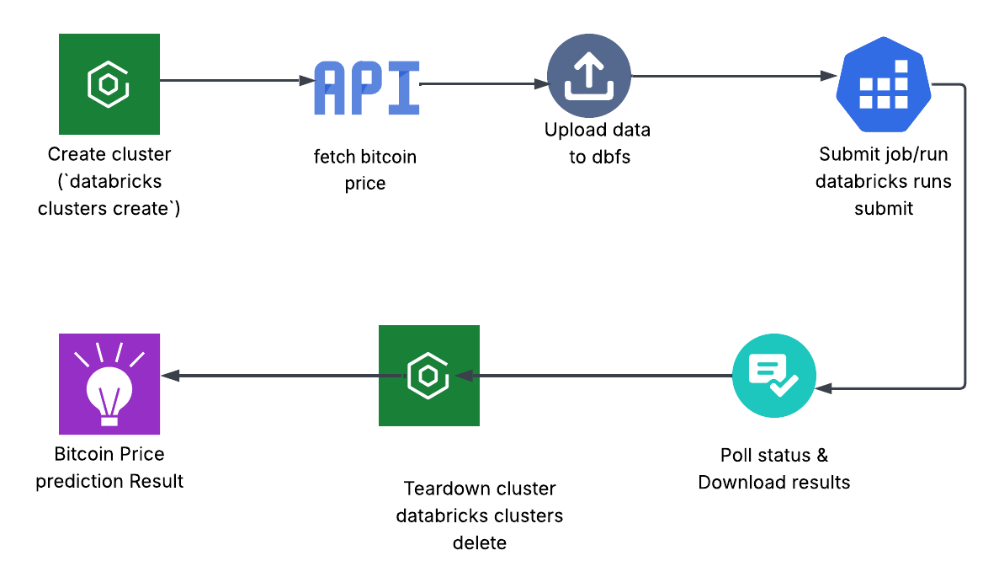

## Table of Contents

- [Workflow Overview](#workflow-overview)
- [Project Files](#project-files)
- [1. Introduction](#1-introduction)
- [2. Prerequisites & Setup](#2-prerequisites--setup)
- [3. Pipeline Steps](#3-pipeline-steps)
- [4. Example Script](#4-example-script)
- [5. Interactive Notebook](#5-interactive-notebook)
- [6. References](#6-references)

## Project Files

- **`databricks_cli_utils.py`**  
  Shared helpers for CLI operations, data fetch/parse, data ingestion, ARIMA training, forecasting and plotting.

- **`databricks_cli.example.py`**  
  **Your go-to, one-shot pipeline runner.** Executes the full fetch→forecast→plot flow without manual steps.

- **`databricks_cli.example.ipynb`**  
  Interactive notebook that imports `databricks_cli_utils.py` for a hands-on, cell-by-cell walkthrough of the same pipeline.

- **`config/cluster_config.json`**  
  Cluster settings for provisioning.

- **`data/bitcoin_price.json`** & **`data/forecast_output.csv`**  
  Local storage of fetched prices and downloaded forecasts.

- **`output_plots/`**  
  Directory holding the generated historical and forecast PNGs.

---

## 1. Introduction

This example demonstrates how to orchestrate a Databricks-powered time-series forecast entirely via the CLI:

- Provision cloud resources  
- Stage data into DBFS  
- Trigger and monitor remote analysis  
- Retrieve results  
- Visualize forecasts locally  

All heavy lifting is done by the Python wrappers in `databricks_cli_utils.py`, called from `databricks_cli.example.py` or the companion notebook.

---

## 2. Prerequisites & Setup

1. **Databricks CLI**  
   ```bash
   pip install databricks-cli
   databricks configure --token
   ```
2. **Python dependencies**  
   ```bash
   pip install -r requirements.txt
   ```
3. **Cluster config**  
   Ensure `config/cluster_config.json` reflects your workspace’s available spark version and node types.

---

## 3. Pipeline Steps

1. **Cluster Provisioning**  
   - `create_cluster_cli()` → waits for “RUNNING” state

   

2. **Data Ingestion**  
   - `fetch_bitcoin_data()` saves to `data/bitcoin_price.json`  
3. **Data Staging**  
   - `upload_to_dbfs_cli("data/bitcoin_price.json", "dbfs:/bitcoin/bitcoin_price.json")`

   **Pre upload dbfs**
   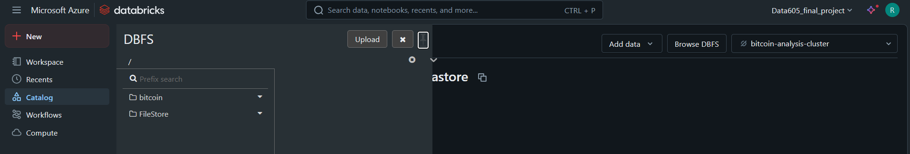

   **After data upload dbfs**
   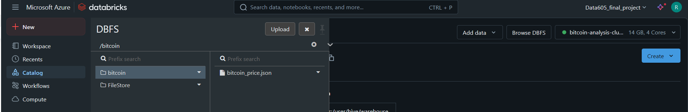

4. **Job Submission**  
   - `submit_notebook_run_cli()` points to `bitcoin_analysis.ipynb` on the cluster

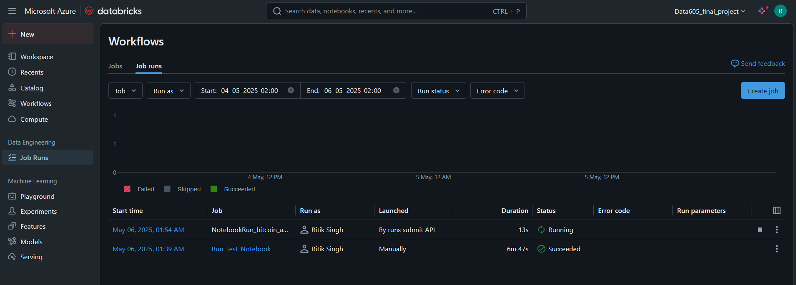

5. **Job Monitoring**  
   - Poll via `get_job_run_status_cli()` until success  
   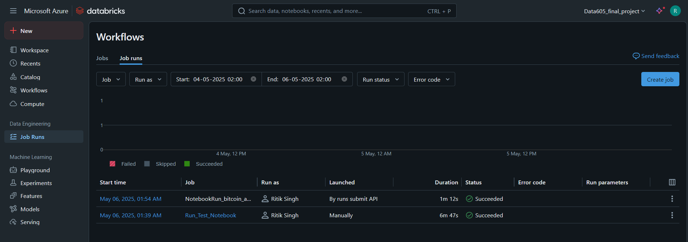

   - `bitcoin analysis (./notebooks/bitcoin_analysis.ipynb)` notebook in databricks run compilation
   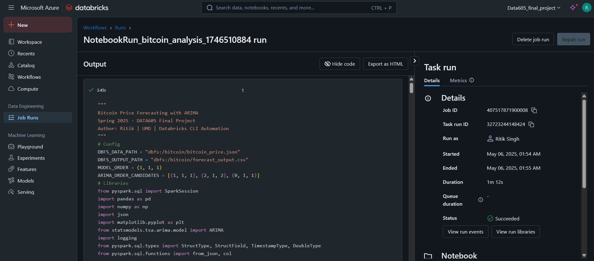

6. **Result Retrieval**  
   - `download_from_dbfs_cli("dbfs:/bitcoin/forecast_output.csv", "data/forecast_output.csv")`
   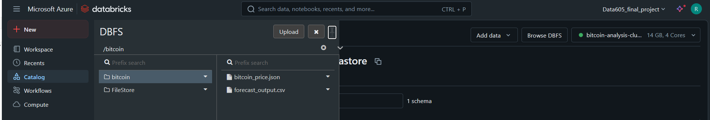
7. **Cluster Teardown**  
   - `delete_cluster_cli()` cleans up resources
   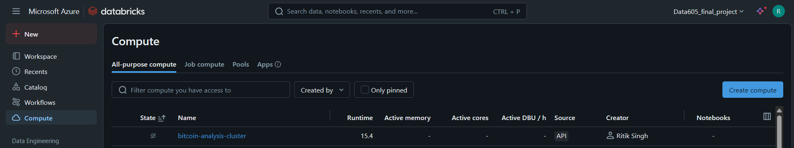  
8. **Local Visualization**  
   - Load `data/bitcoin_price.json` & `data/forecast_output.csv`  
   - Plot with `plot_historical_data()` and `plot_forecast_data()`

   **Intial Data trend in Databricks**
   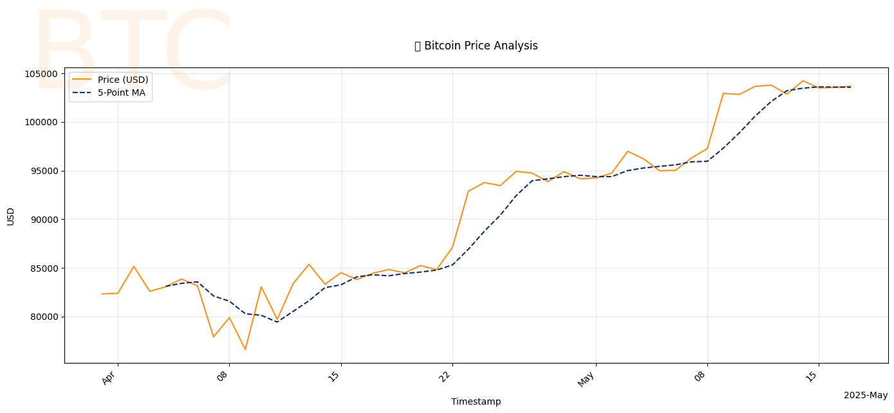

   **ARIMA Results**
   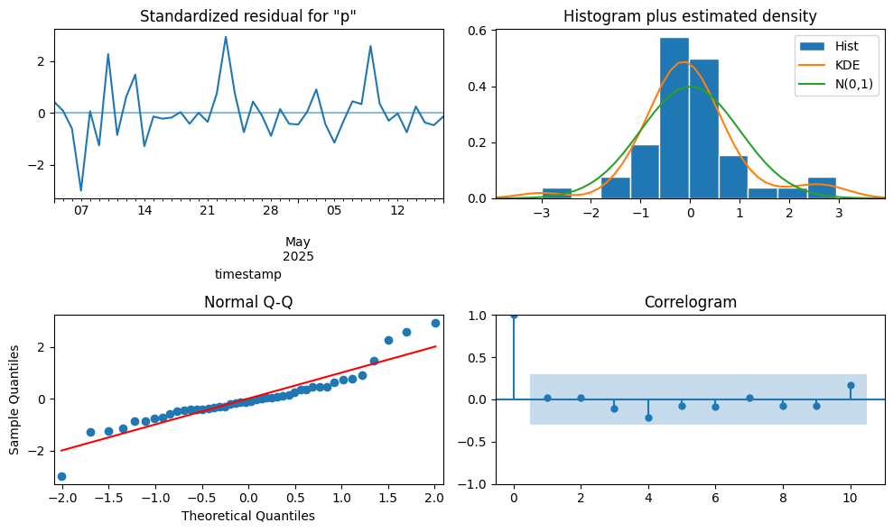

   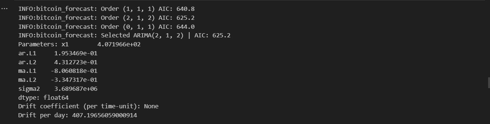


   **Final Prediction Trend**
   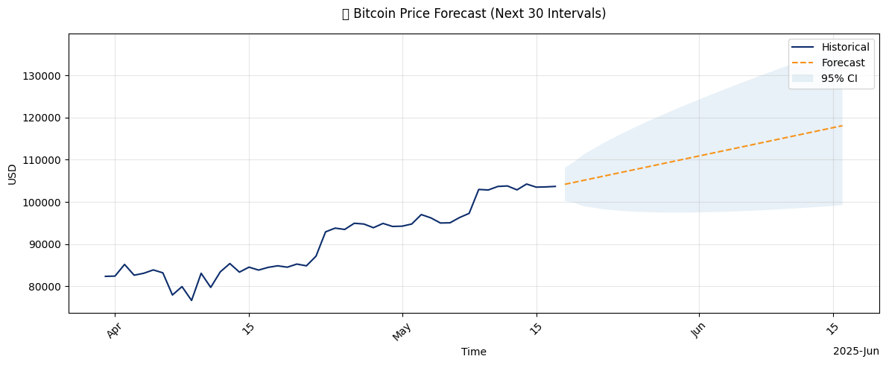 
---

## 4. Example Script

**Why this matters**  
Use the `.py` script for _automated_, reproducible deployments—whether you’re testing in CI or scheduling in cron:

```bash
python databricks_cli.example.py
```

This single command runs steps 1–8 (cluster provision → teardown, data upload/download, forecasting, and plot saving).  

The notebook is offered as a richer, interactive guide, but the `.py` script is your definitive pipeline runner.


This script runs steps 1–8 automatically and saves plots under `output_plots/`.

---

## 5. Interactive Notebook

For a step-by-step, annotated walkthrough, open:

```bash
jupyter notebook databricks_cli.example.ipynb
```

and run **Restart & Run All**.

---

## 6. References

- **Bitcoin API (CoinGecko)**: https://www.coingecko.com/en/api  
- **Databricks CLI Docs**: https://docs.databricks.com/dev-tools/cli/index.html  
- **Companion Utilities**: `databricks_cli_utils.py`


