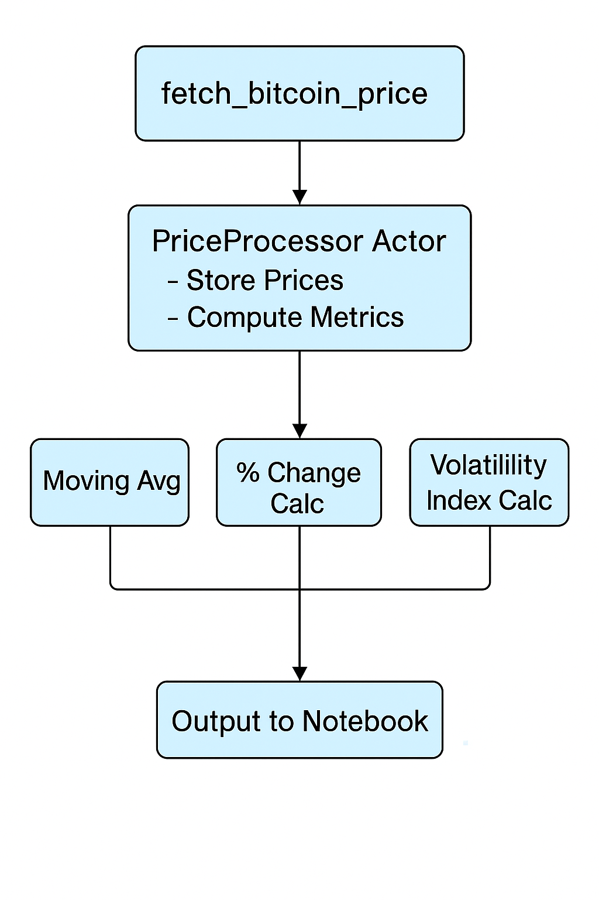

# Bitcoin API Documentation

This document provides a detailed overview of the real-time Bitcoin price ingestion and processing API built using Ray. The API is implemented in the `bitcoin_utils.py` module and is designed to be modular, distributed, and scalable.

---

## Intent and Overview

The goal of this API is to:

* Ingest real-time Bitcoin price data from the [CoinGecko API](https://www.coingecko.com/en/api)
* Use [Apache Ray](https://docs.ray.io/en/latest/) for distributed, asynchronous computation
* Maintain a live data store and compute basic financial analytics in real-time

This utility module enables notebooks to focus solely on documentation, logic flow, and visualization, while computation and data handling are offloaded to scalable Ray components.

---

## Architecture Overview

The system consists of modular, distributed components using Ray:

              

##  Internal Logic Flow

1. **Ingestion**

   * `fetch_bitcoin_price()` (Ray remote function) pings the CoinGecko API.
   * It returns a `(timestamp, price)` tuple.

2. **Storage (Ray Actor)**

   * The `PriceProcessor` actor is a stateful Ray object.
   * It maintains a list of all fetched `(timestamp, price)` entries.
   * All data transformation and analysis operate on this in-memory list.

3. **Analytics**

   * When called, methods like `compute_moving_average()` convert stored data to a DataFrame, perform rolling operations, and return structured dictionaries.
   * Volatility is computed by rolling standard deviation of log returns.
   * Methods like `filter_prices_above(threshold)` scan the data to find matching entries.

4. **Asynchronous Behavior**

   * All Ray actor interactions are non-blocking and distributed across processes.
   * This enables scalable streaming pipelines without bottlenecks.

---

## Key Design Decisions

* **Separation of concerns**: API fetching, processing, and analytics are modular.
* **Ray actor model**: `PriceProcessor` keeps state and handles updates, transforming procedural logic into asynchronous actor tasks.
* **Streaming support**: Functions like `run_price_stream` simulate live feeds for testing.
* **Extensibility**: Easily plug in other APIs or time series analytics.

---

## API Components

### `fetch_bitcoin_price()`

* Type: Ray remote function
* Purpose: Queries the CoinGecko API for the latest BTC price in USD.
* Returns: A tuple `(timestamp, price)`
* Behavior: Uses `requests` with error handling and logs issues

### `PriceProcessor` (Ray Actor)

Maintains a growing in-memory store of `(timestamp, price)` tuples and provides analytics.

#### Key Methods:

* `add_price(timestamp, price)`: Adds new price point
* `get_data()`: Returns raw list of stored prices
* `get_data_with_readable_time()`: Converts Unix timestamps to human-readable format
* `compute_moving_average(window=5)`: Rolling mean of prices
* `compute_percentage_changes()`: Computes percent changes between subsequent prices
* `compute_volatility(window=5)`: Rolling standard deviation of returns (volatility index)
* `filter_prices_above(threshold)`: Filters prices above a given USD threshold

### `load_csv_to_actor(file_path, actor)`

* Loads historical CSV file to the Ray actor (for bootstrapping or offline testing)
* Uses `timestamp` and `price` columns

### `run_price_stream(processor, interval=10, max_fetches=10)`

* Simulates a live stream of price ingestion from the API
* Fetches data every `interval` seconds for a total of `max_fetches`

### `fetch_hourly_btc_yfinance(period="7d", interval="1m")`

* Optional utility to pull historical Bitcoin price data from Yahoo Finance
* Uses `yfinance` to fetch and structure BTC-USD data

---

## References

* CoinGecko API Docs: [https://www.coingecko.com/en/api](https://www.coingecko.com/en/api)
* Apache Ray Docs: [https://docs.ray.io](https://docs.ray.io)
* yFinance: [https://pypi.org/project/yfinance](https://pypi.org/project/yfinance)
