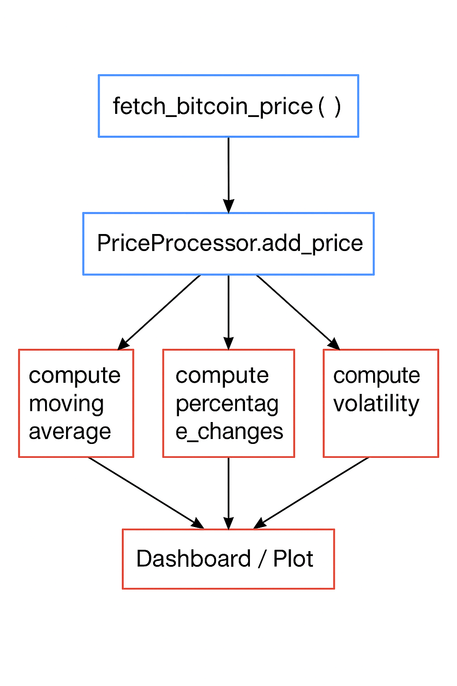

# Real-time Bitcoin Data Processing with Apache Ray

<!-- toc -->

- [Overview](#overview)
- [Native APIs and Their Roles](#native-apis-and-their-roles)
  * [CoinGecko API](#coingecko-api)
  * [Apache Ray](#apache-ray)
- [Custom Software Layer](#custom-software-layer)
  * [Modular Design](#modular-design)
  * [Stateful Processing](#stateful-processing)
- [Streaming Simulation](#streaming-simulation)
- [Extensibility](#extensibility)
- [Design Constraints](#design-constraints)
- [Flowchart Overview](#flowchart-overview)
- [Final Thoughts](#final-thoughts)
- [Future Improvements](#future-improvements)
- [References](#references)

<!-- tocstop -->

## Overview

This document outlines the design decisions and intent behind building a distributed, real-time Bitcoin data processing system using Apache Ray. The project integrates external APIs (such as CoinGecko) for data ingestion and uses Ray's native parallel and distributed computing primitives to structure a scalable and modular processing layer.

The goal was to build a fault-tolerant, extendable system capable of streaming, transforming, and analyzing real-time financial data.

## Native APIs and Their Roles

### CoinGecko API

**Intent:**  
To obtain real-time Bitcoin price data via a free and publicly available HTTP API.

**Design Considerations:**  
- Chosen for its simplicity and rate-limit-friendly nature (for academic use).
- Returns lightweight JSON, making it ideal for frequent polling.
- Time-based polling is used instead of a WebSocket for simplicity and compatibility with batch-based systems.

### Apache Ray

**Intent:**  
To introduce concurrency and distributed stateful processing without rewriting the logic in a lower-level framework like MPI or managing multi-threading explicitly.

**Key Features Used:**
- `@ray.remote` functions for stateless tasks (price fetching).
- `@ray.remote` classes (actors) for maintaining evolving state (time series data).
- Centralized actor (`PriceProcessor`) to encapsulate transformation logic.

**Design Benefits:**
- Parallelism: Functions like price fetching or data transformation can scale with CPU cores.
- Fault isolation: Ray actors run independently, isolating crashes.
- Flexibility: Additional actors or tasks can be added without disrupting current structure.

## Custom Software Layer

### Modular Design

The software layer is split into the following logical units:

#### 1. Data Ingestion

- Implemented via a Ray remote function `fetch_bitcoin_price()`.
- Fetches current BTC price and returns timestamped tuples.
- Isolated from processing to decouple concerns.

**Design Choice:**  
Use a stateless Ray task to allow potential scaling across multiple APIs or retry mechanisms.

### Stateful Processing

Encapsulated within `PriceProcessor` actor, which supports:

- `add_price()`: Append streaming data.
- `get_data_with_readable_time()`: Return formatted output for inspection/logging.
- `compute_moving_average()`: Rolling smoothing of price series.
- `compute_percentage_changes()`: Track short-term market momentum.
- `compute_volatility()`: Measure market variability.
- `filter_prices_above()`: Enable threshold-based decision filtering.

**Design Decision:**  
Keep all business logic inside a single actor to ensure state locality and eliminate the need for external databases.

## Streaming Simulation

A controller function `run_price_stream()` simulates real-time conditions by:
- Periodically invoking the fetch function.
- Pushing data into the actor.
- Logging real-time progress.

**Design Intent:**  
Meant for offline simulation or testing before deploying to real streaming platforms like Kafka or Pub/Sub.

## Extensibility

The software is designed to support:

- **Historical Data Bootstrapping** via `load_csv_to_actor()`.
- **Real-time + Batch Blending** with `yfinance`.
- **Feature Engineering Add-ons** for RSI, MACD, etc.

## Design Constraints

- Minimal external dependencies for portability.
- Focused on CPU-based scalability via Ray.
- In-memory storage only (no persistent DB layer).
- Visualization logic is separated from core logic.

## Flowchart Overview

## LSTM-Based Bitcoin Price Prediction

### Intent

To incorporate deep learning into the pipeline by using an LSTM (Long Short-Term Memory) model to predict future Bitcoin prices based on combined historical and real-time data.

### Preprocessing

- Combined dataset from yfinance and CoinGecko is cleaned and sorted by timestamp.
- Prices are scaled using MinMaxScaler to normalize data for neural network training.
- A sliding window approach is used to prepare sequences for LSTM input.

### Model Design

- Architecture: Two stacked LSTM layers with dropout, followed by a dense output layer.
- Loss function: Mean Squared Error (MSE)
- Optimizer: Adam
- Data split: 80% training, 20% testing (time-based split without shuffling)

### Evaluation

The model performance is evaluated using:

- Mean Absolute Error (MAE)
- Root Mean Squared Error (RMSE)
- Mean Absolute Percentage Error (MAPE)
- Accuracy (defined as 100 - MAPE)

## Final Thoughts

This project demonstrates how Ray can bridge the gap between simple Python scripts and scalable, distributed systems. By abstracting parallelism and state management into Ray's API, the focus shifts to designing clear, modular processing logic — which makes it a powerful tool for real-time financial data processing.

## Future Improvements

- **Integrate WebSocket-based streaming** instead of periodic polling for real-time responsiveness.
- **Persist data in a database** (e.g., PostgreSQL or TimescaleDB) for long-term historical analysis.
- **Add retry mechanisms and error logging** to handle API failures gracefully.
- **Modularize configuration** using YAML or `.env` files to manage parameters like API endpoint, polling interval, or filter thresholds.
- **Implement unit tests and CI/CD hooks** for validating functionality and automating deployments.
- **Support multi-source ingestion**, e.g., yfinance, CoinMarketCap, Binance APIs.

## References and Citations

- [Ray Official Documentation](https://docs.ray.io/en/latest/)
- [CoinGecko API Docs](https://www.coingecko.com/en/api/documentation)
- [Pandas Library](https://pandas.pydata.org/)
- [Matplotlib](https://matplotlib.org/)
- [Plotly](https://plotly.com/python/)
