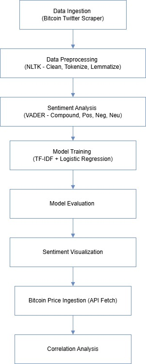

# Real-Time Bitcoin Sentiment Analysis Using NLTK and Selenium​

## Project Overview
This project explores how public opinion about Bitcoin, as expressed on Twitter, aligns with actual changes in Bitcoin's market price. The idea is to use natural language processing (NLP) to understand tweet sentiment — whether people are feeling positive, negative, or neutral — and then investigate if these sentiments correlate with Bitcoin’s value in real time.

The full project pipeline includes:
- **Collecting tweets about Bitcoin** using a selenium-twitter-scraper.
- **Cleaning and preparing the tweet text** so it can be analyzed.
- **Analyzing sentiment** of each tweet using a well-known sentiment tool (VADER).
- **Training a machine learning model** to automatically classify sentiment.
- **Visualizing trends** in sentiment over time.
- **Comparing tweet sentiment to Bitcoin prices** to find any correlation.

---

## Pipeline

  

## Workflow and Explanations

### 1. **Data Ingestion**
We begin by collecting real-time tweets that mention Bitcoin. Instead of using the Twitter API (which has limitations), we used a **selenium-twitter-scraper** that scrolls through Twitter pages and extracts tweet content. These tweets are saved in a CSV file, forming the raw dataset for our analysis.

### 2. **Text Preprocessing**
Raw tweet text contains a lot of unnecessary characters — links, hashtags, emojis, usernames, etc. Before analysis, we clean each tweet by:
- Removing URLs (like links to websites).
- Removing mentions (like `@elonmusk`) and hashtags (like `#Bitcoin`).
- Making everything lowercase to maintain consistency.
- Breaking the tweet into individual words using a method called **tokenization**.
- Removing common unimportant words (like “the”, “is”, “at”) using a predefined list of **stopwords**.
- Reducing each word to its root form using **lemmatization** (e.g., “running” becomes “run”).

This cleaned version of the tweet gives a more meaningful structure for analysis.

### 3. **Sentiment Analysis**
We then use **VADER (Valence Aware Dictionary and sEntiment Reasoner)**, a sentiment analyzer from the NLTK library. It is designed to work well on social media text.

For each tweet, VADER gives:
- A **compound score** (overall sentiment from -1 to 1).
- **Positive, neutral, and negative scores**.

These scores help classify each tweet into **positive**, **negative**, or **neutral** sentiment categories.

### 4. **Model Training and Evaluation**
Once tweets are labeled with sentiment, we train a machine learning classifier. The process includes:
- Converting tweet text into numbers using **TF-IDF vectorization** (which captures important words).
- Splitting the data into training and testing sets (to avoid overfitting).
- Training a **Logistic Regression model** to predict the sentiment of tweets.
- Evaluating the model using **Accuracy, Precision, Recall**, and **F1-score**, which help measure how well the model is performing.

### 5. **Visual Analysis**
We use charts and graphs to explore the results:
- A **bar chart** shows the distribution of tweet sentiments.
- A **line plot** displays how tweet sentiment changes over time — are people more negative when prices fall?
- These visuals make it easy to spot trends and patterns.

### 6. **Correlation with Bitcoin Price**
Finally, we fetch **real-time Bitcoin prices** from a financial API.
We generate a **correlation matrix** to check if there is any mathematical relationship between:
- The compound sentiment score of tweets.
- The actual Bitcoin price.

A **positive correlation** would suggest that as tweet sentiment gets more positive, Bitcoin price tends to rise — and vice versa.

---

## Key Visuals

- **Sentiment Distribution Plot**: Helps understand public mood.
- **Time-Series Sentiment Graph**: Shows trends in how people feel about Bitcoin over time.
- **Correlation Heatmap**: Highlights relationships between tweet sentiment and Bitcoin price.

---

## Tools & Libraries Used
- **Python** for scripting.
- **Pandas** and **NumPy** for data handling.
- **Matplotlib** and **Seaborn** for plotting.
- **NLTK** for natural language processing and VADER sentiment analysis.
- **Selenium** for scraping Twitter without API access.
- **Scikit-learn** for machine learning (Logistic Regression).

---

## Results Summary
- Most tweets tend to be **positive or neutral**, indicating general optimism in Bitcoin discussions.
- Overall, **positive shifts** in tweet sentiment generally align with **price increases** (and negative shifts with declines), though brief divergences show that price can sometimes lead or lag public mood.
- The correlation matrix shows a **noticeable link** between public sentiment and price — supporting the hypothesis that Twitter sentiment can reflect or even predict market behavior.
  - Every time the aggregate sentiment dipped below the negative threshold, the price essentially held steady rather than falling further. 
  - Neutral chatter surprisingly aligned exclusively with upward moves.
  - Positive sentiments mostly accompanied rises, but sometimes showed minor corrections.

---

## Conclusion
This project demonstrates the power of combining **social media analysis** and **financial data** to uncover market signals. By using freely available tools and public data, a pipeline has been built that shows how people’s opinions can potentially forecast economic trends. This could be the first step toward building smarter trading bots or real-time sentiment dashboards.

---
