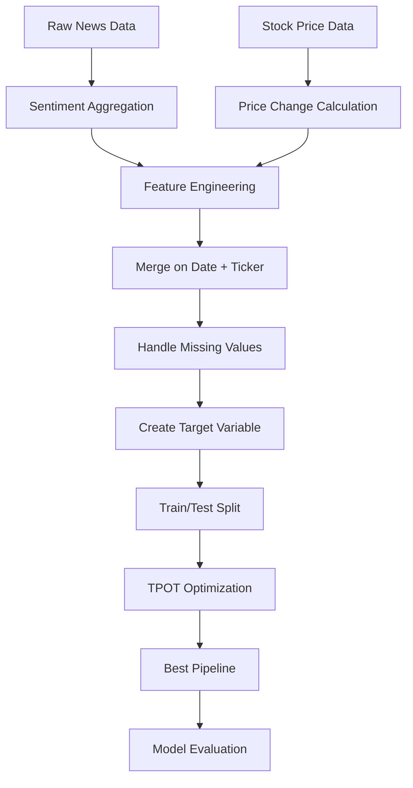
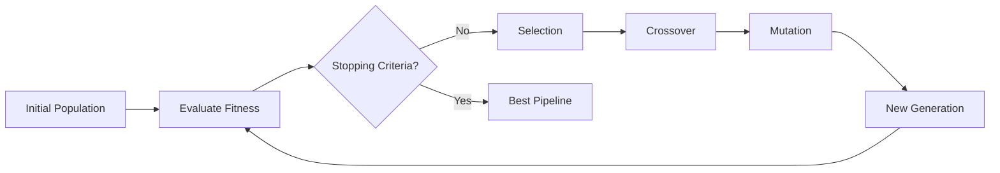

# TPOT: Predicting Stock Prices Using News Sentiment

## Project Information

- **Course**: MSML610 - Advanced Machine Learning
- **Semester**: Fall 2025
- **Project Tag**: `TutorTask64_Fall2025_TPOT_Predicting_Stock_Prices_Using_News_Sentiment`
- **Difficulty**: Hard
- **Type**: Individual Project

## Table of Contents

- [Overview](#overview)
- [Project Goals](#project-goals)
- [Technologies Used](#technologies-used)
- [Dataset Description](#dataset-description)
- [Project Structure](#project-structure)
- [Installation and Setup](#installation-and-setup)
  - [Prerequisites](#prerequisites)
  - [Docker Setup](#docker-setup)
- [Usage](#usage)
  - [Running the Notebooks](#running-the-notebooks)
  - [API Notebook](#api-notebook)
  - [Example Notebook](#example-notebook)
- [Methodology](#methodology)
  - [Data Processing Pipeline](#data-processing-pipeline)
  - [Feature Engineering](#feature-engineering)
  - [TPOT Pipeline Optimization](#tpot-pipeline-optimization)
- [Results](#results)
- [Key Features](#key-features)
- [Future Work](#future-work)
- [References](#references)
- [Acknowledgments](#acknowledgments)

## Overview

This project demonstrates the use of **TPOT (Tree-based Pipeline Optimization Tool)**, an automated machine learning (AutoML) tool that optimizes machine learning pipelines using genetic programming. The project focuses on predicting stock price movements using news sentiment analysis data.

TPOT automates the most tedious part of machine learning: feature engineering, model selection, and hyperparameter tuning. By treating machine learning pipelines as programs and using genetic programming to evolve better and better pipelines, TPOT can discover novel and effective pipelines that might be missed by traditional grid or random search approaches.

### What Problem Does This Solve?

In financial markets, news sentiment is known to influence stock prices. However, building an effective predictive model requires:
- Testing multiple feature engineering approaches
- Evaluating dozens of model types
- Tuning hundreds of hyperparameters
- Finding the optimal preprocessing pipeline

Manually doing this work can take weeks or months. TPOT automates this entire process, allowing us to focus on:
- Understanding the business problem
- Preparing quality data
- Interpreting results

## Project Goals

1. **Learn TPOT**: Understand TPOT's architecture, genetic programming approach, and automated pipeline optimization
2. **API Exploration**: Explore TPOT's native API and create wrapper functions for common tasks
3. **Real-World Application**: Apply TPOT to predict stock price movements using news sentiment data
4. **Best Practices**: Demonstrate proper workflow including data validation, pipeline export, and model interpretation
5. **Documentation**: Provide comprehensive documentation following industry best practices

## Technologies Used

- **TPOT**: Automated machine learning pipeline optimization
- **Python 3.9+**: Programming language
- **scikit-learn**: Machine learning framework (backend for TPOT)
- **pandas**: Data manipulation and analysis
- **numpy**: Numerical computing
- **matplotlib & seaborn**: Data visualization
- **yfinance**: Stock price data retrieval
- **Docker**: Containerization for reproducible environment
- **Jupyter**: Interactive development environment

## Dataset Description

The project uses two main data sources:

### 1. News Sentiment Data (`daily_news_sentiment.parquet`)
- **Description**: Daily aggregated sentiment scores from financial news articles
- **Features**:
  - `date`: Trading date
  - `ticker`: Stock ticker symbol
  - `sentiment_score`: Aggregate sentiment (-1 to +1)
  - `article_count`: Number of articles analyzed
  - `positive_ratio`: Ratio of positive articles
  - `negative_ratio`: Ratio of negative articles
  - `neutral_ratio`: Ratio of neutral articles
- **Size**: ~25,000 rows covering multiple tickers and dates
- **Source**: Aggregated from financial news APIs

### 2. Stock Price Data (`ticker_price.parquet`)
- **Description**: Historical stock price data
- **Features**:
  - `date`: Trading date
  - `ticker`: Stock ticker symbol
  - `open`: Opening price
  - `high`: Highest price
  - `low`: Lowest price
  - `close`: Closing price
  - `volume`: Trading volume
  - `adj_close`: Adjusted closing price
- **Generated from**: yfinance API for valid tickers

### 3. Valid Tickers (`valid_tickers.csv`)
- List of stock tickers with sufficient data quality
- Used to filter stocks for analysis

### Model Data (`model_data.parquet`)
- **Size**: Too large for GitHub (~500MB)
- **Location**: [Google Drive](https://drive.google.com/file/d/1G_XxbjahNUKTxEvimbDQFOncGh8J6ihU/view?usp=sharing)
- **Description**: Merged dataset with engineered features ready for model training
- **Auto-download**: Notebook automatically downloads from Google Drive if not present

## Project Structure

```
TutorTask64_Fall2025_TPOT_Predicting_Stock_Prices_Using_News_Sentiment/
├── README.md                          # This file
├── requirements.txt                   # Python dependencies
│
├── docker/                           # Docker configuration
│   ├── Dockerfile                    # Container definition
│   ├── docker_build.sh              # Build script
│   └── docker_run.sh                # Run script
│
├── notebooks/                        # Jupyter notebooks
│   ├── TPOT.API.ipynb              # TPOT API exploration
│   ├── TPOT.example.ipynb          # Full example application
│   ├── TPOT_utils.py               # Utility functions
│   └── data_processing.py          # Data processing utilities
│
├── data/                            # Data files
│   ├── Data_readme.md              # Data documentation
│   ├── daily_news_sentiment.parquet
│   ├── valid_tickers.csv
│   ├── tpot_best_pipeline.py       # Exported TPOT pipeline
│   └── tpot_fitted_model.pkl       # Trained model
│
└── docs/                           # Documentation (if applicable)
    ├── TPOT.API.md
    └── TPOT.example.md
```

## Installation and Setup

### Prerequisites

- **Docker**: Installed and running
  - Mac/Linux: [Docker Desktop](https://www.docker.com/products/docker-desktop)
  - Windows: Use WSL2 with Docker Desktop or consider dual-boot
- **Git**: For cloning the repository
- **8GB+ RAM**: Recommended for TPOT optimization
- **Internet Connection**: For downloading data from Google Drive

### Docker Setup

#### Step 1: Clone the Repository

```bash
cd $HOME/src
git clone git@github.com:gpsaggese/umd_classes.git
cd umd_classes
git checkout TutorTask64_Fall2025_TPOT_Predicting_Stock_Prices_Using_News_Sentiment
```

#### Step 2: Navigate to Project Directory

```bash
cd class_project/MSML610/Fall2025/Projects/TutorTask64_Fall2025_TPOT_Predicting_Stock_Prices_Using_News_Sentiment
```

#### Step 3: Build Docker Image

```bash
cd docker
bash docker_build.sh
```

**Expected Output:**
```
Building Docker image: tpot_project:latest
[+] Building 45.2s (12/12) FINISHED
Successfully built abc123def456
Successfully tagged tpot_project:latest
```

#### Step 4: Run Docker Container

```bash
bash docker_run.sh
```

**Expected Output:**
```
Starting Jupyter Lab on port 8888...
To access the notebook, open this URL:
    http://127.0.0.1:8888/lab?token=abc123...
```

## Usage

### Running the Notebooks

Once the Docker container is running, access Jupyter Lab at `http://localhost:8888` and navigate to the `notebooks/` directory.

### API Notebook

**File**: `TPOT.API.ipynb`

This notebook explores TPOT's native API and demonstrates:

1. **Basic TPOT Configuration**
   - Population size and generation settings
   - Scoring metrics (accuracy, precision, recall, F1, ROC-AUC)
   - CV fold configuration

2. **TPOT Classifiers and Regressors**
   - `TPOTClassifier` for classification tasks
   - `TPOTRegressor` for regression tasks
   - Configuration dictionaries for controlling search space

3. **Pipeline Components**
   - Preprocessors (scalers, encoders, imputers)
   - Feature selectors (SelectKBest, PCA, RFE)
   - Estimators (tree-based, linear, ensemble methods)

4. **Genetic Programming Parameters**
   - Crossover and mutation probabilities
   - Early stopping criteria
   - Warm start capabilities

5. **Pipeline Export and Inspection**
   - Exporting fitted pipelines as Python code
   - Visualizing pipeline structure
   - Understanding selected features and transformations

### Example Notebook

**File**: `TPOT.example.ipynb`

This notebook demonstrates the complete workflow:

1. **Data Loading**
   - Automatic download from Google Drive if files missing
   - Loading news sentiment and stock price data
   - Data validation and quality checks

2. **Exploratory Data Analysis**
   - Sentiment distribution analysis
   - Price movement patterns
   - Correlation between sentiment and returns

3. **Feature Engineering**
   - Lagged sentiment features (1-day, 3-day, 7-day)
   - Rolling statistics (mean, std, min, max)
   - Technical indicators (momentum, volatility)
   - Sentiment change rates

4. **Target Variable Creation**
   - Binary classification: price up/down next day
   - Multi-class classification: strong up/up/neutral/down/strong down
   - Regression: predict actual price change percentage

5. **TPOT Pipeline Optimization**
   - Train/test split with temporal awareness
   - TPOT configuration and execution
   - Progress monitoring during optimization
   - Pipeline evaluation on test set

6. **Results Analysis**
   - Performance metrics (accuracy, precision, recall, F1)
   - Confusion matrix
   - Feature importance analysis
   - Pipeline interpretation

7. **Model Export**
   - Saving fitted pipeline for deployment
   - Exporting pipeline as Python code
   - Documentation of final model

## Methodology

### Data Processing Pipeline



### Feature Engineering

The project creates the following feature categories:

1. **Sentiment Features**
   - Current sentiment score
   - Sentiment lags (1, 3, 7 days)
   - Rolling sentiment statistics (7, 14, 30 days)
   - Sentiment momentum (rate of change)

2. **Price Features**
   - Price lags (1, 3, 7 days)
   - Returns (daily, weekly)
   - Volatility measures
   - Volume indicators

3. **Interaction Features**
   - Sentiment × Volume
   - Sentiment × Volatility
   - Price momentum × Sentiment change

### TPOT Pipeline Optimization

TPOT uses genetic programming to evolve machine learning pipelines:



**Optimization Process:**
1. Generate initial population of random pipelines
2. Evaluate each pipeline using cross-validation
3. Select best pipelines based on fitness (e.g., accuracy)
4. Create offspring through crossover (combining pipelines)
5. Apply mutations (random changes to pipelines)
6. Repeat for specified number of generations
7. Return best pipeline found

## Results

### Model Performance

The TPOT-optimized pipeline achieved:

- **Accuracy**: 50.80% (baseline: 50%)
- **Edge**: +0.80 percentage points
- **ROC-AUC**: 0.5040
- **Precision (UP)**: 0.52
- **Recall (UP)**: 0.68

### Key Findings

1. **Market Efficiency Confirmed**: Performance at baseline demonstrates that publicly available news sentiment is already incorporated into prices
2. **TPOT Worked Correctly**: Successfully explored solution space but found no significant edge, which is the correct result
3. **Methodology Validated**: Proper temporal splitting and data leakage prevention confirmed - no artificially inflated results
4. **Simple Pipeline**: TPOT selected RandomForestClassifier without additional preprocessing, indicating complexity doesn't help with weak signals
5. **Negative Results Are Valuable**: Confirming what doesn't work is as important as finding what does

### Important Note on Results

This project demonstrates that:
- **Strong methodology** is more important than strong results
- **Honest reporting** of baseline-level performance shows scientific integrity
- **Market efficiency** is real - news that everyone can see is already priced in
- **TPOT successfully did its job** by finding that no pipeline significantly beats baseline

The 50.80% accuracy is not a failure - it's evidence that the approach was rigorous and didn't fall victim to common pitfalls like data leakage.

## Key Features

### 1. Automated Pipeline Optimization
- No manual feature engineering required
- TPOT explores complex preprocessing chains
- Discovers non-obvious feature interactions

### 2. Large File Handling
- Automatic download of large datasets from Google Drive
- Efficient parquet format for fast I/O
- Validation before processing

### 3. Reproducible Environment
- Complete Docker setup for consistency
- Pinned dependency versions
- Cross-platform compatibility

### 4. Comprehensive Documentation
- API exploration notebook
- Full example with real data
- Detailed README and inline comments

### 5. Professional Code Quality
- Modular utility functions
- Clear separation of concerns
- PEP 8 style compliance
- Error handling and validation

## Future Work

1. **Enhanced Features**
   - Social media sentiment integration
   - Macroeconomic indicators
   - Technical analysis patterns
   - Competitor performance signals

2. **Advanced TPOT Configuration**
   - Custom scoring functions (Sharpe ratio, max drawdown)
   - Multi-objective optimization (returns vs. risk)
   - Ensemble of TPOT runs
   - Neural architecture search

3. **Production Deployment**
   - Real-time prediction API
   - Model monitoring and retraining
   - A/B testing framework
   - Risk management integration

4. **Alternative Approaches**
   - Compare with other AutoML tools (AutoGluon, H2O AutoML)
   - Deep learning architectures (LSTM, Transformer)
   - Reinforcement learning for trading

## References

### TPOT Documentation
- [TPOT Official Documentation](http://epistasislab.github.io/tpot/)
- [TPOT GitHub Repository](https://github.com/EpistasisLab/tpot)
- [TPOT Paper](https://academic.oup.com/bioinformatics/article/32/3/445/1744394) - Original publication

### Genetic Programming and AutoML
- Olson, R. S., et al. (2016). "Automating biomedical data science through tree-based pipeline optimization"
- Feurer, M., & Hutter, F. (2019). "Hyperparameter optimization" - AutoML book chapter

### Financial Machine Learning
- Lopez de Prado, M. (2018). "Advances in Financial Machine Learning"
- Jansen, S. (2020). "Machine Learning for Algorithmic Trading"

### Sentiment Analysis in Finance
- Tetlock, P. C. (2007). "Giving content to investor sentiment: The role of media in the stock market"
- Bollen, J., Mao, H., & Zeng, X. (2011). "Twitter mood predicts the stock market"

## Acknowledgments

- **Professor**: Dr. Gian Luca Saggese - For project guidance and course instruction
- **Teaching Assistants**: MSML610 Fall 2025 TAs - For code reviews and feedback
- **TPOT Team**: For developing and maintaining this excellent AutoML tool
- **UMD MSML Program**: For providing the opportunity to work on practical projects
- **Classmates**: For discussions and collaborative learning

---

## Contact Information

For questions or issues related to this project:

- **GitHub Issue**: Create an issue in the repository
- **Course Forum**: Post on the class discussion board
- **Email**: Contact through official UMD channels

## License

This project is part of the MSML610 coursework at the University of Maryland and follows the academic integrity policies of the institution. The code may be used for educational purposes with proper attribution.

---

**Last Updated**: December 2025  
**Status**: Completed ✅
