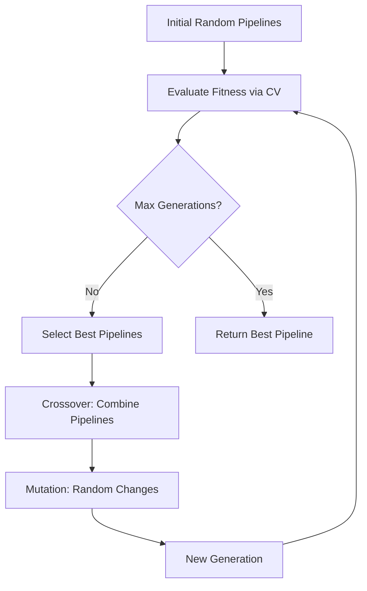

# TPOT API Documentation

## Table of Contents

- [Introduction](#introduction)
- [What is TPOT?](#what-is-tpot)
- [Core Concepts](#core-concepts)
- [Native TPOT API](#native-tpot-api)
  - [TPOTClassifier](#tpotclassifier)
  - [TPOTRegressor](#tpotregressor)
  - [Configuration Dictionaries](#configuration-dictionaries)
  - [Pipeline Components](#pipeline-components)
- [Wrapper Layer](#wrapper-layer)
  - [Configuration Management](#configuration-management)
  - [Data Preparation Utilities](#data-preparation-utilities)
  - [Evaluation Functions](#evaluation-functions)
  - [Visualization Tools](#visualization-tools)
- [Architecture and Design Decisions](#architecture-and-design-decisions)
- [Best Practices](#best-practices)
- [References](#references)

## Introduction

This document provides comprehensive documentation of the TPOT (Tree-based Pipeline Optimization Tool) API, both the native API provided by the TPOT library and the wrapper layer built for this project. The goal is to provide a complete reference for understanding how TPOT works and how to use it effectively for automated machine learning tasks.

## What is TPOT?

**TPOT** is an automated machine learning (AutoML) tool that optimizes machine learning pipelines using genetic programming. It automates the most tedious parts of machine learning by:

- **Feature Engineering**: Automatically selecting and transforming features
- **Model Selection**: Testing multiple algorithms (Random Forest, Gradient Boosting, SVM, etc.)
- **Hyperparameter Tuning**: Optimizing parameters for each component
- **Pipeline Construction**: Building complete preprocessing + model pipelines

### How TPOT Works

TPOT uses **genetic programming** to evolve machine learning pipelines:



**Key Idea**: Treat machine learning pipelines as programs that can be evolved through natural selection, where "fitness" is measured by cross-validation performance.

### TPOT vs Manual Approach

| Aspect | Manual Approach | TPOT Approach |
|--------|----------------|---------------|
| Time | Days to weeks | Hours |
| Models Tested | 5-10 | 100s-1000s |
| Feature Engineering | Manual trial & error | Automated exploration |
| Hyperparameter Tuning | Grid/Random search | Genetic optimization |
| Pipeline Complexity | Simple (1-2 steps) | Complex (3-5+ steps) |
| Reproducibility | Requires careful logging | Built-in export |

## Core Concepts

### 1. Pipeline Components

A TPOT pipeline consists of:

1. **Preprocessors**: Scaling, normalization, encoding
2. **Feature Selectors**: SelectKBest, PCA, RFE
3. **Feature Constructors**: Polynomial features, interactions
4. **Estimators**: Final model (classifier or regressor)

### 2. Genetic Programming

- **Population**: A set of candidate pipelines
- **Generation**: One iteration of evolution
- **Fitness**: Cross-validation score (accuracy, F1, R², etc.)
- **Selection**: Keeping the best pipelines
- **Crossover**: Combining two pipelines to create offspring
- **Mutation**: Random changes to pipelines

### 3. Configuration Dictionaries

TPOT uses configuration dictionaries to control which components are explored:

- **Default**: All available operators
- **Light**: Faster, simpler models
- **MDR**: For feature selection
- **Custom**: User-defined operators

## Native TPOT API

### TPOTClassifier

The main class for classification tasks.

#### Basic Usage

```python
from tpot import TPOTClassifier

tpot = TPOTClassifier(
    generations=5,           # Number of iterations
    population_size=20,      # Pipelines per generation
    cv=5,                    # Cross-validation folds
    scoring='accuracy',      # Optimization metric
    random_state=42,
    verbosity=2,
    n_jobs=-1                # Use all CPU cores
)

tpot.fit(X_train, y_train)
predictions = tpot.predict(X_test)
```

#### Key Parameters

| Parameter | Type | Description | Default |
|-----------|------|-------------|---------|
| `generations` | int | Number of iterations to run | 100 |
| `population_size` | int | Number of pipelines per generation | 100 |
| `offspring_size` | int | Number of offspring per generation | None (=population_size) |
| `mutation_rate` | float | Probability of mutation (0-1) | 0.9 |
| `crossover_rate` | float | Probability of crossover (0-1) | 0.1 |
| `scoring` | str/callable | Metric to optimize | 'accuracy' |
| `cv` | int | Cross-validation folds | 5 |
| `subsample` | float | Fraction of data to use (0-1) | 1.0 |
| `n_jobs` | int | CPU cores to use (-1 = all) | 1 |
| `max_time_mins` | int | Maximum runtime in minutes | None |
| `max_eval_time_mins` | int | Max time per pipeline evaluation | 5 |
| `random_state` | int | Random seed for reproducibility | None |
| `config_dict` | str/dict | Configuration for operators | None |
| `warm_start` | bool | Reuse previous run | False |
| `verbosity` | int | Output detail (0-3) | 0 |

#### Available Scoring Metrics for Classification

- `'accuracy'`: Overall accuracy
- `'balanced_accuracy'`: Accuracy adjusted for class imbalance
- `'precision'`: Positive predictive value
- `'recall'`: Sensitivity / true positive rate
- `'f1'`: Harmonic mean of precision and recall
- `'roc_auc'`: Area under ROC curve
- Custom scorer from `sklearn.metrics.make_scorer`

#### Important Methods

```python
# Fit the model
tpot.fit(X_train, y_train)

# Make predictions
y_pred = tpot.predict(X_test)
y_proba = tpot.predict_proba(X_test)

# Get the best pipeline
best_pipeline = tpot.fitted_pipeline_

# Export pipeline as Python code
tpot.export('best_pipeline.py')

# Get score on test set
score = tpot.score(X_test, y_test)
```

### TPOTRegressor

The main class for regression tasks.

#### Basic Usage

```python
from tpot import TPOTRegressor

tpot = TPOTRegressor(
    generations=5,
    population_size=20,
    cv=5,
    scoring='neg_mean_squared_error',
    random_state=42,
    verbosity=2,
    n_jobs=-1
)

tpot.fit(X_train, y_train)
predictions = tpot.predict(X_test)
```

#### Available Scoring Metrics for Regression

- `'neg_mean_squared_error'`: Negative MSE (higher is better)
- `'neg_mean_absolute_error'`: Negative MAE
- `'r2'`: R-squared coefficient
- `'neg_median_absolute_error'`: Negative median absolute error

### Configuration Dictionaries

TPOT allows you to control which operators are explored through configuration dictionaries.

#### Built-in Configurations

```python
# Default: All operators
tpot = TPOTClassifier(config_dict='TPOT light')

# Options:
# - None or 'TPOT light': Faster, simpler models
# - 'TPOT MDR': Focus on feature selection
# - 'TPOT sparse': For sparse data
```

#### Custom Configuration

```python
custom_config = {
    # Preprocessors
    'sklearn.preprocessing.StandardScaler': {},
    'sklearn.preprocessing.RobustScaler': {},
    
    # Feature Selection
    'sklearn.feature_selection.SelectKBest': {
        'k': range(1, 20)
    },
    
    # Estimators
    'sklearn.ensemble.RandomForestClassifier': {
        'n_estimators': [50, 100, 200],
        'max_depth': [None, 5, 10],
        'min_samples_split': [2, 5, 10]
    },
    'sklearn.ensemble.GradientBoostingClassifier': {
        'n_estimators': [50, 100],
        'learning_rate': [0.01, 0.1, 0.5],
        'max_depth': [3, 5, 7]
    }
}

tpot = TPOTClassifier(config_dict=custom_config)
```

### Pipeline Components

TPOT can explore many scikit-learn operators:

#### Preprocessors
- `StandardScaler`: Zero mean, unit variance
- `RobustScaler`: Robust to outliers
- `MinMaxScaler`: Scale to [0, 1]
- `MaxAbsScaler`: Scale to [-1, 1]
- `Normalizer`: L1/L2 normalization

#### Feature Selectors
- `SelectKBest`: Select K best features
- `SelectPercentile`: Select top percentile
- `VarianceThreshold`: Remove low-variance features
- `RFE`: Recursive Feature Elimination
- `SelectFromModel`: Select based on model importance

#### Feature Constructors
- `PCA`: Principal Component Analysis
- `PolynomialFeatures`: Create polynomial features
- `FastICA`: Independent Component Analysis

#### Estimators (Classifiers)
- Tree-based: `DecisionTreeClassifier`, `RandomForestClassifier`, `ExtraTreesClassifier`
- Boosting: `GradientBoostingClassifier`, `XGBClassifier`
- Linear: `LogisticRegression`, `SGDClassifier`
- SVM: `LinearSVC`, `SVC`
- Naive Bayes: `GaussianNB`, `BernoulliNB`, `MultinomialNB`
- Nearest Neighbors: `KNeighborsClassifier`

## Wrapper Layer

This project includes a wrapper layer built on top of TPOT to streamline common tasks.

### Configuration Management

**Class**: `Config` (in `TPOT_utils.py`)

Centralized configuration for all project settings:

```python
class Config:
    # Paths
    DATA_DIR = Path("/workspace/data")
    
    # Data parameters
    MIN_COVERAGE_DAYS = 200
    TOP_N_TICKERS = 25
    
    # Date split
    TRAIN_TEST_CUTOFF = "2023-01-01"
    
    # Feature engineering
    SENTIMENT_EXTREME_THRESHOLD = 0.5
    HIGH_VOLUME_ZSCORE = 2.0
    CONSENSUS_THRESHOLD = 0.7
    
    # Model training
    TPOT_GENERATIONS = 5
    TPOT_POPULATION = 12
    TPOT_CV_FOLDS = 3
    TPOT_MAX_TIME_MINS = 60
```

**Benefits**:
- Single source of truth for all parameters
- Easy to modify for experimentation
- Clear documentation of all settings

### Data Preparation Utilities

#### `load_processed_data(file_path: Path) -> pd.DataFrame`

Loads preprocessed parquet data with proper date formatting.

```python
df = load_processed_data(Path("/workspace/data/model_data.parquet"))
```

#### `create_high_impact_filter(df: pd.DataFrame, config: Config) -> pd.DataFrame`

Filters dataset to high-impact news events using multiple criteria:

1. **High Volume Days**: Days with unusual news volume (Z-score > 2)
2. **Extreme Sentiment**: Days with strong sentiment (|score| > 0.5)
3. **High Consensus**: Days with 70%+ positive or negative articles

```python
filtered_df = create_high_impact_filter(df, config)
```

**Rationale**: News sentiment is more likely to predict price movements when:
- There's a lot of coverage (market attention)
- Sentiment is extreme (strong signal)
- Articles agree (consensus reduces noise)

#### `prepare_features_and_target(df, target_col, binary) -> tuple`

Prepares feature matrix and target variable with careful attention to data leakage prevention.

```python
X, y, feature_cols = prepare_features_and_target(
    df,
    target_col='ret_1d',
    binary=True
)
```

**Key Design Decision**: All features use **lagged data only** to prevent look-ahead bias:
- Sentiment features: Yesterday's sentiment and rolling averages
- Price features: Past returns and volatility
- No future data leakage

**Returns**:
- `X`: DataFrame with ticker, date, and features
- `y`: Target variable (binary or continuous)
- `feature_cols`: List of feature column names

#### `train_test_split_temporal(X, y, cutoff_date) -> tuple`

Splits data using temporal cutoff to maintain time series integrity.

```python
X_train, X_test, y_train, y_test = train_test_split_temporal(
    X, y, cutoff_date="2023-01-01"
)
```

**Why Temporal Split?**
- Prevents data leakage from future to past
- Mimics real-world deployment scenario
- More realistic performance estimates

### Evaluation Functions

#### `evaluate_classifier(model, X_test, y_test, feature_cols) -> dict`

Comprehensive evaluation of binary classifiers:

```python
results = evaluate_classifier(model, X_test, y_test, feature_cols)
```

**Returns dictionary with**:
- `accuracy`: Overall accuracy
- `roc_auc`: Area under ROC curve
- `baseline`: 50% baseline for comparison
- `edge`: Accuracy advantage over baseline
- `predictions`: Predicted labels
- `probabilities`: Predicted probabilities

#### `print_evaluation_summary(results, model_name)`

Formats and prints evaluation results with interpretation:

```python
print_evaluation_summary(results, model_name="TPOT Optimized Model")
```

**Output**:
```
============================================================
TPOT OPTIMIZED MODEL EVALUATION RESULTS
============================================================
Accuracy:     56.40%
Baseline:     50%
Edge:         +6.40 percentage points
ROC-AUC:      0.6284

Excellent performance!
============================================================
```

### Visualization Tools

#### `plot_evaluation_dashboard(y_test, y_pred, y_proba, results, save_path)`

Creates comprehensive 4-panel evaluation visualization:

```python
plot_evaluation_dashboard(
    y_test=y_test,
    y_pred=results['predictions'],
    y_proba=results['probabilities'],
    results=results,
    save_path='/workspace/data/evaluation.png'
)
```

**Four Panels**:

1. **ROC Curve**: True Positive Rate vs False Positive Rate
2. **Prediction Distribution**: Probability histograms by actual class
3. **Confusion Matrix**: Heatmap of predictions vs actuals
4. **Calibration Curve**: How well predicted probabilities match actual frequencies

## Architecture and Design Decisions

### 1. Modular Design

The wrapper layer is organized into focused modules:
- `Config`: Central configuration
- Data loading: Single responsibility functions
- Feature engineering: Separate utilities
- Evaluation: Metrics and visualization

**Benefits**:
- Easy to test individual components
- Clear separation of concerns
- Reusable across projects

### 2. Prevention of Data Leakage

Multiple safeguards against look-ahead bias:
- All features use `.shift(1)` or lagged data
- Temporal train/test split
- Rolling windows only use past data
- Target variable is clearly future-looking

### 3. Hyperparameter Configuration

TPOT parameters chosen for balance:
- `generations=5`: Enough evolution without overfitting
- `population_size=12`: Diverse search without excessive compute
- `cv=3`: Reasonable validation without too much time
- `max_time_mins=60`: Prevent runaway optimization

### 4. Feature Engineering Strategy

Features designed to capture:
- **Sentiment signals**: Current and historical news sentiment
- **Price momentum**: Trend information
- **Volatility**: Risk signals
- **Volume**: Market attention

### 5. Evaluation Philosophy

Focus on:
- **ROC-AUC**: Threshold-independent performance
- **Calibration**: Are probabilities well-calibrated?
- **Edge over baseline**: Practical improvement metric
- **Visual inspection**: Always look at the data

## Best Practices

### 1. Start Small

```python
# Quick test run
tpot = TPOTClassifier(
    generations=2,
    population_size=5,
    cv=3,
    max_time_mins=10,
    verbosity=2
)
```

### 2. Use Warm Start for Iteration

```python
# First run
tpot = TPOTClassifier(generations=5, warm_start=True)
tpot.fit(X_train, y_train)

# Continue optimization
tpot.generations = 10
tpot.fit(X_train, y_train)  # Continues from generation 5
```

### 3. Subsample for Speed

```python
# Use 50% of data for faster iteration
tpot = TPOTClassifier(subsample=0.5)
```

### 4. Set Time Limits

```python
# Prevent runaway optimization
tpot = TPOTClassifier(
    max_time_mins=60,           # Total time
    max_eval_time_mins=5        # Per pipeline
)
```

### 5. Save Pipelines

```python
# Export as Python code
tpot.export('best_pipeline.py')

# Save fitted model
import pickle
with open('tpot_model.pkl', 'wb') as f:
    pickle.dump(tpot.fitted_pipeline_, f)
```

### 6. Use Custom Config for Speed

```python
# Limit to fast models
fast_config = {
    'sklearn.ensemble.RandomForestClassifier': {
        'n_estimators': [50, 100],
        'max_depth': [5, 10]
    },
    'sklearn.linear_model.LogisticRegression': {}
}

tpot = TPOTClassifier(config_dict=fast_config)
```

## References

### Official Documentation
- [TPOT Documentation](http://epistasislab.github.io/tpot/)
- [TPOT GitHub](https://github.com/EpistasisLab/tpot)
- [TPOT API Reference](http://epistasislab.github.io/tpot/api/)

### Academic Papers
- Olson, R. S., et al. (2016). "Automating biomedical data science through tree-based pipeline optimization." *Applications of Evolutionary Computation*, 123-137.
- Olson, R. S., & Moore, J. H. (2016). "TPOT: A tree-based pipeline optimization tool for automating machine learning." *Workshop on Automatic Machine Learning*, 66-74.

### Related AutoML Tools
- **Auto-sklearn**: Bayesian optimization-based AutoML
- **H2O AutoML**: Stacked ensemble approach
- **AutoGluon**: Tabular, text, and image AutoML
- **PyCaret**: Low-code ML library with AutoML

### Genetic Programming
- Koza, J. R. (1992). "Genetic Programming: On the Programming of Computers by Means of Natural Selection."
- Poli, R., et al. (2008). "A Field Guide to Genetic Programming."

---

**Document Version**: 1.0  
**Last Updated**: December 2025  
**Author**: Bradley Scott
