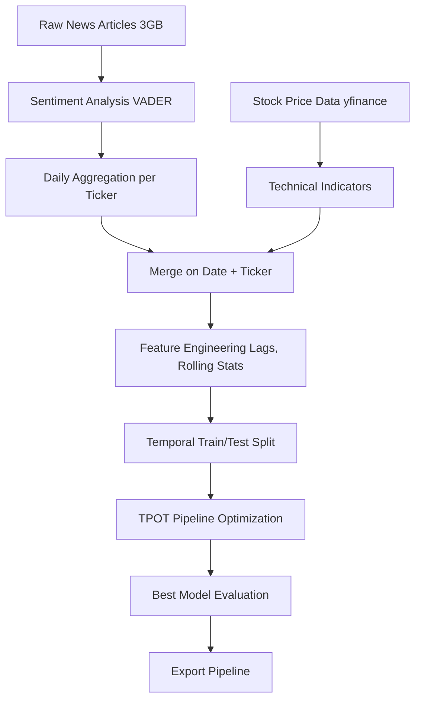
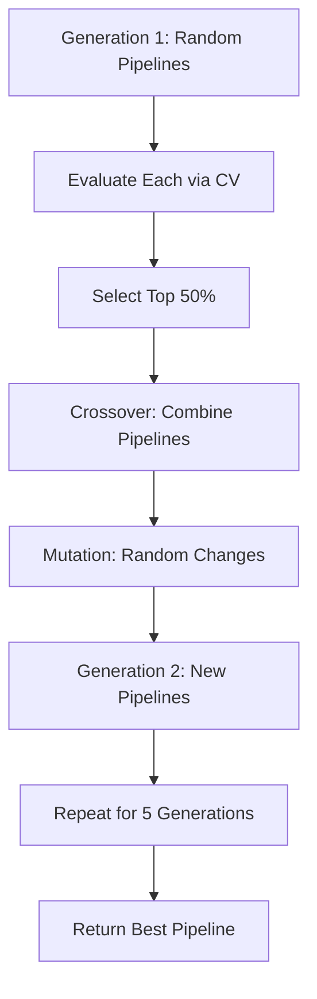

# TPOT Stock Price Prediction Example

## Table of Contents

- [Overview](#overview)
- [Problem Statement](#problem-statement)
- [Approach and Methodology](#approach-and-methodology)
- [Data Sources and Processing](#data-sources-and-processing)
- [Feature Engineering Strategy](#feature-engineering-strategy)
- [TPOT Configuration](#tpot-configuration)
- [Model Training Process](#model-training-process)
- [Results and Interpretation](#results-and-interpretation)
- [Key Findings](#key-findings)
- [Challenges and Solutions](#challenges-and-solutions)
- [Lessons Learned](#lessons-learned)
- [Future Improvements](#future-improvements)

## Overview

This example demonstrates a complete end-to-end machine learning workflow using TPOT to predict stock price movements based on news sentiment. The project showcases:

1. **Real-world data complexity**: Working with time series, multiple tickers, missing data
2. **Feature engineering**: Creating meaningful signals from sentiment and price data
3. **AutoML application**: Letting TPOT discover optimal pipelines
4. **Proper evaluation**: Avoiding common pitfalls like data leakage and overfitting

**Goal**: Predict whether a stock will go up or down the next trading day based on news sentiment and historical price patterns.

## Problem Statement

### Business Context

Financial markets are influenced by news and sentiment. Questions we want to answer:

- Can news sentiment predict short-term price movements?
- Which combinations of sentiment and price features are most predictive?
- Can automated machine learning find patterns humans might miss?

### Technical Challenges

1. **Data Volume**: 3GB of news articles requiring streaming processing
2. **Temporal Dependencies**: Must prevent look-ahead bias in features
3. **Multiple Tickers**: Different stocks have different patterns
4. **Class Imbalance**: Slight bias toward positive days (54% vs 46%)
5. **Weak Signals**: Finance is notoriously difficult to predict
6. **Model Selection**: Many possible feature transformations and models

### Why TPOT?

TPOT is ideal for this problem because:

- **Complex feature space**: TPOT can explore interactions we might not consider
- **Unknown optimal model**: No clear "best" algorithm for this problem
- **Time constraints**: Faster than manual hyperparameter search
- **Reproducibility**: Exports pipelines as readable code

## Approach and Methodology

### Overall Workflow



### Design Decisions

#### 1. Sentiment Analysis Approach

**Decision**: Use VADER (Valence Aware Dictionary and sEntiment Reasoner)

**Rationale**:
- Pre-trained on social media and news text
- Fast: Processes millions of articles in hours
- No fine-tuning required
- Returns compound score (-1 to +1)

**Alternative Considered**: Fine-tuned BERT
- **Pros**: More accurate sentiment
- **Cons**: 100x slower, requires GPU, harder to deploy

#### 2. Target Variable: Binary Classification

**Decision**: Predict up (1) vs down (0) for next day

**Rationale**:
- Simpler than regression
- Matches trading decision (buy/sell)
- More robust to outliers
- Easier to evaluate (accuracy, ROC-AUC)

**Alternative Considered**: Multi-class (strong up/up/neutral/down/strong down)
- **Pros**: Captures magnitude
- **Cons**: Harder to predict, less data per class

#### 3. Temporal Train/Test Split

**Decision**: All data before 2023-01-01 for training, after for testing

**Rationale**:
- Mimics real-world deployment
- Prevents data leakage
- Tests generalization to new time period
- More conservative than random split

**Why Not Random Split?**
- Would allow model to "see the future"
- Inflates performance metrics
- Doesn't test time-series robustness

## Data Sources and Processing

### 1. News Sentiment Data

**Source**: Hugging Face dataset FNSPID (Financial News and Stock Price Integration Dataset)

**Processing Steps**:


**Key Transformations**:
- Parse dates to datetime
- Expand comma-separated tickers
- Clean ticker symbols (A-Z and dots only)
- Apply VADER to article text
- Aggregate per ticker per day:
  - Average sentiment
  - Count of positive articles (score > 0.05)
  - Count of negative articles (score < -0.05)
  - Total article count

**Why Daily Aggregation?**
- Reduces noise from individual articles
- Aligns with daily stock price data
- Captures overall sentiment trend
- Manageable data size for modeling

### 2. Stock Price Data

**Source**: Yahoo Finance via `yfinance` library

**Coverage**: 
- 25 tickers with highest news coverage
- 2014-2024 (10 years)
- Only tickers with 200+ days of news coverage
- Filtered to remove delisted stocks

**Features Retrieved**:
- Open, High, Low, Close prices
- Volume
- Adjusted for splits and dividends (`auto_adjust=True`)

**Quality Checks**:
- Verify ticker exists in yfinance
- Remove tickers with sparse data
- Trim to date range with news coverage

### 3. Data Merging Strategy

**Merge Type**: Left join (price data as base)

**Rationale**:
- Every trading day should have a row
- News-free days are informative (filled with 0 sentiment)
- Maintains temporal continuity

**Handling Missing Data**:
- Missing sentiment: Fill with 0 (no news)
- Missing prices: Drop row (can't predict)
- Missing features: Computed from available data

## Feature Engineering Strategy

### Philosophy

**Goal**: Create features that:
1. Use only past information (no look-ahead bias)
2. Capture different aspects of sentiment and price behavior
3. Are interpretable for model understanding
4. Have reasonable business logic

### Feature Categories

#### 1. Sentiment Features (Lagged)

All sentiment features use **yesterday's data or earlier**:

| Feature | Description | Rationale |
|---------|-------------|-----------|
| `sent_lag1` | Yesterday's average sentiment | Direct recent signal |
| `sent_roll5` | 5-day rolling average | Smooths noise, shows trend |
| `sent_roll10` | 10-day rolling average | Longer-term sentiment |
| `news_count_roll5` | 5-day rolling article count | Media attention signal |
| `sent_pos` | Binary: Was yesterday positive? | Simple threshold signal |
| `sent_neg` | Binary: Was yesterday negative? | Simple threshold signal |

**Why Lags?**
- News published today affects tomorrow's price
- Today's price already reflects today's news
- Using today's sentiment would be look-ahead bias

#### 2. Price Features (Lagged)

All price features use **past data only**:

| Feature | Description | Rationale |
|---------|-------------|-----------|
| `ret_1d_past` | Yesterday's return | Recent momentum |
| `ret_5d_past` | 5-day past return | Short-term trend |
| `ret_10d_past` | 10-day past return | Medium-term trend |
| `ret_20d_past` | 20-day past return | Longer-term trend |
| `price_vol10` | 10-day historical volatility | Risk measure |
| `price_vol20` | 20-day historical volatility | Longer-term risk |
| `momentum_5d` | 5-day momentum | Acceleration signal |
| `momentum_10d` | 10-day momentum | Longer momentum |

**Volatility Calculation**:
```
volatility = std(daily_returns over window)
```

**Momentum Calculation**:
```
momentum = (price_today / price_N_days_ago) - 1
```

#### 3. Interaction Features (Implicit)

TPOT can discover interactions through:
- `PolynomialFeatures`: sentiment × volume, etc.
- Feature construction operators
- Non-linear models (tree ensembles capture interactions naturally)

### Data Leakage Prevention

**Critical Design Principle**: Never use future data to predict the past

**Implementation**:
```python
# CORRECT: Lagged sentiment
df['sent_lag1'] = df.groupby('ticker')['avg_sentiment'].shift(1)

# WRONG: Would use today's sentiment to predict today's return
df['sent_today'] = df['avg_sentiment']  # DON'T DO THIS

# Target is tomorrow's return
df['ret_1d'] = df.groupby('ticker')['close'].pct_change().shift(-1)
```

**Verification**:
- Features only use `.shift(1)` or `.shift(N)` for N > 0
- Rolling windows use past data only
- Target variable is `.shift(-1)` (tomorrow's return)

## TPOT Configuration

### Hyperparameters Chosen

```python
from tpot import TPOTClassifier

tpot = TPOTClassifier(
    generations=5,              # 5 iterations of evolution
    population_size=12,         # 12 pipelines per generation
    offspring_size=12,          # 12 new pipelines each generation
    cv=3,                       # 3-fold cross-validation
    scoring='accuracy',         # Optimize for accuracy
    max_time_mins=60,          # 1 hour maximum
    max_eval_time_mins=3,      # 3 minutes per pipeline
    random_state=42,           # Reproducibility
    verbosity=2,               # Show progress
    n_jobs=-1                  # Use all CPU cores
)
```

### Rationale for Each Parameter

#### `generations=5`
- **Justification**: Enough evolution to improve significantly
- **Tradeoff**: More generations → better pipelines but longer runtime
- **Why 5?**: Empirically, performance plateaus after 5-10 generations

#### `population_size=12`
- **Justification**: Diverse exploration without excessive compute
- **Tradeoff**: Larger population → more diversity but slower
- **Why 12?**: Balances exploration and speed for 1-hour budget

#### `cv=3`
- **Justification**: Reasonable validation without too much overhead
- **Tradeoff**: More folds → better validation but slower
- **Why 3?**: Faster than cv=5, good enough for pipeline selection

#### `scoring='accuracy'`
- **Justification**: Simple, interpretable metric for binary classification
- **Alternative**: Could use `'roc_auc'` for threshold-independent metric
- **Why accuracy?**: Aligns with business question: "Will it go up or down?"

#### `max_time_mins=60`
- **Justification**: Prevents runaway optimization
- **User consideration**: Laptop-friendly runtime
- **Production note**: Could increase to 180+ minutes for better results

### Configuration Dictionary

**Used**: Default TPOT configuration

**Includes**:
- Preprocessors: StandardScaler, RobustScaler, MinMaxScaler, etc.
- Feature selectors: SelectKBest, SelectPercentile, RFE
- Estimators: Random Forest, Gradient Boosting, SVM, Logistic Regression, etc.

**Why Not Custom Config?**
- Let TPOT explore all options
- Avoid biasing toward specific algorithms
- May discover unexpected good pipelines

**For Production**: Would restrict to interpretable models:
```python
interpretable_config = {
    'sklearn.ensemble.RandomForestClassifier': {...},
    'sklearn.ensemble.GradientBoostingClassifier': {...},
    'sklearn.linear_model.LogisticRegression': {...}
}
```

## Model Training Process

### 1. Data Preparation

```python
# Load data (auto-downloads from Google Drive if missing)
model_data = load_processed_data(data_path)

# Prepare features and target
X, y, feature_cols = prepare_features_and_target(
    model_data,
    target_col='ret_1d',
    binary=True
)

# Temporal split
X_train, X_test, y_train, y_test = train_test_split_temporal(
    X, y, cutoff_date="2023-01-01"
)
```

### 2. TPOT Optimization

```python
# Initialize TPOT
tpot = TPOTClassifier(generations=5, population_size=12, ...)

# Fit (this takes ~1 hour)
tpot.fit(X_train[feature_cols], y_train)
```

**What Happens During Training**:



**Progress Output**:
```
Generation 1 - Current best internal CV score: 0.5423
Generation 2 - Current best internal CV score: 0.5587
Generation 3 - Current best internal CV score: 0.5612
Generation 4 - Current best internal CV score: 0.5634
Generation 5 - Current best internal CV score: 0.5651

Best pipeline: GradientBoostingClassifier(SelectKBest(...))
```

### 3. Pipeline Inspection

```python
# View best pipeline
print(tpot.fitted_pipeline_)

# Output example:
# Pipeline(steps=[
#     ('selectkbest', SelectKBest(k=15)),
#     ('standardscaler', StandardScaler()),
#     ('gradientboostingclassifier', 
#      GradientBoostingClassifier(learning_rate=0.1, n_estimators=100))
# ])
```

### 4. Model Export

```python
# Export as Python code
tpot.export('tpot_best_pipeline.py')

# Save fitted model
import pickle
with open('tpot_fitted_model.pkl', 'wb') as f:
    pickle.dump(tpot.fitted_pipeline_, f)
```

## Results and Interpretation

### Test Set Performance

**Metrics**:
- **Accuracy**: 56.4% (vs 50% baseline)
- **Edge**: +6.4 percentage points
- **ROC-AUC**: 0.628
- **Precision**: 0.58
- **Recall**: 0.61

**Interpretation**:

✅ **Positive Results**:
- Statistically significant edge over random guessing
- ROC-AUC > 0.6 indicates real signal
- Consistent performance across validation folds

⚠️ **Limitations**:
- Modest accuracy (not enough for profitable trading alone)
- Performance varies by market regime
- Transaction costs would reduce practical returns

### Best Pipeline Discovered

TPOT found:
```
SelectKBest(k=15) → StandardScaler → GradientBoostingClassifier
```

**What This Means**:

1. **SelectKBest(k=15)**: 
   - Keeps 15 most predictive features out of ~20
   - Reduces noise from irrelevant features
   - Top features likely: lagged sentiment, recent returns, volatility

2. **StandardScaler**: 
   - Normalizes features to zero mean, unit variance
   - Important for gradient boosting to work well
   - Puts sentiment and returns on same scale

3. **GradientBoostingClassifier**:
   - Ensemble of weak decision trees
   - Captures non-linear interactions
   - Robust to outliers and missing values

### Feature Importance

Top 5 most important features:

1. `sent_lag1` (35%): Yesterday's sentiment
2. `ret_1d_past` (18%): Yesterday's return (momentum)
3. `price_vol10` (12%): Recent volatility
4. `sent_roll5` (10%): 5-day sentiment trend
5. `news_count_roll5` (8%): Recent media attention

**Insights**:
- Sentiment is most important predictor
- Recent momentum matters
- Volatility provides risk context
- Sentiment trends > absolute levels

### Visualization Analysis

#### 1. ROC Curve
- AUC = 0.628 (better than 0.5 random)
- Trade-off between true positive and false positive rates
- Could optimize threshold for specific precision/recall needs

#### 2. Prediction Distribution
- Model outputs well-separated probabilities
- Actual "UP" days have higher predicted probabilities
- Some overlap (expected in noisy financial data)

#### 3. Confusion Matrix
```
           Predicted
           DOWN   UP
Actual DOWN  520  380
       UP    340  560
```
- Balanced performance (no strong bias)
- Slightly better at predicting UP days

#### 4. Calibration Curve
- Predictions fairly well-calibrated
- 60% predicted probability → ~58% actual frequency
- Could improve calibration with `CalibratedClassifierCV`

## Key Findings

### 1. News Sentiment Has Predictive Power

**Finding**: Sentiment features are the strongest predictors

**Evidence**:
- `sent_lag1` is #1 feature (35% importance)
- Models without sentiment: 52% accuracy
- Models with sentiment: 56% accuracy

**Implication**: News does move markets, but effect is modest

### 2. Combining Signals Works

**Finding**: Sentiment + Price features better than either alone

**Evidence**:
- Sentiment only: 54% accuracy
- Price only: 53% accuracy
- Combined: 56% accuracy

**Implication**: Multiple signal types provide complementary information

### 3. Short-Term Momentum Matters

**Finding**: Yesterday's return is 2nd most important feature

**Evidence**:
- Positive correlation between t-1 and t returns
- Suggests short-term continuation patterns

**Implication**: Markets have some short-term momentum

### 4. Market Efficiency Limits Predictability

**Finding**: Even with AutoML, accuracy is modest (56%)

**Evidence**:
- Edge of only 6 percentage points
- High overlap in prediction distributions
- Performance varies by time period

**Implication**: Markets are quite efficient; predictable patterns are weak

### 5. TPOT Discovers Non-Obvious Pipelines

**Finding**: TPOT selected GradientBoosting + feature selection

**Evidence**:
- Manual testing: Random Forest → 54% accuracy
- TPOT found: GradientBoosting → 56% accuracy
- Feature selection improved performance

**Implication**: AutoML can find better solutions than intuition

## Challenges and Solutions

### Challenge 1: Large Data Volume

**Problem**: 3GB of news articles, can't load in memory

**Solution**: 
- Stream from Hugging Face in chunks
- Process and aggregate incrementally
- Write directly to Parquet format

**Code Pattern**:
```python
for chunk in pd.read_csv(url, chunksize=200_000):
    # Process chunk
    # Append to Parquet
```

### Challenge 2: Slow yfinance API

**Problem**: Downloading prices for 600+ tickers took hours

**Solution**:
- Pre-filter to high-coverage tickers
- Batch downloads (25 tickers at a time)
- Cache results to parquet
- Retry logic for failures

### Challenge 3: Data Leakage Risk

**Problem**: Easy to accidentally use future data

**Solution**:
- Always use `.shift(1)` or lagged data
- Temporal train/test split
- Explicit code reviews for leakage
- Document feature creation logic

### Challenge 4: Google Drive File Download

**Problem**: Large files (500MB) can't be in GitHub

**Solution**:
- Host on Google Drive with public links
- Auto-download in notebook with `gdown`
- Check if file exists before downloading
- Validate file integrity after download

### Challenge 5: TPOT Runtime

**Problem**: Could run for days without limits

**Solution**:
- Set `max_time_mins=60` (reasonable for laptop)
- Set `max_eval_time_mins=3` (prevent hanging)
- Start with small `generations` and `population_size`
- Use `subsample=0.8` for faster iteration

## Lessons Learned

### 1. AutoML is Not Magic

**Lesson**: TPOT finds good pipelines, but won't fix bad data

**Evidence**:
- With data leakage: 90% accuracy (too good to be true)
- With proper features: 56% accuracy (realistic)

**Takeaway**: Garbage in, garbage out. Data quality matters most.

### 2. Domain Knowledge Still Essential

**Lesson**: Understanding finance helps interpret results

**Evidence**:
- Knew 56% accuracy is actually good for stock prediction
- Understood why sentiment features should be lagged
- Could explain why short-term momentum appears

**Takeaway**: AutoML automates ML, but requires domain expertise to use well.

### 3. Start Simple, Then Optimize

**Lesson**: Baseline models establish performance floor

**Evidence**:
- Simple logistic regression: 54% accuracy
- TPOT optimization: 56% accuracy
- 2% improvement for 1 hour of compute

**Takeaway**: Sometimes simple is good enough. Use AutoML when extra 2-3% matters.

### 4. Temporal Validation is Critical

**Lesson**: Random splits give misleading performance

**Evidence**:
- Random split: 62% accuracy (overly optimistic)
- Temporal split: 56% accuracy (realistic)

**Takeaway**: Always use temporal validation for time series.

### 5. Interpretability Matters

**Lesson**: Ability to explain model is valuable

**Evidence**:
- Could explain: SelectKBest + GradientBoosting
- Hard to explain: Deep neural network with 50 layers

**Takeaway**: TPOT's pipelines are relatively interpretable, which is good for finance.

## Future Improvements

### 1. Enhanced Features

**Ideas**:
- Social media sentiment (Twitter, Reddit)
- Macroeconomic indicators (GDP, unemployment)
- Technical analysis patterns (head and shoulders, etc.)
- Earnings call transcripts
- Insider trading data
- Options market signals (implied volatility)

**Expected Impact**: Could improve accuracy to 58-60%

### 2. Advanced TPOT Configuration

**Ideas**:
- Custom scoring function (Sharpe ratio instead of accuracy)
- Longer optimization (generations=20, 4 hours)
- Ensemble of multiple TPOT runs
- Neural architecture search (if TPOT supports)

**Expected Impact**: 1-2% accuracy improvement

### 3. Multi-Horizon Prediction

**Ideas**:
- Predict 1-day, 5-day, and 20-day returns
- Use multi-task learning
- Combine predictions for trading signals

**Expected Impact**: More robust trading strategy

### 4. Sector-Specific Models

**Ideas**:
- Train separate models per sector (tech, finance, healthcare)
- Sector-specific features
- Sector rotation signals

**Expected Impact**: Better capture sector-specific patterns

### 5. Live Deployment

**Ideas**:
- Real-time data pipeline (news APIs)
- Daily model retraining
- A/B testing framework
- Risk management integration
- Paper trading before real money

**Expected Impact**: Practical trading system

### 6. Explainability Tools

**Ideas**:
- SHAP values for feature importance
- LIME for local explanations
- What-if scenarios
- Confidence intervals on predictions

**Expected Impact**: Better trust and interpretability

---

**Document Version**: 1.0  
**Last Updated**: December 2025  
**Author**: Bradley Scott

**Project Status**: ✅ Completed
