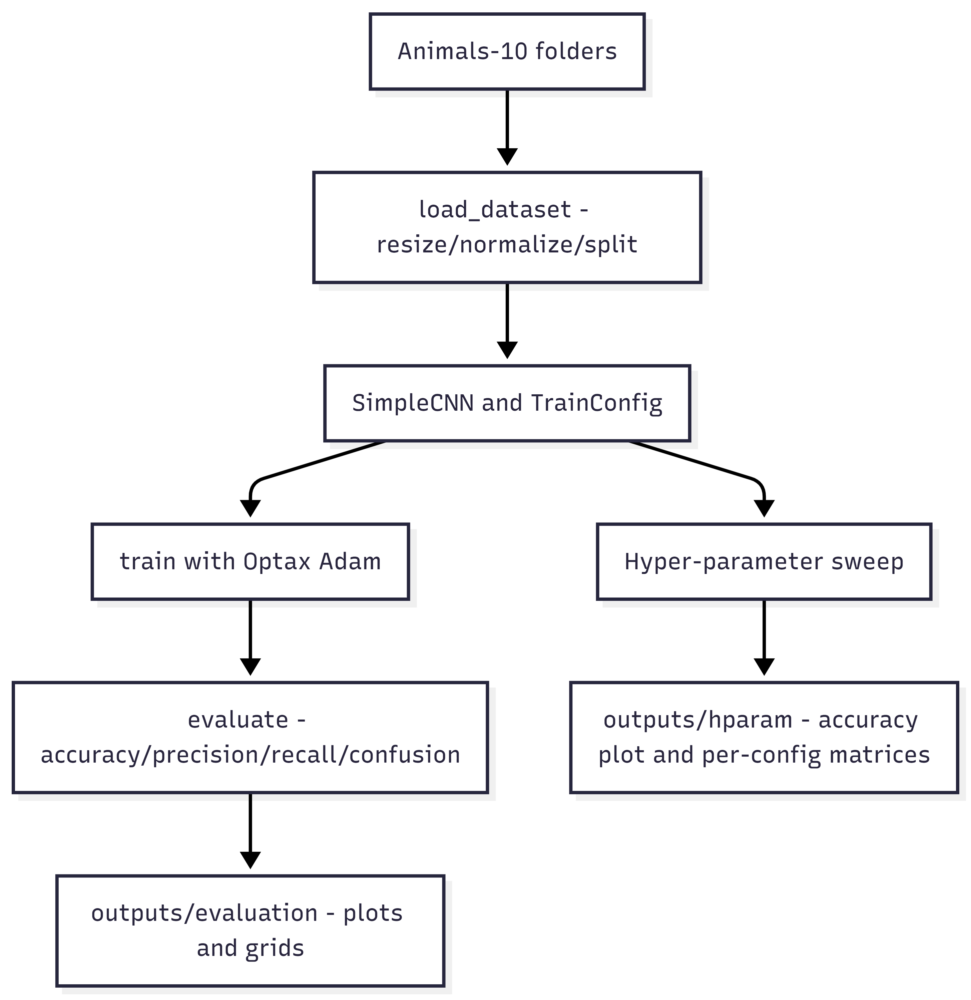

# JAX_wildlife.API – Internal Interface Documentation
**Project:** TutorTask72 – Wildlife Image Classification with JAX/Flax  
**Author:** Ravi Vignesh LNU (UID 121322302)


---

## 1. Overview
- **Dataset:** Animals-10, stored as `data/animals10/<class_name>/<image>.jpg`.
- **Objective:** Load RGB wildlife frames, train a lightweight CNN, report accuracy/precision/recall +
  confusion matrices, and visualize misclassifications.
- **Design:** Keep all heavy lifting (data I/O, modeling, training, evaluation, plotting) inside
  `JAX_wildlife_utils.py` so notebooks only orchestrate the flow.

### Architecture at a Glance


---

## 2. Data Layer API
| Function | Signature | Description |
|----------|-----------|-------------|
| `list_images_with_labels` | `list_images_with_labels(root: str) -> List[Tuple[str, int]]` | Enumerates subdirectories under `root`, sorts them alphabetically (stable class order), and returns `(filepath, class_index)` tuples. |
| `load_image` | `load_image(path: str, image_size: Tuple[int, int]) -> np.ndarray` | Uses Pillow to open an image, converts it to RGB, resizes with bilinear interpolation, and normalizes pixels to `[0,1]` float32. |
| `load_dataset` | `load_dataset(root, image_size=(128,128), splits=(0.7,0.15,0.15), shuffle=True, seed=42, limit_per_class=None)` | End-to-end ingestion utility. Applies optional per-class cap (`limit_per_class`), deterministic shuffling, splitting, and returns `(X_splits, y_splits, class_names)` where each `X_splits['train']` etc. is a NumPy array. |
| `batch_iter` | `batch_iter(X, y, batch_size, shuffle=True, seed=0)` | Generator that yields `(X_batch, y_batch)` without copying full arrays; used by training/eval loops. |

**Key behaviors**
- The alphabetical sorting of classes ensures label indices remain stable across runs.
- `limit_per_class` is honored early, making quick experiments possible without touching raw files.
- Splits default to 70/15/15 and are computed with integer slicing for reproducibility.

---

## 3. Modeling and Training API
### SimpleCNN
```python
class SimpleCNN(nn.Module):
    num_classes: int
    kernel_sizes: Tuple[Tuple[int, int], Tuple[int, int], Tuple[int, int]] = (
        (3, 3), (3, 3), (3, 3)
    )
    dropout_rate: float = 0.5

    @nn.compact
    def __call__(self, x, train: bool = True):
        ...
```
- Three Conv → ReLU → MaxPool blocks.
- Dense layer (256 units) + dropout + final classifier head.
- Kernel sizes and dropout rate are configurable via `TrainConfig`.

### TrainConfig
Dataclass that exposes all critical hyper-parameters:
```python
@dataclass
class TrainConfig:
    image_size: Tuple[int, int] = (128, 128)
    num_classes: int = 10
    learning_rate: float = 1e-3
    batch_size: int = 64
    num_epochs: int = 5
    seed: int = 0
    conv_kernel_sizes: Tuple[Tuple[int, int], Tuple[int, int], Tuple[int, int]] = ((3,3),(3,3),(3,3))
    dropout_rate: float = 0.5
```

### Training helpers
| Function | Responsibility |
|----------|----------------|
| `create_train_state(rng, config)` | Initializes `SimpleCNN`, sets up Optax Adam optimizer, and returns a Flax `TrainState`. Dropout RNG is split off for determinism. |
| `train_step(state, batch, rng)` | JIT-compiled step that runs forward pass with dropout RNG, computes cross-entropy loss, backpropagates via JAX autodiff, and returns updated state + metrics. |
| `eval_step(state, batch)` | JIT-compiled inference step that returns predictions for a batch. |
| `train(X_train, y_train, X_val, y_val, config)` | High-level loop: iterates over epochs, logs loss/accuracy, evaluates on validation split after each epoch, and returns `(state, history)` where `history` tracks loss/acc curves. |

---

## 4. Evaluation & Visualization API
- `evaluate(state, X, y, class_names) -> Dict[str, object]`  
  Computes accuracy, macro precision/recall, confusion matrix, and stores raw predictions (`y_pred`). Uses `batch_iter` internally to avoid memory spikes.

- `plot_confusion_matrix(cm, class_names, figsize=(6,6)) -> plt.Figure`  
  Returns a Matplotlib figure with labeled axes and color bar. Notebooks decide whether to display or save the figure.

- `sample_misclassifications(X, y_true, y_pred, k=8)`  
  Returns `(images, y_true_subset, y_pred_subset)` limited to the first `k` mistakes. When no misclassifications exist, returns empty arrays.

---

## 5. Wrapper Layer (API Notebook)
The `JAX_wildlife.API.ipynb` notebook demonstrates the canonical usage pattern:

1. **Configuration Hub**
   ```python
   DATA_DIR = './data/animals10'
   IMAGE_SIZE = (128, 128)
   config = TrainConfig(
       image_size=IMAGE_SIZE,
       num_classes=len(class_names),
       num_epochs=1,
       batch_size=64,
       learning_rate=1e-3
   )
   ```
   This cell exposes the variables graders expect to see (data path, image size, epochs).

2. **Orchestration**
   ```python
   Xs, ys, class_names = load_dataset(DATA_DIR, image_size=IMAGE_SIZE,
                                      splits=(0.7,0.15,0.15), limit_per_class=50)
   state, history = train(Xs['train'], ys['train'], Xs['val'], ys['val'], config)
   metrics = evaluate(state, Xs['test'], ys['test'], class_names)
   print(metrics)
   ```


3. **Interpretation**
   - Uses `history` from `train` to show loss/accuracy trends (optional).
   - Prints `metrics` dictionary so accuracy/precision/recall/confusion are visible without hunting for files.

---

## 6. Hyper-Parameter Controls

| Hyper-parameter | How to change | Impact |
|-----------------|---------------|--------|
| `image_size` | `TrainConfig(image_size=(160,160))` | Higher resolution at the cost of memory/time. |
| `batch_size` | `TrainConfig(batch_size=32)` | Smaller batches → more gradient updates but slower per epoch. |
| `learning_rate` | adjust `TrainConfig.learning_rate` | Controls convergence speed/stability. |
| `num_epochs` | `TRAIN_EPOCHS = 5` (example notebook) | More epochs improve accuracy at expense of wall time. |
| `conv_kernel_sizes` | e.g., `((5,5),(3,3),(3,3))` | Wider receptive field for early layers. |
| `dropout_rate` | `TrainConfig(dropout_rate=0.3)` | Tunes regularization strength. |
| `limit_per_class` | notebook variable | Provides quick demo mode without editing code. |

---

## 7. Quick Reference
| Task | Minimal code snippet |
|------|----------------------|
| Load dataset | `Xs, ys, class_names = load_dataset('./data/animals10', image_size=(128,128))` |
| Train model | `state, history = train(Xs['train'], ys['train'], Xs['val'], ys['val'], TrainConfig(...))` |
| Evaluate | `metrics = evaluate(state, Xs['test'], ys['test'], class_names)` |
| Plot confusion matrix | `fig = plot_confusion_matrix(metrics['confusion_matrix'], class_names)` |
| Visualize mistakes | `imgs, y_t, y_p = sample_misclassifications(Xs['test'], ys['test'], metrics['y_pred'])` |

---

## 8. End-to-End Example (Script-Style)
```python
from JAX_wildlife_utils import (
    load_dataset, TrainConfig, train, evaluate, plot_confusion_matrix
)

Xs, ys, class_names = load_dataset('./data/animals10',
                                   image_size=(128,128),
                                   splits=(0.7,0.15,0.15),
                                   limit_per_class=60)
config = TrainConfig(image_size=(128,128),
                     num_classes=len(class_names),
                     num_epochs=2,
                     batch_size=64,
                     learning_rate=1e-3)
state, history = train(Xs['train'], ys['train'], Xs['val'], ys['val'], config)
metrics = evaluate(state, Xs['test'], ys['test'], class_names)
fig = plot_confusion_matrix(metrics['confusion_matrix'], class_names)
fig.savefig('confusion_matrix.png', bbox_inches='tight')
```
This snippet mirrors what the API notebook does, making it easy to port the workflow into any script or CI job.

---

## 9. Troubleshooting & FAQs
| Issue | Likely Cause | Resolution |
|-------|--------------|------------|
| `ValueError: splits must sum to 1` | Custom split tuple doesn’t sum to 1.0 | Ensure `sum(splits) == 1.0` before calling `load_dataset`. |
| `MemoryError when loading data` | All images loaded at once | Use `limit_per_class` for quick demos; reduce `image_size`. |
| `Dropout RNG error` | Attempted to bypass `create_train_state` | Always call `create_train_state` via `train` which handles RNG splits. |
| `Metrics are zero` | No examples in split (e.g., tiny `limit_per_class`) | Increase dataset size or adjust split ratios. |

---

