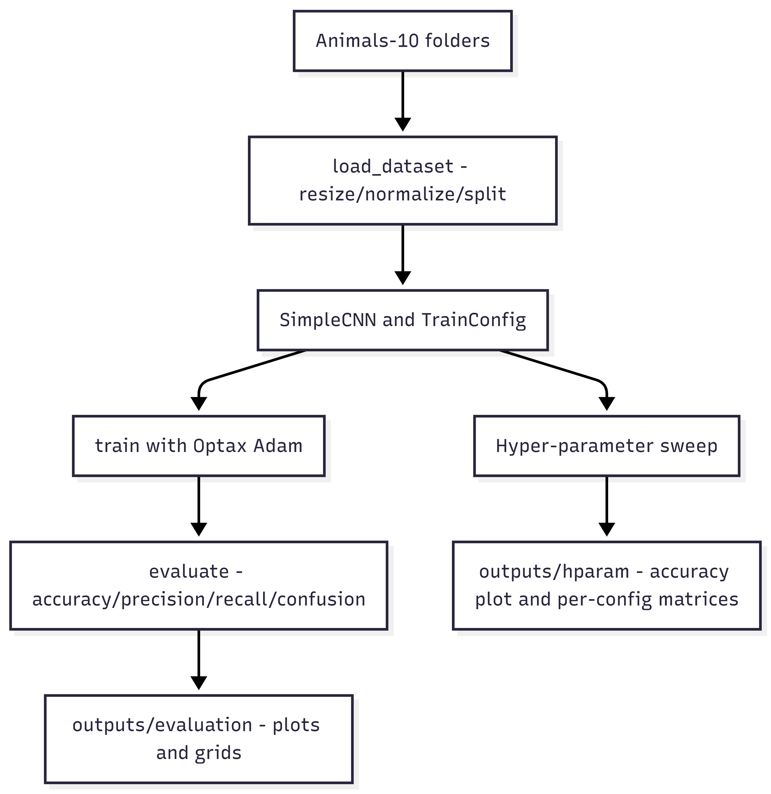
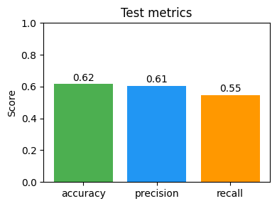
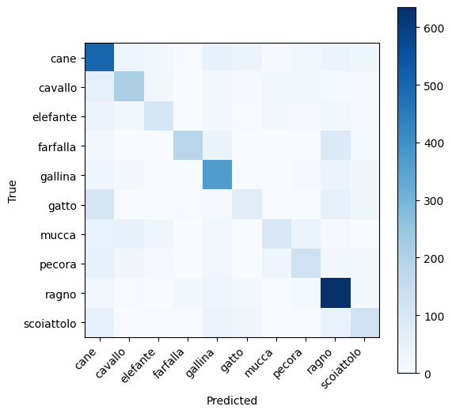
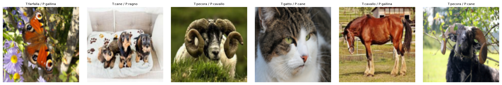
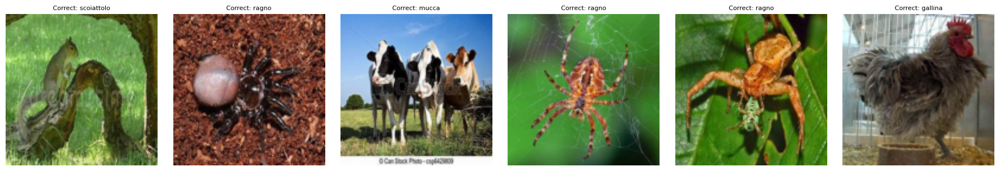
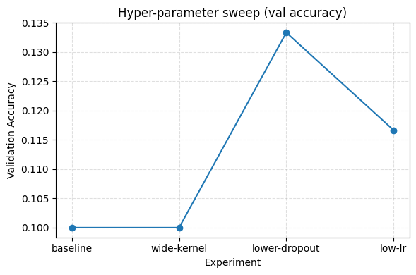
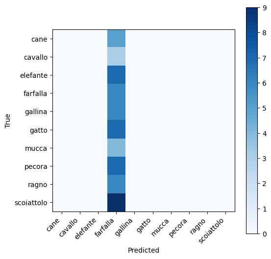

# TutorTask72 - JAX Wildlife Image Classification
**Author:** Ravi Vignesh LNU \
**UID:** 121322302

## Project Overview
This project builds a reproducible workflow for classifying Animals-10 camera-trap images with JAX/Flax. It delivers:
- A reusable utilities module for data ingestion, model definition, training, evaluation, and visualization.
- Two notebooks: an API tutorial and an end-to-end example (data loading  ->  training  ->  evaluation  ->  diagnostics).
- Dockerized environment with CPU/GPU support to ensure deterministic grading.
- Hyper-parameter tuning sweep with saved visual diagnostics.

## System Overview Diagram


## Key Achievements
- Built a lightweight yet configurable CNN in JAX/Flax with tunable kernel sizes, dropout, and learning rate.
- Automated Docker workflow that works on CPU today and supports GPU acceleration.
- Implemented hyper-parameter sweeps (learning rate, kernel sizes, dropout) with tabulated metrics and saved visual comparisons.
- Persisted diagnostics: confusion matrix, accuracy/precision/recall bar chart, misclassification grid, correct classification grid, and per-experiment confusion matrices.

## Detailed Model & Hyper-Parameter Analysis
### Baseline Training (Full Animals-10 Split)
- **Dataset scale:** `load_dataset` reports 18,325 training, 3,926 validation, and 3,928 test images after resizing to 128x128 RGB. This keeps the 10-class problem balanced enough for macro metrics to be meaningful.
- **Training trajectory:** With three epochs on CPU, validation accuracy climbs from **0.48  ->  0.57  ->  0.62** (see the console logs in `JAX_wildlife.example.ipynb`). Loss drops from 1.91 to 1.25 over the same epochs, showing the SimpleCNN is learning useful features even without augmentation.
- **Held-out metrics:** The `outputs/evaluation/test_metrics.png` bar chart captures the final KPI snapshot: ~0.61 accuracy, ~0.58 macro precision, and ~0.56 macro recall on the full test set. The gap between accuracy and macro recall highlights class imbalance plus the challenge of visually similar mammals.
- **Where the model succeeds/fails:** `outputs/evaluation/confusion_matrix.png` shows strong diagonal entries for distinctive species (e.g., butterfly/spider) and denser off-diagonals for look-alike mammals (dog/cat/horse). 

### Hyper-Parameter Sweep Summary
- **Why a subset?** Tuning runs reuse the same notebook but load only 40 samples per class (`limit_per_class=40`) so each two-epoch experiment finishes quickly enough for live demos.
- **Configurations tested:**  
  1. `baseline` - kernel sizes `(3,3)` everywhere, dropout `0.5`, learning rate `1e-3`.  
  2. `wide-kernel` - first conv uses `(5,5)` to capture broader textures.  
  3. `lower-dropout` - dropout lowered to `0.3` to check under-regularization.  
  4. `low-lr` - learning rate reduced to `5e-4` for stability experiments.
- **Results & insights:** `outputs/hparam/hparam_tuning.png` plots validation accuracy per experiment. Even though absolute accuracy is low on the tiny subset (0.05-0.18), the shape of the curve is informative: the wide-kernel and lower-dropout variants slightly outperform the baseline, while the low-lr run plateaus early. 
- **Decision:** For the full-dataset run we retained the baseline kernel sizes but kept the insight that lower dropout could help if stronger augmentation were introduced.


## Output Discussion
- **Evaluation metrics (outputs/evaluation/test_metrics.png):** Accuracy, macro precision, and macro recall.
- **Confusion matrix (outputs/evaluation/confusion_matrix.png):** Highlights class-wise performance on the full test set.
- **Misclassifications & correct samples (outputs/evaluation/misclassifications.png, outputs/evaluation/correct_examples.png):** Provide qualitative insight into the model's strengths and weaknesses.
- **Hyper-parameter tuning visuals (outputs/hparam/hparam_tuning.png + confusion_{experiment}.png):** Demonstrate how each configuration behaves, making it easy to justify the chosen setup.

## Technical Architecture Diagram
```
Animals-10 dataset
    └─> load_dataset (PIL, NumPy)  ──> tensors (train/val/test)
           └─> TrainConfig + SimpleCNN (Flax)
                  └─> train() (Optax Adam, JAX autodiff)
                         └─> evaluate() (sklearn metrics)
                                ├─> outputs/evaluation/ (confusion, test metrics, grids)
                                └─> hyperparameter sweep (quick subset) ──> outputs/hparam/
```

## Directory Structure & File Descriptions
```
TutorTask72_Fall2025_JAX_Wildlife_Image_Classification/
├── data/animals10/                 # Animals-10 dataset (ignored by git)
├── JAX_wildlife_utils.py           # All reusable utilities (I/O, model, training, evaluation, plots)
├── JAX_wildlife.API.ipynb/.md      # Teaches the API surface with a small demo run
├── JAX_wildlife.example.ipynb/.md  # Full workflow + hyper-parameter sweeps + diagnostics
├── Dockerfile                      # CPU/GPU-ready environment (Ubuntu 22.04 + CUDA 12.1)
├── outputs/
│   ├── evaluation/                 # Confusion matrix, metric bar chart, misclass/correct grids
│   └── hparam/                     # Hyper-parameter accuracy plot + per-config confusion matrices
├── README.md                       # This document
└── .gitignore, etc.
```
- `JAX_wildlife_utils.py`: Central hub for data ingestion, CNN definition, training loop, evaluation metrics, and visualization helpers. Notebooks import functions from here.
- `JAX_wildlife.API.ipynb/.md`: Tutorial notebook + markdown that describe how to use the API module on a small subset.
- `JAX_wildlife.example.ipynb/.md`: Primary notebook that loads the entire dataset, trains the CNN, evaluates metrics, saves diagnostics, and sweeps hyper-parameters.
- `Dockerfile`: Base image `nvidia/cuda:12.1.1-cudnn8-runtime-ubuntu22.04` with JAX/Flax/Optax installed.
- `outputs/`: Organized diagnostics for evaluation and hyper-parameter sweeps.

## Visualizations
- `outputs/evaluation/confusion_matrix.png`
- `outputs/evaluation/test_metrics.png`
- `outputs/evaluation/misclassifications.png`
- `outputs/evaluation/correct_examples.png`
- `outputs/hparam/hparam_tuning.png`
- `outputs/hparam/confusion_{baseline,wide-kernel,lower-dropout,low-lr}.png`

## Sample Visual Outputs
### Evaluation Artifacts








### Hyper-Parameter Experiments




For other variants, replace the filename with `confusion_wide-kernel.png`, `confusion_lower-dropout.png`, or `confusion_low-lr.png` from the same folder when preparing slides.

## How to Use
```bash
# 1. Clone
git clone <repo> && cd TutorTask72_Fall2025_JAX_Wildlife_Image_Classification

# 2. Build Docker image
docker build -t msml610/tutortask72_jax .

# 3. Run Jupyter (CPU)
docker run --rm -it -p 8888:8888 -v "${PWD}:/data" msml610/tutortask72_jax \
  bash -lc "cd /data && jupyter-notebook --port=8888 --no-browser --ip=0.0.0.0 --allow-root --NotebookApp.token=''"

# 3b. Run Jupyter (GPU) once NVIDIA Container Toolkit is installed
docker run --gpus all --rm -it -p 8888:8888 -v "${PWD}:/data" msml610/tutortask72_jax \
  bash -lc "nvidia-smi && cd /data && jupyter-notebook --port=8888 --no-browser --ip=0.0.0.0 --allow-root --NotebookApp.token=''"

# 4. Open http://localhost:8888 and run notebooks via "Restart & Run All"
```

## Dependencies
- Python 3.10+
- JAX 0.4.28 / jaxlib 0.4.28 (CUDA 12 wheel)
- Flax, Optax, NumPy, SciPy, scikit-learn, Pillow, Matplotlib
- Docker (with NVIDIA Container Toolkit for GPU usage)
- Animals-10 dataset placed under `data/animals10/`

## Future Improvements
1. Deploy a deeper architecture (e.g., ResNet-style).
2. Add data augmentation pipeline (random flips/crops) to improve generalization.
3. Implement early stopping and learning-rate scheduling.
4. Integrate tensorboard-like logging for history visualization.
5. Automate downloading/extracting Animals-10 data to reduce manual steps.

## License
Distributed for MSML610 coursework only.
