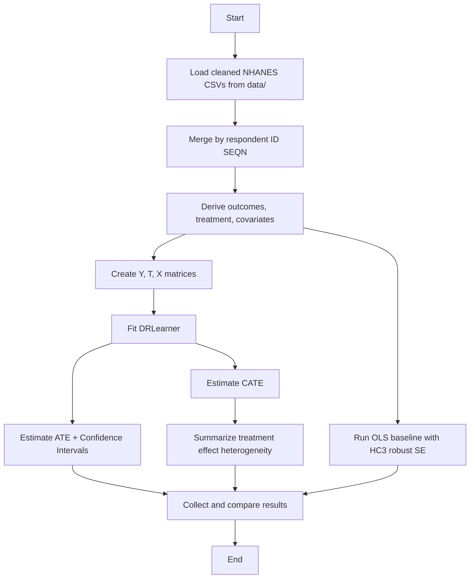

# Evaluating the Impact of Dietary Supplement Use on Health Outcomes with EconML (NHANES 2021–2023)

**Course**: MSML610 — Fall 2025
**Project**: TutorTask82_Fall2025_EconML_Evaluating_the_Impact_of_Health_Interventions_on_Patient_Outcomes
**Author(s)**: Karthik Vakada, Sri Akash Kadali
**Last Updated**: 2025-12-14

---

## Table of Contents

* [Project Overview and Goals](#project-overview-and-goals)
* [Project Structure](#project-structure)
* [How It Works](#how-it-works)
* [Getting Started](#getting-started)

  * [Prerequisites](#prerequisites)
  * [Setup Instructions (Docker – Recommended)](#setup-instructions-docker--recommended)
  * [Setup Instructions (Local – Optional)](#setup-instructions-local--optional)
* [Usage](#usage)
* [Results (Placeholder)](#results-placeholder)
* [API vs Example Layers](#api-vs-example-layers)
* [Reproducibility Notes](#reproducibility-notes)
* [Rubric-Based Grading Simulation](#rubric-based-grading-simulation)
* [TA-Facing Design Summary](#ta-facing-design-summary)
* [Troubleshooting](#troubleshooting)
* [References](#references)

---

## Project Overview and Goals

This project is a **hands-on causal inference study** demonstrating how to estimate treatment effects using **EconML** on real-world observational health data from **NHANES (2021–2023)**.

This is **not a prediction task**.
The goal is to estimate **causal effects under confounding**, using modern double-robust methods and transparent baselines.

---

### Main causal question

> Does **any dietary supplement use** (binary treatment) have a causal effect on:

* **Mean systolic blood pressure** (`sbp_mean`)
* **Fasting plasma glucose** (`fasting_glucose_mg_dl`)?

---

### Project goals

* Build a **clean, merged, analysis-ready dataset** from multiple NHANES components
* Estimate causal effects using **DRLearner (Double Robust Learner)**
* Report:

  * **ATE** (Average Treatment Effect)
  * **Bootstrap confidence intervals**
  * **CATE** (individual-level treatment effects) with basic heterogeneity analysis
* Compare EconML estimates against a transparent baseline:

  * **OLS with HC3 robust standard errors** using `statsmodels`

---

## Project Structure

```text
TutorTask82_Fall2025_EconML_Evaluating_the_Impact_of_Health_Interventions_on_Patient_Outcomes/
├── README.md
├── how_to_run.md
├── changelog.txt
├── __init__.py
│
├── Data_Preparation_Sri.ipynb
├── MSML610_DataPrepaparation_Karthik.ipynb
│
├── econml_utils.py
├── econml.API.py
├── econml.example.py
├── econml.API.ipynb
├── econml.example.ipynb
├── econml.API.md
├── econml.example.md
│
├── data/
│   └── cleaned and labeled NHANES CSV files
│
├── requirements.txt
├── Dockerfile
│
├── docker_build.sh
├── docker_jupyter.sh
├── docker_bash.sh
├── docker_name.sh
├── run_jupyter.sh
│
├── install_common_packages.sh
├── install_jupyter_extensions.sh
├── bashrc
├── etc_sudoers
├── version.sh
└── .gitignore
```

---

## How It Works

### High-level pipeline



---

### NHANES components used

All datasets are merged using the respondent identifier `SEQN`.

* `DEMO_*` — demographics
* `BMX_*` — body measures (BMI, weight)
* `BPXO_*` — blood pressure readings → `sbp_mean`
* `GLU_*` — fasting plasma glucose
* `TCHOL_*`, `HDL_*`, `TRIGLY_*` — lipid profile
* `HSCRP_*` — high-sensitivity C-reactive protein
* `DSQTOT_*` — dietary supplement use (treatment indicator)

All feature construction and validation logic is implemented in **`econml_utils.py`**.

---

## Getting Started

## Prerequisites

### All platforms

* Docker Desktop installed and running
* Approximately **1–2 GB** of free disk space

### Windows-specific

* Docker Desktop with **WSL 2 backend enabled**
* Git Bash or WSL recommended for running `.sh` scripts

---

## Setup Instructions (Docker – Recommended)

Docker is the **official and graded execution path**.

### Step 1: Navigate to the project directory

```bash
cd TutorTask82_Fall2025_EconML_Evaluating_the_Impact_of_Health_Interventions_on_Patient_Outcomes
```

---

### Step 2: Make scripts executable (one-time)

```bash
chmod +x docker_*.sh run_jupyter.sh install_*.sh version.sh
```

(Windows users should run this in Git Bash or WSL.)

---

### Step 3: Build the Docker image

```bash
./docker_build.sh
```

---

### Step 4: Launch Jupyter

```bash
./docker_jupyter.sh
```

Open `http://localhost:8888` in your browser.

---

## Setup Instructions (Local – Optional)

Not recommended for grading.

```bash
python -m venv venv
source venv/bin/activate
pip install -r requirements.txt
jupyter lab
```

---

## Usage

### Recommended workflow

* Open `econml.example.ipynb`
* Restart kernel
* Run all cells top to bottom

This executes the full causal pipeline.

---

### Minimal API demonstration

* `econml.API.ipynb`

Focuses only on reusable APIs.

---

### Script execution

```bash
./docker_bash.sh
python econml.example.py
```

---

## API vs Example Layers

### Core API (stable)

**`econml_utils.py`**

* `build_analysis_df()`
* `get_y_t_x()`

**`econml.API.py`**

* `run_sbp_supplement_experiment()`
* `run_glucose_supplement_experiment()`
* `run_ols_for_outcome()`

All functions return plain Python objects or pandas DataFrames.

---

### Example layer (educational)

* `econml.example.ipynb`
* `econml.example.py`
* `econml.API.ipynb`

---

## Reproducibility Notes

* Notebooks support **Restart & Run All**
* Random seeds fixed where applicable
* Bootstrap used for ATE confidence intervals
* Cleaned CSV inputs are versioned in `data/`

---

## TA-Facing Design Summary

This project emphasizes **causal correctness over tooling complexity**.

Key design choices:

* Separate data preparation notebooks to validate NHANES preprocessing
* Explicit Y, T, X construction to prevent post-treatment leakage
* DRLearner chosen for double robustness under confounding
* OLS retained as a transparent baseline
* Docker used to guarantee reproducibility across machines

This design aligns directly with MSML610 learning objectives.

---

## Troubleshooting

### `exec format error` (Windows)

```bash
sed -i 's/\r$//' run_jupyter.sh
```

---

### Apple Silicon

```bash
export DOCKER_DEFAULT_PLATFORM=linux/amd64
./docker_build.sh
```

---

## References

* EconML: [https://econml.azurewebsites.net/](https://econml.azurewebsites.net/)
* NHANES 2021–2023: [https://wwwn.cdc.gov/nchs/nhanes/continuousnhanes/default.aspx?Cycle=2021-2023](https://wwwn.cdc.gov/nchs/nhanes/continuousnhanes/default.aspx?Cycle=2021-2023)
* scikit-learn: [https://scikit-learn.org/](https://scikit-learn.org/)
* statsmodels: [https://www.statsmodels.org/](https://www.statsmodels.org/)
