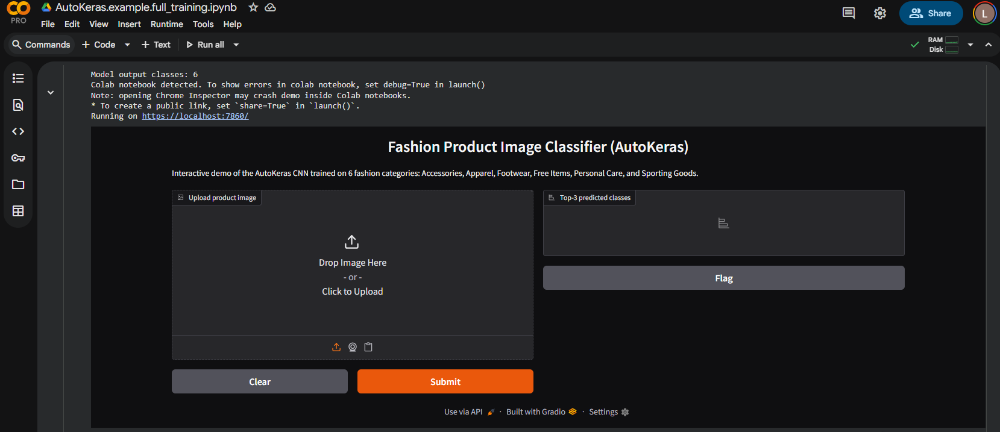
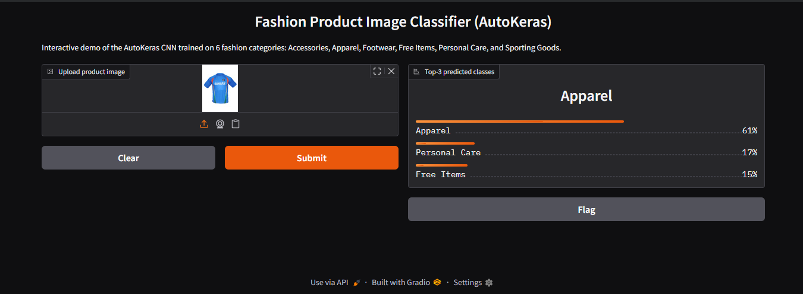

# Fashion Product Image Classification – MSML610 Class Project

Name: **Lokesh Reddy Konda**  
Course: **MSML610 – Fall 2025**  
University of Maryland

---

In this project I built an end-to-end Image classification pipeline on the **Fashion Product Images (Small)** Kaggle dataset.

The goal is to automatically classify product photos into six categories:

- Accessories  
- Apparel  
- Footwear  
- Free Items  
- Personal Care  
- Sporting Goods  

I implemented and compared three modeling strategies:

1. **Baseline CNN** trained from scratch  
2. **Transfer Learning with MobileNetV2** (ImageNet-pretrained)  
3. **AutoKeras Neural Architecture Search (NAS)**  
   - A **small, CPU-friendly search inside Docker**  
   - A **full GPU search on Colab** for stronger models

Everything is wired so that anyone can:

- run the **core experiments completely inside Docker on CPU**, and  
- optionally inspect the **full AutoKeras GPU run + Gradio app in Colab**.

---

## 1. Project Structure

Main layout of the project folder:

```
UmdTask123_Fall2025_Fashion_Product_Image_Classification_AutoKeras/
│
├── AutoKeras.API.ipynb                  # API demo notebook
├── AutoKeras.API.md                     # Markdown description of API notebook
│
├── AutoKeras.example.ipynb              # Main Docker experiment notebook
├── AutoKeras.example.md                 # Markdown description for example notebook
│
├── AutoKeras.example.full_training.ipynb  # Full AutoKeras + Gradio, meant for Colab
│
├── src/
│   ├── utils_data_io.py                 # Data loading + TSV → tf.data helpers
│   └── utils_model.py                   # Baseline CNN + AutoKeras factory
│
├── docker/
│   ├── Dockerfile                       # CPU-only Python image with requirements
│   ├── docker_build.sh                  # Build script
│   ├── docker_bash.sh                   # Interactive shell into container
│   └── docker_jupyter.sh                # JupyterLab inside container
│
├── lists/
│   ├── train.tsv                        # image_path \t label_idx
│   ├── val.tsv
│   └── test.tsv
│
├── images/                              # Kaggle JPGs (NOT committed to GitHub)
│   └── *.jpg
│
├── models/                              # Models saved from Docker runs
│   ├── mobilenetv2_fashion.keras
│   ├── autokeras_best_docker.keras
│   └── (optional extra models)
│
├── outputs/                             # Docker notebook evaluation artifacts
│   ├── report_baseline.txt
│   ├── report_mobilenet.txt
│   ├── report_autokeras.txt
│   ├── confmat_baseline.png
│   ├── confmat_mobilenet.png
│   ├── confmat_autokeras.png
│   └── (other plots if needed)
│
├── colab_outputs/                       # Text outputs from full Colab run
│   ├── report_baseline_cnn.txt
│   ├── report_mobilenetv2.txt
│   ├── report_autokeras_colab.txt
│   ├── confmat_baseline_cnn.txt
│   ├── confmat_mobilenetv2.txt
│   ├── confmat_autokeras_colab.txt
│   └── (optionally, other small artifacts)
│
└── README.md                            # This file
```
Note: Large Colab .keras files are intentionally not tracked because of GitHub’s 100MB limit. They can always be regenerated from the full training notebook.

---

## 2. Notebooks and Their Roles

### 2.1 **AutoKeras.API.ipynb** – Tool API Demonstration

This notebook is a **tool-only demonstration of AutoKeras** for image classification.  
It is intentionally **independent of this project’s dataset and pipeline**.

The goal is to explain:
- what AutoKeras is,
- how the `ak.ImageClassifier` API works,
- and how to train, evaluate, and export a model using AutoKeras.

This notebook is meant to document the **AutoKeras tool itself**, not the project implementation.

---

#### What this notebook covers

- Verifies the TensorFlow and AutoKeras installation and device availability  
  (CPU-only execution is expected in Docker).
- Loads a **small built-in dataset (CIFAR-10)** for demonstration purposes.
- Creates an `ak.ImageClassifier` with a very small search budget.
- Runs a minimal training loop (`max_trials` and `epochs` kept small).
- Evaluates the trained model on a small test set.
- Exports the best discovered architecture as a standard Keras model.
- Saves the exported model to disk.

---

#### Key AutoKeras functionality demonstrated

- `ak.ImageClassifier`
    - Automatically performs neural architecture search (NAS).
    - Tries multiple CNN architectures.
    - Selects the best model based on validation performance.
- `fit()` / `evaluate()`
    - Standard training and evaluation workflow.
- `export_model()`
    - Converts the best AutoKeras pipeline into a reusable `tf.keras.Model`.
- `model.save()`
    - Saves the trained model in `.keras` format for reuse or deployment.

---

#### Design notes

- Training uses **very small datasets and few epochs** so the notebook runs quickly on CPU.
- Accuracy is not the objective here — demonstrating **correct API usage** is.
- No project-specific code, datasets, or TSV pipelines are used in this notebook.

---


### 2.2 **AutoKeras.example.ipynb** – Main Docker experiment

This is the core experimental pipeline that would should run in Docker.

It performs:
1. Dataset loading using `lists/train.tsv`, `val.tsv`, `test.tsv`
2. `tf.data` augmentation, including flips, brightness/contrast tweaks, and random rotations
3. Baseline CNN training
    - Trains on a subset (e.g. 2,000 train / 500 val / 500 test) for 5 epochs
4. MobileNetV2 transfer learning
    - Uses ImageNet-pretrained MobileNetV2 (include_top=False)
    - Freezes the backbone; adds a small classification head
    - Achieves much stronger performance (≈ 0.97 validation accuracy)
5. AutoKeras “mini search” (CPU-friendly)
    - Only 1 trial, 1 epoch, small subset
    - Its main purpose is to demonstrate that the AutoKeras pipeline works inside Docker
6. Evaluation
    - `classification_report` and confusion matrix for all models
    - Saved metrics and confusion matrices into `outputs/`
7. Misclassification plots
     - Visualizes mistakes for each model to highlight differences in behavior
This notebook is designed to be reproducible on CPU and to finish in a reasonable amount of time.

### 2.3 **AutoKeras.example.full_training.ipynb** – full Colab GPU run + Gradio app

This notebook is meant to run on Google Colab (ideally Pro/Pro+) with a GPU.

Here I:
- Increase dataset size, epochs, and `max_trials` for AutoKeras
- Use stronger augmentation and more aggressive search settings
- Train:
    - A deeper baseline CNN
    - A stronger MobileNetV2 variant
    - A much larger AutoKeras NAS search than in Docker
- Save final reports and confusion matrices into `colab_outputs/`

On top of that, I also built a small Gradio demo app:
- Load a trained MobileNetV2 (or AutoKeras) model
- Expose a simple gr.Interface
- Let a user upload a product image
- Show the predicted category and class probabilities

The Gradio block is meant to run inside Colab only (because of the environment and GPU models).
I kept the code in this notebook so that the anyone can:
- See exactly how I wired the model into a tiny “app”, and
- Re-run it to get the same interactive behaviour.

---

## 3. Dataset and Data Setup

### 3.1 Dataset Source (Kaggle)
The project uses:

Fashion Product Images (Small)
Kaggle link: https://www.kaggle.com/datasets/paramaggarwal/fashion-product-images-small

The dataset is not small enough for GitHub, so the images themselves are not committed.
Only the TSV lists and code are provided; you must download the images locally.

### 3.2 Required Local Structure (Docker)
After downloading and extracting from Kaggle, arrange things like this:
```
UmdTask123_Fall2025_Fashion_Product_Image_Classification_AutoKeras/
│
├── images/            # put ALL JPGs here (flat, no subfolders)
│   ├── 000001.jpg
│   ├── 000002.jpg
│   └── ...
│
├── lists/
│   ├── train.tsv
│   ├── val.tsv
│   └── test.tsv
│
└── (rest of the project)
```

Important details:
- Do not create extra subdirectories inside `images/`.
- Filenames must match exactly what appears in lists/*.tsv.
- `lists/*.tsv` use relative paths like:
    - `images/12345.jpg<TAB>2`

The TSV layout:
```
images/12345.jpg    2
images/99871.jpg    0
images/45012.jpg    4
```
Where the labels 0–5 correspond to:
- 0 – Accessories
- 1 – Apparel
- 2 – Footwear
- 3 – Free Items
- 4 – Personal Care
- 5 – Sporting Goods

### 3.3 Quick Data Sanity Check in Python (Docker)
Once `images/` and `lists/*.tsv` are set up, inside the container you can run:
```
from src.utils_data_io import tsv_to_tfds

NUM_CLASSES = 6
ds_train = tsv_to_tfds("lists/train.tsv", num_classes=NUM_CLASSES)
for img, label in ds_train.take(1):
    print(img.shape, label.numpy())
```
If the dataset is correctly placed, this runs without errors and prints something like:

```
(224, 224, 3)  2
```
If you see `NOT_FOUND: images/xxxxx.jpg`, it means:
- `images/` are in the wrong directory,
- filenames don’t match, or
- `lists/*.tsv` paths were modified.

### 3.4 Colab Data Setup for Full Training
For `AutoKeras.example.full_training.ipynb` on Colab, I assume:
- You upload the dataset as `images.zip` to your Google Drive.

The notebook:
- Mounts Google Drive
- Unzips `images.zi`p into `/content/images/`
- Reuses the same `lists/train.tsv`, `val.tsv`, `test.tsv` layout

The final in-notebook structure looks like:
```
/content/
│
├── images/
│   └── *.jpg
│
├── lists/
│   ├── train.tsv
│   ├── val.tsv
│   └── test.tsv
│
└── colab_outputs/
``` 
This keeps the repo light while still giving a reproducible path for the full GPU experiments.

---

## 4. How to Run Everything in Docker

You only need Docker and the local dataset. No Conda, no manual pip juggling.

Step 1 – Build the Docker image
From the project root:
``` 
bash docker/docker_build.sh
``` 
This uses `docker/Dockerfile` and installs all required packages (TensorFlow, AutoKeras, etc.).

Step 2 – Start JupyterLab inside the container
From the same root:
``` 
bash docker/docker_jupyter.sh
``` 

This:
- Starts a container named `msml610_fashion`,
- Mounts the project folder into `/workspace`,
- Launches JupyterLab on port 8888, and
- Prints a URL with an authentication token in the terminal
Open the `http://127.0.0.1:8888/...` link in your browser.

Step 3 – Run the notebooks
Inside the Jupyter interface (root is `/workspace`):
1. Run `AutoKeras.API.ipynb`
- Verifies imports
- Shows data loading helpers and model factories
- Runs a very small sample just to prove the pipeline works
2. Run `AutoKeras.example.ipynb``
- This is the main Docker pipeline
- Trains:
    - baseline CNN
    - MobileNetV2
    - small AutoKeras search
- Saves all metrics and confusion matrices to `outputs/`
- Saves the trained models into `models/`
You can optionally open the `.md` versions (`AutoKeras.API.md`, `AutoKeras.example.md`) if you prefer to read the narrative without executing code.

---

## 5. Outputs & Models

### 5.1 Outputs from Docker (`AutoKeras.example.ipynb`)

After running the main notebook in Docker, you should see:
``` 
outputs/
├── report_baseline.txt
├── report_mobilenet.txt
├── report_autokeras.txt
├── confmat_baseline.png
├── confmat_mobilenet.png
├── confmat_autokeras.png
``` 
These text files contain the `classification_report` for each model.
The PNGs are confusion matrices.

Trained models:
``` 
models/
├── mobilenetv2_fashion.keras           # best Docker MobileNetV2 model
├── autokeras_best_docker.keras         # best AutoKeras model from Docker search
└── (optional extra models)
``` 

### 5.2 Outputs from Colab (`AutoKeras.example.full_training.ipynb`)

The full GPU run saves only lightweight text metrics (no 300MB .keras files in GitHub) into `colab_outputs/`:
``` 
colab_outputs/
├── report_baseline_cnn.txt
├── report_mobilenetv2.txt
├── report_autokeras_colab.txt
├── confmat_baseline_cnn.txt
├── confmat_mobilenetv2.txt
├── confmat_autokeras_colab.txt
``` 
These files are the ones I use to discuss final metrics , since they’re from the strongest GPU runs.

The actual Colab models can be re-saved as `.keras` files if needed during a Colab session, but those files are too large to track comfortably in this shared repository.

---
## 6. Gradio Demo (Colab)
Inside `AutoKeras.example.full_training.ipynb`, I added a small Gradio app section:
- It loads a trained model (typically the GPU-trained MobileNetV2 or AutoKeras best model).
- It defines a prediction function that:
    - takes an uploaded image,
    - resizes and preprocesses it the same way as training,
    - runs model.predict,
    - maps the logits back to one of the six product categories.
- It wraps this function in:
``` 
import gradio as gr

iface = gr.Interface(
    fn=predict_image,
    inputs=gr.Image(type="filepath"),
    outputs="label",
    examples=[...]
)
iface.launch()
``` 
This is mainly to demonstrate how the model can be deployed in a very simple interactive way.
Because it depends on GPU-trained weights and Colab’s environment, I keep this in the Colab notebook only.

## 7. Screenshots

### 7.1 Gradio App

Below are three screenshots from the Gradio demo app I built in Colab.  
I will attach both images here once added to the repository.

#### Screenshot 1 – Upload + Predict Interface  


#### Screenshot 2 – Example Prediction Output  


#### Screenshot 3 – Example Prediction Output  


---


## 8. Quick Checklists

### 8.1 Docker checklist

Before running:
- `images/` folder present locally with all Kaggle JPGs
- `lists/train.tsv`, `val.tsv`, `test.tsv` in place
- `lists/*.tsv` paths match filenames in `images/`
- Docker is installed and working

Run:
``` 
bash docker/docker_build.sh
bash docker/docker_jupyter.sh
``` 
Then open notebooks and run all cells.

### 8.2 Colab checklist

For `AutoKeras.example.full_training.ipynb`:
- Upload `images.zip` to Google Drive
- Open the notebook in Colab
- Make sure runtime is GPU
- Run all cells; the notebook will:
    - unzip images
    - run full CNN / MobileNetV2 / AutoKeras pipelines
    - save text outputs into `/content/colab_outputs/` (mirrored to repo as `colab_outputs/`)

---

## 9. Relationship Between Notebooks (Short Table)

| Notebook                                | Environment | Purpose                                       |
| --------------------------------------- | ----------- | --------------------------------------------- |
| `AutoKeras.API.ipynb`                   | Docker/CPU  | Demonstrate data + model API in a small demo  |
| `AutoKeras.example.ipynb`               | Docker/CPU  | Main experimental pipeline (baseline, TL, AK) |
| `AutoKeras.example.full_training.ipynb` | Colab GPU   | Large AutoKeras search + Gradio demo          |

