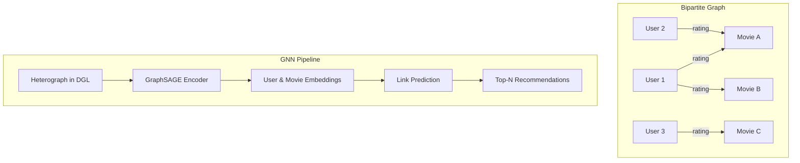

<!-- toc -->

- [DGL API — Movie Recommendation System](#dgl-api--movie-recommendation-system)
  * [Overview](#overview)
  * [Problem Statement](#problem-statement)
  * [Native DGL API Overview](#native-dgl-api-overview)
    + [Key DGL Concepts Used](#key-dgl-concepts-used)
  * [Our Integration Layer (`dgl_utils.py`)](#our-integration-layer-dgl_utilspy)
    + [Data Loading & Cleaning](#data-loading--cleaning)
    + [Graph Construction](#graph-construction)
    + [Node & Edge Features](#node--edge-features)
    + [Edge Splits & Training Utilities](#edge-splits--training-utilities)
    + [Models & Training Loop](#models--training-loop)
    + [Evaluation & Recommendation Utilities](#evaluation--recommendation-utilities)
  * [Design Decisions & Trade-offs](#design-decisions--trade-offs)
  * [Limitations & Next Steps](#limitations--next-steps)
  * [References](#references)

<!-- tocstop -->

## DGL API — Movie Recommendation System

### Overview

This document describes a **DGL-based integration layer** for building a **movie recommendation system** using **graph neural networks (GNNs)**.  
We treat recommendation as a **link prediction** problem on a **user–movie bipartite graph**:

- **Nodes**: users and movies (heterogeneous graph)
- **Edges**: ratings (with timestamps) connecting users to movies
- **Goal**: learn user and movie embeddings with **GraphSAGE** and use them for:
  - **Top-N recommendations** (Precision@K / Recall@K)
  - **Rating prediction** (RMSE via a downstream regressor)

The API consists of:

- A **script** (`DGL.API.py`) that runs end‑to‑end on CPU.
- A **notebook** (`DGL.API.ipynb`) that walks through the same pipeline step‑by‑step.
- A **thin utility layer** (`dgl_utils.py`) that wraps the native DGL API.

**Note**: This API tutorial uses a **simplified, didactic configuration** (homogeneous graphs, configurable epochs with default 40, basic sampling)

**Data Setup**: Before running the API tutorial, ensure you have the MovieLens 20M dataset files (`rating.csv` and `movie.csv`) in the `data/raw/` directory. See the main `README.md` for detailed download and setup instructions.

### Problem Statement

Classical recommendation pipelines often rely on:

- **Matrix factorization / collaborative filtering** on dense matrices.
- **Heuristic baselines** (e.g., popularity, user/item averages).

These approaches:

- Struggle to naturally incorporate **rich side information** (genres, timestamps, etc.).
- Do not expose the full **graph structure** of user–item interactions.
- Can be harder to extend to **heterogeneous** relations (e.g., tags, actors, directors).

Our goal is to:

1. **Represent MovieLens as a heterograph** where:
   - Users and movies are distinct node types.
   - Ratings (with timestamps) are typed edges.
2. **Leverage DGL** to build a **GraphSAGE encoder** on top of this graph.
3. **Provide a clean, reusable Python API** for:
   - Data loading and graph construction.
   - Training link-prediction models.
   - Evaluating recommendation quality (P@K, R@K) and rating RMSE.
   - Generating top‑N recommendations for individual users.

---

### Native DGL API Overview

The project relies on the **native DGL API** to represent graphs and run GNNs.  
Key responsibilities of the native API in this project:

- Construct a **heterogeneous graph** from raw `pandas` DataFrames.
- Attach **edge attributes** (ratings, timestamps) and **node attributes** (movie genres).
- Convert to a **homogeneous graph** for a didactic GraphSAGE model.
- Run message passing with **`dgl.nn.SAGEConv`** to produce user and movie embeddings.

#### Key DGL Concepts Used

- **Heterographs**:
  - `dgl.heterograph({...})` to build:
    - `("user", "rates", "movie")` edges.
    - `("movie", "rated_by", "user")` reverse edges.
- **Edge data**:
  - `g.edges[etype].data["rating"]` for ratings.
  - `g.edges[etype].data["ts"]` for timestamps (temporal splits).
- **Node data**:
  - `g.nodes["movie"].data["feat"]` for movie genre one‑hot features.
- **Homogenization**:
  - `dgl.to_homogeneous(g)` so we can apply a simple, single‑type **GraphSAGE** encoder.
- **GNN layers**:
  - `dgl.nn.SAGEConv` for neighborhood aggregation and embedding learning.

---

### Our Integration Layer (`dgl_utils.py`)

The file `dgl_utils.py` provides a **thin, composable wrapper** around native DGL so that the notebook and script can focus on **Explain → Run → Inspect** rather than boilerplate.

#### Data Loading & Cleaning

- **`load_dummy_data()`**  
  - Returns a **tiny MovieLens‑like toy dataset** (movies + ratings).
  - Used when real CSVs are missing so the tutorial **always runs**.
- The script and notebook use either:
  - **Real data** from `data/raw/rating.csv` and `data/raw/movie.csv` (subsampled via `--max-edges`), or
  - The **dummy** dataset from `load_dummy_data()`.

#### Graph Construction

- **`create_hetero_graph_from_pandas(ratings_df, movies_df)`**:
  - Cleans ratings (`userId`, `movieId`, `rating`, `timestamp`).
  - Builds **0‑indexed id maps**:
    - `{"user": {raw_user_id → idx}, "movie": {raw_movie_id → idx}}`.
  - Constructs a DGL **heterograph** with:
    - `("user", "rates", "movie")` edges.
    - `("movie", "rated_by", "user")` reverse edges.
  - Ensures movies present in `movies_df` but not rated are still included as nodes.

- **`get_graph_summary(g)`**, **`plot_degree_distribution(g, ntype)`** (optional EDA helpers).

#### Node & Edge Features

- **`add_edge_features(g, ratings_df, maps)`**:
  - Attaches:
    - `rating` (float32)
    - `timestamp` / `ts` (int64)
  - to both `("user","rates","movie")` and `("movie","rated_by","user")` edges.
  - `ts` is used later for **temporal splits**.

- **`add_movie_node_features(g, movies_df, maps)`**:
  - Parses the `genres` string per movie.
  - Uses a `MultiLabelBinarizer` to build **genre one‑hot vectors**.
  - Stores them as `g.nodes["movie"].data["feat"]`.

These features allow the model to combine:

- **Collaborative signal** (graph structure via ratings).
- **Content signal** (movie genres).

#### Edge Splits & Training Utilities

- **`make_temporal_edge_splits(g, etype, val_frac, test_frac, ts_key="ts")`**:
  - Performs **time‑based splits** on edges:
    - Oldest edges → train
    - Middle slice → validation
    - Most recent slice → test
  - Returns a dict like:
    - `{"train_eids": ..., "val_eids": ..., "test_eids": ...}`.

- **`eids_to_pairs(g, eids)`**:
  - Converts edge IDs to **(user_index, movie_index)** pairs.
  - Used to:
    - Evaluate link prediction (P@K, R@K).
    - Build data for the rating regressor.

#### Models & Training Loop

- Internally defines **GraphSAGE‑based encoders** and link‑prediction heads, e.g.:
  - `GraphSAGEModel`
  - `LinkPredictorDot` (dot‑product scoring of user/movie embeddings)

- **`train_link_prediction(g, splits, embed_dim, epochs, lr, device, movie_feat_tensor)`**:
  - Converts the heterograph to a **homogeneous** graph for simplicity.
  - Uses **GraphSAGE** layers on CPU (or CUDA if available).
  - Runs a small number of epochs (didactic configuration).
  - Performs **binary classification** on edges via **positive/negative sampling**.
  - Returns a dict:
    - `{"user_emb": <tensor>, "movie_emb": <tensor>}`.

These embeddings are used for both **top‑N link prediction** and **rating regression**.

#### Evaluation & Recommendation Utilities

- **`evaluate_precision_recall_at_k(user_emb, movie_emb, test_pairs, k)`**:
  - Computes **Precision@K** and **Recall@K** on held‑out test edges.
  - Treats link prediction as a **top‑N recommendation** problem.

- **`fit_edge_regressor_ridge(user_emb, movie_emb, train_pairs, train_ratings, alpha)`**:
  - Freezes GNN embeddings.
  - Fits a **Ridge regression** model to predict ratings from concatenated user/movie embeddings.

- **`rmse_from_regressor(reg, user_emb, movie_emb, test_pairs, test_ratings)`**:
  - Computes **RMSE** on test edges.

- **`build_user_seen_map(g, train_eids, etype)`**:
  - Builds a mapping: `user_idx → set(movie_idx)` of movies the user has **already seen** in train.

- **`recommend_topk_for_user(user_idx, user_emb, movie_emb, k, seen_items, maps)`**:
  - Scores **all movies** for a given user via embedding dot product.
  - Filters out **seen_items**.
  - Returns the **top‑K movie indices**.

- **`id_maps_to_title_lookup(movies_df, movie_id_map)`**:
  - Converts internal movie indices back to **human‑readable titles** for display.

---
### Using This API in the Project

This API tutorial focuses on demonstrating the DGL utilities (`dgl_utils.py`) on a small, didactic link‑prediction example.

For full project setup, end‑to‑end training commands, and evaluation of the production‑style recommender, see:

- The main project `README.md`
- `DGL.example.md` / `DGL.example.ipynb`
---

### Design Decisions & Trade-offs

- **Homogeneous GraphSAGE via `dgl.to_homogeneous`**:
  - Simpler for teaching and debugging than a full heterogeneous encoder.
  - Makes model definition and training loop **easy to read** in the notebook.
  - Trade‑off: loses type‑specific message‑passing flexibility.

- **Genre one‑hot features + learnable embeddings**:
  - Combine simple **content features** with learnable representations.
  - Fast to compute and easy to visualize.
  - Trade‑off: ignores richer metadata (tags, cast, crew, etc.) in the API demo.

- **Small, didactic training loop**:
  - Configurable epochs (default: 40), random negative sampling, CPU‑friendly defaults.
  - Prioritizes **clarity and runtime** over absolute performance.
  - More advanced sampling/loading (neighbor loaders, hard negatives) are reserved for the **example** notebook.

- **API surface kept small and composable**:
  - Each notebook cell calls **one or two** functions from `dgl_utils.py`.
  - Encourages a **readable, stepwise** “Explain → Run → Inspect” workflow.

---

### Limitations & Next Steps

Current limitations:

- No **early stopping** on validation metrics.
- **Negative sampling** is basic; does not enforce sophisticated hard‑negative strategies.
- Uses a **homogeneous** encoder instead of a fully heterogeneous GNN with type‑specific parameters.
- Temporal modeling is limited to simple **temporal splits**, not sequence modeling.

Potential extensions:

- Add **early stopping** and richer **logging** for training curves.
- Implement **heterogeneous GNNs** (e.g., relation‑specific GraphSAGE / R‑GCN).
- Improve **negative sampling** (e.g., popularity‑aware, time‑aware).
- Incorporate additional node/edge types:
  - Tags, actors, directors, user demographics, etc.
- Explore **sequential recommenders** that use timestamps more directly.

---

### References

- **DGL Documentation**: Graph construction, heterographs, and GraphSAGE layers.
- **MovieLens 20M dataset**: Harper, F. M., & Konstan, J. A. (2015).
- Standard literature on **graph‑based recommendation** and **GNNs for collaborative filtering**.
