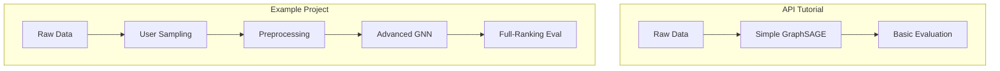

# DGL Movie Recommendation System

**Course:** MSML610 (Fall 2025)  
**Difficulty:** 3 — Hard  
**Contributors:** Swattik Maiti, Ritik Pratap Singh

A graph neural network-based movie recommendation system using **Deep Graph Library (DGL)** and **GraphSAGE** for link prediction on bipartite user-movie graphs.

## Table of Contents

- [Overview](#overview)
- [Features](#features)
- [Project Structure](#project-structure)
- [Prerequisites](#prerequisites)
- [Installation](#installation)
  - [Option 1: Docker Setup (Recommended)](#option-1-docker-setup-recommended)
  - [Option 2: Direct Python Installation](#option-2-direct-python-installation)
- [Data Preparation](#data-preparation)
- [Usage](#usage)
  - [API Tutorial](#api-tutorial)
  - [Example Project](#example-project)
- [Project Files](#project-files)
- [Evaluation Metrics](#evaluation-metrics)
- [Key Concepts](#key-concepts)
- [References](#references)
- [Troubleshooting](#troubleshooting)

## Overview

This project demonstrates how to build a movie recommendation system using **Graph Neural Networks (GNNs)** with DGL. We treat recommendation as a **link prediction** problem on a bipartite graph where:

- **Nodes**: Users and Movies (heterogeneous graph)
- **Edges**: User-movie ratings (with timestamps)
- **Goal**: Learn user and movie embeddings using GraphSAGE and generate personalized recommendations



The project consists of two main components:

1. **API Tutorial** (`DGL.API.*`): Demonstrates native DGL API usage and a thin wrapper layer
   - **Educational focus**: Simplified setup for learning DGL fundamentals
   - **Expected performance**: Lower scores (prioritizes clarity over optimization)
   - **Best for**: Understanding graph construction, basic GNN concepts, DGL API usage

2. **Example Project** (`DGL.example.*`): Full end-to-end recommendation system with advanced GNN architecture
   - **Production focus**: Advanced techniques and optimized hyperparameters
   - **Expected performance**: Higher scores (demonstrates best practices)
   - **Best for**: Learning how to build production-quality recommendation systems

**Note**: The API tutorial intentionally uses simpler configurations (homogeneous graphs, basic sampling) with more epochs for didactic purposes

### API Tutorial vs Example Project: Understanding the Difference

**API Tutorial** (`DGL.API.*`):
- **Purpose**: Educational demonstration of DGL's native API and basic concepts
- **Configuration**: Simplified setup with:
  - Homogeneous GraphSAGE (via `dgl.to_homogeneous`)
  - Configurable training epochs (default: 40, didactic CPU-friendly setup)
  - Basic negative sampling
  - Smaller embedding dimensions
- **Expected Results**: Lower precision/recall scores (typically P@10 ≈ 0.01-0.05, R@10 ≈ 0.01-0.03)
- **Why Lower Scores**: Prioritizes **clarity and learning** over performance optimization
- **Use Case**: Learn DGL fundamentals, understand graph construction, see basic link prediction

**Example Project** (`DGL.example.*`):
- **Purpose**: Production-ready recommendation system demonstrating best practices
- **Configuration**: Advanced setup with:
  - Heterogeneous GraphSAGE encoder (type-specific layers)
  - Proper train/validation/test splits with negative sampling
  - Full-ranking evaluation (ranks entire catalog)
  - Larger embedding dimensions (128 vs 64 in API tutorial)
- **Expected Results**: Higher precision/recall scores (typically P@10 ≈ 0.10-0.20, R@10 ≈ 0.05-0.15)
- **Why Better Scores**: Uses advanced techniques, proper data preprocessing, and optimized hyperparameters
- **Use Case**: See how to build a real-world recommendation system with DGL

**Key Takeaway**: The API tutorial is designed for **learning**, while the Example project shows **production-quality** implementation. Lower scores in the API tutorial are expected and intentional—they demonstrate the concepts clearly without overwhelming complexity.


## Features

- **Heterogeneous Graph Construction**: Builds user-movie bipartite graphs with bidirectional edges
- **GraphSAGE Encoder**: Learns node embeddings through neighborhood aggregation
- **Link Prediction**: Predicts missing user-movie interactions
- **Multiple Evaluation Metrics**: Precision@K, Recall@K, NDCG@K, and RMSE
- **Full-Ranking Evaluation**: Realistic recommendation evaluation on entire movie catalog
- **Personalized Recommendations**: Generate top-N recommendations for any user

## Bonus Features

This project includes implementations of all three bonus features:

### 1. Heterogeneous Node Types (Tags)
- **Fully implemented**: The project includes a complete heterogeneous graph with three node types (users, movies, tags)
- **Usage**: Enable with `--include-tags` flag in `DGL.example.py`
- **Implementation**: `HeterogeneousGNNRecommender` with tag-aware GraphSAGE encoder

### 2. Hybrid Recommendations (GNN + Matrix Factorization)
- **Foundation implemented**: Matrix factorization utilities (`mf_truncated_svd_embeddings`, `build_user_item_csr`) are available in `dgl_utils.py`
- **Architecture**: The codebase includes functions for computing MF embeddings that can be combined with GNN embeddings

### 3. Temporal GNNs
- **Temporal splits implemented**: The project uses temporal train/validation/test splits (`make_temporal_edge_splits`)
- **Timestamp features**: Edge timestamps are incorporated into the graph structure

## Project Structure

```
UmdTask17_Fall2025_DGL_Movie_Recommendation_System/
├── data/                          # MovieLens dataset
│   ├── raw/                       # Raw MovieLens data (used by both API and Example)
│   │   ├── rating.csv            # User-movie ratings
│   │   └── movie.csv             # Movie metadata
│   ├── processed/                 # Preprocessed data (generated)
│   └── graphs/                    # Saved graph files (generated)
├── images/                        # Diagram images for documentation
│   ├── img1.png                   # GraphSAGE architecture overview
│   ├── img2.png                   # Message passing architecture diagram               
│   └── img3.png                   # GraphSAGE architecture detailed view
├── dgl_utils.py                  # Utility functions and wrappers
├── validate_data.py              # Data validation script
├── DGL.API.ipynb                 # API tutorial notebook
├── DGL.API.py                    # API tutorial script
├── DGL.API.md                    # API documentation
├── DGL.example.ipynb             # Example project notebook
├── DGL.example.py                # Example project script
├── DGL.example.md                # Example project documentation
├── requirements.txt              # Python dependencies
└── README.md                     # Project overview and setup guide
```

## Prerequisites

- **Python**: 3.8 or higher
- **Operating System**: Linux, macOS, or Windows (with WSL)
- **Memory**: At least 8GB RAM recommended
- **Storage**: ~2GB free space for data and processed files
- **Docker** (for Docker setup): Docker Engine installed and running
- **Clone the Repository**:
    ```bash
    git clone --recursive git@github.com:gpsaggese-org/umd_classes.git ~/src/umd_classes1
    cd ~/src/umd_classes1/class_project/MSML610/Fall2025/Projects/UmdTask17_Fall2025_DGL_Movie_Recommendation_System
    ```
    **Note**: The `--recursive` flag ensures submodules are also cloned. If you prefer HTTPS, use:
    ```bash 
    git clone --recursive https://github.com/gpsaggese-org/umd_classes.git ~/src/umd_classes1
    ```

## Installation

### Option 1: Docker Setup (Recommended)

This project follows the MSML610 Docker workflow for consistent, containerized development. The Docker setup ensures all dependencies are properly isolated and the environment matches the course requirements.

#### Prerequisites for Docker Setup

1. **Verify Docker Installation**:
   ```bash
   docker --version
   docker pull hello-world
   docker run --rm hello-world
   ```

2. **Add User to Docker Group** (if needed):
   ```bash
   sudo usermod -aG docker $USER
   newgrp docker
   groups  # Verify 'docker' appears in the output
   ```

#### Step 1: Build Thin Environment

The thin environment contains minimal dependencies needed for Docker and Invoke tasks.

```bash
cd ~/src/umd_classes1
./helpers_root/dev_scripts_helpers/thin_client/build.py
```

**Expected Output**: Build completion log showing successful environment creation.

#### Step 2: Activate Thin Environment

Activate the thin client environment to use the correct Python interpreter and path settings.

```bash
source dev_scripts_umd_classes/thin_client/setenv.sh
```

**Verify Activation**:
```bash
which python
python --version
echo $VIRTUAL_ENV  # Should show the thin client path
```

#### Step 3: Build Docker Image

Navigate to the tutorial template directory and build the standardized MSML610 Docker image.

```bash
cd class_project/instructions/tutorial_template/tutorial_github_data605_style
DOCKER_BUILDKIT=0 docker build -t umd_msml610/umd_msml610_image .
```

**Expected Output**: 
- Build logs showing successful image creation
- Image size approximately 1 GB
- "Successfully built" message with image ID

**Note**: The build process may take several minutes on first run as it downloads base images and installs dependencies.

#### Step 4: Run Jupyter Notebook in Docker

Launch Jupyter Lab inside the Docker container with proper volume mounting.

```bash
./docker_jupyter.sh
```

**Expected Output**:
- Container starts successfully
- Jupyter URL displayed: `http://127.0.0.1:8888/`
- Access token for Jupyter authentication

**Access Jupyter**:
1. Open your web browser
2. Navigate to `http://127.0.0.1:8888/`
3. Enter the token shown in the terminal output
4. Navigate to your project directory: `class_project/MSML610/Fall2025/Projects/UmdTask17_Fall2025_DGL_Movie_Recommendation_System/`
5. Open `DGL.API.ipynb` or `DGL.example.ipynb`

#### Docker Workflow Summary

```bash
# 1. Build thin environment (one-time setup)
cd ~/src/umd_classes1
./helpers_root/dev_scripts_helpers/thin_client/build.py

# 2. Activate thin environment (each new terminal session)
source dev_scripts_umd_classes/thin_client/setenv.sh

# 3. Build Docker image (one-time, or when dependencies change)
cd class_project/instructions/tutorial_template/tutorial_github_data605_style
DOCKER_BUILDKIT=0 docker build -t umd_msml610/umd_msml610_image .

# 4. Run Jupyter (each time you want to work)
./docker_jupyter.sh
```

**Note**: If you need to install additional project dependencies, you can install them inside the Docker container:

```bash
# After accessing Jupyter, open a terminal in Jupyter and run:
pip install -r requirements.txt
```


### Option 2: Direct Python Installation

If you prefer not to use Docker, you can install dependencies directly in a virtual environment.


#### 1. Create Virtual Environment

```bash
python -m venv venv
source venv/bin/activate  # On Windows: venv\Scripts\activate
```

#### 2. Install Dependencies

**Note**: Ensure you are in the project directory (from Prerequisites step).

DGL requires installation from their custom wheel repository. Install all dependencies:

```bash
pip install -r requirements.txt
```

**Note**: The `requirements.txt` includes the `--find-links` flag for DGL's wheel repository. If installation fails, you may need to install DGL separately:

```bash
pip install --find-links https://data.dgl.ai/wheels/repo.html dgl==1.1.2
pip install torch==2.0.1 torchvision==0.15.2 torchaudio==2.0.2
pip install numpy==1.24.4 pandas==2.0.3 scikit-learn==1.3.2 scipy==1.10.1
pip install matplotlib==3.7.5 tqdm==4.66.5 ipykernel==6.29.5 jupyterlab==4.2.7
```

#### 3. Verify Installation

```bash
python -c "import dgl; import torch; print(f'DGL version: {dgl.__version__}'); print(f'PyTorch version: {torch.__version__}')"
```


## Data Preparation

### MovieLens Dataset

The project uses the **MovieLens 20M dataset** (stable release from GroupLens Research).

**Dataset Information**:
- **Source**: [MovieLens 20M Dataset](https://grouplens.org/datasets/movielens/20m/)
- **Version**: MovieLens 20M (stable release)
- **Download Date**: Dataset is stable and does not change
- **License**: For research and educational use

**Required Files**:
Both the API tutorial and Example project use the same raw data files in `data/raw/`:

- `data/raw/rating.csv`: User-movie ratings
  - **Source**: Extract `ratings.csv` from MovieLens 20M download
  - **Expected columns**: `userId`, `movieId`, `rating`, `timestamp`
  - **Expected format**: CSV with header row
- `data/raw/movie.csv`: Movie metadata
  - **Source**: Extract `movies.csv` from MovieLens 20M download
  - **Expected columns**: `movieId`, `title`, `genres`
  - **Expected format**: CSV with header row
- `data/raw/genome_tags.csv`: Master list of tag IDs and tag text
  - **Source**: Extract `genome-tags.csv` from MovieLens 20M download
  - **Expected columns**: `tagId`, `tag`
  - **Expected format**: CSV with header row
- `data/raw/genome_scores.csv`: Movie-tag relevance scores
  - **Source**: Extract `genome-scores.csv` from MovieLens 20M download
  - **Expected columns**: `movieId`, `tagId`, `relevance`
  - **Expected format**: CSV with header row

**Note**: 
- For the **API tutorial**, if data files are missing, a toy dataset will be automatically generated (see `load_dummy_data()` in `dgl_utils.py`).
- For the **Example project**, the raw data files are **required** in `data/raw/` directory.

**Important**: Ensure you are in the project directory before running the following commands:
```bash
cd ~/src/umd_classes1/class_project/MSML610/Fall2025/Projects/UmdTask17_Fall2025_DGL_Movie_Recommendation_System
```

### Download Instructions

1. Visit [MovieLens 20M Dataset](https://grouplens.org/datasets/movielens/20m/)
2. Click "Download" to get `ml-20m.zip`
3. Extract the archive
4. Copy files to `data/raw/` directory:
   ```bash
   cp ml-20m/ratings.csv data/raw/rating.csv
   cp ml-20m/movies.csv data/raw/movie.csv
   cp ml-20m/genome-tags.csv data/raw/genome_tags.csv
   cp ml-20m/genome-scores.csv data/raw/genome_scores.csv
   ```
   **Expected File Sizes** (approximate):
- `rating.csv`: ~500-600 MB
- `movie.csv`: ~2-3 MB
- `genome_tags.csv`: ~50-100 KB
- `genome_scores.csv`: ~200-300 MB

### Data Validation

**Note**: Ensure you are in the project directory before running validation commands.

After downloading, validate that the data files have the correct structure:

**Option 1: Using the validation script** (recommended):
```bash
python -c "from validate_data import validate_movielens_data; validate_movielens_data('data/raw')"
```

**Option 2: Manual verification**:
```bash
head -5 data/raw/rating.csv
head -5 data/raw/movie.csv
head -5 data/raw/genome_tags.csv
head -5 data/raw/genome_scores.csv
```

The validation script checks:
- Files exist (`rating.csv`, `movie.csv`, `genome_tags.csv` and `genome_scores.csv`)
- Correct column names: `userId`, `movieId`, `rating`, `timestamp` for ratings; `movieId`, `title`, `genres` for movies
- Prints confirmation message if validation passes

### Reproducibility Notes

- **Random Seed**: All random operations use seed `42` (set via `--seed` argument, default: 42)
- **Python Version**: 3.8+ (tested with 3.8, 3.9, 3.10)
- **Dependencies**: See `requirements.txt` with pinned versions
- **Data Version**: MovieLens 20M (stable release, no version changes)

## Usage

### API Tutorial

The API tutorial demonstrates native DGL API usage and the wrapper layer in `dgl_utils.py`.

#### Using Jupyter Notebook

**In Docker**:
1. Follow Docker setup steps above
2. Access Jupyter at `http://127.0.0.1:8888/`
3. Open `DGL.API.ipynb`
4. Run all cells sequentially

**Note**: Ensure you have installed dependencies first (see [Option 2: Direct Python Installation](#option-2-direct-python-installation) above).

**Direct Installation**:

**Note**: Ensure you are in the project directory.

```bash
jupyter lab DGL.API.ipynb
```

#### Using Python Script

**Note**: Ensure you are in the project directory.

```bash
# With real data
python DGL.API.py \
  --ratings data/raw/rating.csv \
  --movies data/raw/movie.csv \
  --max-edges 200000 \
  --epochs 40 \
  --embed-dim 64 \
  --k 10 \
  --device cpu

# Without data files (uses toy dataset)
python DGL.API.py --epochs 10 --k 10
```

**Command-line Arguments**:
- `--ratings`: Path to rating.csv (optional, defaults to toy data)
- `--movies`: Path to movie.csv (optional)
- `--max-edges`: Maximum edges to sample (default: 200000)
- `--epochs`: Training epochs (default: 40)
- `--embed-dim`: Embedding dimension (default: 64)
- `--k`: K for Precision@K/Recall@K (default: 10)
- `--seed`: Random seed (default: 42)
- `--device`: Device to use, 'cpu' or 'cuda' (default: 'cpu')
- `--sample-user`: User index for recommendations (default: 0)

### Example Project

The example project demonstrates a complete end-to-end recommendation system.

#### Using Jupyter Notebook

**In Docker**:
1. Follow Docker setup steps above
2. Access Jupyter at `http://127.0.0.1:8888/`
3. Open `DGL.example.ipynb`
4. Run all cells sequentially

**Direct Installation**:

**Note**: Ensure you are in the project directory.

```bash
jupyter lab DGL.example.ipynb
```

**Note**: The example notebook requires raw MovieLens data in `data/raw/` directory.

#### Using Python Script

**Note**: Ensure you are in the project directory.

```bash
python DGL.example.py \
  --raw-dir data/raw/ \
  --n-users 15000 \
  --min-ratings-per-user 20 \
  --epochs 20 \
  --batch-size 2048 \
  --lr 0.001 \
  --k 10 \
  --device cpu \
  --sample-user 12
```

**Command-line Arguments**:
- `--raw-dir`: Directory containing rating.csv, movie.csv, genome_tags.csv, and genome_scores.csv (default: 'data/raw/')
- `--n-users`: Number of users to sample (default: 15000)
- `--min-ratings-per-user`: Minimum ratings per user for sampling (default: 20)
- `--epochs`: Training epochs (default: 20)
- `--batch-size`: Batch size for training (default: 2048)
- `--lr`: Learning rate (default: 0.001)
- `--k`: K for Precision@K/Recall@K/NDCG@K (default: 10)
- `--seed`: Random seed (default: 42)
- `--device`: Device to use, 'cpu' or 'cuda' (default: 'cpu')
- `--sample-user`: User index for recommendations (default: 12)
- `--include-tags`: Include tag nodes in graph (heterogeneous with 3 node types) - requires genome_tags.csv and genome_scores.csv
- `--relevance-threshold`: Minimum relevance score for movie-tag edges (default: 0.8)

## Project Files

### Core Files

- **`dgl_utils.py`**: Comprehensive utility module containing:
  - Data loading and preprocessing functions
  - Graph construction helpers
  - Model training utilities
  - Evaluation metrics
  - Recommendation generators

### API Tutorial Files

- **`DGL.API.ipynb`**: Interactive tutorial notebook demonstrating DGL API
- **`DGL.API.py`**: Standalone script version of the API tutorial
- **`DGL.API.md`**: Documentation explaining the native DGL API and wrapper layer

### Example Project Files

- **`DGL.example.ipynb`**: Complete end-to-end recommendation system notebook
- **`DGL.example.py`**: Standalone script version of the example project
- **`DGL.example.md`**: Documentation for the example project

### Documentation

- **`README.md`**: This file - project overview and setup instructions
- **`requirements.txt`**: Python package dependencies

## Evaluation Metrics

The project evaluates recommendation quality using multiple metrics:

### Link Prediction Metrics

- **Precision@K**: Fraction of top-K recommendations that are relevant
- **Recall@K**: Fraction of relevant items found in top-K recommendations
- **NDCG@K**: Normalized Discounted Cumulative Gain at K (ranking quality)

### Rating Prediction Metrics

- **RMSE**: Root Mean Squared Error for rating prediction (API tutorial only)

### Full-Ranking Evaluation

The example project uses **full-ranking evaluation**, where for each user:
1. All movies in the catalog are scored
2. Movies are ranked by predicted score
3. Metrics are computed on the top-K recommendations

This provides a realistic evaluation that mirrors production recommendation systems.

## Key Concepts

### Bipartite Graph

A graph with two disjoint node types (users and movies) where edges only connect nodes of different types.

### GraphSAGE

Graph Sample and Aggregate - a GNN architecture that learns node embeddings by aggregating information from node neighborhoods.

### Link Prediction

The task of predicting missing edges in a graph. In recommendation systems, this corresponds to predicting which movies a user would interact with.

### Heterogeneous Graph

A graph with multiple node types and edge types. Our graph has:
- Node types: `user`, `movie`
- Edge types: `rates` (user → movie), `rev_rates` (movie → user)

## References

- **DGL Documentation**: [https://www.dgl.ai/](https://www.dgl.ai/)
- **MovieLens Dataset**: Harper, F. M., & Konstan, J. A. (2015). The MovieLens Datasets: History and Context. ACM Transactions on Interactive Intelligent Systems (TiiS), 5(4), 1-19.
- **GraphSAGE Paper**: Hamilton, W. L., Ying, R., & Leskovec, J. (2017). Inductive representation learning on large graphs. NeurIPS.
- **Graph Neural Networks for Recommendation**: Survey papers and tutorials on GNN-based recommendation systems

## Troubleshooting

### Common Issues

1. **DGL Installation Fails**
   - Ensure you're using the correct Python version (3.8+)
   - Try installing DGL separately with the `--find-links` flag
   - Check PyTorch compatibility
   - Verify you're using the correct pip version

2. **Out of Memory Errors**
   - Reduce `--n-users` or `--max-edges` parameters
   - Use smaller batch sizes (e.g., `--batch-size 1024`)
   - Process data in smaller chunks
   - Use CPU instead of GPU if memory is limited

3. **Data File Not Found**
   - For API tutorial: The script will use a toy dataset automatically
   - For Example project: Ensure `data/raw/rating.csv` and `data/raw/movie.csv` exist
   - Check file paths and naming (should be `rating.csv` not `ratings.csv`)

4. **CUDA/GPU Issues**
   - Use `--device cpu` if CUDA is not available
   - The project is designed to work on CPU
   - Verify CUDA installation: `nvidia-smi` (if using GPU)

5. **Docker Permission Denied**
   ```bash
   sudo usermod -aG docker $USER
   newgrp docker
   # Log out and log back in, or restart terminal
   ```

6. **Docker Daemon Not Running**
   ```bash
   sudo systemctl start docker
   sudo systemctl enable docker  # Enable on boot
   ```

7. **Port 8888 Already in Use (Jupyter)**
   - Stop other Jupyter instances
   - Or modify `docker_jupyter.sh` to use a different port
   - Check running containers: `docker ps`

8. **Container Exits Immediately**
   - Check Docker logs: `docker logs <container_id>`
   - Ensure the image was built successfully
   - Verify file permissions on the project directory
   - Check if the thin environment is activated

9. **Import Errors in Notebook**
   - Ensure `dgl_utils.py` is in the same directory as the notebook
   - Check that all dependencies are installed
   - Restart the Jupyter kernel
   - Verify Python path in the notebook

## Contributing

This is a class project for MSML610. For questions or issues, please refer to the course guidelines.

## License

This project is part of a class assignment. Please refer to the course materials for usage guidelines.


