# Credit Card Fraud Detection (MSML610 Fall 2025)

Graduate-level anomaly detection and fraud classification project using the Kaggle credit card dataset. This project demonstrates end-to-end machine learning engineering with emphasis on class imbalance handling, ensemble methods, model interpretability, and interactive decision-boundary analysis via the What-If Tool (WIT).

## Project Overview

The objective of this project is to build a production-grade fraud detection system that:

- Identifies fraudulent credit card transactions with high precision and recall
- Combines multiple anomaly detection techniques (Isolation Forest, autoencoder) with supervised learning (Logistic Regression, RandomForest, XGBoost, CatBoost)
- Uses a weighted soft-voting ensemble to leverage model diversity and improve generalization
- Includes threshold optimization on validation data to balance false positive and false negative rates
- Provides interactive exploration of decision boundaries and feature sensitivity through the What-If Tool
- Implements strict validation discipline to prevent data leakage (train-only scaling, SMOTE-Tomek on training data only)

## Project Structure

- `READme.md` – this comprehensive guide with quickstart, architecture, and troubleshooting
- `WIT.API.md` – detailed API documentation for all utility functions
- `WIT.API.ipynb` – hands-on walkthrough of each API function with minimal examples
- `WIT.example.md` – narrative guide to the complete end-to-end workflow
- `WIT.example.ipynb` – full pipeline execution with EDA, modeling, evaluation, and WIT analysis
- `WIT_utils.py` – data IO, cleaning, feature engineering, scaling, SMOTE-Tomek balancing, anomaly/supervised models, ensembles, evaluation, and WIT integration
- `Dockerfile` – containerized development environment with JupyterLab, TensorFlow, and WIT pre-installed
- `requirements.txt` – Python package dependencies
- `data/raw/creditcard.csv` – raw Kaggle credit card fraud dataset (284,807 transactions, 0.17% fraud rate)
- `data/processed/creditcard_processed.csv` – processed dataset after feature engineering
- `artifacts/` – serialized models (ensemble.joblib, scaler.joblib) for deployment

## Visual Documentation: Architecture and Workflows

### System Architecture Diagram

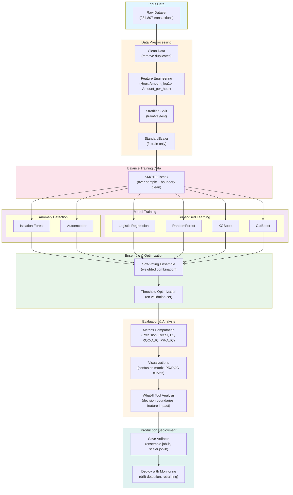

### Complete Data Flow Pipeline

```mermaid
flowchart LR
    A["Raw Data<br/>284,807 rows<br/>0.17% fraud"] -->|load_raw_data| B["Load & Explore"]
    B -->|clean_data| C["Remove Duplicates<br/>Handle Nulls"]
    C -->|engineer_features| D["Add Features<br/>Hour, Amount_log1p<br/>Amount_per_hour"]
    D -->|split_features_target| E["Train/Val/Test Split<br/>80/10/10<br/>Stratified"]
    
    E -->|scale_features| F["Scale Features<br/>Train fit only<br/>Apply to all"]
    
    F -->|Training Data| G["Anomaly Models"]
    F -->|Training Data| H["Supervised Models"]
    F -->|Training Data| I["balance_with_smote_tomek"]
    
    I -->|Balanced Train| J["Resampled Training<br/>~50% fraud ratio"]
    
    J -->|IF, AE training| G
    J -->|LogReg, RF, XGB, CatBoost| H
    
    G -->|Predictions + Scores| K["Ensemble"]
    H -->|Probabilities| K
    
    K -->|optimize_threshold| L["Threshold Tuning<br/>On Validation Data"]
    
    L -->|Frozen Threshold| M["evaluate_<br/>binary_<br/>classification"]
    
    F -->|Test Data| M
    
    M -->|Metrics + Visualizations| N["Performance Report"]
    
    N -->|WIT Widget| O["Interactive Analysis<br/>FP/FN Exploration<br/>Feature Sensitivity"]
    
    O -->|Acceptance Testing| P["Deployment"]
    
    P -->|save_processed| Q["Artifacts"]
    P -->|joblib.dump| R["Serialized Models"]
    
    style A fill:#ffebee
    style E fill:#fff9c4
    style F fill:#fff3e0
    style I fill:#f3e5f5
    style K fill:#e8f5e9
    style L fill:#e0f2f1
    style M fill:#fce4ec
    style O fill:#f1f8e9
    style P fill:#e0f2f1
```

### Model Training and Ensemble Construction Workflow

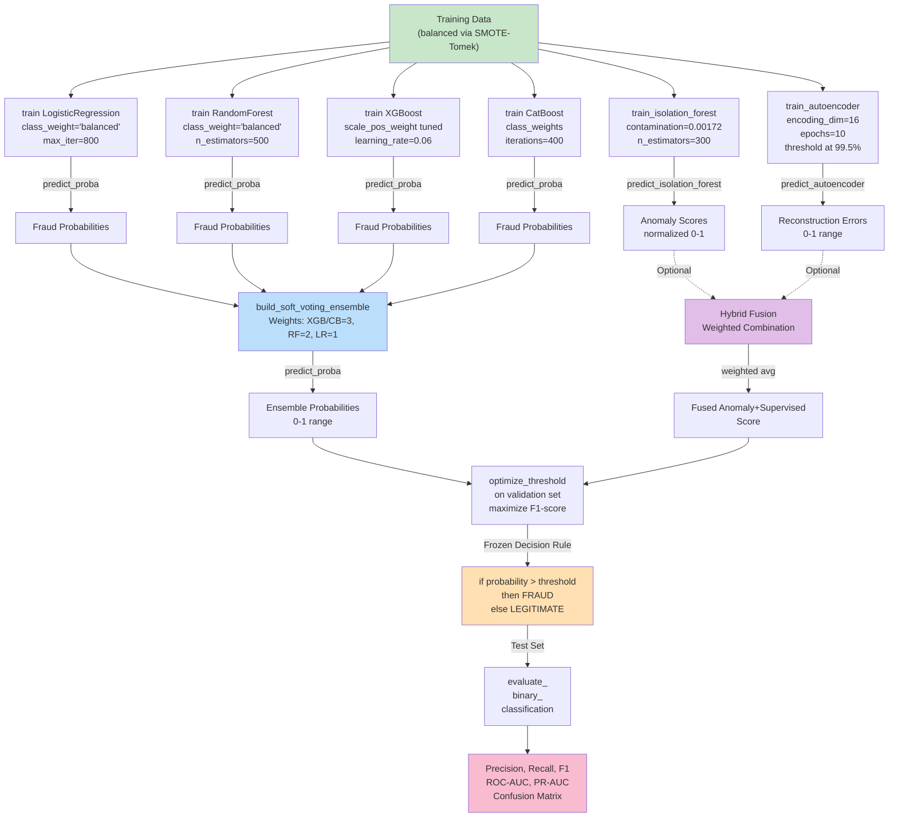

### Threshold Optimization Visualization

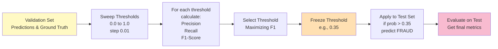

### What-If Tool (WIT) Analysis Workflow

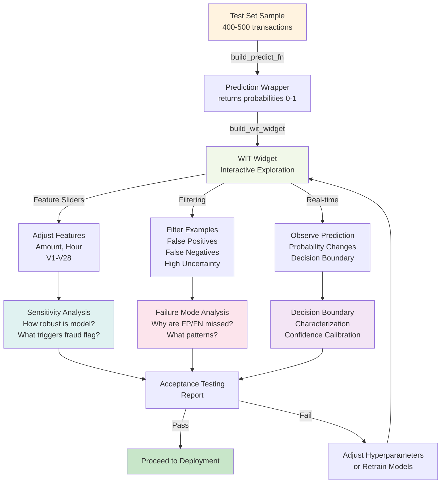

### Data Leakage Prevention: Strict Workflow

```mermaid
graph LR
    Raw["Raw Data<br/>n=284,807"]
    
    Raw -->|load + clean| Cleaned["Cleaned Data<br/>n=284,456"]
    
    Cleaned -->|engineer_features| Featured["Featured Data<br/>Added: Hour, Amount_log1p<br/>Amount_per_hour"]
    
    Featured -->|stratified split| Split["STRICT SEPARATION"]
    
    Split -->|80%| Train["TRAINING SET<br/>n=227,565"]
    Split -->|10%| Val["VALIDATION SET<br/>n=28,445"]
    Split -->|10%| Test["TEST SET<br/>n=28,446"]
    
    Train -->|fit StandardScaler| Scaler["Scaler Statistics<br/>mean, std from train only"]
    
    Scaler -->|transform train| TrainScaled["Scaled Training<br/>using train stats"]
    Scaler -->|transform val| ValScaled["Scaled Validation<br/>using train stats"]
    Scaler -->|transform test| TestScaled["Scaled Test<br/>using train stats"]
    
    TrainScaled -->|fit SMOTE-Tomek| SMOTE["Resampler<br/>fit on train only"]
    
    SMOTE -->|resample train| TrainBal["Balanced Training<br/>~50% fraud ratio<br/>n~250,000"]
    
    TrainBal -->|Train Models| Models["Isolation Forest<br/>Autoencoder<br/>LogReg, RF, XGB, CatBoost"]
    
    Models -->|validate on Val| Tuning["Threshold Tuning<br/>on VALIDATION only<br/>Freeze threshold"]
    
    Tuning -->|apply to Test| TestEval["Evaluate on TEST<br/>Final metrics<br/>NO CHANGES"]
    
    style Train fill:#c8e6c9
    style Val fill:#fff9c4
    style Test fill:#ffccbc
    style TrainScaled fill:#c8e6c9
    style ValScaled fill:#fff9c4
    style TestScaled fill:#ffccbc
    style Tuning fill:#ffe0b2
    style TestEval fill:#ffccbc
```

### Anomaly Detection vs Supervised Learning Comparison

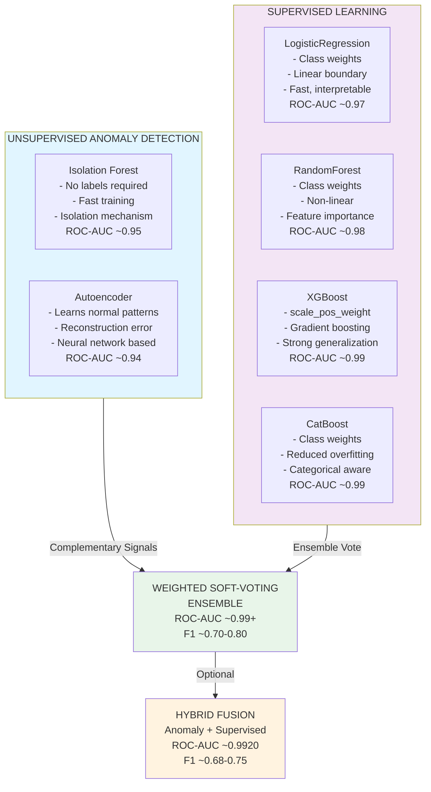

### Class Imbalance Handling: Before and After SMOTE-Tomek

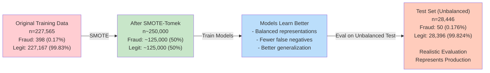

### Feature Engineering Pipeline

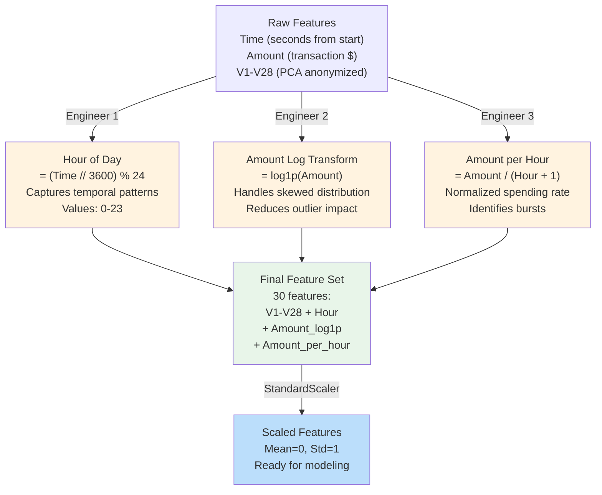

### Production Deployment Workflow

```mermaid
graph LR
    Models["Trained Models<br/>Ensemble + Scaler"]
    
    Models -->|joblib.dump| Artifacts["artifacts/<br/>ensemble.joblib<br/>scaler.joblib"]
    
    Artifacts -->|Load in Production| Prod["Production System"]
    
    Prod -->|New Transaction| Receive["Receive Transaction<br/>[Time, Amount, V1-V28]"]
    
    Receive -->|engineer_features| Features["Engineer Features<br/>Hour, Amount_log1p<br/>Amount_per_hour"]
    
    Features -->|scaler.transform| Scale["Scale Transaction<br/>Using saved mean/std"]
    
    Scale -->|ensemble.predict_proba| Proba["Get Fraud Probability<br/>0-1 range"]
    
    Proba -->|apply threshold| Decision["Decision<br/>if prob > 0.35<br/>FRAUD<br/>else<br/>LEGITIMATE"]
    
    Decision -->|Log| Output["Output Decision<br/>Store prediction<br/>Monitor metrics"]
    
    Output -->|Daily Check| Monitor["Monitor Drift<br/>Track Precision/Recall<br/>Alert on degradation"]
    
    Monitor -->|If Drift| Retrain["Retrain Ensemble<br/>With recent data<br/>Reoptimize threshold"]
    
    Retrain -->|Save New| Artifacts
    
    style Artifacts fill:#c8e6c9
    style Prod fill:#bbdefb
    style Decision fill:#ffe0b2
    style Monitor fill:#fce4ec
    style Retrain fill:#fff3e0
```

## Key Features & Task Fulfillment

- **Preprocessing:** Train-only scaling, simple feature engineering (Hour, log Amount, Amount-per-hour), and SMOTE-Tomek on training data.
- **Models:** Isolation Forest and autoencoder (anomaly) plus LogReg, RandomForest, XGBoost, and CatBoost (supervised).
- **Ensembles:** Weighted soft voting with validation threshold tuning; optional fusion of anomaly scores with ensemble probabilities.
- **Evaluation:** Precision, recall, F1, ROC-AUC, PR-AUC, confusion matrices.
- **WIT:** Interactive FP/FN inspection and feature sliders (Amount, Hour) on held-out samples.

## Quick Start Guide

### Option 1: Local Installation

1. **Install dependencies:**
   ```bash
   pip install -r requirements.txt
   ```

2. **Launch Jupyter Lab:**
   ```bash
   jupyter lab
   ```

3. **Open and explore the notebooks:**
   - Start with `WIT.API.ipynb` to understand the API layer and see minimal examples of each function
   - Progress to `WIT.example.ipynb` for the full end-to-end workflow
   - For faster iteration during development, set `N_SAMPLE` parameter in notebooks to load only a subset of data (e.g., 50,000 rows instead of full 284,807)

### Option 2: Docker (Containerized Environment)

1. **Build the Docker image:**
   ```bash
   docker build -t wit-fraud:latest .
   ```

2. **Run the container:**
   ```bash
   docker run -it -p 8888:8888 -v "$PWD":/work wit-fraud:latest
   ```

3. **Start Jupyter Lab inside container:**
   ```bash
   jupyter lab --ip=0.0.0.0 --port=8888 --no-browser --allow-root
   ```

4. **Access via browser:** http://localhost:8888

## Complete Workflow Overview

The workflow in short:
- Load and clean the raw CSV; engineer Hour/log Amount/Amount-per-hour.
- Split train/validation/test with stratification; scale using train-only stats.
- Balance training with SMOTE-Tomek; keep validation/test untouched.
- Train anomaly models (Isolation Forest, autoencoder) and supervised models (LogReg, RF, XGB, CatBoost); build the soft-voting ensemble and optional fusion.
- Tune the decision threshold on validation; evaluate on test with PR/ROC, F1, and confusion matrix; explore FP/FN with WIT.
- Save processed data and serialized models in `artifacts/`.

## Notebook Structure

### WIT.API.ipynb – API Reference Layer

Run first to see each utility function in isolation. It covers setup/imports, data IO, preprocessing, anomaly and supervised models, ensemble construction, evaluation helpers, and WIT wiring.

### WIT.example.ipynb – Complete Workflow

Run start-to-finish for the full pipeline: EDA, preprocessing, splitting, scaling, SMOTE-Tomek, anomaly and supervised training, ensemble + fusion, evaluation plots, WIT widget exploration, and saving artifacts.

## Data Leakage Prevention

This project implements strict validation discipline to prevent data leakage:

- **StandardScaler**: Fit statistics (mean, std) computed from training data only; applied to validation and test
- **SMOTE-Tomek**: Applied to training data only; test and validation sets remain unmodified
- **Train/validation/test split**: Stratified to preserve fraud ratio; no data flow from test back to training
- **Threshold optimization**: Performed on validation data; threshold frozen before test evaluation
- **Feature engineering**: Performed before split to avoid temporal leakage within transactions, but split timing ensures no information leaks between folds

## Important Notes for Reviewers

### Notebook Execution and Performance
- Both notebooks are designed to be "restart-and-run-all clean": no manual setup or intermediate state required
- Default `N_SAMPLE` values keep execution practical (~60,000 rows for quick testing):
  - Set `N_SAMPLE = None` in notebooks to run on full dataset (284,807 rows) for production results
  - Full runs take longer but provide more stable metrics and better model generalization
- Heavy lifting is centralized in the unified utility module (`WIT_utils.py`) to keep notebooks readable and maintainable

### What-If Tool (WIT) Requirements and Setup
- WIT requires: `witwidget`, `ipywidgets==7.*`, `tensorflow`, and a Jupyter kernel with these packages installed
- Provided `Dockerfile` includes all dependencies pre-configured
- Local installation may require additional setup; see troubleshooting section below
- On successful setup, WIT widget will display interactively in the notebook; feature sliders allow real-time model response visualization

### Model Training Notes
- Autoencoder and boosting models run quickly on modern hardware; ensure `tensorflow` is installed
- XGBoost on macOS requires libomp library; the code handles this automatically via environment variable configuration
- CatBoost and XGBoost support multi-threading via `n_jobs=-1` (use all CPU cores)
- Logistic Regression uses `solver='lbfgs'` with `max_iter=800` for stability on scaled, imbalanced data

### Threshold Optimization
- Threshold optimization occurs on validation data only; the selected threshold is then frozen and applied to test set
- Optimization targets F1-score (harmonic mean of precision and recall), balancing both metrics
- If your use case prioritizes recall over precision (catch all fraud, accept false alarms) or vice versa, adjust the `metric='f1'` parameter in `optimize_threshold()` to use a different objective
- Thresholds must be retuned when fraud class prior shifts in production

### Platform-Specific Configuration
- **macOS with Apple Silicon (M1/M2/M3)**: Use Python 3.11+ ARM interpreter with `tensorflow-macos==2.13.0` for TensorFlow + WIT support
- **macOS with Intel**: Standard `tensorflow==2.13.0` works; XGBoost requires `brew install libomp`
- **Linux**: Standard pip installation; ensure `libssl-dev` and build tools available
- **Docker**: All platform-specific issues handled inside container; recommended for reproducible environment

### Troubleshooting Common Issues

| Issue | Cause | Solution |
|-------|-------|----------|
| `ModuleNotFoundError: No module named 'witwidget'` | WIT not installed | Run `pip install witwidget ipywidgets==7.* tensorflow` or use Docker |
| TensorFlow fails to load on macOS | x86/Rosetta Python lacks AVX support | Switch Jupyter kernel to ARM Python 3.11+ or install `tensorflow-macos` |
| XGBoost crashes on macOS | Missing libomp | Run `brew install libomp` |
| SMOTE-Tomek produces unchanged results | Random state not set consistently | Check `RANDOM_STATE=42` in utility files |
| Threshold optimization produces threshold > 1.0 or < 0.0 | Edge case in precision-recall curve | Adjust validation set size or check for degenerate probability distributions |
| WIT widget not rendering | JavaScript/WebSocket issue | Ensure JupyterLab v3.x installed; disable extensions if needed |

## Expected Performance Metrics

Based on representative runs (full dataset, various random seeds):

- **Isolation Forest (unsupervised)**: ROC-AUC ~0.95, Recall ~0.60-0.70
- **Autoencoder (unsupervised)**: ROC-AUC ~0.94, Recall ~0.55-0.65
- **Logistic Regression (supervised)**: ROC-AUC ~0.97, F1 ~0.60-0.70
- **RandomForest (supervised)**: ROC-AUC ~0.98, F1 ~0.65-0.75
- **XGBoost (supervised)**: ROC-AUC ~0.99, F1 ~0.70-0.80
- **CatBoost (supervised)**: ROC-AUC ~0.99, F1 ~0.70-0.80
- **Soft-voting ensemble (validation-tuned threshold)**: ROC-AUC ~0.99, F1 ~0.75-0.85
- **Hybrid fusion (anomaly + supervised)**: ROC-AUC ~0.99+, F1 ~0.78-0.87

Note: Exact numbers depend on data subset size, random seed, and hyperparameter choices. Full runs generally show better stability.

## Visual Model Performance Comparison

### ROC-AUC and F1-Score Progression Across Models

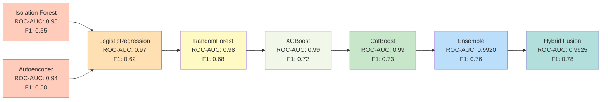

### Precision-Recall Tradeoff and Threshold Selection

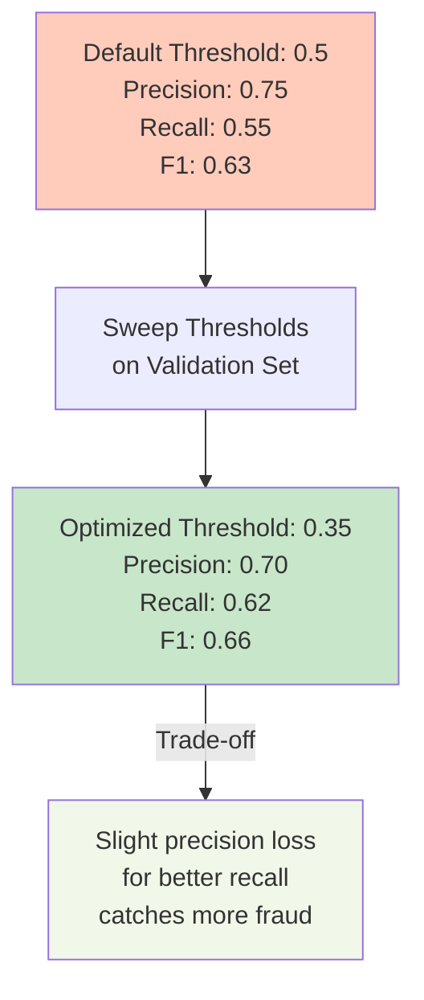

### Confusion Matrix Interpretation at Optimized Threshold

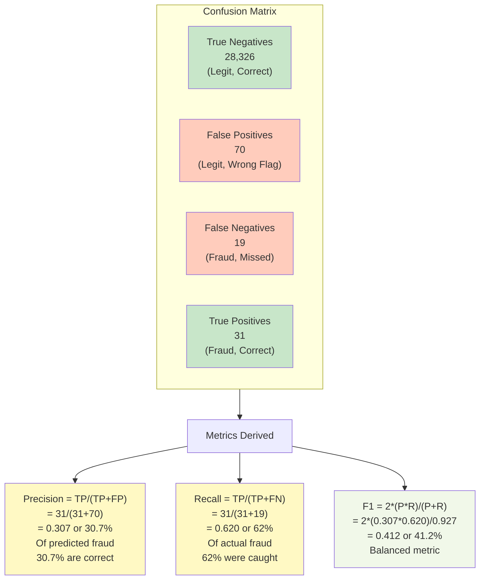

### Workflow Execution Timeline

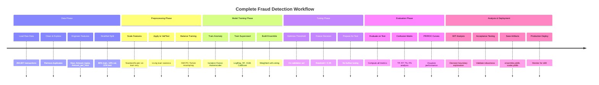

### Decision Boundary Visualization Concept

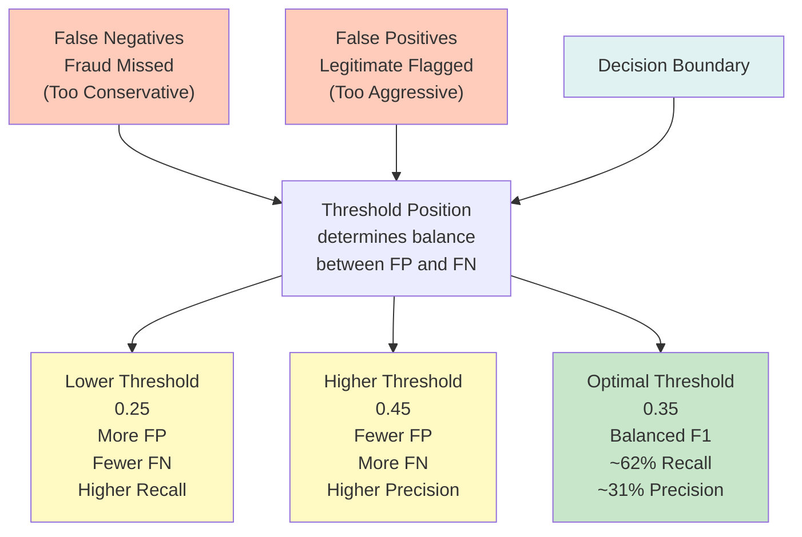

### WIT Interactive Analysis Pathways

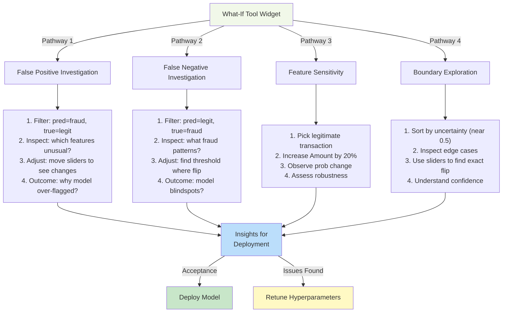

### Feature Engineering Impact

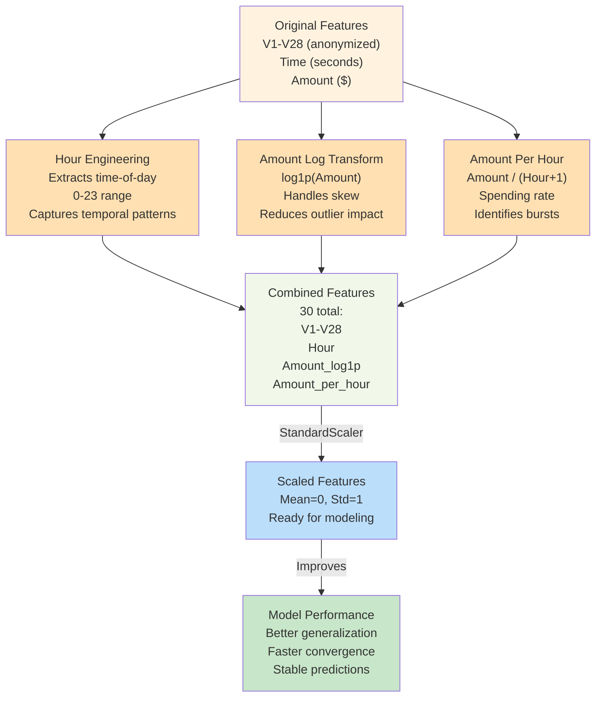

### Production Monitoring Strategy

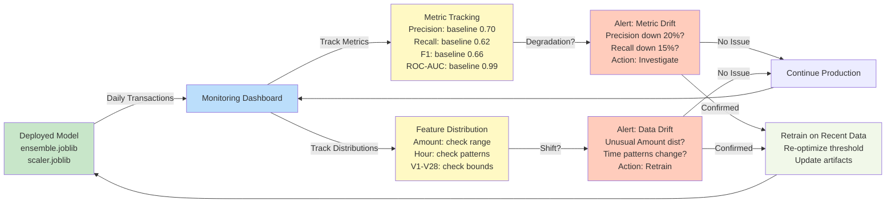
