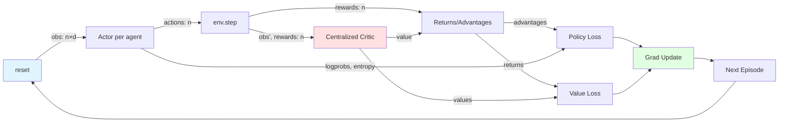

# TorchRL_MAC API Reference

This document describes the two-layer architecture for multi-agent cooperation on MPE environments using CTDE (Centralized Training, Decentralized Execution) with an A2C baseline.

---

## Layer 1: Native API (Project Internals)

These modules provide the core MPE environment and policy infrastructure.

### `src/envs/mpe_env.py`

**Purpose:** Factory for PettingZoo MPE parallel environments.

**Key Function:**
```python
make_mpe_env(
    render_mode: str | None = None,
    N: int = 3,                    # number of agents
    local_ratio: float = 0.5,      # reward locality
    max_cycles: int = 25,          # max steps per episode
) -> ParallelEnv
```

**Returns:** PettingZoo `simple_spread_v3.parallel_env` with discrete actions (`continuous_actions=False`).

**Behavior:**
- Resets env with `seed=0` before returning
- Agents list: `env.agents = ["agent_0", "agent_1", "agent_2"]`
- Observation/action spaces accessed via `env.observation_space(agent)`, `env.action_space(agent)`

**Helpers:**
- `run_random_episode() -> Dict[str, float]`: sanity check with random actions, returns total rewards per agent
- `print_env_specs()`: prints spaces for first agent

---

### `src/wrappers/wrapper.py`

**Purpose:** Adapts PettingZoo dict-based I/O to fixed-order PyTorch tensors.

**Class:**
```python
MPEWrapper(device="cpu", **mpe_kwargs)
```

**Attributes:**
- `num_agents: int` — fixed number of agents
- `obs_dim: int` — observation dimension per agent
- `n_actions: int` — discrete action count (from `action_space.n`)
- `agents: List[str]` — stable agent ordering

**Methods:**
```python
reset(seed: int | None = None) -> Tensor
```
- **Returns:** `[num_agents, obs_dim]` float32
- Seeds both wrapper RNG and internal env

```python
step(actions: Tensor) -> Tuple[Tensor, Tensor, bool]
```
- **Input:** `actions` — `[num_agents]` int64, range `[0, n_actions)`
- **Returns:**
  - `obs` — `[num_agents, obs_dim]` float32
  - `rewards` — `[num_agents]` float32
  - `done_all` — bool (aggregates per-agent terminations and truncations)

**Done Semantics:**
- `done_all = all(dones[a] or truncs[a] for a in agents)`
- Episode ends when ANY agent terminates or max_cycles reached

**Validation:**
- Checks action shape `[num_agents]`
- Validates discrete action range if `n_actions` is known

---

### `src/agent_policy/agent_policy.py`

**Purpose:** Parameter-shared MLP policy for discrete actions.

**Class:**
```python
SharedMLPPolicy(obs_dim: int, act_dim: int, hidden_dims: Iterable[int] = (128, 64))
```

**Methods:**
```python
forward(obs: Tensor) -> Tensor
```
- **Input:** `[num_agents, obs_dim]`
- **Returns:** logits `[num_agents, act_dim]`

```python
act(obs: Tensor) -> Tensor
```
- **Input:** `[num_agents, obs_dim]`
- **Returns:** sampled actions `[num_agents]` int64

**Design:**
- Same network parameters used for all agents
- ReLU activations between linear layers
- No value head (actor-only)

---

### `src/train/rollout.py`

**Purpose:** Minimal integration test for env + policy wiring (no learning).

**Function:**
```python
run_rollout(num_episodes: int = 3) -> None
```

**Behavior:**
- Creates `MPEWrapper`, infers dims, builds `SharedMLPPolicy`
- Loops: `obs → policy.act → env.step → accumulate rewards`
- Prints per-agent episode rewards
- **No gradients or updates**

---

## Layer 2: Wrapper API (TorchRL_MAC_utils.py)

High-level training utilities and CTDE A2C baseline.

### Configuration Dataclasses

**`EnvConfig`**
```python
@dataclass
class EnvConfig:
    env_name: str = "simple_spread"
    seed: int = 0
    max_steps: int = 25
    device: str = "cpu"
```

**`TrainConfig`**
```python
@dataclass
class TrainConfig:
    gamma: float = 0.99
    lr_actor: float = 3e-4
    lr_critic: float = 3e-4
    entropy_coef: float = 0.01
    value_coef: float = 0.5
    max_grad_norm: float = 0.5
    n_episodes: int = 500
    log_every: int = 25
    device: str = "cpu"
```

**`RolloutBatch`**
```python
@dataclass
class RolloutBatch:
    obs: Tensor        # [T, num_agents, obs_dim]
    actions: Tensor    # [T, num_agents]
    rewards: Tensor    # [T, num_agents]
    dones: Tensor      # [T]
    logprobs: Tensor   # [T] mean over agents
    values: Tensor     # [T] central critic V(s)
    entropies: Tensor  # [T] mean over agents
```

---

### Core Functions

**Environment Creation**
```python
make_env(cfg: EnvConfig) -> MPEWrapper
```
- Seeds torch RNG and env
- Returns wrapper with `max_cycles=cfg.max_steps`

**Network Builders**
```python
build_shared_actor(obs_dim: int, n_actions: int, hidden_sizes=(128,128)) -> nn.Module
```
- Returns `SharedMLPPolicy` with specified hidden layers

```python
build_central_critic(joint_obs_dim: int, hidden_sizes=(128,128)) -> nn.Module
```
- Returns `CentralCritic` that maps concatenated observations → scalar value
- `joint_obs_dim = num_agents * obs_dim`

**Action Selection**
```python
select_actions(actor: nn.Module, obs: Tensor) -> Tuple[Tensor, Tensor, Tensor]
```
- **Input:** `obs` — `[num_agents, obs_dim]`
- **Returns:**
  - `actions` — `[num_agents]` sampled from Categorical
  - `logprob_mean` — scalar (mean log-prob across agents)
  - `entropy_mean` — scalar (mean entropy across agents)

**Rollout Collection**
```python
collect_episode(wrapper, actor, critic, env_cfg) -> RolloutBatch
```
- Resets env with `env_cfg.seed`
- Loops until `done_all` or `max_steps`
- For each step:
  - Samples actions via `select_actions`
  - Computes value via `critic.value(joint_obs)` where `joint_obs = obs.reshape(-1)`
  - Steps env and stores tensors
- Returns `RolloutBatch` with episode trajectory

**Returns and Advantages**
```python
compute_returns_advantages(
    rewards_mean: Tensor,  # [T]
    values: Tensor,        # [T]
    dones: Tensor,         # [T]
    gamma: float
) -> Tuple[Tensor, Tensor]
```
- Computes discounted returns backward from episode end
- `advantages = returns - values`
- **No GAE** (simple TD-λ with λ=1)

**A2C Update**
```python
a2c_update(actor, critic, batch, cfg, optim_actor, optim_critic) -> Dict[str, float]
```
- Computes losses:
  - Policy: `-(logprobs * advantages.detach()).mean()`
  - Value: `MSE(values, returns)`
  - Entropy: `-entropy_coef * entropies.mean()`
- Total loss: `policy + value_coef * value + entropy_term`
- Clips gradients to `max_grad_norm`
- Returns metrics dict: `policy_loss`, `value_loss`, `entropy`

**Training Loop**
```python
train_ctde_a2c(env_cfg: EnvConfig, train_cfg: TrainConfig) -> Dict[str, List[float]]
```
- Creates env, actor, critic, optimizers
- For each episode:
  - Collects trajectory via `collect_episode`
  - Computes returns/advantages
  - Updates networks via `a2c_update`
  - Logs episode return and losses
- **Returns:** `history` dict with arrays for plotting:
  - `episode_return`, `policy_loss`, `value_loss`, `entropy`

---

## CTDE Concept

**Centralized Training, Decentralized Execution**

### Training Phase
- **Actor (decentralized):** Each agent's action depends only on its local observation `obs[i]`
- **Critic (centralized):** Value function sees all agents' observations concatenated: `joint_obs = [obs[0], obs[1], ..., obs[n-1]]`
- Centralized critic stabilizes training by providing better credit assignment across agents

### Execution Phase
- Only the actor is used
- Each agent acts independently using `actor(obs[i])`
- No communication or global state required at runtime

### Parameter Sharing
- All agents use the **same actor network** (symmetry assumption)
- Improves sample efficiency and generalization
- Reduces total parameter count

---

## Data Flow Diagram



**Key:**
- **Blue (reset):** Episode initialization with `seed`
- **Red (Critic):** Centralized component sees joint observations
- **Green (Update):** Gradient step updates both actor and critic

---

## Design Decisions

### Minimal A2C First
- No GAE (λ=1 returns) for simplicity and debuggability
- Synchronous updates (A2C) before async (A3C)
- Single-env rollout before vectorization
- CPU-safe defaults (no GPU assumptions)

### Debuggability
- Explicit tensor shapes in docstrings
- Scalar metrics returned from update step
- History dict for easy plotting
- Separate `collect_episode` and `a2c_update` for inspection

### Extensibility
- Configs are dataclasses (easy to serialize/override)
- Modular functions (swap critic, add GAE, vectorize envs)
- Protocol types for actor/critic allow custom implementations

---

## Common Patterns

### Quick Training Run
```python
from TorchRL_MAC_utils import EnvConfig, TrainConfig, train_ctde_a2c

env_cfg = EnvConfig(seed=42, max_steps=25)
train_cfg = TrainConfig(n_episodes=100, log_every=10)
history = train_ctde_a2c(env_cfg, train_cfg)
```

### Custom Hyperparameters
```python
train_cfg = TrainConfig(
    gamma=0.95,
    lr_actor=1e-4,
    entropy_coef=0.02,
    n_episodes=1000
)
```

### Inspect Rollout
```python
from TorchRL_MAC_utils import make_env, build_shared_actor, build_central_critic, collect_episode

env = make_env(env_cfg)
obs = env.reset()
n_agents, obs_dim = obs.shape

actor = build_shared_actor(obs_dim, env.n_actions)
critic = build_central_critic(n_agents * obs_dim)

batch = collect_episode(env, actor, critic, env_cfg)
print(batch.rewards.shape, batch.obs.shape)
```

---

## Backward Compatibility

Legacy helpers from earlier notebooks remain available:
- `build_wrapped_env()` → alias for `MPEWrapper(...)`
- `infer_action_obs_dims()` → shape inference helper
- `make_shared_policy()` → builds actor only
- `run_stateless_rollout()` → no-training sanity check

These are **not** part of the main training flow but useful for quick prototyping.
