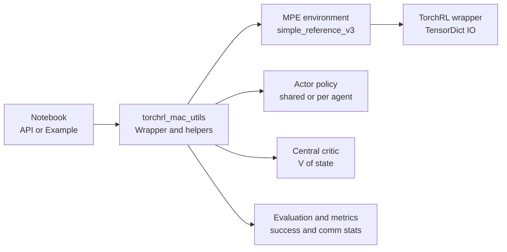

# TorchRL + PettingZoo MPE API Layer (Multi-Agent Communication)

## Goal of this tutorial

This API tutorial introduces a lightweight wrapper layer for training and evaluating cooperative multi-agent RL policies on PettingZoo's MPE tasks using TorchRL. The focus is on:

- environment integration,
- actor/critic interfaces,
- rollout collection,
- standardized evaluation including communication ablations.

## Project structure

- `TorchRL_MAC_utils.py`: reusable logic (env creation, policies, rollout, training/eval helpers)
- `TorchRL_MAC.API.ipynb`: minimal usage demos of the API and wrapper layer
- `TorchRL_MAC.example.*`: end-to-end training run + results

## Environment integration

We integrate PettingZoo's MPE environments through TorchRL's PettingZoo wrappers when available, and fall back to raw PettingZoo parallel environments when needed. This keeps the tutorial robust to version differences while still focusing on core concepts: reset/step loops, observation/action formats, and multi-agent ordering.

## High-level architecture (API layer)

### Key design decision: stable agent ordering

Multi-agent training is sensitive to consistent agent ordering. The API enforces a fixed ordering of agents so that:

- per-agent actors always receive the same agent's observation slot
- the centralized critic (if used) receives a consistent "global state" vector

## API objects and functions

### Configuration

- `MACConfig`: holds environment name/version, training hyperparameters, evaluation settings, and device preferences.

### Core API

- `make_env(cfg)`: builds the MPE env with TorchRL wrappers if possible
- `build_actors(env, cfg)`: builds per-agent actor modules (discrete/continuous handling)
- `build_central_critic(env, cfg)`: builds centralized critic for CTDE
- `collect_rollout(env, actors, critic, cfg)`: runs an on-policy rollout and returns a structured batch
- `evaluate(env, actors, cfg)`: computes success rate and other task metrics
- `evaluate_with_comparison(env, actors, cfg)`: runs a communication ablation ("no-comm") to estimate communication gain

## What to look for in the API notebook

By the end of `TorchRL_MAC.API.ipynb`, you should be able to:

- create an env and print observation/action specs
- sample actions from each agent's policy
- run a short rollout and inspect:
  - observations
  - chosen actions
  - rewards/dones
- run evaluation utilities and interpret metrics

## Common pitfalls (and how this API avoids them)

- Mismatch in agent ordering → fixed ordering enforced
- TorchRL wrapper version differences → wrapper fallback path
- Silent shape bugs → consistent tensor shapes and sanity checks
- Communication not actually being used → "no-comm" ablation to verify causality

