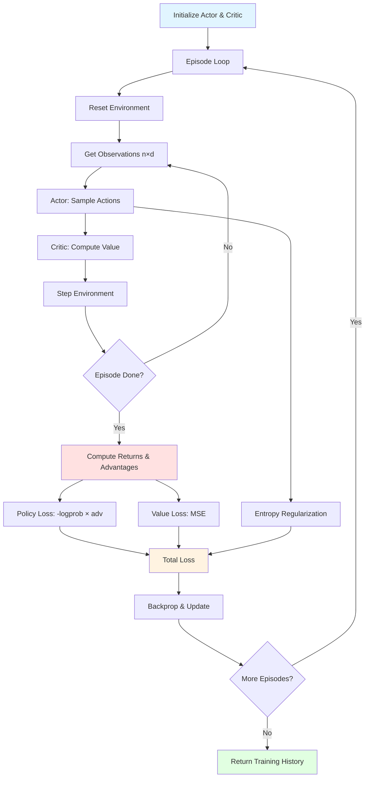

# TorchRL_MAC Training Example

End-to-end demonstration of CTDE (Centralized Training, Decentralized Execution) A2C on the MPE `simple_spread` environment.

---

## Overview

**Goal:** Train multiple agents to cooperatively cover landmarks in a 2D continuous space using discrete movement actions.

**Environment:** PettingZoo MPE `simple_spread_v3`
- 3 agents (default), 3 landmarks
- **Reward structure:** Team reward for covering landmarks, penalty for collisions
- **Partial observability:** Each agent sees its position, landmark positions, and nearby agents

**Algorithm:** Advantage Actor-Critic (A2C) with CTDE
- **Actor:** Parameter-shared MLP policy (decentralized, uses local observations)
- **Critic:** Centralized value function (sees all agents' observations concatenated)
- **Updates:** Synchronous after each episode

---

## Training Loop Flowchart



**Key Steps:**
1. **Collect episode:** Actor samples actions, critic estimates value, env returns rewards
2. **Compute returns:** Discounted sum of rewards (backward from episode end)
3. **Compute advantages:** `returns - values` (TD residual)
4. **Update networks:** Policy gradient with advantage weighting, value MSE, entropy bonus

---

## Loss Components

### Policy Loss
```python
policy_loss = -(logprobs * advantages.detach()).mean()
```
**Why:** Encourage actions with positive advantage (better than expected); discourage actions with negative advantage.

**Minimal design:** Direct policy gradient (REINFORCE with baseline); no clipping (PPO), no importance sampling (off-policy).

### Value Loss
```python
value_loss = MSE(predicted_values, returns)
```
**Why:** Train critic to accurately predict episode returns for better advantage estimation.

**Minimal design:** Simple MSE regression; no target network, no Huber loss.

### Entropy Bonus
```python
entropy_term = -entropy_coef * entropies.mean()
```
**Why:** Maintain exploration by penalizing deterministic policies (negative sign makes it a *bonus* in the total loss).

**Minimal design:** Mean entropy across agents; no adaptive coefficient scheduling.

---

## Why Minimal?

**Debuggability:**
- Each component is interpretable and can be inspected independently
- No complex architectures (attention, recurrence, communication)
- CPU-safe defaults (no distributed training)

**Baseline First:**
- Establish working A2C before adding GAE, PPO, TorchRL abstractions
- Easy to verify shapes, gradients, convergence
- Reference point for ablations and extensions

**Academic Context:**
- Focus on understanding CTDE and multi-agent credit assignment
- Gradual complexity ramp (A2C → GAE → MAPPO → communication)

---

## Roadmap for Extensions

### Phase 1: Stabilization (Immediate)
- [x] Minimal A2C with CTDE
- [ ] Add GAE (Generalized Advantage Estimation) for lower variance
- [ ] Observation normalization (running mean/std)
- [ ] Reward scaling

### Phase 2: Modern RL Components
- [ ] TorchRL `TensorDict` for structured rollout storage
- [ ] Vectorized environments (parallel rollouts)
- [ ] TensorBoard/W&B logging
- [ ] Checkpoint saving/loading

### Phase 3: Advanced MARL
- [ ] MAPPO (multi-agent PPO with clipped surrogate)
- [ ] Value function factorization (QMIX-style)
- [ ] Communication channels (CommNet, TarMAC)
- [ ] Attention over agents

### Phase 4: Robustness
- [ ] Hyperparameter sweeps (learning rate, entropy coef)
- [ ] Multiple seeds and statistical significance
- [ ] Ablations (centralized vs decentralized critic)
- [ ] Transfer to other MPE scenarios (`simple_reference`, `simple_adversary`)

---

## Quick Start

**Install dependencies:**
```bash
pip install -r requirements.txt
```

**Run training:**
```python
from TorchRL_MAC_utils import EnvConfig, TrainConfig, train_ctde_a2c

env_cfg = EnvConfig(seed=42, max_steps=25)
train_cfg = TrainConfig(n_episodes=500, log_every=50)

history = train_ctde_a2c(env_cfg, train_cfg)
```

**Plot results:**
```python
import matplotlib.pyplot as plt

plt.plot(history["episode_return"])
plt.xlabel("Episode")
plt.ylabel("Team Return")
plt.title("CTDE A2C on MPE simple_spread")
plt.show()
```

---

## Expected Behavior

**Early episodes (0-100):**
- Random exploration, low/negative returns
- High entropy (nearly uniform action distributions)
- Large policy and value losses

**Mid training (100-300):**
- Agents begin coordinating, returns increase
- Entropy gradually decreases (more confident actions)
- Value loss stabilizes as critic learns return distribution

**Late training (300-500):**
- Agents cover landmarks with minimal collisions
- Returns plateau near scenario optimum
- Low entropy (near-deterministic policies)

**Typical final return:** -5 to 0 (scenario-dependent; higher is better)

---

## Evaluation

After training, evaluate with greedy (argmax) actions:

```python
from TorchRL_MAC_utils import make_env, select_actions
import torch

env = make_env(env_cfg)
obs = env.reset(seed=123)
done = False
total_reward = 0.0

while not done:
    with torch.no_grad():
        logits = actor(obs)
        actions = logits.argmax(dim=-1)  # greedy
    obs, rewards, done = env.step(actions)
    total_reward += rewards.mean().item()

print(f"Greedy episode return: {total_reward:.2f}")
```

---

## Common Issues

**Training diverges (NaN losses):**
- Reduce learning rates (`lr_actor`, `lr_critic`)
- Check gradient norms (`max_grad_norm`)
- Verify environment reset/seeding

**No learning progress:**
- Increase entropy coefficient (more exploration)
- Check reward scaling (are rewards too sparse?)
- Inspect individual episode trajectories

**Slow convergence:**
- Tune gamma (discount factor)
- Try GAE (λ = 0.95) for smoother advantages
- Increase episode length (`max_steps`)

---

## Next Steps

1. Run the example notebook (`TorchRL_MAC.example.ipynb`)
2. Experiment with hyperparameters in `TrainConfig`
3. Add logging and visualization (see roadmap)
4. Implement ablations (decentralized critic, no parameter sharing)
5. Extend to communication or other MPE scenarios