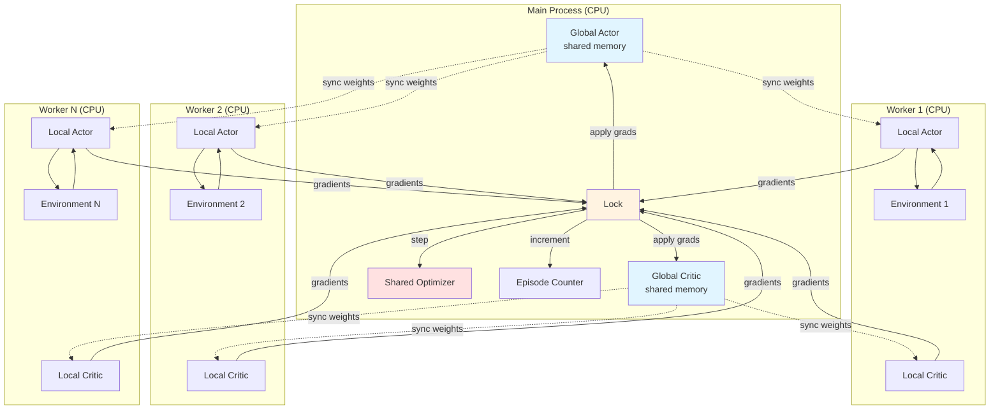

# TorchRL_MAC Training Example

End-to-end demonstration of CTDE (Centralized Training, Decentralized Execution) A3C on the MPE `simple_spread` environment.

---

## Overview

**Goal:** Train multiple agents to cooperatively cover landmarks in a 2D continuous space using discrete movement actions.

**Environment:** PettingZoo MPE `simple_spread_v3`
- 3 agents (default), 3 landmarks
- **Reward structure:** Team reward for covering landmarks, penalty for collisions
- **Partial observability:** Each agent sees its position, landmark positions, and nearby agents

**Algorithm:** Asynchronous Advantage Actor-Critic (A3C) with CTDE
- **Global Networks:** Shared actor and critic on CPU with `.share_memory()`
- **Worker Processes:** Multiple parallel workers, each with local network copies
- **Actor:** Parameter-shared MLP policy (decentralized, uses local observations)
- **Critic:** Centralized value function (sees all agents' observations concatenated)
- **Updates:** Asynchronous - workers compute gradients locally, update global networks under lock
- **Device:** CPU for workers (MPS doesn't support multiprocessing); MPS available for single-process modes

---

## A3C Architecture Flow



**Key Steps:**
1. **Initialize:** Global actor/critic on CPU with shared memory; spawn N workers
2. **Worker Loop:** Each worker independently:
   - Collects n-step rollout using local networks
   - Computes loss and gradients locally
   - Acquires lock, copies gradients to global networks
   - Updates global networks via shared optimizer
   - Syncs local weights from global periodically
3. **Asynchronous:** Workers run in parallel, update global networks without waiting for others
4. **Termination:** Stop when episode counter reaches max_episodes

**Key Steps (per worker):**
1. **Collect n-step rollout:** Actor samples actions, env returns rewards (no critic during rollout)
2. **Recompute logits/values:** From stored observations and actions during update
3. **Compute returns:** Discounted sum of team rewards (sum over agents)
4. **Compute advantages:** `returns - values` (TD residual)
5. **Compute gradients:** Backward pass on local networks
6. **Update global (under lock):** Copy gradients to global networks, optimizer step
7. **Sync weights:** Pull updated global weights to local networks periodically

**A3C Key Features:**
- **Asynchronous:** Multiple workers run independently in parallel
- **Shared optimizer:** Single optimizer updates both actor and critic globally
- **No experience replay:** On-policy learning from fresh rollouts
- **Thread-safe:** Lock protects global network updates
- **n-step returns:** Workers collect n-step rollouts before updating
- **CPU workers:** MPS doesn't support multiprocessing, workers use CPU
- **Diverse exploration:** Different workers explore different state spaces simultaneously

---

## Loss Components

### Policy Loss
```python
policy_loss = -(logprobs * advantages.detach()).mean()
```
**Why:** Encourage actions with positive advantage (better than expected); discourage actions with negative advantage.

**Minimal design:** Direct policy gradient (REINFORCE with baseline); no clipping (PPO), no importance sampling (off-policy).

### Value Loss
```python
value_loss = MSE(predicted_values, returns)
```
**Why:** Train critic to accurately predict episode returns for better advantage estimation.

**Minimal design:** Simple MSE regression; no target network, no Huber loss.

### Entropy Bonus
```python
entropy_term = -entropy_coef * entropies.mean()
```
**Why:** Maintain exploration by penalizing deterministic policies (negative sign makes it a *bonus* in the total loss).

**Minimal design:** Mean entropy across agents; no adaptive coefficient scheduling.

---

## Why A3C?

**Advantages:**
- **Parallelism:** Multiple workers collect experience simultaneously
- **Exploration diversity:** Different workers explore different trajectories
- **Stable gradients:** Parallel workers provide decorrelated gradient updates
- **No replay buffer:** Simpler than DQN/DDPG, lower memory footprint

**Debuggability:**
- Each component is interpretable and can be inspected independently
- No complex architectures (attention, recurrence, communication)
- Multiprocessing on CPU for stability (MPS single-GPU mode still available)

**Baseline First:**
- Establish working A2C before adding GAE, PPO, TorchRL abstractions
- Easy to verify shapes, gradients, convergence
- Reference point for ablations and extensions

**Academic Context:**
- Focus on understanding CTDE and multi-agent credit assignment
- Gradual complexity ramp (A2C → GAE → MAPPO → communication)

---

## Roadmap for Extensions

### Phase 1: Stabilization (Immediate)
- [x] Minimal A3C with CTDE and async parallel workers
- [x] MPS device support with CPU fallback
- [x] Fixed learning issues (recompute logits/values, team reward aggregation)
- [ ] Add GAE (Generalized Advantage Estimation) for lower variance
- [ ] Observation normalization (running mean/std)
- [ ] Reward scaling

### Phase 2: Modern RL Components
- [ ] TorchRL `TensorDict` for structured rollout storage
- [ ] Vectorized environments (parallel rollouts)
- [ ] TensorBoard/W&B logging
- [ ] Checkpoint saving/loading

### Phase 3: Advanced MARL
- [ ] MAPPO (multi-agent PPO with clipped surrogate)
- [ ] Value function factorization (QMIX-style)
- [ ] Communication channels (CommNet, TarMAC)
- [ ] Attention over agents

### Phase 4: Robustness
- [ ] Hyperparameter sweeps (learning rate, entropy coef)
- [ ] Multiple seeds and statistical significance
- [ ] Ablations (centralized vs decentralized critic)
- [ ] Transfer to other MPE scenarios (`simple_reference`, `simple_adversary`)

---

## Quick Start

**Install dependencies:**
```bash
pip install -r requirements.txt
```

**Run training:**
```python
from TorchRL_MAC_utils import EnvConfig, TrainConfig, train_ctde_a3c

env_cfg = EnvConfig(seed=42, max_steps=25, device=None)  # Auto-detect MPS/CPU
train_cfg = TrainConfig(
    max_episodes=300,    # Total episodes across all workers
    log_every=50,
    device="mps",        # Global networks device (workers use CPU)
    num_workers=4,       # Number of parallel A3C workers
    n_steps=10,          # Steps per worker rollout
    lr=3e-4,
    gamma=0.99
)

history = train_ctde_a3c(env_cfg, train_cfg)
```

**Plot results:**
```python
import matplotlib.pyplot as plt

plt.plot(history["episode_return"])
plt.xlabel("Episode")
plt.ylabel("Team Return")
plt.title("CTDE A3C on MPE simple_spread")
plt.show()
```

---

## Expected Behavior

**Early episodes (0-100):**
- Random exploration across multiple workers, low/negative returns
- High entropy (nearly uniform action distributions)
- Large policy and value losses across workers

**Mid training (100-200):**
- Workers discover coordinating behaviors, returns increase
- Entropy gradually decreases (more confident actions)
- Value loss stabilizes as critic learns return distribution
- Global network receives diverse gradients from parallel workers

**Late training (200-300):**
- Agents cover landmarks with minimal collisions
- Returns plateau near scenario optimum
- Low entropy (near-deterministic policies)
- Workers exhibit coordinated behavior despite independent rollouts

**Typical final return:** -5 to 0 (scenario-dependent; higher is better)

**A3C-specific behaviors:**
- Training may be faster than single-process A2C due to parallel experience collection
- Episode returns may be more variable due to asynchronous updates
- Loss curves may appear noisier due to decorrelated worker gradients

---

## Evaluation

After training, evaluate with greedy (argmax) actions:

```python
from TorchRL_MAC_utils import make_env, select_actions
import torch

env = make_env(env_cfg)
obs = env.reset(seed=123)
done = False
total_reward = 0.0

while not done:
    with torch.no_grad():
        logits = actor(obs)
        actions = logits.argmax(dim=-1)  # greedy
    obs, rewards, done = env.step(actions)
    total_reward += rewards.mean().item()

print(f"Greedy episode return: {total_reward:.2f}")
```

---

## Common Issues

**Training diverges (NaN losses):**
- Reduce learning rate (`lr` in TrainConfig)
- Check gradient norms with `debug_grads=True`
- Verify environment reset/seeding across workers
- Ensure shared memory networks are properly initialized

**No learning progress:**
- Increase entropy coefficient (more exploration)
- Check if workers are collecting diverse experiences
- Verify lock-protected updates are happening correctly
- Inspect worker logs for individual trajectories

**Slow convergence:**
- Tune gamma (discount factor)
- Adjust `n_steps` (rollout length per worker)
- Increase `num_workers` for more parallel experience
- Try different `sync_every` values for weight synchronization

**Multiprocessing issues:**
- If workers hang, check for deadlocks in lock usage
- If MPS errors occur, verify workers use CPU device
- Use `mp.set_start_method('spawn')` for proper initialization

---

## Next Steps

1. Run the example notebook (`TorchRL_MAC.example.ipynb`)
2. Experiment with hyperparameters in `TrainConfig`
3. Add logging and visualization (see roadmap)
4. Implement ablations (decentralized critic, no parameter sharing)
5. Extend to communication or other MPE scenarios