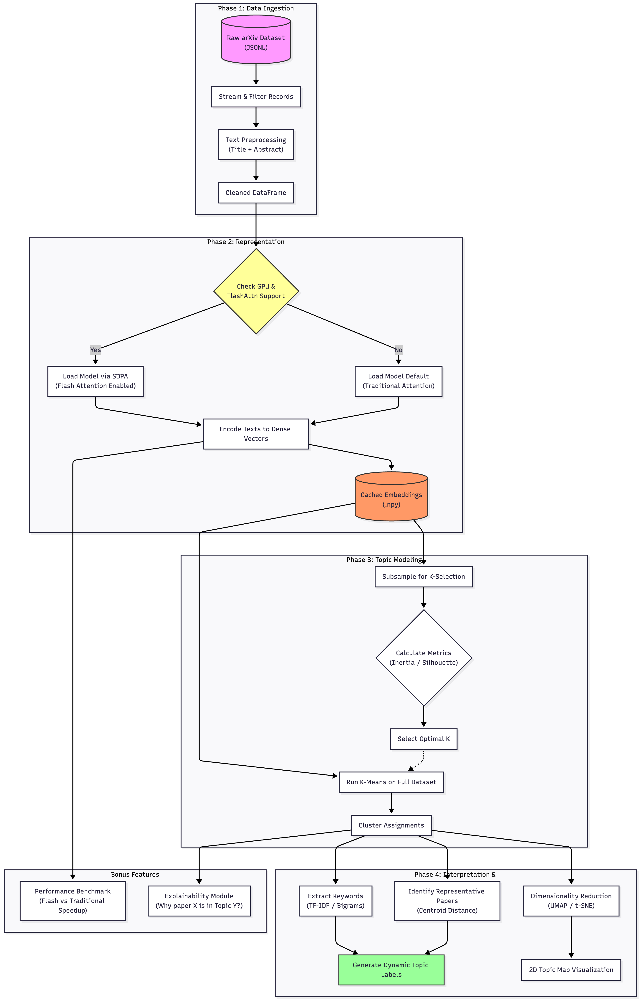

# UmdTask39 – FlashAttention Topic Modeling of Scientific Papers
Name : Gowtham Krishna Tadikamalla

UID: 121321909

This project implements a complete topic modeling pipeline for scientific papers using FlashAttention-optimized transformer embeddings. The system processes arXiv metadata, generates dense vector embeddings, clusters documents into topics, and provides interpretable topic labels with visualizations.

## Overview

This project demonstrates how FlashAttention can significantly improve the efficiency of large-scale topic modeling tasks. FlashAttention is an optimized attention mechanism that reduces memory complexity from quadratic to linear and provides 2-4x speedup compared to standard attention implementations, making it ideal for processing large text corpora.

### Key Features

- **Efficient Processing**: FlashAttention integration via PyTorch 2.0+ for faster, memory-efficient attention computation
- **Scalable Pipeline**: Handles large datasets (400K+ documents) with optimized batching and memory management
- **Interpretable Topics**: Generates human-readable topic labels using TF-IDF keywords and representative papers
- **Reproducible**: Docker-based setup ensures consistent execution across different environments
- **Comprehensive Documentation**: Includes API documentation, example notebooks, and detailed workflow descriptions

### What is FlashAttention?

FlashAttention is an optimized attention algorithm that reduces memory usage from O(n²) to O(n) and provides significant speed improvements (2-4x) on CUDA-enabled GPUs. It achieves this by:
- Computing attention on-the-fly without storing full attention matrices
- Using tiling to keep computation within fast GPU memory
- Maintaining numerical accuracy while reducing memory footprint

For more details, see the [FlashAttention paper](https://arxiv.org/abs/2205.14135).

Everything is designed to run reproducibly inside Docker via `docker compose`.

---

## Workflow Overview

The project follows a complete pipeline from raw data to topic visualization:



### Pipeline Steps

1. **Data Loading & Preprocessing**: Stream and clean arXiv metadata, filter short abstracts, concatenate title and abstract
2. **Text Encoding**: Generate dense embeddings using transformer models with FlashAttention optimization when available
3. **K Selection**: Determine optimal number of topics by testing multiple K values on a subsample
4. **Clustering**: Apply K-Means clustering on normalized embeddings to assign documents to topics
5. **Topic Labeling**: Extract TF-IDF keywords and identify representative papers to generate human-readable labels
6. **Visualization**: Project embeddings to 2D using UMAP/t-SNE and create topic maps

For detailed explanations of each step, see [`flash_attn.example.md`](flash_attn.example.md).

---

## 1. Project Layout

All files live under:

`class_project/MSML610/Fall2025/Projects/UmdTask39_Fall2025_flash_attn_Topic_Modeling_of_Scientific_Papers/`

Key files:

- `flash_attn_utils.py`  
  Core utilities:
  - Load & preprocess arXiv metadata (JSONL → cleaned DataFrame)
  - Load encoder (`intfloat/e5-base-v2` by default; main example uses `intfloat/e5-large-v2` for higher-quality embeddings)
  - Encode texts to embeddings (PyTorch)
  - K-means clustering + TF-IDF topic descriptors
  - 2D projection via UMAP or t-SNE

- `flash_attn.example.ipynb`  
  Main end-to-end notebook:
  - Load and clean a large subset of arXiv metadata
  - Compute embeddings with `intfloat/e5-large-v2` (with FlashAttention on CUDA when available)
  - Select a suitable number of topics K via a small K-selection experiment
  - Cluster documents with K-Means, extract TF-IDF topic keywords, and generate human-readable topic labels using representative papers
  - Visualize the topic map in 2D (UMAP/t-SNE) on a subsample of embeddings
  - Includes FlashAttention performance benchmarks and explainability examples

- `flash_attn.API.ipynb`  
  API demonstration notebook:
  - Shows native Transformers and Sentence-Transformers library usage
  - Demonstrates custom wrapper functions from `flash_attn_utils.py`
  - Illustrates FlashAttention integration and fallback mechanisms

- `flash_attn.API.md`  
  Complete API documentation:
  - Describes native APIs (Transformers, Sentence-Transformers)
  - Documents custom wrapper layer functions
  - Explains FlashAttention integration strategy

- `flash_attn.example.md`  
  Complete application documentation:
  - Detailed explanation of the full pipeline
  - Design decisions and rationale
  - Performance considerations and limitations
  - Results interpretation guide

- `flash_attn_flowchart.png`  
  Visual workflow diagram showing the complete pipeline from data loading to visualization

- `Dockerfile`  
  Builds a Python 3.x environment with:
  - PyTorch (CPU), transformers, sentence encoders
  - scikit-learn, UMAP-learn, matplotlib, pandas, numpy, tqdm, etc.
  - Jupyter Notebook server

- `docker-compose.yml`  
  Runs the Jupyter Notebook server in a container with:
  - Working directory: `/workspace`
  - Host project mounted at `/workspace`
  - Host `./data` also mounted at  
    `/data/UmdTask39_Fall2025_flash_attn_Topic_Modeling_of_Scientific_Papers/data` (for backward compatibility)
  
  The notebooks expect the raw data and generated artifacts under `/workspace/data/...` (i.e., the `data/` subfolder of the project).

- `requirements.txt`  
  Python dependencies list (for reference/manual installation). 
  Note: Dockerfile installs packages directly, but this file documents all dependencies.

- `data/` (created by you)  
  - `arxiv-metadata-oai-snapshot.json`  (raw dataset – **you download**)
  - `clean_subset.parquet`              (generated by the notebook)
  - `clean_subset.csv`                  (generated by the notebook)
  - `topic_map.png`                     (generated by the notebook)

---

## 2. Running in Docker

### 2.1 Prerequisites

- Docker and Docker Compose installed on your system
- Dataset file `arxiv-metadata-oai-snapshot.json` downloaded and placed in `data/` directory

### 2.2 Build the Docker Image

```bash
docker compose build
```

**Expected Output:**
```text
Building jupyter
Step 1/8 : FROM python:3.10-slim
...
Successfully built <image_id>
Successfully tagged flash_attn_tm_jupyter:latest
```

### 2.3 Run the Container

```bash
docker compose up -d
```

**Expected Output:**
```text
Starting flash_attn_tm ...
flash_attn_tm | [I ...] JupyterLab is running at:
flash_attn_tm | [I ...] http://(container_id or 0.0.0.0):8888/lab
```

### 2.4 Access Jupyter Notebook

1. Open your browser and navigate to `http://localhost:8888`
2. You should see the Jupyter Lab interface with all project files
3. Open `flash_attn.example.ipynb` or `flash_attn.API.ipynb` to start working
4. **Important**: Skip Cell 3 in `flash_attn.example.ipynb` (Colab setup) when running in Docker

### 2.5 Stop the Container

Press `Ctrl+C` in the terminal where `docker compose up` is running, or run:

```bash
docker compose down
```

---

## 3. Dataset

### 3.1 Dataset Description

We use the **arXiv metadata snapshot**, a JSONL file where each line is a JSON record with fields such as:

- `id`
- `title`
- `abstract`
- `categories`
- `authors`, etc.

The file used here is:

- **Filename:** `arxiv-metadata-oai-snapshot.json`  
- **Size:** ~4–5 GB (full corpus, 1.7M+ papers)

### 3.2 Where to Download

You can obtain the metadata from Kaggle’s arXiv dataset (which includes `arxiv-metadata-oai-snapshot.json`):

1. Go to Kaggle and sign in.
2. Navigate to the arXiv metadata dataset (search for **“arxiv-metadata-oai-snapshot.json”**).
3. Download **`arxiv-metadata-oai-snapshot.json`**.

> Note: The full file is large; in the notebook we only use a subset of documents (`MAX_DOCS`) for compute efficiency.

### 3.3 Where to Place the File (Host & Container Paths)

On the **host (your machine)**, place the file here:

```text
class_project/MSML610/Fall2025/Projects/UmdTask39_Fall2025_flash_attn_Topic_Modeling_of_Scientific_Papers/
└── data/
    └── arxiv-metadata-oai-snapshot.json
```

---

## 4. Running in Google Colab (for GPU/FlashAttention Testing)

To test FlashAttention functionality and run the full example on GPU, you can use Google Colab:

### 4.1 Setup in Colab

1. **Enable GPU**:
   - Click `Runtime` → `Change runtime type`
   - Select `GPU` (T4 recommended)
   - Click `Save`

2. **Install Dependencies** (example versions, you may also use newer compatible releases):
   ```python
   !pip install torch==2.3.0 --index-url https://download.pytorch.org/whl/cu118
   !pip install transformers==4.44.2 sentence-transformers==3.1.1
   !pip install scikit-learn==1.3.2 umap-learn matplotlib pyarrow==12.0.1 tqdm
   !pip install numpy pandas seaborn notebook jupyterlab
   ```
3. **Bring the project into Drive**:
   - Copy or clone the entire project folder  
     `UmdTask39_Fall2025_flash_attn_Topic_Modeling_of_Scientific_Papers/`  
     into your Google Drive under `MyDrive/`.

4. **Mount Drive and change directory in Colab**:
   ```python
   from google.colab import drive
   drive.mount('/content/drive')

   import os
   os.chdir("/content/drive/MyDrive/UmdTask39_Fall2025_flash_attn_Topic_Modeling_of_Scientific_Papers")
   !pwd
   !ls
   ```

5. **Place the data file**:
   - Ensure `arxiv-metadata-oai-snapshot.json` is present under  
     `UmdTask39_Fall2025_flash_attn_Topic_Modeling_of_Scientific_Papers/data/`
     in your Drive (the notebooks use `data/arxiv-metadata-oai-snapshot.json`).
   - You can either:
     - Download the file locally and upload it into `data/` in Drive, or
     - Use a Kaggle dataset and copy the JSONL into that `data/` folder.

6. **Verify FlashAttention**:
   ```python
   import torch
   import flash_attn_utils
   
   print(f"PyTorch: {torch.__version__}")
   print(f"CUDA: {torch.cuda.is_available()}")
   if torch.cuda.is_available():
       print(f"GPU: {torch.cuda.get_device_name(0)}")
   
   has_flash, msg = flash_attn_utils.check_flash_attention_support()
   print(f"\nFlashAttention: {has_flash}")
   print(f"Status: {msg}")
   ```

### 4.2 Expected Output on Colab with GPU

```text
PyTorch: 2.3.0
CUDA: True
GPU: Tesla T4

FlashAttention: True
Status: FlashAttention available via scaled_dot_product_attention (CUDA)
```

### 4.3 Note on Mac/Docker

- **Docker on Mac**: Still uses Mac hardware (CPU/MPS), FlashAttention not available
- **FlashAttention requires**: NVIDIA GPU with CUDA (not available on Mac)
- **Solution for testing**: Use Google Colab or cloud GPU service to test FlashAttention

---

## 5. Documentation

This project includes comprehensive documentation:

- **`flash_attn.example.md`**: Complete application documentation with detailed explanations of each pipeline step, design decisions, and results interpretation
- **`flash_attn.API.md`**: API reference documentation describing all utility functions, their parameters, and usage examples
- **`flash_attn.example.ipynb`**: Main demonstration notebook with complete end-to-end workflow
- **`flash_attn.API.ipynb`**: API demonstration notebook showing native library usage and wrapper functions

For new users, we recommend starting with `flash_attn.example.ipynb` to see the complete pipeline in action, then consulting `flash_attn.API.md` for detailed function documentation.

---

## 6. Key Technical Details

### FlashAttention Integration

The project uses PyTorch 2.0+ `scaled_dot_product_attention` which automatically enables FlashAttention when:
- PyTorch 2.0+ is installed
- CUDA-compatible GPU is available
- FlashAttention kernel is available

When FlashAttention is not available (CPU/MPS or disabled), the system gracefully falls back to standard attention mechanisms.

### Topic Labeling Approach

Topics are labeled using a data-driven approach:
1. Extract top TF-IDF keywords for each cluster
2. Identify representative papers (closest to cluster centroids in embedding space)
3. Generate labels in format: "{primary_keyword} | {representative_paper_title}"

This approach is transparent and demonstrates what the model learned, rather than using hardcoded domain rules.

### Model Selection

The main example uses `intfloat/e5-large-v2` for high-quality embeddings:
- 1024-dimensional embeddings provide rich semantic representations
- Trained for semantic similarity, well-suited for topic modeling
- Benefits significantly from FlashAttention on CUDA for large-scale processing

---

## 7. Results

The pipeline produces:
- **Topic Assignments**: Each document assigned to a topic cluster
- **Topic Keywords**: Top TF-IDF keywords per topic
- **Topic Labels**: Human-readable labels combining keywords and representative papers
- **Quality Metrics**: Silhouette scores and cluster distributions
- **Visualizations**: 2D topic maps showing cluster relationships

Example output topics include particle physics, quantum computing, machine learning, astrophysics, and mathematics, demonstrating the system's ability to discover meaningful research themes.

---

## 8. Citation

If you use this project, please cite:

- **FlashAttention**: Dao et al. (2022). "FlashAttention: Fast and Memory-Efficient Exact Attention with IO-Awareness." https://arxiv.org/abs/2205.14135
- **E5 Embeddings**: Wang et al. (2022). "Text Embeddings by Weakly-Supervised Contrastive Pre-training." https://arxiv.org/abs/2212.03533
