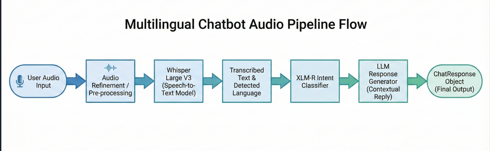
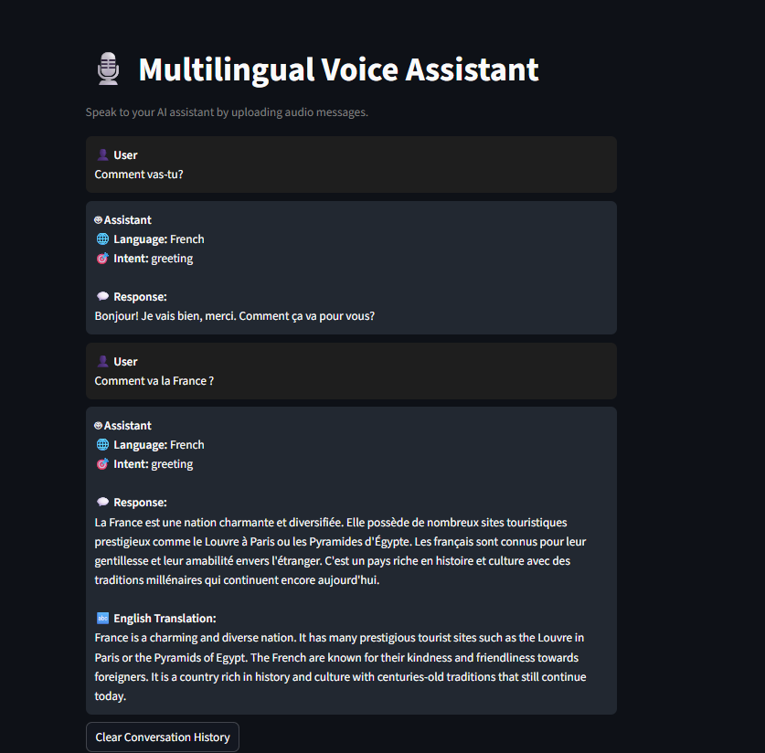

# Whisper Large V3 Multilingual Customer Support Chatbot

This repository implements the **core engine** of a multilingual customer support chatbot.  

The system is built around four main capabilities:

1. **Robust audio loading & preprocessing** (for user voice messages)  
2. **Speech transcription** using a Whisper model  
3. **Multilingual intent classification** using XLM-R  
4. **Multilingual response generation** using Qwen

All of that logic lives in **core Python modules under `src/utils/`**.  
Assignment files like `XYZ.API.md`, `XYZ.API.ipynb`, `XYZ.example.md`, `XYZ.example.ipynb`, and `XYZ_utils.py` are **just thin wrappers**: they import these modules and demonstrate how to use them. The README below focuses on the *real* implementation.

---

## Core Architecture

At a high level, the system implements this pipeline:

1. **Audio ingestion**
   - Load a user audio file (e.g. `.wav`, `.mp3`) from disk.
   - Convert to a mono waveform at 16 kHz to provide high quaity audio files

2. **Transcription (Whisper)**
   - Feed the waveform into a Whisper model.
   - Get back **text + detected language code**.
   

3. **Intent classification (XLM-R)**
   - Take the transcribed text.
   - Use an XLM-R–based zero-shot classifier to decide which **intent label** best matches the text.

4. **Response generation (Qwen)**
   - Use an LLM (Qwen2.5-1.5B-Instruct) to:
     - Generate a response **in the user’s language** for all other languages.
     - Generate a reponse in english for a better understanding acts like subtitlte
     

This pipeline is typically orchestrated in a higher-level component (e.g. `MultilingualChatbot` in `src/app/main_pipeline.py`), which wires together the utility modules described below.

---

## Core Modules

### 1. `src/utils/audio_utils.py` – Audio Loading

The `load_audio(path, max_duration_sec=60)` function is responsible for **robustly loading audio** and preparing it for Whisper. It:


- Loads audio using `soundfile` as 32-bit float  
- Resamples to **16 kHz** using `torchaudio.functional.resample` if the original sample rate differs  

It returns:

- `waveform` – a NumPy `float32` array  
- `sample_rate` – always `16000` Hz, ready for Whisper

This module encapsulates all the “messy” audio handling so the rest of the code can assume a clean auido

---

### 2. `src/utils/transcription_utils.py` – Whisper Transcription

The `transcription_utils` module defines `transcribe_audio(whisper_model, audio_waveform, language=None)`, which handles **speech-to-text** using a Whisper model :contentReference[oaicite:2]{index=2}.

Key behaviors:

- Ensures the input is a NumPy `float32` array  
- Detects almost-silent audio and returns an empty transcription with a fallback language (`"unknown"` or the provided `language`) instead of crashing Whisper :contentReference[oaicite:3]{index=3}  
- Uses **GPU if available** (`device = "cuda" if torch.cuda.is_available() else "cpu"`) and moves the Whisper model to that device  
- Supports an optional `language` parameter to **force** a language; otherwise Whisper’s auto-detection is used  
- Cleans up the result:
  - Strips whitespace from `text`  
  - Normalizes the `language` code to lowercase and trims it  
- Performs **garbage collection** and empties CUDA cache to avoid memory issues on 4–8 GB systems :contentReference[oaicite:4]{index=4}  

The function returns a dictionary with:

```python
{
    "text": "<transcribed text>",
    "language": "<lang_code or 'unknown'>"
}
````

---

### 3. `src/utils/intent_utils.py` – Intent Classification (XLM-R)

The `IntentClassifier` class implements **zero-shot multilingual intent detection** using **XLM-RoBERTa Large** fine-tuned on XNLI .

On initialization, it:

* Loads the model `joeddav/xlm-roberta-large-xnli` from Hugging Face
* Creates a tokenizer and a sequence classification model for that checkpoint 
* Defines a configurable list of **intent labels** along with the pre-trained model label list such as:

  * `greeting`, `goodbye`, `help_request`, `order_issue`, `refund_request`,
  * `device_control`, `search_query`, `chit_chat`, `general_question`,
  * `product_question`, `math_question`, `translation_request`,
  * `travel_information`, `medical_information`, `technical_support`,
  * `programming_help`, `task_management` 

The main method `predict_intent(text: str) -> str`:

* Returns `"help_request"` for empty text (defensive default)
* For each label, constructs a **natural language hypothesis**:
  `"This text is about {label}."`
* Runs the text + hypothesis pair through the XNLI model and looks at the **entailment probability** (index 2 in the softmax output, since XNLI uses `[contradiction, neutral, entailment]`)
* Chooses the label with the highest entailment score as the predicted intent 

This design turns the XNLI model into a flexible **zero-shot classifier** that can easily be extended by adding new labels to the list.

---

### 4. `src/utils/response_utils.py` – Multilingual Response Generation (Qwen)

The `ResponseGenerator` class is a **multilingual response engine** built on top of **Qwen/Qwen2.5-1.5B-Instruct** .

On initialization:

* Loads the tokenizer and model using `AutoTokenizer` and `AutoModelForCausalLM` with `trust_remote_code=True`
* Defines a `lang_map` dictionary mapping common ISO language codes (`"en"`, `"de"`, `"es"`, `"fr"`, `"hi"`, `"zh"`, etc.) to human-readable language names 

The main method `generate(text: str, lang_code: str | None)` has **two modes**:

1. **Pure English translation mode (`lang_code == "en"`)**

   * Builds a prompt that asks Qwen to *only* produce a **clean English translation** of the input text:

2. **Same-language reply mode (all other languages)**

   * If `lang_code` is recognized, it asks Qwen to:

     * Reply **only in that language**
     * Write clearly and naturally

Generation details:

* Tokenizes the prompt and moves tensors to the model’s device
* Calls `model.generate` with:

  * `max_new_tokens=180`, `temperature=0.3`, `top_p=0.7`, `do_sample=True`, `repetition_penalty=1.15`
* Decodes and cleans the output:

  * Strips the prompt back out from the generated text
  * Extra cleanup specifically for translation mode (remove “English translation:” prefixes, etc.)

This module is where the **“respond in the same language”** logic is enforced.

---

## Setup & Dependencies

All Python dependencies are listed in `requirements.txt`:

```txt
transformers>=4.40.0
accelerate
sentencepiece
openai-whisper
soundfile
huggingface-hub
numpy
torchaudio
streamlit
````

---

## Environment Setup (Docker)

The project is intended to run inside Docker using `docker-compose.yml`:
Here is a snippet of the code

```yaml
version: "3.9"

services:
  chatbot:
    build: .
    container_name: multilingual_chatbot
    working_dir: /app

    # Mount the entire project folder into /app
    volumes:
      - .:/ap
```

### Steps to Run

1. **Go to the project root** (where `Dockerfile` and `docker-compose.yml` live):

   ```bash
   cd /path/to/TutorTask40_Fall2025_Whisper_Large_V3_Multilingual_Customer_Support_Chatbot
   ```

2. **Build the Docker image**:

   ```bash
   docker build -t multilingual_chatbot .
   ```

3. **Start the `chatbot` service via docker-compose**:

   ```bash
   docker compose up -d chatbot
   ```

4. **Attach to the running container and go to `/app`**:

   ```bash
   docker exec -it multilingual_chatbot bash
   cd /app
   ```

5. **(Optional) Start Jupyter Lab on port 8888**:

   ```bash
   jupyter lab --ip 0.0.0.0 --port 8888 --no-browser --allow-root
   ```

   Then open the printed URL (or `http://localhost:8888`) in your browser.

6. **Run the Streamlit app from the container**:

   ```bash
   streamlit run streamlit_app.py --server.port 8501 --server.address 0.0.0.0
   ```

   If port `8501` is exposed in `docker-compose.yml` (e.g., `- "8501:8501"`), you can open the UI at:

   ```text
   http://localhost:8501
   ```
## Data Collection

Audio samples for testing are taken online from the **Hugging Face Common Voice** dataset (and any user-provided audio files).

---

## Pipeline

> Audio/Text → Transcription (Whisper) → Intent (XLM-R) → Response (LLM)




### Core Files 

- `src/app/main_pipeline.py` – Orchestrates the full chatbot pipeline for text and audio requests.  
- `src/utils/audio_utils.py` – Loads and preprocesses audio into a Whisper-ready waveform.  
- `src/utils/transcription_utils.py` – Runs Whisper to transcribe audio and detect language.  
- `src/utils/intent_utils.py` – Uses a multilingual model (XLM-R) to classify user intent.  
- `src/utils/response_utils.py` – Uses an LLM (Qwen) to generate responses in the user’s language.  
- `streamlit_app.py` – Launches the Streamlit web UI that calls the chatbot API.  
- `requirements.txt` – Lists all Python dependencies for the project.  
- `Dockerfile` – Builds the Docker image containing the chatbot environment.  
- `docker-compose.yml` – Defines the `chatbot` service, volumes, ports, and GPU settings.

### Multilingual Chat Experience, UI & Core Capabilities

The multilingual customer support chatbot provides an **end-to-end conversational experience** that works seamlessly across languages and input types. Customers can **speak** or **type** their queries, and the system will transcribe, understand, and respond appropriately. Under the hood, it combines Whisper Large V3 for speech-to-text, a multilingual intent classifier to understand what the user wants, and an LLM-based responder to generate clear, helpful answers in the customer’s own language.

The frontend is built with **Streamlit**, which provides a simple, reactive web UI on top of the core Python pipeline. Streamlit is used here because it lets us:

* Turn Python scripts into a clean web app with **minimal boilerplate**,
* Quickly wire UI elements (file upload, text input, buttons, chat layout) into the backend logic,
* Run everything in the **same environment** as the models (no separate frontend stack)
  



The interface is designed to feel like a modern support chat window: it keeps track of the **full chat history**, offers an **English translation view** for easier review, and includes a **“Clear chat”** option so users can reset the conversation. Clearing the chat not only gives a fresh session but also helps with **better memory handling**, avoiding very long conversations that can slow things down.

**Key capabilities:**

* **Multimodal input** – accepts both **voice messages** (audio upload) and **typed text** via the Streamlit UI.
* **Multilingual support** – handles multiple languages end-to-end (speech → intent → response).
* **Whisper-based transcription** – uses **Whisper Large V3** to convert audio into text and detect the spoken language.
* **Intent understanding** – uses a multilingual transformer-based classifier to infer user intents (e.g., order issues, refunds, general questions).
* **LLM-powered responses** – generates concise, context-aware replies using an LLM, aiming to respond in the **same language as the user**.
* **English translation view** – provides an **English translation** of messages/responses to make evaluation and debugging easier.
* **Conversation history** – displays the full chat history so users can see how the conversation evolves over multiple turns.
* **Clear chat for better memory handling** – includes a one-click **“Clear chat history”** button that resets the session and helps keep the system’s memory footprint under control.


