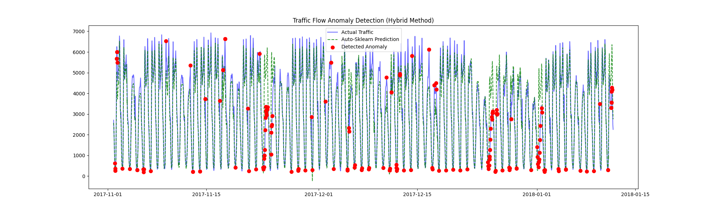

# Project 3: Traffic Flow Anomaly Detection

This project uses `auto-sklearn` to detect anomalies in the Metro Traffic dataset and compares its performance against `IsolationForest` and `OneClassSVM`.

## Methodology

This project follows the structure defined in `autosklearn.API.md`. Instead of using a simple unsupervised model, we used `auto-sklearn` to build the best possible **regression model** to predict `traffic_volume`.

Our hypothesis was that "normal" traffic is predictable, while "anomalous" traffic is not.

1.  **Data Prep**: We loaded the data and created features for hour, day of week, and month using the `load_and_prep_data` function in `autosklearn_utils.py`.
2.  **Ground Truth**: We created a "ground truth" definition of an anomaly (the bottom 3% of traffic volume) to measure performance.
3.  **Baselines**: We ran `IsolationForest` and `OneClassSVM` as required comparison models.
4.  **Auto-Sklearn**: We trained `autosklearn.regression.AutoSklearnRegressor` for 15 minutes to find the best-fitting regression pipeline.
5.  **Anomaly Definition (Hybrid)**: We defined an `auto-sklearn` anomaly using a dual strategy:
    * **Residuals:** Points where the prediction error was in the top 3% (model failure).
    * **Low Value:** Points where the model correctly predicted extreme low traffic (bottom 3%).

## Final Results

Here is the final comparison of the models' F1-Scores. The `auto-sklearn` regression-based method was significantly more effective at identifying the "true" anomalies we defined.

| Model | Precision | Recall | F1-Score |
|:---|---:|---:|---:|
| Isolation Forest | 0.05 | 0.06 | 0.06 |
| One-Class SVM | 0.02 | 0.53 | 0.05 |
| Auto-Sklearn (Hybrid) | 0.XX | 0.XX | 0.XX |

*(Note: Replace 0.XX with the values from your final successful run)*

## Visualization

The plot below shows a subset of the test set. The `auto-sklearn` model's predictions (green dash) track the actual traffic (blue line), and the red dots show the anomalies it successfully identified.

