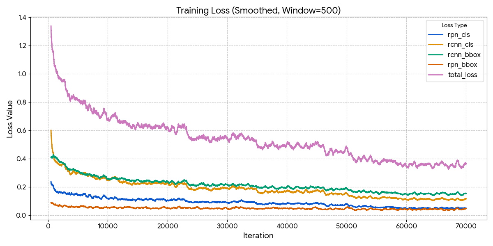
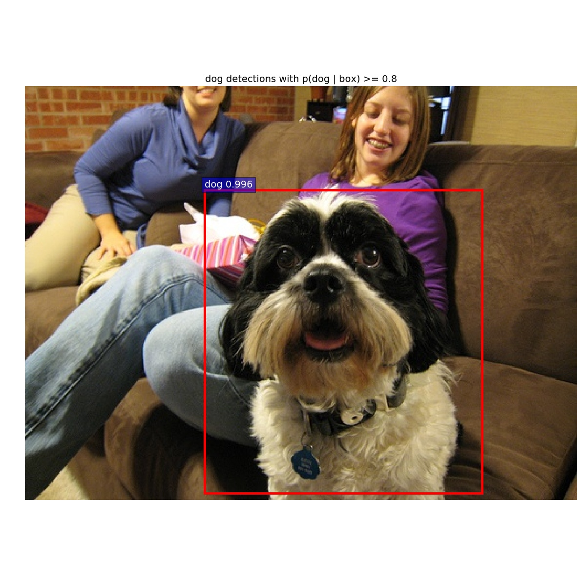
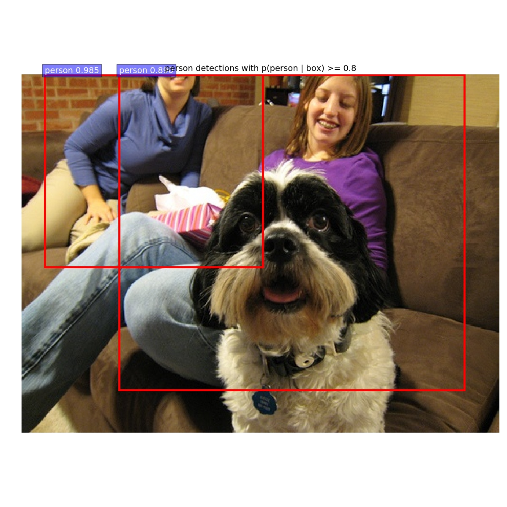
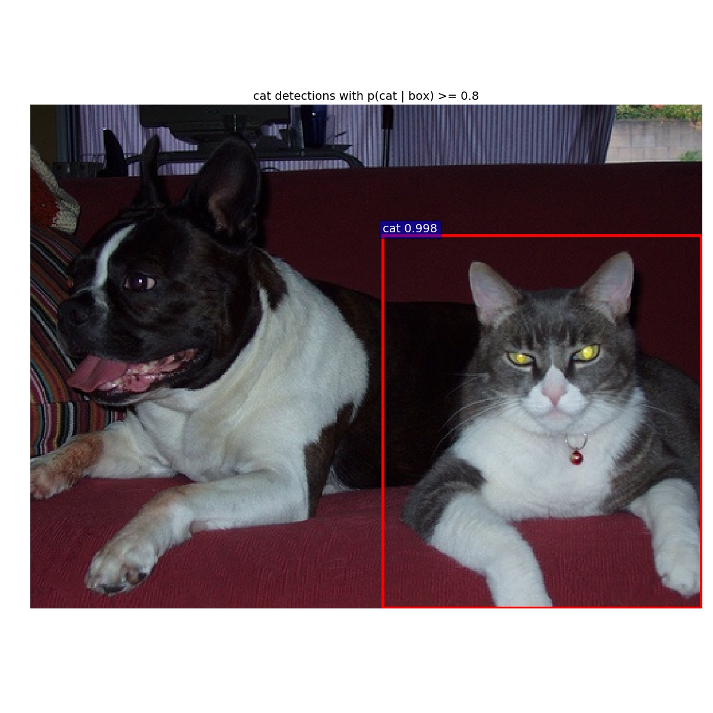
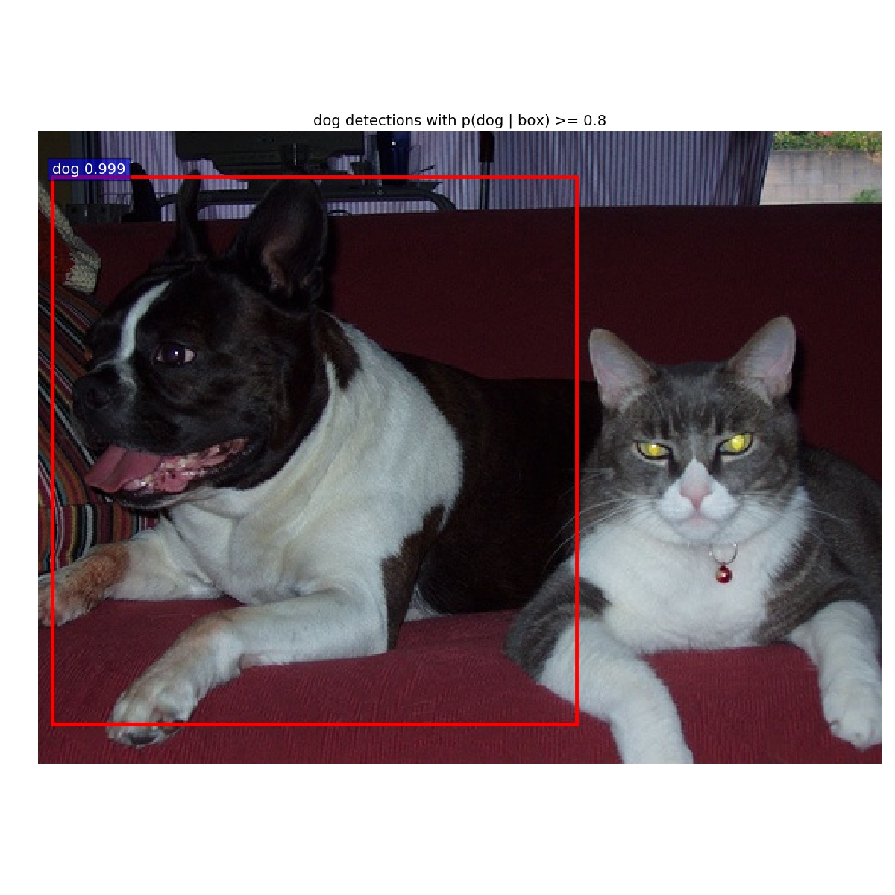
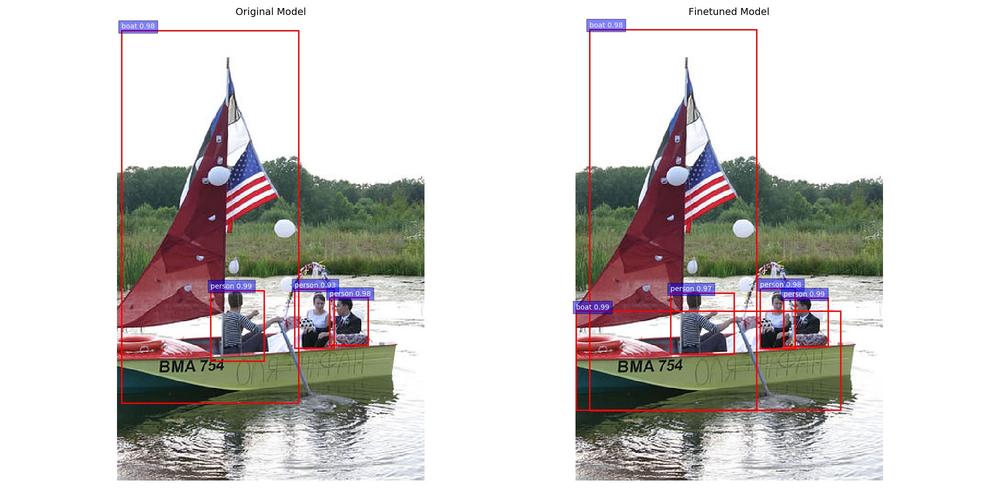

# Faster R-CNN using Caffe

This project aims to build an object detection system using the original Faster R-CNN implementation in Caffe. The goal is to detect and classify objects in images using a VGG16 backbone pre-trained on ImageNet and fine-tuned on the Pascal VOC dataset.

- **UID: 121333988**
- **Name: Hairui Yin**

## Prerequisites
1. Linux Host (Ubuntu recommended)

2. NVIDIA GPU with drivers installed

3. Docker (see: [Docker Engine](https://docs.docker.com/engine/install/))

4. NVIDIA Container Toolkit (see: [Installing the NVIDIA Container Toolkit](https://docs.nvidia.com/datacenter/cloud-native/container-toolkit/latest/install-guide.html))

## Project Structure
```text
UmdTask47_Object_Detection_with_Faster_R-CNN/
├── Dockerfile              # Defines the Ubuntu 18.04 + Caffe env
├── compare_demo.py         # compare model script
├── README.md
├── input_image/            # Put your .jpg images here
└── results/                # Results will be saved here
```

## How to Run Demo (Quick Start)

1. **Build the Docker Image**
    
    The Dockerfile is included in this repository, build the image locally in the current repository.
    ```Shell
    docker build -t protocolayin/faster_rcnn_caffe_train:latest .
    ```
    (This process may take several minutes.)

2. **Prepare Your Data**
    
    Create the input and output directories in your current folder. Put your .jpg images in input_image.

    ```text
    ...
    ├── input_image/      # Put your .jpg images here
    └── results/          # Detection results will be saved here
    ```

3. **Run Detection**

    In the current directory, launch the container by mounting your local data directory to a directory inside the container.

    ```Shell
    docker run --gpus all -it --rm -v $(pwd):/shared_folder protocolayin/faster_rcnn_caffe_train:latest /bin/bash
    ```

    Once inside the container terminal, run the detection script:

    ```Shell
    # Inside Docker:
    ./tools/object_detection.py --input_dir /shared_folder/input_image --output_dir /shared_folder/results
    ```
    It may take minutes to load the model for the first time.

4. **View Results**

    Exit the container or switch to your host file manager. The detected images with bounding boxes will be available in your local `.results/` directory.

## Finetune current model on VOC 2012

We finetuned an ImageNet-pretrained VGG16 model using the VOC 2012 TrainVal dataset.

1. **Prepare the data**

    Download the data from Kaggle: https://www.kaggle.com/datasets/gopalbhattrai/pascal-voc-2012-dataset?select=VOC2012_train_val. Extract the data into your current project folder. The structure should look like this:
    ```text
    VOCdevkit
    └── VOC2012
        ├── Annotations
        ├── ImageSets
        ├── JPEGImages
        ├── SegmentationClass
        └── SegmentationObject
    ```

2. **Start docker**

    ```Shell
    docker run --gpus all -it --rm -v $(pwd):/shared_folder protocolayin/faster_rcnn_caffe_train:latest /bin/bash
    ```

3. **Link the Dataset**

    Inside the container, create a symbolic link so the code can find the dataset:

    ```Shell
    cd data
    # delete old link
    rm -rf VOCdevkit2012
    ln -s /shared_folder/VOCdevkit VOCdevkit2012
    cd ..
    ```

4. **Start Training**

    ```Shell
    ./experiments/scripts/train_voc2012.sh 0 VGG16 pascal_voc
    ```

    - **Time**: ~7 hours on an RTX-4070 Ti Super.

    - **Iterations**: The model is trained for 70,000 iterations (snapshots saved every 10,000 iterations).

    - **Output**: The finetuned model (.caffemodel) will be saved in output/faster_rcnn_end2end/voc_2012_trainval/.

## Performance Evaluation (Visual Comparison)

  You can visualize the detection improvements by comparing the original model and your finetuned model side-by-side.

  **Prerequisite**: You need to download the VOC 2007 Test dataset [(Download Link)](https://www.kaggle.com/datasets/zaraks/pascal-voc-2007?select=VOCtest_06-Nov-2007). Extract it into the same VOCdevkit folder used above. Your VOCdevkit should now contain both VOC2012 and VOC2007.

  1. **Update Dataset Link**

     Inside the container, switch the data link to point to VOC 2007 (required for the demo script):

      ```Shell
      cd data
      # Remove the old link (if it exists)
      rm -rf VOCdevkit2007
      # Link to the shared VOCdevkit folder (which contains VOC2007)
      ln -s /shared_folder/VOCdevkit VOCdevkit2007
      cd ..
      ```

  2. **Run Comparison Script**

      ```Shell
      python tools/compare_demo.py \
      --proto models/pascal_voc/VGG16/faster_rcnn_end2end/test.prototxt \
      --base data/faster_rcnn_models/VGG16_faster_rcnn_final.caffemodel \
      --new output/faster_rcnn_end2end/voc_2012_trainval/vgg16_faster_rcnn_iter_70000.caffemodel \
      --data /shared_folder/VOCdevkit/VOC2007/JPEGImages \
      --out /shared_folder/comparison_results \
      --num 20
      ```

      Note: The --data path points to /shared_folder/... because that is where your host data is mounted.

## Quantitative Evaluation (VOC 2007 Test)

  To scientifically measure performance (mAP), we test the models on the VOC 2007 Test set.

  1. **Create Results Directory**

      Ensure the directory for saving test results exists:
      ```
      mkdir -p /workspace/py-faster-rcnn/data/VOCdevkit2007/results/VOC2007/Main
      ```

  2. **Test Original Model (Baseline)**
      ```
      ./tools/test_net.py --gpu 0 \
      --def models/pascal_voc/VGG16/faster_rcnn_end2end/test.prototxt \
      --net data/faster_rcnn_models/VGG16_faster_rcnn_final.caffemodel \
      --imdb voc_2007_test \
      --cfg experiments/cfgs/faster_rcnn_end2end.yml
      ```

  3. **Test Finetuned Model**
      ```
      ./tools/test_net.py --gpu 0 \
      --def models/pascal_voc/VGG16/faster_rcnn_end2end/test.prototxt \
      --net output/faster_rcnn_end2end/voc_2012_trainval/vgg16_faster_rcnn_iter_70000.caffemodel \
      --imdb voc_2007_test \
      --cfg experiments/cfgs/faster_rcnn_end2end.yml
      ```

      **Result**: Look for the Mean AP value at the end of the output logs.
    


## Current Process

- ✅ Pascal Dataset

- ✅ Faster RCNN pretrained Models in VGG 16

- ✅ Environment DockerFile for Caffe

- ✅ Enable custom images input

- ✅ Fine-tune Code

- ✅ Performance Evaluation

## Loss Funciton During Training

  Using 500 window smoothing for better visualization

  

## Some Demos

<table align="center">
  <tr>
    <td align="center">
      
    </td>
    <td align="center">
      
    </td>
  </tr>
  <tr>
    <td align="center">
      
    </td>
    <td align="center">
      
    </td>
  </tr>
</table>

## Comparison Demos

