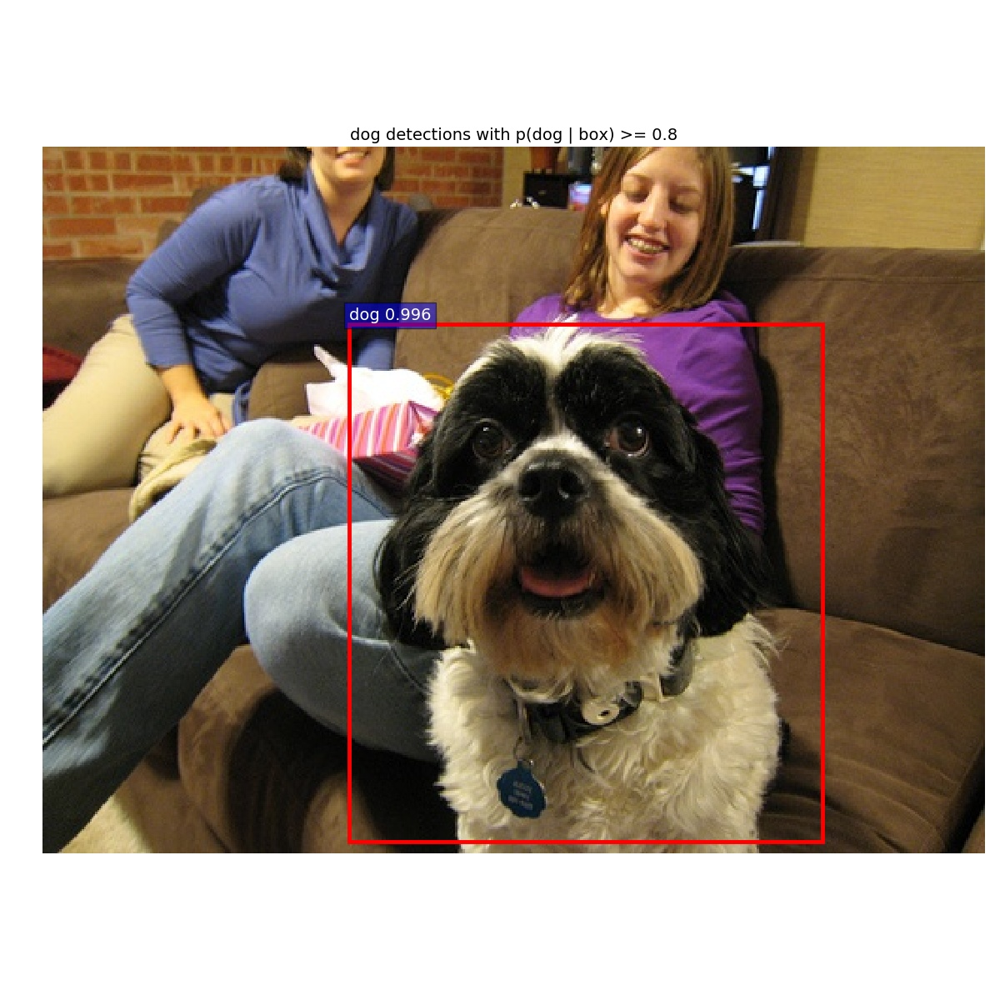
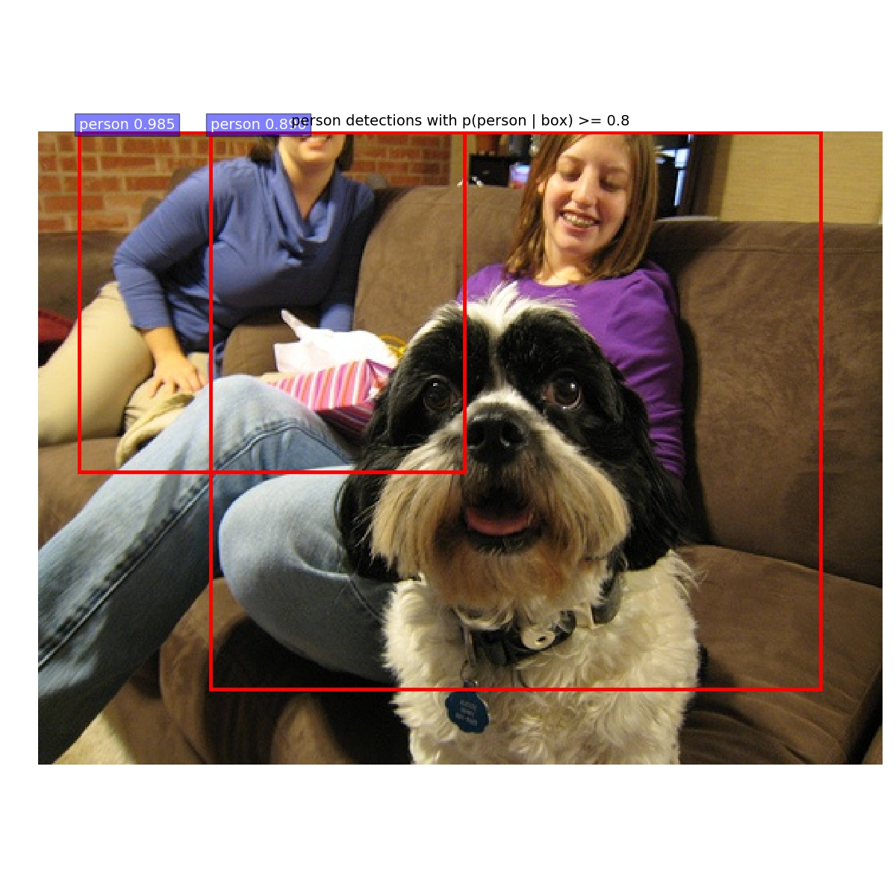
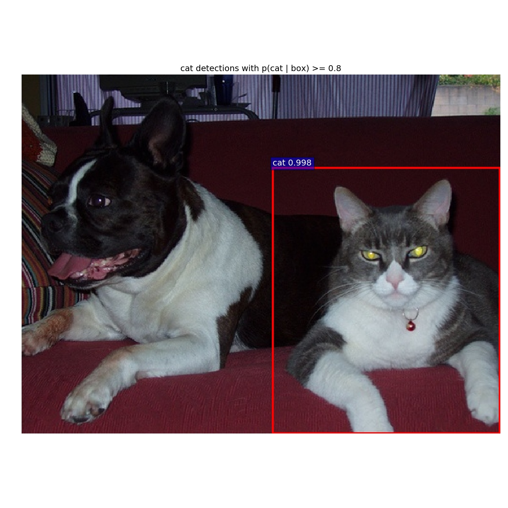
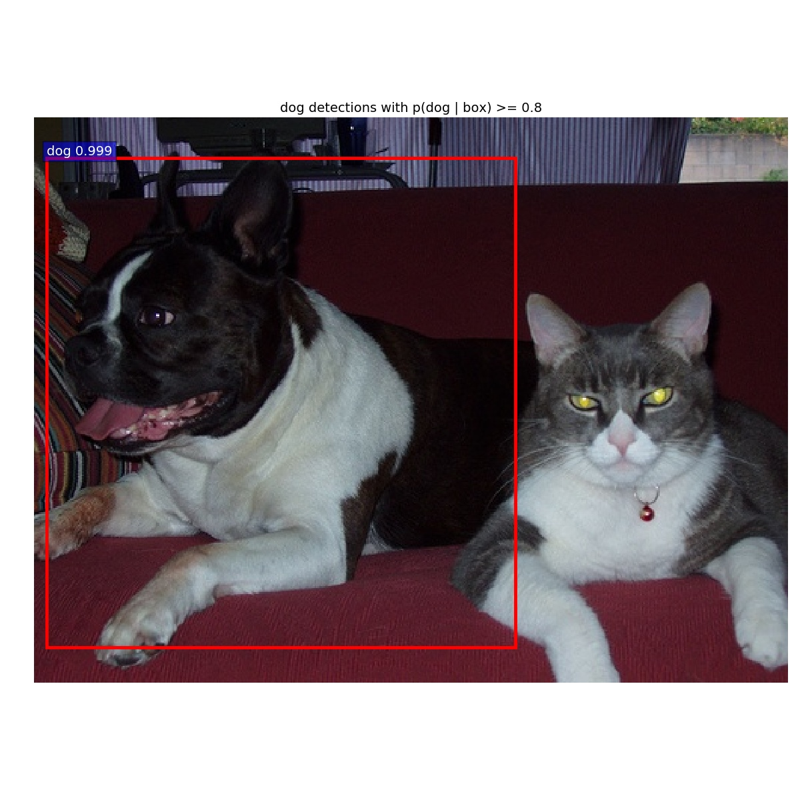

# Faster R-CNN using Caffe

This project aims to build an object detection system using the original Faster R-CNN implementation in Caffe. The goal is to detect and classify objects in images using a VGG16 backbone pre-trained on ImageNet and fine-tuned on the Pascal VOC dataset.

## Prerequisites
1. Linux Host (Ubuntu recommended)

2. NVIDIA GPU with drivers installed

3. Docker (see: [Docker Engine](https://docs.docker.com/engine/install/))

4. NVIDIA Container Toolkit (see: [Installing the NVIDIA Container Toolkit](https://docs.nvidia.com/datacenter/cloud-native/container-toolkit/latest/install-guide.html))

## Project Structure
```text
UmdTask47_Object_Detection_with_Faster_R-CNN/
├── Dockerfile              # Defines the Ubuntu 18.04 + Caffe env
├── Makefile.config         # Patched Caffe configuration
├── object_detection.py     # Custom inference script
├── README.md
├── input_image/      # Put your .jpg images here
└── results/     # Results will be saved here
```

## How to Run (Quick Start)

1. **Build the Docker Image**
    
    In the current directory, run
    ```Shell
    docker build -t faster-rcnn .
    ```
    This process may take several minutes.

2. **Prepare Your Data**
    
    Put your `.jpg` images in ./input. Some images have been placed as examples.

    ```text
    ...
    ├── input_image/      # Put your .jpg images here
    └── results/     # Results will be saved here
    ```

3. **Run Detection**

    In the current directory, launch the container by mounting your local data directory to a directory inside the container.

    ```Shell
    docker run --gpus all -it --rm -v $(pwd):/shared_folder faster-rcnn /bin/bash
    ```

    Once inside the container terminal, run the detection script:

    ```Shell
    # Inside Docker:
    ./tools/object_detection.py --input_dir /shared_folder/input_image --output_dir /shared_folder/results
    ```
    It may take one minute to load the model for the first time.

4. **View Results**

    Exit the container or switch to your host file manager. The detected images with bounding boxes will be available in your local `.results/` directory.

## Current Process

- ✅ Pascal Dataset

- ✅ Faster RCNN pretrained Models in VGG 16

- ✅ Environment DockerFile for Caffe

- ✅ Enable custom images input

- 🚧 Fine-tune Code

- 🚧 Performance Evaluation

## Some Demos

<!DOCTYPE html>
<html lang="en">
<head>
    <meta charset="UTF-8">
    <style>
        .image-grid {
            display: flex;
            justify-content: center;
            flex-wrap: wrap;
            gap: 20px;
            margin: 20px 0;
        }
        .image-grid img {
            width: 48%; 
            height: auto; 
            object-fit: contain;
        }
    </style>
</head>
<body>
    <div class="image-grid">
        
        
        
        
    </div>
</body>
</html>