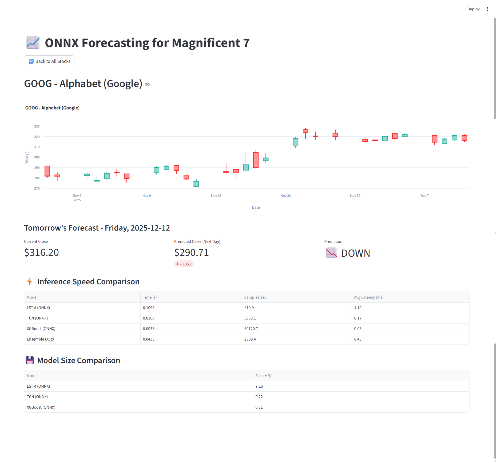

# ONNX Time Series Forecasting of Stock Prices

This project implements an ensemble-based time series forecasting system for live stock prices using ONNX Runtime. It features multiple deep learning models (LSTM, TCN, XGBoost) trained using multiple frameworks (TensorFlow/Keras, PyTorch/DARTS, sklearn/xgboost) converted to ONNX for fast inference and includes an interactive Streamlit dashboard for visualization.



## Project Files

### API Documentation and Examples

`onnx_forecasting.API.ipynb`: A notebook describing the ONNX forecasting API and core functionality

`onnx_forecasting.API.md`: Markdown documentation of the ONNX forecasting API

`onnx_forecasting.example.ipynb`: A notebook implementing the complete stock price forecasting project

`onnx_forecasting.example.md`: Markdown description of the forecasting project implementation

### Core Application Files

`streamlit_dashboard.py`: Interactive Streamlit dashboard for visualizing stock predictions and model performance

`onnx_forecasting_utils.py`: Utility functions for ONNX model operations and inference

`preprocessing.py`: Data preprocessing utilities for time series data

`model.py`: Model architecture definitions for LSTM, TCN, and XGBoost

`evaluation.py`: Model evaluation and performance metrics

`utils.py`: General utility functions

### Ensemble Pipeline

`ensemble/01_preprocess_data.py`: Data preprocessing and feature engineering

`ensemble/02_train_lstm.py`: LSTM model training and ONNX conversion

`ensemble/03_train_tcn.py`: TCN model training and ONNX conversion

`ensemble/04_train_xgboost.py`: XGBoost model training and ONNX conversion

`ensemble/05_ensemble_analysis.py`: Ensemble predictions and performance analysis

## Run Instructions

### Navigate to Project Directory

```bash
cd class_project/MSML610/Fall2025/Projects/UmdTask55_Fall2025_ONNX_Time_Series_Forecasting_of_Stock_Prices
```

### Setup Data

Download the stock price dataset from Kaggle and extract it to the data folder:

```bash
curl -L -o ~/price-volume-data-for-all-us-stocks-etfs.zip \
  https://www.kaggle.com/api/v1/datasets/download/borismarjanovic/price-volume-data-for-all-us-stocks-etfs

unzip ~/price-volume-data-for-all-us-stocks-etfs.zip -d data/
```

### 1. Build the Container

```bash
./docker_build.sh
```

### 2. Start Jupyter Notebook

```bash
./docker_jupyter.sh
```

**Open in browser:**
- Go to http://localhost:8888 in your web browser
- The Jupyter notebook will open in the project path

### 2. Train the Ensemble Models

```bash
./docker_ensemble.sh
```

This script runs the complete ensemble pipeline in sequence:
1. Data preprocessing
2. LSTM model training
3. TCN model training
4. XGBoost model training
5. Ensemble analysis

The trained models are converted to ONNX format and saved in the `ensemble/` directory.

### 3. Launch the Streamlit Dashboard

```bash
./docker_streamlit.sh
```

**Open in browser:**
- Go to http://localhost:8501 in your web browser
- The dashboard displays:
  - Stock price forecasts for Magnificent 7 stocks
  - Tomorrow's predictions with trend indicators
  - Inference speed comparison across models
  - Model size comparison

**Optional**: Specify a custom port
```bash
./docker_streamlit.sh -p 8502
```
