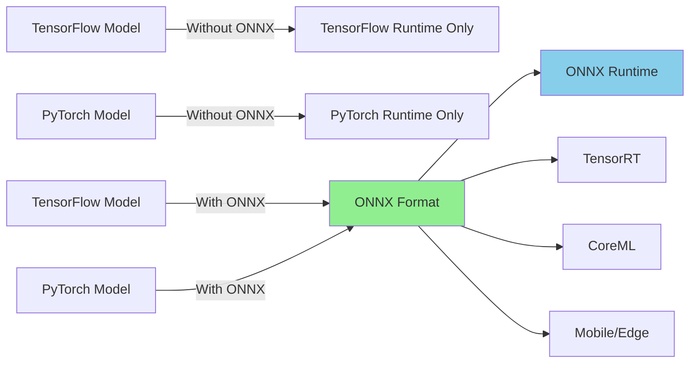
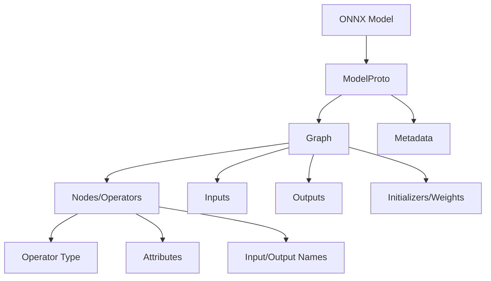
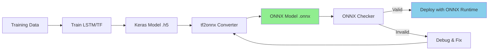
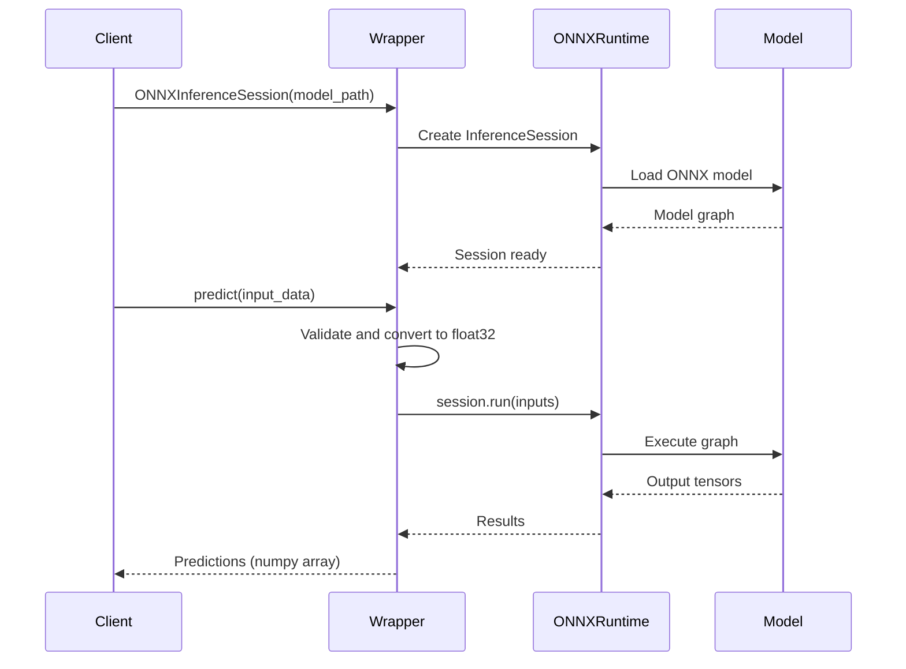
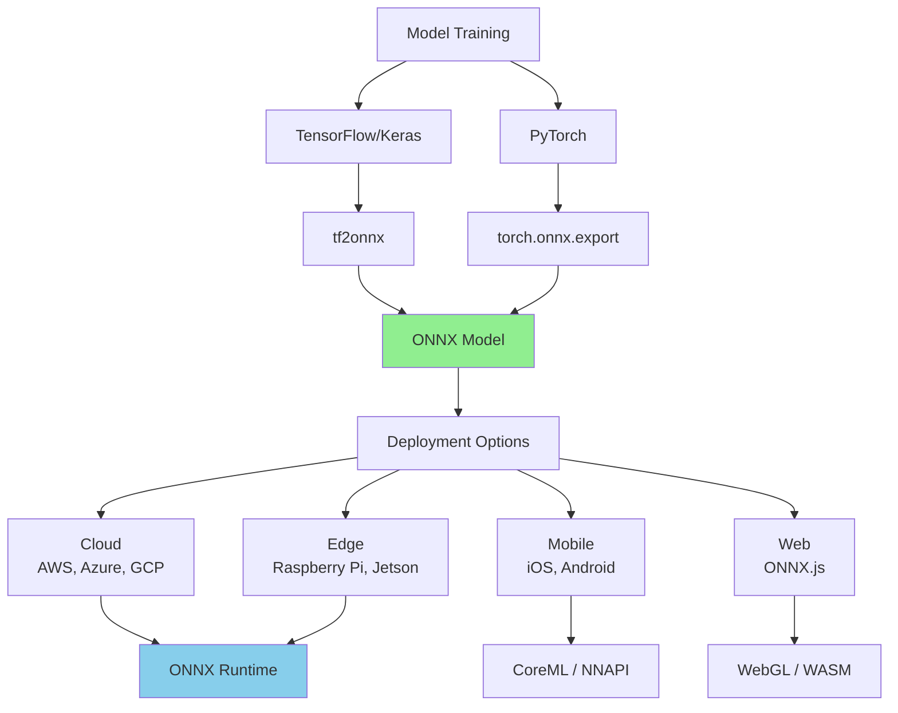

# ONNX Time Series Forecasting - API Documentation

## Table of Contents
1. [Introduction to ONNX](#introduction-to-onnx)
2. [Why ONNX for Time Series Forecasting?](#why-onnx-for-time-series-forecasting)
3. [ONNX Core Components](#onnx-core-components)
4. [ONNX Runtime API](#onnx-runtime-api)
5. [Custom Wrapper API](#custom-wrapper-api)
6. [Architecture Diagrams](#architecture-diagrams)
7. [API Reference](#api-reference)

---

## Introduction to ONNX

**ONNX (Open Neural Network Exchange)** is an open format designed to represent machine learning models. It enables interoperability between different AI frameworks, allowing models trained in one framework (e.g., TensorFlow, PyTorch) to be deployed in another.

### Key Features
- **Framework Interoperability**: Train in TensorFlow/PyTorch, deploy anywhere
- **Hardware Optimization**: Optimized runtimes for CPU, GPU, and edge devices
- **Production Ready**: Enterprise-grade inference performance
- **Vendor Neutral**: Open-source and community-driven

### The Problem ONNX Solves



---

## Why ONNX for Time Series Forecasting?

### 1. **Cross-Framework Compatibility**
Train LSTM/Transformer models in TensorFlow or PyTorch, deploy with ONNX Runtime for consistent inference across platforms.

### 2. **Performance Optimization**
ONNX Runtime provides:
- **Graph Optimizations**: Operator fusion, constant folding
- **Hardware Acceleration**: CPU (AVX, SSE), GPU (CUDA, ROCm), specialized accelerators
- **Memory Efficiency**: Reduced memory footprint

### 3. **Production Deployment**
- Simplified deployment pipeline
- Consistent inference API
- Lower latency and higher throughput
- Smaller model footprint

### 4. **Model Versioning**
- Standardized model format
- Version control friendly
- Easy model updates without code changes

---

## ONNX Core Components

### ONNX Model Structure



### Key Classes

#### 1. **ModelProto**
The top-level container for an ONNX model.

```python
import onnx

model = onnx.load("model.onnx")
print(f"IR Version: {model.ir_version}")
print(f"Producer: {model.producer_name}")
print(f"Opset Version: {model.opset_import[0].version}")
```

#### 2. **Graph**
Defines the computational graph.

```python
graph = model.graph
print(f"Nodes: {len(graph.node)}")
print(f"Inputs: {[input.name for input in graph.input]}")
print(f"Outputs: {[output.name for output in graph.output]}")
```

#### 3. **Nodes**
Individual operations in the graph (e.g., LSTM, Dense, Activation).

```python
for node in graph.node:
    print(f"Op: {node.op_type}, Inputs: {node.input}, Outputs: {node.output}")
```

---

## ONNX Runtime API

### Core API Components

#### 1. **InferenceSession**
The main interface for model inference.

```python
import onnxruntime as ort

session = ort.InferenceSession("model.onnx")
```

**Constructor Parameters:**
- `path_or_bytes`: Model file path or bytes
- `providers`: Execution providers (CPUExecutionProvider, CUDAExecutionProvider)
- `sess_options`: Session configuration

#### 2. **Session Configuration**

```python
sess_options = ort.SessionOptions()
sess_options.intra_op_num_threads = 4
sess_options.graph_optimization_level = ort.GraphOptimizationLevel.ORT_ENABLE_ALL

session = ort.InferenceSession("model.onnx", sess_options=sess_options)
```

**Optimization Levels:**
- `ORT_DISABLE_ALL`: No optimizations
- `ORT_ENABLE_BASIC`: Basic optimizations (default)
- `ORT_ENABLE_EXTENDED`: Extended optimizations
- `ORT_ENABLE_ALL`: All optimizations

#### 3. **Running Inference**

```python
input_name = session.get_inputs()[0].name
output_name = session.get_outputs()[0].name

outputs = session.run([output_name], {input_name: input_data})
predictions = outputs[0]
```

#### 4. **Execution Providers**

```python
providers = ['CUDAExecutionProvider', 'CPUExecutionProvider']
session = ort.InferenceSession("model.onnx", providers=providers)

print("Available providers:", ort.get_available_providers())
print("Active provider:", session.get_providers())
```

---

## Custom Wrapper API

We provide a high-level wrapper to simplify ONNX model conversion, verification, and inference.

### Design Principles

```python
from dataclasses import dataclass
from typing import Protocol, Dict, Any
import numpy as np

@dataclass
class ModelMetadata:
    """Metadata for ONNX models."""
    model_name: str
    version: str
    input_shape: tuple
    output_shape: tuple
    opset_version: int

class ONNXConverter(Protocol):
    """Protocol for model-to-ONNX converters."""
    def convert(self, model_path: str, onnx_path: str) -> str:
        """Convert model to ONNX format."""
        ...

class ONNXInference(Protocol):
    """Protocol for ONNX inference engines."""
    def predict(self, X: np.ndarray) -> np.ndarray:
        """Run inference on input data."""
        ...
```

### Wrapper Implementation

#### 1. **Model Conversion**

```python
def convert_to_onnx(model_path: str, onnx_path: str, opset: int = 13) -> str:
    """
    Convert Keras model to ONNX format.

    Args:
        model_path: Path to Keras model (.h5 or SavedModel)
        onnx_path: Path to save ONNX model
        opset: ONNX opset version (default: 13)

    Returns:
        Path to saved ONNX model

    Example:
        onnx_path = convert_to_onnx('lstm_model.h5', 'lstm_model.onnx')
    """
```

**Key Features:**
- Automatic input signature detection
- Opset version selection
- Error handling and validation

#### 2. **Model Verification**

```python
def verify_onnx(onnx_path: str) -> Dict[str, Any]:
    """
    Verify ONNX model integrity.

    Args:
        onnx_path: Path to ONNX model

    Returns:
        Verification results with:
        - is_valid: Boolean indicating model validity
        - error: Error message if invalid
        - opset_version: ONNX opset version
        - num_nodes: Number of nodes in graph

    Example:
        result = verify_onnx('model.onnx')
        if result['is_valid']:
            print(f"Valid ONNX model with {result['num_nodes']} nodes")
    """
```

#### 3. **Inference Session Wrapper**

```python
class ONNXInferenceSession:
    """
    High-level wrapper for ONNX Runtime inference.

    Attributes:
        model_path: Path to ONNX model
        session: ONNX Runtime session
        input_name: Name of input tensor
        output_name: Name of output tensor

    Example:
        session = ONNXInferenceSession('model.onnx')
        predictions = session.predict(test_data)
        print(f"Input shape: {session.get_input_shape()}")
    """

    def __init__(self, model_path: str):
        """Initialize session with model."""

    def predict(self, X: np.ndarray) -> np.ndarray:
        """Run inference."""

    def get_input_shape(self):
        """Get expected input shape."""

    def get_output_shape(self):
        """Get output shape."""
```

**Benefits:**
- Simplified API compared to raw ONNX Runtime
- Automatic input/output name handling
- Type conversion (numpy arrays)
- Error handling

#### 4. **Framework Comparison**

```python
def compare_frameworks_inference(
    keras_model_path: str,
    onnx_model_path: str,
    test_input: np.ndarray
) -> Dict[str, Any]:
    """
    Compare TensorFlow vs ONNX Runtime inference.

    Args:
        keras_model_path: Path to Keras model
        onnx_model_path: Path to ONNX model
        test_input: Test input array

    Returns:
        Comparison metrics:
        - tensorflow_time: TF inference time (seconds)
        - onnx_time: ONNX inference time (seconds)
        - speedup: Speed improvement factor
        - max_difference: Maximum numerical difference
        - mean_difference: Mean numerical difference
        - numerically_close: Boolean (within tolerance)

    Example:
        results = compare_frameworks_inference(
            'model.h5', 'model.onnx', test_data
        )
        print(f"ONNX speedup: {results['speedup']:.2f}x")
        print(f"Numerically equivalent: {results['numerically_close']}")
    """
```

---

## Architecture Diagrams

### ONNX Conversion Pipeline



### Inference Workflow



### Cross-Framework Deployment



---

## API Reference

### Conversion Functions

| Function | Purpose | Input | Output |
|----------|---------|-------|--------|
| `convert_to_onnx` | Convert Keras to ONNX | Model path, ONNX path, opset | ONNX path |
| `verify_onnx` | Validate ONNX model | ONNX path | Verification dict |

### Inference Classes

| Class | Methods | Purpose |
|-------|---------|---------|
| `ONNXInferenceSession` | `__init__`, `predict`, `get_input_shape`, `get_output_shape` | High-level inference |

### Comparison Functions

| Function | Purpose | Output Metrics |
|----------|---------|----------------|
| `compare_frameworks_inference` | Compare TF vs ONNX | Speed, accuracy, compatibility |

### Configuration Objects

```python
@dataclass
class ONNXConfig:
    """Configuration for ONNX conversion and inference."""
    opset_version: int = 13
    optimization_level: str = 'all'
    providers: List[str] = field(default_factory=lambda: ['CPUExecutionProvider'])
    intra_op_threads: int = 4
```

---

## Best Practices

### 1. **Opset Version Selection**
- Use opset 13+ for modern operators
- Check framework compatibility
- Verify target runtime support

### 2. **Model Validation**
- Always run `verify_onnx` after conversion
- Test numerical equivalence
- Validate input/output shapes

### 3. **Performance Optimization**
- Enable graph optimizations
- Use appropriate execution providers
- Batch inputs when possible
- Profile before and after conversion

### 4. **Error Handling**
```python
try:
    onnx_path = convert_to_onnx('model.h5', 'model.onnx')
    verification = verify_onnx(onnx_path)

    if not verification['is_valid']:
        raise ValueError(f"Invalid ONNX: {verification['error']}")

except Exception as e:
    print(f"Conversion failed: {e}")
```

---

## Alternatives to ONNX

| Tool | Pros | Cons | Use Case |
|------|------|------|----------|
| **TensorFlow Lite** | Mobile optimized, good TF support | TensorFlow-only | Mobile/embedded TF models |
| **TorchScript** | Native PyTorch, dynamic graphs | PyTorch-only | PyTorch production |
| **TensorRT** | Excellent GPU performance | NVIDIA-only | GPU inference |
| **CoreML** | iOS/macOS native | Apple-only | Apple ecosystem |
| **ONNX** | ✅ Framework agnostic, wide support | Learning curve | Cross-platform, production |

---

## References

1. **ONNX Official Documentation**: https://onnx.ai/
2. **ONNX Runtime**: https://onnxruntime.ai/
3. **tf2onnx**: https://github.com/onnx/tensorflow-onnx
4. **ONNX Model Zoo**: https://github.com/onnx/models
5. **ONNX Tutorials**: https://github.com/onnx/tutorials

---

## Quick Start

```python
# 1. Convert model
onnx_path = convert_to_onnx('lstm_model.h5', 'lstm_model.onnx')

# 2. Verify
result = verify_onnx(onnx_path)
print(f"Valid: {result['is_valid']}")

# 3. Run inference
session = ONNXInferenceSession(onnx_path)
predictions = session.predict(test_data)

# 4. Compare frameworks
comparison = compare_frameworks_inference(
    'lstm_model.h5', 'lstm_model.onnx', test_data
)
print(f"Speedup: {comparison['speedup']:.2f}x")
```

This API provides a clean, Pythonic interface for ONNX model conversion and inference, abstracting away low-level details while maintaining full control when needed.
