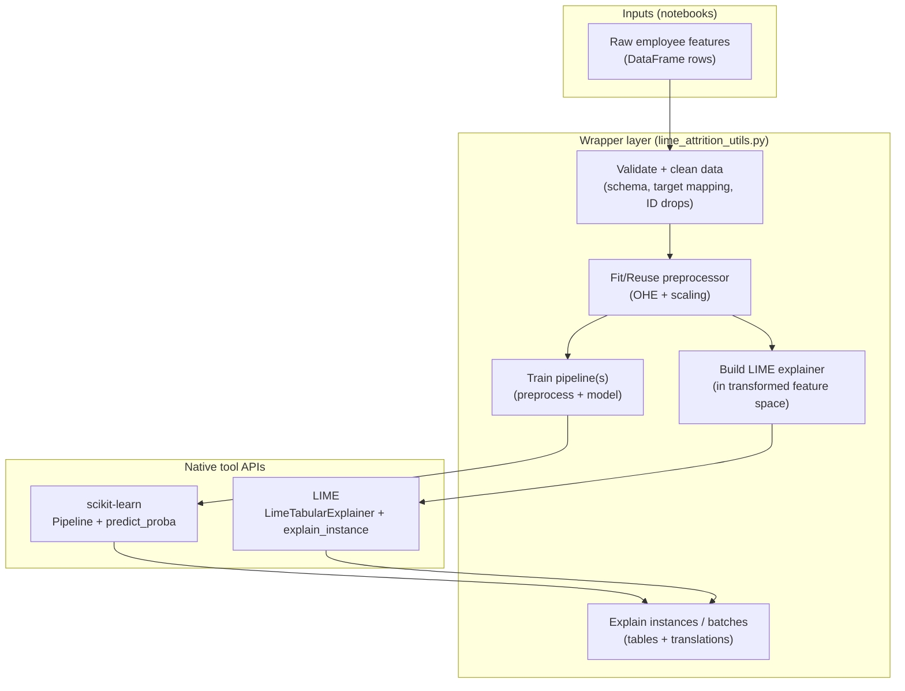

# lime_attrition.API.md

This document describes the **native programming interface** (API) of **LIME** for tabular classification and the **lightweight wrapper layer** implemented in `lime_attrition_utils.py` for the Employee Attrition Prediction project.

> Important: “API” here refers to the tool’s **internal interface** (LIME’s programming objects and our wrapper functions), not an external service API.

---

## 1. Overview of the project API

This project builds a binary **Employee Attrition Prediction** model and uses **LIME (Local Interpretable Model-agnostic Explanations)** to explain individual predictions.

There are two layers:

1. **Native LIME API (tool layer)**  
   LIME provides `LimeTabularExplainer` to generate local explanations for a trained model’s prediction.

2. **Wrapper layer**  
   `lime_attrition_utils.py` provides reusable functions for:
   - loading/cleaning the IBM HR Attrition dataset
   - preprocessing with `ColumnTransformer`
   - training one or more models (baseline + optional models)
   - evaluating metrics
   - building a LIME explainer in the correct feature space
   - generating single-employee and batch explanations
   - producing aggregated “top drivers” summaries

Related deliverables:
- `lime_attrition.API.ipynb`: minimal demo of native LIME + wrapper usage
- `lime_attrition.example.ipynb`: end-to-end application example (EDA → modeling → explanations → summary)
- `lime_attrition.example.md`: narrative write-up of the end-to-end application

---

## 2. What is LIME?

**LIME** explains a complex model’s prediction for **one specific input** by:
1. Creating perturbed samples near the input
2. Querying the model for predictions on those samples
3. Fitting a simple interpretable model (often sparse linear) locally
4. Reporting which features most influenced the prediction **for that one case**

Key idea:
- LIME is **local** (one case at a time)
- LIME is **model-agnostic** (needs only a prediction function)

---

## 3. Requirements

### Python / packages
- Python 3.10+
- Core runtime:
  - `numpy`, `pandas`
  - `scikit-learn`
  - `lime`
  - `matplotlib`

### Data
- IBM HR Attrition dataset CSV under `./data/`

### Optional dependencies
The wrapper can optionally train XGBoost/LightGBM models, but the API notebook ran using only scikit-learn models for maximum reproducibility.

---

## 4. Native LIME tabular API (tool interface)

This section documents the **native** objects and methods from LIME used in this project.

### 4.1 `lime.lime_tabular.LimeTabularExplainer`

**Purpose:** Creates an explainer for tabular data.

**Constructor (common parameters used):**
```python
from lime.lime_tabular import LimeTabularExplainer

explainer = LimeTabularExplainer(
    training_data,
    feature_names=[...],
    class_names=["Stay", "Leave"],
    mode="classification",
    discretize_continuous=True,
)
```

**Important requirements:**
- `training_data` must be in the **same feature space** that the model’s `predict_fn` expects
- `feature_names` must match the columns of `training_data`
- for classification, `predict_fn(X)` must return probabilities of shape `(n_samples, n_classes)`

### 4.2 `explainer.explain_instance(...)`

**Purpose:** Explains one prediction.

```python
exp = explainer.explain_instance(
    data_row,
    predict_fn,
    num_features=10,
    num_samples=5000,
)
```

**Key parameters:**
- `data_row`: the single instance to explain (in the explainer feature space)
- `predict_fn`: function returning class probabilities
- `num_features`: number of top contributing features to display
- `num_samples`: number of perturbed samples LIME generates

### 4.3 `lime.explanation.Explanation` outputs

The returned `exp` supports:
- `exp.as_list()` → list of feature contributions like `("num__MonthlyIncome <= -0.77", +0.052)`
- `exp.as_pyplot_figure()` → matplotlib figure of local contributions
- `exp.save_to_file("file.html")` → saves an HTML explanation artifact

---

## 5. Wrapper layer API (`lime_attrition_utils.py`)


### 5.0 Wrapper API quick reference (exported symbols)

The table below summarizes the main “exported” wrapper interfaces provided by `lime_attrition_utils.py`.  
These are the functions/classes you will typically use from notebooks.

| Category | Name | Type | One-line purpose |
|---|---|---|---|
| Config | `AttritionDataConfig` | dataclass | Controls target column, ID columns, and train/test split settings. |
| Config | `ModelConfig` | dataclass | Toggles optional models and sets shared hyperparameters. |
| Config | `LimeConfig` | dataclass | Controls explanation size (`num_features`, `num_samples`). |
| Artifacts | `ModelArtifacts` | dataclass | Container for split data, fitted preprocessor, trained models, and metrics. |
| Data | `load_raw_attrition_data(csv_path)` | function | Loads the raw IBM HR Attrition CSV into a DataFrame. |
| Data | `clean_attrition_data(df, config)` | function | Drops ID/constant columns, standardizes target to 0/1, and removes missing rows. |
| Data | `split_features_target(df, config)` | function | Separates `X` features and `y` target using `config.target_column`. |
| Data | `train_test_split_attrition(X, y, config)` | function | Stratified train/test split to preserve attrition rate. |
| Features | `build_preprocessor(X)` | function | Builds a `ColumnTransformer` (OHE + scaling) compatible with LIME. |
| Models | `train_attrition_models(X_train, y_train, preprocessor, model_config)` | function | Trains one or more sklearn Pipelines (preprocess + model). |
| Models | `evaluate_models(models, X_test, y_test)` | function | Computes classification + probability-based metrics for each model. |
| LIME | `build_lime_explainer(preprocessor, X_train, class_names)` | function | Builds `LimeTabularExplainer` in the *model feature space*. |
| LIME | `explain_single_employee(explainer, model_pipeline, raw_row, preprocessor, lime_config)` | function | Generates a native LIME `Explanation` for one employee record. |
| LIME | `batch_lime_explanations(...)` | function | Explains the top-N highest-risk employees and returns a compact summary table. |
| LIME | `lime_explanation_to_long_df(explanation, ...)` | function | Converts one LIME explanation into a long-form tabular representation. |
| LIME | `batch_lime_explanations_long(...)` | function | Produces long-form explanation tables for multiple high-risk employees. |
| LIME | `translate_lime_feature(feature_str)` | function | Converts LIME’s encoded feature strings into more readable text. |
| LIME | `aggregate_lime_features(long_df)` | function | Aggregates local explanations to estimate common “drivers” across employees. |
| LIME | `plot_lime_aggregate_bar(agg_df, ...)` | function | Visualizes aggregated LIME contributions as a bar chart. |


This section documents the lightweight wrapper layer written on top of LIME + scikit-learn.  
The notebooks are expected to call these helpers instead of embedding long logic inline.

### 5.1 Configuration objects (stable wrapper interface)

#### `AttritionDataConfig`
**Purpose:** Dataset + split settings.

Fields (with defaults):
- `target_column: str = "Attrition"`
- `id_columns: list[str] | None = None`  
  If `None`, the wrapper fills common IBM columns (IDs / constants).
- `test_size: float = 0.2`
- `random_state: int = 42`

Notes:
- Train/test splitting uses stratification internally to preserve the attrition rate.

#### `ModelConfig`
**Purpose:** Model toggles and shared hyperparameters.

Model toggles:
- `use_xgboost: bool = True`
- `use_lightgbm: bool = True`
- `use_random_forest: bool = True`

Shared boosting knobs:
- `learning_rate: float = 0.05`
- `n_estimators: int = 300`
- `max_depth: int = 3`
- `random_state: int = 42`
- `n_jobs: int = -1` (where supported)

Random Forest knobs:
- `rf_n_estimators: int = 500`
- `rf_max_depth: int | None = None`
- `rf_min_samples_leaf: int = 1`
- `rf_max_features: str | int | float = "sqrt"`
- `rf_class_weight: str | dict | None = "balanced"`

Notes:
- A scikit-learn **GradientBoostingClassifier** baseline is always trained and available.

#### `LimeConfig`
**Purpose:** Controls LIME explanation size.
- `num_features: int = 10`
- `num_samples: int = 5000`

#### `ModelArtifacts`
**Purpose:** Container for outputs produced by the pipeline:
- `X_train, X_test, y_train, y_test`
- `preprocessor`
- `trained_models: dict[str, Any]`
- `metrics: dict[str, dict[str, float]]`

---

### 5.2 Data loading and cleaning

#### `load_raw_attrition_data(csv_path) -> pd.DataFrame`
Loads the raw CSV.

#### `clean_attrition_data(df, config) -> pd.DataFrame`
Normalizes the dataset for modeling:
- drops identifier/constant columns (from `config.id_columns`)
- maps target `"Yes"/"No"` to `1/0` (when needed)
- drops rows with missing values (simple baseline handling)

---

### 5.3 Splitting and preprocessing

#### `split_features_target(df, config) -> (X, y)`
Separates features and target.

#### `train_test_split_attrition(X, y, config) -> (X_train, X_test, y_train, y_test)`
Train/test split using:
- `config.test_size`, `config.random_state`
- stratification on `y` (attrition is typically imbalanced)

#### `build_preprocessor(X) -> ColumnTransformer`
Creates a preprocessing transformer:
- `OneHotEncoder(handle_unknown="ignore")` for categorical columns
- `StandardScaler()` for numeric columns

This same preprocessor is used for:
- training models via scikit-learn pipelines
- LIME explanations so explanations reflect the real model feature space

---

### 5.4 Model training and evaluation

#### `train_attrition_models(X_train, y_train, preprocessor, model_config) -> dict[str, Pipeline]`
Trains one or more models as scikit-learn Pipelines:
- `("preprocess", ColumnTransformer)`
- `("model", <classifier>)`

Returns: dict mapping model name → trained pipeline.

#### `evaluate_models(models, X_test, y_test) -> dict[str, dict[str, float]]`
Evaluates pipelines using probability-based and classification metrics:
- ROC AUC, PR AUC
- Accuracy, Precision, Recall, F1

Recommended pattern:
- compare models in `lime_attrition.example.*`
- pick **one** final model for LIME reporting (to avoid mixing “why” across different models)

---

### 5.5 Explainability API: LIME wrapper functions

#### `build_lime_explainer(preprocessor, X_train, class_names) -> LimeTabularExplainer`
Builds a `LimeTabularExplainer` using:
- the **fitted** preprocessor from a trained pipeline
- `X_train` transformed into the model feature space
- feature names derived from `preprocessor.get_feature_names_out()` when available

Contract:
- `preprocessor` must be fitted (use `pipeline.named_steps["preprocess"]`).

#### `explain_single_employee(explainer, model_pipeline, raw_row, preprocessor, lime_config) -> Explanation`
Explains one employee row from the original (raw) feature space by:
1. transforming `raw_row` with the fitted preprocessor
2. creating a `predict_fn` aligned to the model feature space
3. calling `explainer.explain_instance(...)`

Returns: native LIME `Explanation`.

---

### 5.6 HR-friendly summaries

#### `batch_lime_explanations(..., top_n=10, top_k_features=5) -> pd.DataFrame`
Generates a compact table of the highest-risk employees and their top local drivers.

#### `lime_explanation_to_long_df(explanation, ...) -> pd.DataFrame`
Converts one explanation into a long-form table for analysis/aggregation.

#### `batch_lime_explanations_long(..., top_n=50, top_k_features=10) -> pd.DataFrame`
Generates long-form explanations for multiple employees.

#### `translate_lime_feature(feature_str) -> str`
Translates encoded LIME feature strings into more human-readable text (helpful for HR-facing summaries).

#### `aggregate_lime_features(long_df) -> pd.DataFrame`
Aggregates local explanations across many employees to estimate:
- which features most commonly push toward “Leave” vs “Stay”
- which features have the largest average absolute contribution

#### `plot_lime_aggregate_bar(agg_df, ...)`
Simple matplotlib horizontal bar chart of aggregated LIME importance.

---

## 6. Native API → Wrapper layer: Architecture and Mapping 


### 6.0 Architecture diagram



### 6.1 Design decisions and trade-offs

- **LIME feature-space alignment:** We build the explainer using *transformed* training data (after one-hot encoding + scaling), because the model’s `predict_proba` expects that space.  
  Trade-off: explanation strings are less human-readable, so the wrapper includes translation helpers and long-form tables.

- **Dense one-hot encoding:** The preprocessor forces dense output to avoid sparse-matrix edge cases in LIME.  
  Trade-off: higher memory usage, but better reliability for explainability demos.

- **Stratified split:** Attrition is typically imbalanced; stratification keeps train/test class rates comparable and reduces evaluation volatility.

- **Single “final model” for explanations:** The wrapper supports training multiple models for comparison, but you should pick one final pipeline for LIME reporting so your “why” is consistent.


### Data + modeling flow
1. Load CSV → clean → split
2. Build preprocessor
3. Train pipeline(s): preprocessor + classifier
4. Choose final pipeline (for explanation)
5. Build LIME explainer in the **pipeline’s feature space**
6. Explain one employee or many employees
7. Optionally aggregate explanations for HR insights

### Why “feature space alignment” matters
LIME only needs a `predict_fn`, but the explainer’s `training_data` and the `predict_fn` input must match.

Our wrapper enforces:
- LIME training data = transformed `X_train`
- `predict_fn` = calls the trained pipeline and returns `(n_samples, 2)` probabilities

---

## 7. Common pitfalls and how the wrapper helps

- **Pitfall:** Passing raw (untransformed) features to LIME while `predict_fn` expects transformed features  
  **Fix:** wrapper always transforms rows consistently using the fitted preprocessor.

- **Pitfall:** `predict_fn` returns wrong shape  
  **Fix:** wrapper uses classifier `.predict_proba(...)` which yields `(n_samples, 2)`.

- **Pitfall:** Hard-to-read feature names (one-hot + scaled bins)  
  **Fix:** wrapper provides translation helpers and long-form tables for clearer, HR-friendly summaries.

---

## 8. Limitations

- LIME explanations are **local**, not global.
- Explanations can vary with:
  - random sampling (`num_samples`),
  - how continuous features are discretized,
  - correlated features (credit may be “shared” unpredictably).
- Aggregating local explanations can provide useful signals, but it is not a true global feature-importance method.

---

## 9. What to read next
- `lime_attrition.API.ipynb`: native LIME API demo + wrapper demo
- `lime_attrition.example.ipynb`: full end-to-end workflow, model comparisons, HR insights, and bonus feature-subset experiments
