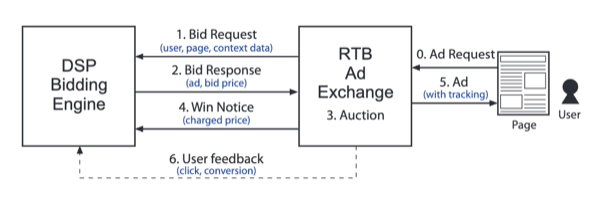
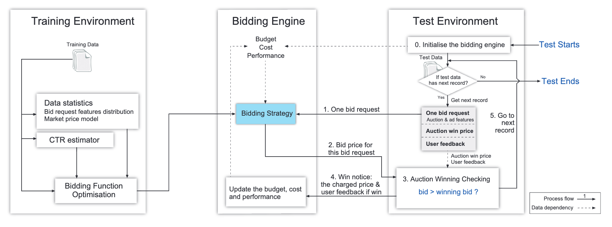
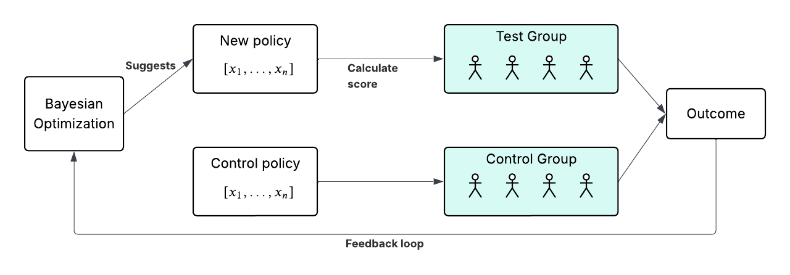

# Ax - Multi-Objective Optimization for Marketing Campaigns

- Student: Damian Calabresi
- Course: MSML610 - Fall 2025
- UMD ID: 121332271

## Table of Contents
- [1. Introduction to Bayesian Optimization](#1-introduction-to-bayesian-optimization)
  - [1.1. Optimization Problem](#11-optimization-problem)
  - [1.2. Black-Box Optimization](#12-black-box-optimization)
    - [1.2.1. Surrogate Model](#121-surrogate-model)
    - [1.2.2. Gaussian Process (GP)](#122-gaussian-process-gp)
  - [1.3. Bayesian Optimization](#13-bayesian-optimization)
    - [1.3.1. Acquisition Function](#131-acquisition-function)
    - [1.3.2. Sequential Optimization](#132-sequential-optimization)
- [2. Real-Time Bidding Algorithms with Bayesian Optimization](#2-real-time-bidding-algorithms-with-bayesian-optimization)
  - [2.1. Real-Time Bidding (RTB)](#21-real-time-bidding-rtb)
  - [2.2. Acronyms](#22-acronyms)
  - [2.3. Bidding Strategy](#23-bidding-strategy)
    - [2.3.1. Linear-form bidding of pCTR (Lin)](#231-linear-form-bidding-of-pctr-lin)
      - [2.3.1.1. Base Bid](#2311-base-bid)
      - [2.3.1.2. Pay to Bid Ratio](#2312-pay-to-bid-ratio)
      - [2.3.1.3. Pacing](#2313-pacing)
      - [2.3.1.4. Final Bid Formula](#2314-final-bid-formula)
  - [2.4. DSP Simulation](#24-dsp-simulation)
    - [2.4.1. iPinYou Dataset](#241-ipinyou-dataset)
    - [2.4.2. Prediction Model](#242-prediction-model)
    - [2.4.3. Dataset](#243-dataset)
    - [2.4.4. About the Simulation](#244-about-the-simulation)
    - [2.4.5. Results](#245-results)
- [3. Bayesian Optimization on Multi-Armed Bandits](#3-bayesian-optimization-on-multi-armed-bandits)
  - [3.1. A/B Testing](#31-ab-testing)
  - [3.2. Policy Exploration Problem](#32-policy-exploration-problem)
  - [3.3. Sequential Optimization](#33-sequential-optimization)
  - [3.4. Literature](#34-literature)
  - [3.5. Multi-Armed Bandit Problem](#35-multi-armed-bandit-problem)
    - [3.5.1. Traditional Exploration-Exploitation Algorithms](#351-traditional-exploration-exploitation-algorithms)
    - [3.5.2. Bayesian Algorithms](#352-bayesian-algorithms)
      - [3.5.2.1. Thompson Sampling](#3521-thompson-sampling)
      - [3.5.2.2. Gaussian Process Bandit](#3522-gaussian-process-bandit)
    - [3.5.3. Hypothesis](#353-hypothesis)
    - [3.5.4. Simulation](#354-simulation)

## 1. Introduction to Bayesian Optimization

### 1.1. Optimization Problem

We have an optimization problem:

$\min_{x} f(x)$

Where $f(x)$ is the objective function to minimize.

Gradient method -> $x_{t+1} = x_t - \alpha \nabla f(x_t)$

**Requires a differentiable objective function!**

### 1.2. Black-Box Optimization

In a black-box optimization problem, we don't have a differentiable objective function. The relation between input and output is unknown.

This relation is modeled as an unknown function $f(x)$ that predicts the outcome.

**Surrogate model:** $y = f(x) + \epsilon$

How do we obtain the surrogate model?

#### 1.2.1. Surrogate Model

Given hyperparameters $x$, we want obtain a function $f(x)$ that predicts the outcome of the objective function.

We have a set of points $x_1, x_2, ..., x_n$ and the corresponding outcomes $y_1, y_2, ..., y_n$.

#### 1.2.2. Gaussian Process (GP)

Define $f(x) \sim GP(m(x), k(x, x'))$ where:

- $m(x)$ is the mean function
- $k(x, x')$ is the covariance function

Most common kernel: RBF kernel $k(x, x') = \sigma^2 \exp(-\frac{||x - x'||^2}{2l^2})$

- Gaussian kernel
- Smoothness

In other words:
- Mean defined at each point $x_i$
- Uncertainty defined at each point $x_i$
- Covariance allows interpolation of unknown $f(x_i)$, with some uncertainty

### 1.3. Bayesian Optimization

Bayesian optimization is a sequential optimization technique that uses a probabilistic model to guide the search for the optimal solution. In order to do this, first, an Acquisition Function has to be defined.

#### 1.3.1. Acquisition Function

The acquisition function is the function used to define the next point to evaluate.

Note: $f^* = \max_i y_i$ -> Best observed outcome

Different types of acquisition functions are:

**Expected Improvement (EI):** $EI(x)=E[\max(f(x)−f^*, 0)]$

**Probability of Improvement (PI):** $PI(x)=P(f(x) \geq f^*)$

**Upper Confidence Bound (UCB):** $UCB(x) = \mu(x) + \kappa \sigma(x)$

Expected Improvement is the acquisition function used by Ax.

#### 1.3.2. Sequential Optimization

Bayesian optimization leads to a sequential optimization process where the Acquisition Function is applied to define the next point to evaluate. After the evaluation, the result is fed back to the model to adjust the Surrogate Model.

## 2. Real-Time Bidding Algorithms with Bayesian Optimization

### 2.1. Real-Time Bidding (RTB)

Real-Time Bidding (RTB) is a programmatic advertising technique where advertisers bid on ad inventory in real-time. The advertiser pays only when the ad is clicked.

There are four actors in the RTB process:
- Publisher: The website or app that sells the ad inventory.
- Advertiser: The advertiser that wants to display their ad.
- Ad Exchange: Works on the Publisher side. It's the platform that starts the auction when a space is available, receives the bids from the DSP and decides which ad will be published.
- DSP (Demand Side Platform): Works on the Advertiser side. It receives the auction request from the Ad Exchange and makes a bid to show the ad.

The Ad Exchange shares the Auction with multiple DSPs. Each DSP, represents and advertiser, makes a bid. The highest bid wins the auction and the ad is published.

**Note:** The bid done by the DSP is not the final price of the Impression. A common practice is the use the second highest bid as the price of the Impression. This is called the "Second Price Auction".

A different but more simple diagram:

### 2.2. Acronyms

- DSP: Demand Side Platform
- RTB: Real-Time Bidding
- CTR: Click-Through Rate
- CVR: Conversion Rate
- CPC: Cost Per Click
- CPM: Cost Per Mile Impressions
- eCPC: effective Cost Per Click (The value paid for the impression is not the bid price, but the second highest bid)
- pCTR: predicted Click-Through Rate

### 2.3. Bidding Strategy

A DSP is running a campaign for an advertiser. It receives an auction and has to make a bid. A bidding strategy is used to determine the bid amount. The DSP wants to maximize the revenue while minimizing the cost for the advertiser. The revenue can be measured in Impressions, Clicks, or Conversions, depending on the campaign objective.

The steps in the bidding strategy are:
- Learn from existing data, this includes information about the publisher, users, cookies, the content to advertise, etc.
- Receive an auction request from the Ad Exchange.
- Predict a potential CTR
- Define a formula to calculate the bid amount. If it's to high, we may be spending the advertiser's budget without getting good results. If it's to low, we may be losing the auction.

Classic algorithms to define the bid amount are:
- **Constant bidding (Const):** Bid a constant value for all the bid requests
- **Random bidding (Rand):** Randomly choose a bid value in a given range.
- **Bidding below max eCPC (Mcpc):** The goal of bid optimisation is to reduce the eCPC. The bid price on an impression is obtained by multiplying the max eCPC and the pCTR.
- **Linear-form bidding of pCTR (Lin):** Bid a linear function of the predicted CTR.

Lin has demonstrated to be one of the best and simplest bidding strategies.

#### 2.3.1. Linear-form bidding of pCTR (Lin)

The formula is:

$bid = base\_bid + \frac{pCTR}{avg\_CTR}$

- $base\_bid$: A constant value for all the bid requests. The average bid value of the campaign.
- $pCTR$: The predicted Click-Through Rate.
- $avg\_CTR$: The average Click-Through Rate of the campaign, or the advertiser.

The rationale within this formula is that the campaing naturally has an average probability of a click (Average CTR). Some bids, based on the data provided by the publisher, may have a higher probability of a click. On those we want to bid higher.

How much this predicted CTR is going to affect the final bid price is going to be regulated by a coefficient $ctr\_reg\_coef$ between 0.5 and 2.

##### 2.3.1.1. Base Bid

$base\_bid$ represents how much the DSP (Or the advertiser) is willing to pay per thousand impressions of average quality.

##### 2.3.1.2. Pay to Bid Ratio

As explained in the previous section, the bid price is not the final price of the impression. The final price is the second highest bid. This means we can always aim a little bit higher to win the auction as it's not the price we're going to pay.

Complex machine learning models can be used to predict how much other DSPs could be bidding for the same impression. In this case we'll just keep a simple ratio.

$pay\_to\_bid\_ratio = \frac{raw\_bid}{pay\_bid}$

If the pay price is much lower than the raw bid, the ratio will be higher. This ratio is always greater than 1. This means we can increase the bid price to win the auction.

In this case we'll keep an average of the historic ratio.

$pay\_to\_bid\_ratio$ is clipped between 0.5 and 2

$final\_bid = raw\_bid \times pay\_to\_bid\_ratio$

How this affects the final bid price is going to be regulated by a coefficient $pay\_to\_bid\_reg\_coef$ between 0.5 and 2.

##### 2.3.1.3. Pacing

The advertiser usually sets a budget for the campaign. The DSP needs to ensure that the bid amount is within the budget and decrease the budget by the "pay_price", the price paid for the impression, not the bid price.

If the `base_bid` is too high, the budget could be consumed early in the day, while the majority of the conversions happen at night. To correct this, the DSP can use "pacing". A coefficient is calculated over the time of the day based on the expected budget to be spent.

$pacing\_coefficient$: A coefficient between 0.5 and 2 that is calculated over the time of the day based on the expected budget to be spent.

$pacing\_coefficient = \frac{expected\_budget\_to\_be\_spent}{actual\_budget\_spent}$

With $expected\_budget\_to\_be\_spent = \frac{budget}{24} \times hour\_of\_day$

$pacing\_coefficient$ is clipped between 0.5 and 2.

$final\_bid = raw\_bid \times pacing\_coefficient$

How this affects the final bid price is going to be regulated by a coefficient $pacing\_reg\_coef$ between 0.5 and 2.

##### 2.3.1.4. Final Bid Formula

The final bid formula without the regulation coefficients is:

$final\_bid = base\_bid \times \frac{pCTR}{avg\_CTR} \times pay\_to\_bid\_ratio \times pacing\_coefficient$

With the regulation coefficients:

$final\_bid = base\_bid \times \left(1 + ctr\_reg\_coef \times \left(\frac{pCTR}{avg\_CTR} - 1\right)\right) \times \left(1 + pay\_to\_bid\_reg\_coef \times (pay\_to\_bid\_ratio - 1)\right) \times \left(1 + pacing\_reg\_coef \times (pacing\_coefficient - 1)\right)$

- Hyperparameters:
  - $base\_bid$: How much the DSP (Or the advertiser) is willing to pay per thousand impressions of average quality
  - $ctr\_reg\_coef$: A coefficient to regulate the importance of the predicted CTR. (0.5 to 2)
  - $pay\_to\_bid\_reg\_coef$: A coefficient to regulate the importance of the pay to bid ratio. (0.5 to 2)
  - $pacing\_reg\_coef$: A coefficient to regulate the importance of the pacing. (0.5 to 2)
  - $budget$: The budget set by the advertiser.
- Calculated values:
  - $pCTR$: The predicted Click-Through Rate.
  - $avg\_CTR$: The average Click-Through Rate of the campaign, or the advertiser.
  - $pay\_to\_bid\_ratio$: The ratio of the pay price to the raw bid.
  - $pacing\_coefficient$: The coefficient to regulate the pacing.

### 2.4. DSP Simulation

### 2.4.1. iPinYou Dataset

This simulation is based on the iPinYou dataset, described in these publications:

- iPinYou Global RTB Bidding Algorithm Competition Dataset (Hairen Liao, Lingxiao Peng, Zhenchuan Liu, Xuehua Shen)
- Real-Time Bidding Benchmarking with iPinYou Dataset (Weinan Zhang, Shuai Yuan, Jun Wang)

For more information:
- [iPinYou Global RTB Bidding Algorithm Competition](https://contest.ipinyou.com/)
- [Github - wnzhang/make-ipinyou-data](https://github.com/wnzhang/make-ipinyou-data)
- [Github - wnzhang/optimal-rtb](https://github.com/wnzhang/optimal-rtb)

iPinYou is a DSP (Demand Side Platform) for RTB (Real-Time Bidding) in China that published in 2014 a complete dataset of individual bids, impressions and clicks for a certain group of advertisers during a week.

iPinYou opened this dataset for a competition to create the best bidding algorithm. A bidding algorithm is a function that, based on some information given by the Ad Exchange, decides whether to bid for an impression and the bid amount.

The analysis and processing of the dataset is done in the Jupyter Notebook [dsp_pctr_prediction_model.ipynb](dsp_pctr_prediction_model.ipynb).

**Important:** The bid and paid price are measured in CNY (Chinese Yuan) per 1000 impressions.

### 2.4.2. Prediction Model

A requirement for the simulation is to predict the Click-Through Rate (CTR) of an impression. This is a classic machine learning problem. A model using XGBoost has been created to predict the CTR based on tha auction request provided by the Ad Exchange.

The model training and evaluation is done in the Jupyter Notebook [dsp_pctr_prediction_model.ipynb](dsp_pctr_prediction_model.ipynb). The models are available in the [models](models) folder.

### 2.4.3. Dataset

The iPinYou dataset has been reduced to a smaller dataset files (From 4GB to 300MB) to only contain the features that are used to predict the CTR, plus other features required for the simulation:

- Paid price
- Clicked or not
- Floor price

Original iPinYou dataset contains:

- Bid logs: Every auction request from the Ad Exchange, with some data about the ad, the amount bidded by the DSP.
- Impression logs: Every won bid generates an impression, this adds the paid price data.
- Click logs: Some impressions generate a click, this is logged here.

The new dataset is reduced to a file per day. The dataset contains all this information for **one** advertiser and from June 6th 2013 to June 12th 2013.

The dataset is available in the [dataset](dataset) folder.

### 2.4.4. About the Simulation

The simulation will run for a given date (E.g. 06/10/2013). It will start processing the dataset which contains one line per bid. Then, for each bid:
- Predict the CTR using the prediction model.
- Calculate the bid amount using the bidding strategy.
- Verify if the bid was won, based on the paid price and the floor price.
- Update the budget based on the paid price.
- If it was clicked, update the CTR and average CTR.

**About the model predictions:**
- The pCTR can only be predicted with the information from the previous days.
- If the current simulation day is 06/10/2013, the model `2013-06-06_2013-06-09` will be loaded

### 2.4.5. Results

The simulation and the results can be seen in the Jupyter Notebook [Ax.example.ipynb](Ax.example.ipynb).

## 3. Bayesian Optimization on Multi-Armed Bandits

A Multi-Armed Bandit is a problem where there are multiple arms (actions) to choose from. A/B Testing is a special case of them.

### 3.1. A/B Testing

In A/B Testing, we have a set of arms $A_1, A_2, ..., A_n$ and we want to find the best arm. 

The arms are the different versions of the product or feature that we want to test. The outcome is the success of the arm.

The goal is to find the best arm to maximize the success.

The problem is that we don't know the success of the arms before running the test.

In A/B Testing the criteria to present an arms is randomized to eliminate potential confounders, similar to an RCT.

### 3.2. Policy Exploration Problem

Through exploration, we want to find the best policy to maximize the outcome. The policy is defined by a "scoring function".

This means, we have a set of features about the user and the content, then a prediction model will return a series of predictions from those features (E.g.: click probability, share probability, etc). We want to define how those predictions will be weighted to select the arm to maximize the outcome. Examples of this are:
- Facebook feed: Decide which content to show to the user.
- LinkedIn search results: Who should appear first in the search results.
- Netflix recommendations: Which movies to recommend to the user.

We define the features corresponding to the User (Who is receiving the content) and the ones corresponding to the Content (What is being shown to the user) as $u$ and $c$.

A Prediction Model generates $d$ predictions $f_i(u, c)$ (E.g.: click probability, share probability, etc.) based on the user and content.

We have to weigh in those predictions to calculate the score $s(u, c) = \sum_{i=1}^d x_i f_i(u, c)$. The score will decide which content is shown to the user.

The policy is the definition of $x_i$ which are the weights assigned to each prediction.

### 3.3. Sequential Optimization

A/B Testing models can be used to optimize the policy. This is what the Meta Adaptive Experimentation Team currently does.

Bayesian Optimization can be used to test different policies in a sequential manner.

Bayesian Optimization does exploration and exploitation, this means, it will try to use the policies that are returning the best results but also try new policies to explore the input space.

### 3.4. Literature

The following literature shows how Bayesian Optimization techniques have been applied by top companies to optimize their advertising algorithms.

- **Google Vizier: A Service for Black-Box Optimization (2017)**: Google. Comparison of Bayesian Optimization vs Simulated Annealing. Initial definitions of Bayesian Optimization.
- **Online Parameter Selection for Web-based Ranking Problems (2018)**: LinkedIn. Select the policy to score and rank search results.
- **Constrained Bayesian Optimization with Noisy Experiments (2018)**: Meta. Improvements to Bayesian Optimization. Quasi-Monte Carlo sampling.
- **Bayesian Optimization for Policy Search via Online-Offline Experimentation (2019)**: Meta. Mix online (Real users) and offline (Simulations) experiments. Use Multi-task Gaussian Process (MTGP) to combine the results and model the response surface.
- **Experimenting, Fast and Slow: Bayesian Optimization of Long-term Outcomes with Online Experiments (2025)**: Combine short-run experiments (SRE) and long-run experiments (LRE) with MTGP and Target-Aware Gaussian Process Model (TAGP) to model the response surface. Use proxy metrics for short-run experiments.

### 3.5. Multi-Armed Bandit Problem

We have $n$ Arms -> $A_1, A_2, ..., A_n$, and we need to find the best arm.

Maximizing $Reward(A_i)$ requires testing, but the number of tests is limited.

**Every time we didn't pull the best arm, we incur a regret.**

**Regret:** The difference between the best arm and the arm we chose.

In other words, how much we would have won if we used the best arm instead of the one we tried. 

#### 3.5.1. Traditional Exploration-Exploitation Algorithms

To minimize the regret we need to exploit the arm with highest rewards, but we also need to explore to be sure we know which is the best arm.

There are different techniques to balance exploration and exploitation.

**Classic A/B Testing**

All bandits are tried equally often. The policy doesn't adapt to the results. Regret increases linearly $O(T)$

**UCB1 (Upper Confidence Bound)**

On each iteration, the expected reward of each arm is calculated based on the mean reward and the number of times the arm has been pulled.

If we have an arm $A_i$, at iteration $t$, then:

$UCB(A_i) = \hat{\mu}_i + \kappa \sqrt{\frac{2 \log(t)}{N_i(t)}}$

- $\kappa$ -> exploration vs exploitation trade-off
- $\hat{\mu}_i$ -> the mean reward of arm $A_i$ (Frequentist estimator)
- $N_i(t)$ -> the number of times arm $A_i$ has been pulled until time $t$

Without uncertainty (The mean reward is stable) regret is $O(log T)$. This technique is a frequentist approach, and widely used in the field. It assumes there is a ground truth for the reward of each arm. (E.g., CTR is 0.1 for a given arm and we can estimate it)

*Ref: Finite-time Analysis of the Multiarmed Bandit Problem (Peter Auer, 2002)*

*Ref: Introduction to Multi-Armed Bandits (Aleksandrs Slivkins, 2019)*

#### 3.5.2. Bayesian Algorithms

Bayesian algorithms consider the uncertainty of the rewards. This means, there isn't a simple "ground truth", like a single expected CTR for an arm, but a distribution of possible CTRs.

##### 3.5.2.1. Thompson Sampling

This algorithm defines a prior that is updated on each iteration.

**Prior:** $P(A_i) \sim Beta(\alpha_i, \beta_i)$ | $\alpha_i = 1, \beta_i = 1$

**Arm Selection:** Evaluate the Beta distribution for each $A_i$, should return a value for $P(A_i)$. The arm with the highest value is selected.

**Evaluation:** Evaluate A_i in a real experiment. If it's a simulation do $Bernoulli(P(A_i))$.

**Posterior:** If $Bernoulli(P(A_i))$ is 1, update $\alpha_i = \alpha_i + 1$ else $\beta_i = \beta_i + 1$

Regret is $O(log T)$. Thompson Sampling supports higher variance.

**Note:** Thompson Sampling is a simplified version of the analytical solution for the Probabilistic Programming scenario of the coin toss problem. It's a Heuristic approach.

*Ref: Analysis of Thompson Sampling for the Multi-armed Bandit Problem (Shipra Agrawal and Navin Goyal, 2012)*

*Ref: A Tutorial on Thompson Sampling (Russo, 2018)*

##### 3.5.2.2. Gaussian Process Bandit

Gaussian Process Bandit is a Bayesian approach to the Multi-Armed Bandit problem. It uses a Gaussian Process to model the uncertainty of the rewards.

*Reminder:* GP is defined by $f(x) \sim GP(m(x), k(x, x'))$ where:
- $x$ represents the arm
- $f(x)$ represents the reward of the arm, is maximized
- Regret is minimized

In the Multi-Armed Bandit problem, the input $x_i$ is the probability of choosing arm $A_i$.

In a classic Multi-Armed Bandit with $n$ options, the Gaussian Process will be linear. One of the solutions is better and the maximum is on the border of the search space. The ideal function would be an hyperplane of the search space.

Compared to Thompson Sampling, a GP Bandit supports the case where there is a non-linear relationship between the chosen arm and the reward.

Example of Gaussian Process Bandit:
- Arm 1 has a CTR of 0.1 and Arm 2 has a CTR of 0.2, they are unknown.
- The bandit will explore both arms, with a probability for each one $P(A_1)$ and $P(A_2)$.
- The function $f(P(A_1),P(A_2))$ is the reward based on the probability of choosing Arm 1 or Arm 2.
- The function is linear, assuming each Arm has a constant CTR.

*Ref: Weighted Gaussian Process Bandits for Non-stationary Environments (2021)*

#### 3.5.3. Hypothesis

We start with a Multi-Armed Bandit problem, and define a hypothesis. Then we'll run a simulation to test this hypothesis.

**Scenario** 

- We have $n$ Arms $A_1, A_2, ..., A_n$
- Each arm has an unknown reward $f(A_i)$ (E.g.: Click-through rate)
- $T$: Total number of pulls (Number of times one of the arms is presented to the user)
- Experiment: Variation of the frequency of the arms  $x_1, x_2, ..., x_n$ (Each arm has a probability of being chosen)
- Exploitation: Pull the arm with the estimated best reward
- Exploration: Pull the arm with the highest uncertainty
- Regret: At the end of the experiment we can get the reward of the best arm, and calculate the regret if we have always pulled the best arm.

**Hypothesis**

- UCB1 is the best algorithm when each Arm has a constant reward.
- Reward is linear in theory but not in practice due to variance (E.g.: CTR isn't really constant).
- Thompson Sampling and GP-Bandit are more robust to non-linear relationships with high variance.

**Note:** Records show that GP-Bandit achieves better results in practice but it's not guaranteed by the theoretical analysis.

*Ref: Weighted Gaussian Process Bandits for Non-stationary Environments (2021)*

*Ref: Gaussian Process Upper Confidence Bound Achieves Nearly-Optimal Regret in Noise-Free Gaussian Process Bandits (2025)*

#### 3.5.4. Simulation

The simulation is done in the Jupyter Notebook [Ax.example.ipynb](Ax.example.ipynb). It confirms the hypothesis and shows that Thompson Sampling and GP Bandit adapt better to the uncertainty of the rewards.

