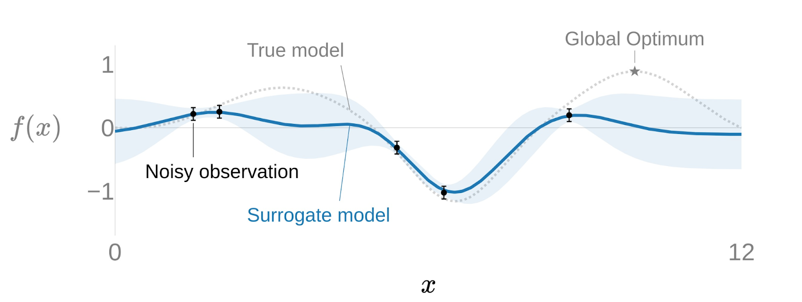
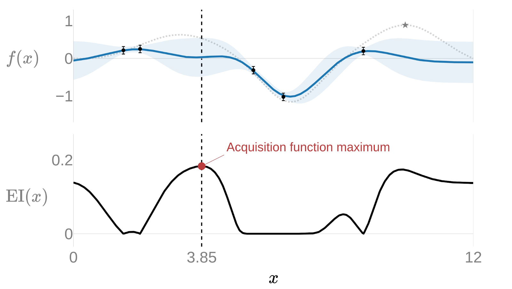
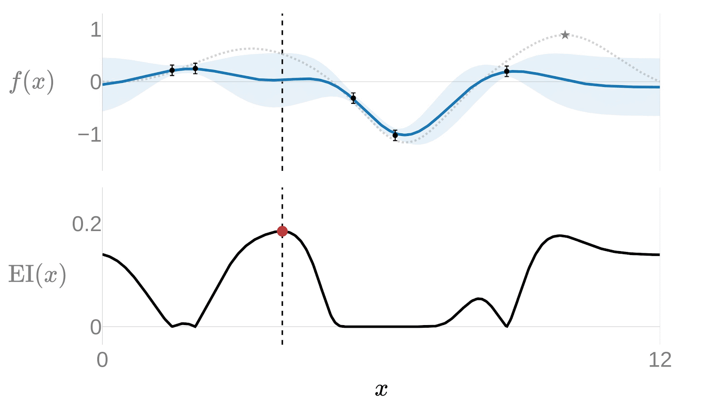
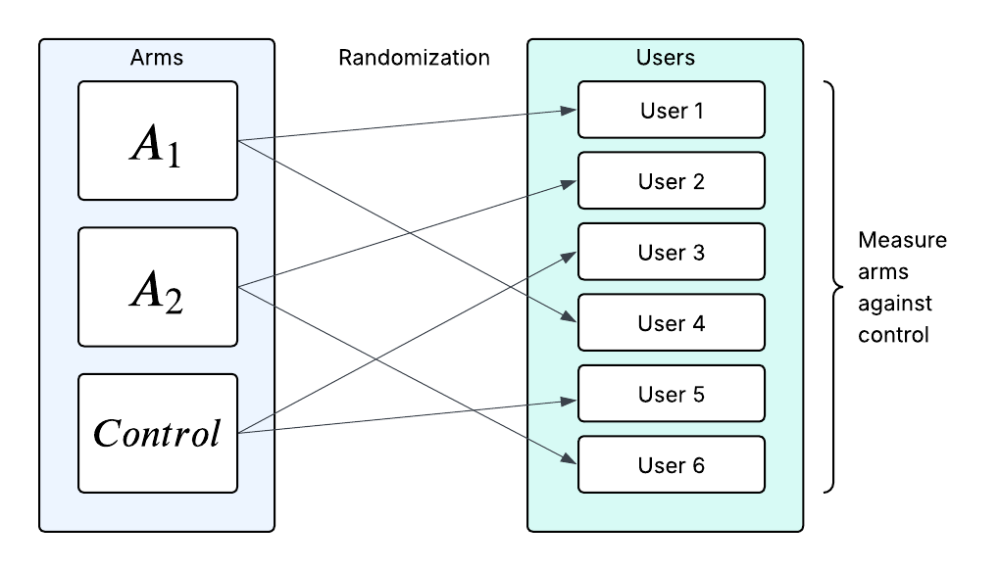
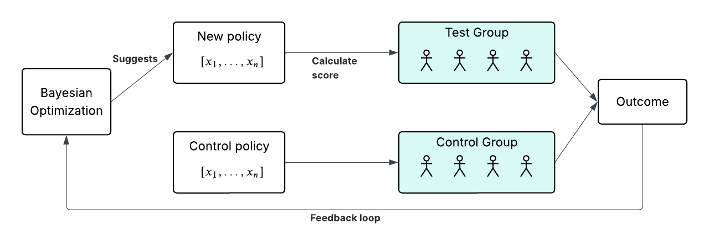
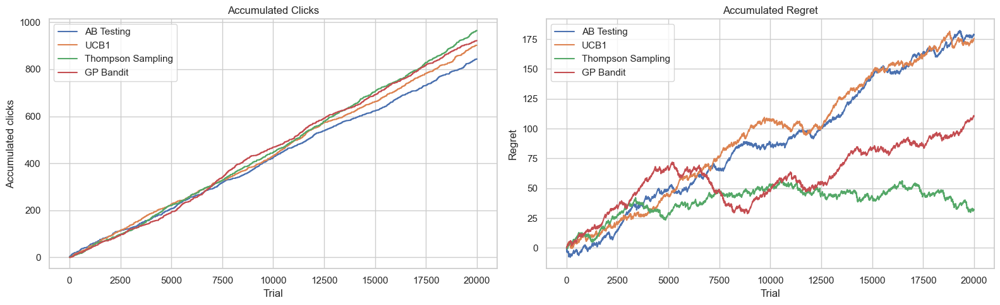

# Ax - Adaptive Experimentation - Example

## Table of Contents
- [1. Introduction to Bayesian Optimization](#1-introduction-to-bayesian-optimization)
  - [1.1. Optimization Problem](#11-optimization-problem)
  - [1.2. Black-Box Optimization](#12-black-box-optimization)
    - [1.2.1. Surrogate Model](#121-surrogate-model)
    - [1.2.2. Gaussian Process (GP)](#122-gaussian-process-gp)
  - [1.3. Bayesian Optimization](#13-bayesian-optimization)
    - [1.3.1. Acquisition Function](#131-acquisition-function)
    - [1.3.2. Sequential Optimization](#132-sequential-optimization)
- [2. Bayesian Optimization on Multi-Armed Bandits](#2-bayesian-optimization-on-multi-armed-bandits)
  - [2.1. A/B Testing](#21-ab-testing)
  - [2.2. Policy Exploration Problem](#22-policy-exploration-problem)
  - [2.3. Sequential Optimization](#23-sequential-optimization)
  - [2.4. Literature](#24-literature)
  - [2.5. Multi-Armed Bandit Problem](#25-multi-armed-bandit-problem)
    - [2.5.1. Traditional Exploration-Exploitation Algorithms](#251-traditional-exploration-exploitation-algorithms)
    - [2.5.2. Bayesian Algorithms](#252-bayesian-algorithms)
      - [2.5.2.1. Thompson Sampling](#2521-thompson-sampling)
      - [Gaussian Process Bandit](#gaussian-process-bandit)
    - [2.5.3. Hypothesis](#253-hypothesis)

## 1. Introduction to Bayesian Optimization

### 1.1. Optimization Problem

We have an optimization problem:

$\min_{x} f(x)$

Where $f(x)$ is the objective function to minimize.

Gradient method -> $x_{t+1} = x_t - \alpha \nabla f(x_t)$

**Requires a differentiable objective function!**

### 1.2. Black-Box Optimization

In a black-box optimization problem, we don't have a differentiable objective function. The relation between input and output is unknown.

This relation is modeled as an unknown function $f(x)$ that predicts the outcome.

**Surrogate model:** $y = f(x) + \epsilon$

How do we obtain the surrogate model?

#### 1.2.1. Surrogate Model

Given hyperparameters $x$, we want obtain a function $f(x)$ that predicts the outcome of the objective function.

We have a set of points $x_1, x_2, ..., x_n$ and the corresponding outcomes $y_1, y_2, ..., y_n$.

#### 1.2.2. Gaussian Process (GP)

Define $f(x) \sim GP(m(x), k(x, x'))$ where:

- $m(x)$ is the mean function
- $k(x, x')$ is the covariance function

Most common kernel: RBF kernel $k(x, x') = \sigma^2 \exp(-\frac{||x - x'||^2}{2l^2})$

- Gaussian kernel
- Smoothness

In other words:
- Mean defined at each point $x_i$
- Uncertainty defined at each point $x_i$
- Covariance allows interpolation of unknown $f(x_i)$, with some uncertainty

### 1.3. Bayesian Optimization

Bayesian optimization is a sequential optimization technique that uses a probabilistic model to guide the search for the optimal solution. In order to do this, first, an Acquisition Function has to be defined.

#### 1.3.1. Acquisition Function

The acquisition function is the function used to define the next point to evaluate.

Note: $f^* = \max_i y_i$ -> Best observed outcome

Different types of acquisition functions are:

**Expected Improvement (EI):** $EI(x)=E[\max(f(x)−f^*, 0)]$

**Probability of Improvement (PI):** $PI(x)=P(f(x) \geq f^*)$

**Upper Confidence Bound (UCB):** $UCB(x) = \mu(x) + \kappa \sigma(x)$

Expected Improvement is the acquisition function used by Ax.

#### 1.3.2. Sequential Optimization

Bayesian optimization leads to a sequential optimization process where the Acquisition Function is applied to define the next point to evaluate. After the evaluation, the result is fed back to the model to adjust the Surrogate Model.

## 2. Bayesian Optimization on Multi-Armed Bandits

A Multi-Armed Bandit is a problem where there are multiple arms (actions) to choose from. A/B Testing is a special case of them.

### 2.1. A/B Testing

In A/B Testing, we have a set of arms $A_1, A_2, ..., A_n$ and we want to find the best arm. 

The arms are the different versions of the product or feature that we want to test. The outcome is the success of the arm.

The goal is to find the best arm to maximize the success.

The problem is that we don't know the success of the arms before running the test.

In A/B Testing the criteria to present an arms is randomized to eliminate potential confounders, similar to an RCT.

### 2.2. Policy Exploration Problem

Through exploration, we want to find the best policy to maximize the outcome. The policy is defined by a "scoring function".

This means, we have a set of features about the user and the content, then a prediction model will return a series of predictions from those features (E.g.: click probability, share probability, etc). We want to define how those predictions will be weighted to select the arm to maximize the outcome. Examples of this are:
- Facebook feed: Decide which content to show to the user.
- LinkedIn search results: Who should appear first in the search results.
- Netflix recommendations: Which movies to recommend to the user.

We define the features corresponding to the User (Who is receiving the content) and the ones corresponding to the Content (What is being shown to the user) as $u$ and $c$.

A Prediction Model generates $d$ predictions $f_i(u, c)$ (E.g.: click probability, share probability, etc.) based on the user and content.

We have to weigh in those predictions to calculate the score $s(u, c) = \sum_{i=1}^d x_i f_i(u, c)$. The score will decide which content is shown to the user.

The policy is the definition of $x_i$ which are the weights assigned to each prediction.

### 2.3. Sequential Optimization

A/B Testing models can be used to optimize the policy. This is what the Meta Adaptive Experimentation Team currently does.

Bayesian Optimization can be used to test different policies in a sequential manner.

Bayesian Optimization does exploration and exploitation, this means, it will try to use the policies that are returning the best results but also try new policies to explore the input space.

### 2.4. Literature

The following literature shows how Bayesian Optimization techniques have been applied by top companies to optimize their advertising algorithms.

- **Google Vizier: A Service for Black-Box Optimization (2017)**: Google. Comparison of Bayesian Optimization vs Simulated Annealing. Initial definitions of Bayesian Optimization.
- **Online Parameter Selection for Web-based Ranking Problems (2018)**: LinkedIn. Select the policy to score and rank search results.
- **Constrained Bayesian Optimization with Noisy Experiments (2018)**: Meta. Improvements to Bayesian Optimization. Quasi-Monte Carlo sampling.
- **Bayesian Optimization for Policy Search via Online-Offline Experimentation (2019)**: Meta. Mix online (Real users) and offline (Simulations) experiments. Use Multi-task Gaussian Process (MTGP) to combine the results and model the response surface.
- **Experimenting, Fast and Slow: Bayesian Optimization of Long-term Outcomes with Online Experiments (2025)**: Combine short-run experiments (SRE) and long-run experiments (LRE) with MTGP and Target-Aware Gaussian Process Model (TAGP) to model the response surface. Use proxy metrics for short-run experiments.

### 2.5. Multi-Armed Bandit Problem

We have $n$ Arms -> $A_1, A_2, ..., A_n$, and we need to find the best arm.

Maximizing $Reward(A_i)$ requires testing, but the number of tests is limited.

**Every time we didn't pull the best arm, we incur a regret.**

**Regret:** The difference between the best arm and the arm we chose.

In other words, how much we would have won if we used the best arm instead of the one we tried. 

#### 2.5.1. Traditional Exploration-Exploitation Algorithms

To minimize the regret we need to exploit the arm with highest rewards, but we also need to explore to be sure we know which is the best arm.

There are different techniques to balance exploration and exploitation.

**Classic A/B Testing**

All bandits are tried equally often. The policy doesn't adapt to the results. Regret increases linearly $O(T)$

**UCB1 (Upper Confidence Bound)**

On each iteration, the expected reward of each arm is calculated based on the mean reward and the number of times the arm has been pulled.

If we have an arm $A_i$, at iteration $t$, then:

$UCB(A_i) = \hat{\mu}_i + \kappa \sqrt{\frac{2 \log(t)}{N_i(t)}}$

- $\kappa$ -> exploration vs exploitation trade-off
- $\hat{\mu}_i$ -> the mean reward of arm $A_i$ (Frequentist estimator)
- $N_i(t)$ -> the number of times arm $A_i$ has been pulled until time $t$

Without uncertainty (The mean reward is stable) regret is $O(log T)$. This technique is a frequentist approach, and widely used in the field. It assumes there is a ground truth for the reward of each arm. (E.g., CTR is 0.1 for a given arm and we can estimate it)

*Ref: Finite-time Analysis of the Multiarmed Bandit Problem (Peter Auer, 2002)*

*Ref: Introduction to Multi-Armed Bandits (Aleksandrs Slivkins, 2019)*

#### 2.5.2. Bayesian Algorithms

Bayesian algorithms consider the uncertainty of the rewards. This means, there isn't a simple "ground truth", like a single expected CTR for an arm, but a distribution of possible CTRs.

##### 2.5.2.1. Thompson Sampling

This algorithm defines a prior that is updated on each iteration.

**Prior:** $P(A_i) \sim Beta(\alpha_i, \beta_i)$ | $\alpha_i = 1, \beta_i = 1$

**Arm Selection:** Evaluate the Beta distribution for each $A_i$, should return a value for $P(A_i)$. The arm with the highest value is selected.

**Evaluation:** Evaluate A_i in a real experiment. If it's a simulation do $Bernoulli(P(A_i))$.

**Posterior:** If $Bernoulli(P(A_i))$ is 1, update $\alpha_i = \alpha_i + 1$ else $\beta_i = \beta_i + 1$

Regret is $O(log T)$. Thompson Sampling supports higher variance.

**Note:** Thompson Sampling is a simplified version of the analytical solution for the Probabilistic Programming scenario of the coin toss problem. It's a Heuristic approach.

*Ref: Analysis of Thompson Sampling for the Multi-armed Bandit Problem (Shipra Agrawal and Navin Goyal, 2012)*

*Ref: A Tutorial on Thompson Sampling (Russo, 2018)*

##### Gaussian Process Bandit

Gaussian Process Bandit is a Bayesian approach to the Multi-Armed Bandit problem. It uses a Gaussian Process to model the uncertainty of the rewards.

*Reminder:* GP is defined by $f(x) \sim GP(m(x), k(x, x'))$ where:
- $x$ represents the arm
- $f(x)$ represents the reward of the arm, is maximized
- Regret is minimized

In the Multi-Armed Bandit problem, the input $x_i$ is the probability of choosing arm $A_i$.

In a classic Multi-Armed Bandit with $n$ options, the Gaussian Process will be linear. One of the solutions is better and the maximum is on the border of the search space. The ideal function would be an hyperplane of the search space.

Compared to Thompson Sampling, a GP Bandit supports the case where there is a non-linear relationship between the chosen arm and the reward.

Example of Gaussian Process Bandit:
- Arm 1 has a CTR of 0.1 and Arm 2 has a CTR of 0.2, they are unknown.
- The bandit will explore both arms, with a probability for each one $P(A_1)$ and $P(A_2)$.
- The function $f(P(A_1),P(A_2))$ is the reward based on the probability of choosing Arm 1 or Arm 2.
- The function is linear, assuming each Arm has a constant CTR.

*Ref: Weighted Gaussian Process Bandits for Non-stationary Environments (2021)*

#### 2.5.3. Hypothesis

We start with a Multi-Armed Bandit problem, and define a hypothesis. Then we'll run a simulation to test this hypothesis.

**Scenario** 

- We have $n$ Arms $A_1, A_2, ..., A_n$
- Each arm has an unknown reward $f(A_i)$ (E.g.: Click-through rate)
- $T$: Total number of pulls (Number of times one of the arms is presented to the user)
- Experiment: Variation of the frequency of the arms  $x_1, x_2, ..., x_n$ (Each arm has a probability of being chosen)
- Exploitation: Pull the arm with the estimated best reward
- Exploration: Pull the arm with the highest uncertainty
- Regret: At the end of the experiment we can get the reward of the best arm, and calculate the regret if we have always pulled the best arm.

**Hypothesis**

- UCB1 is the best algorithm when each Arm has a constant reward.
- Reward is linear in theory but not in practice due to variance (E.g.: CTR isn't really constant).
- Thompson Sampling and GP-Bandit are more robust to non-linear relationships with high variance.

**Note:** Records show that GP-Bandit achieves better results in practice but it's not guaranteed by the theoretical analysis.

*Ref: Weighted Gaussian Process Bandits for Non-stationary Environments (2021)*

*Ref: Gaussian Process Upper Confidence Bound Achieves Nearly-Optimal Regret in Noise-Free Gaussian Process Bandits (2025)*

#### 2.5.4. Simulation

The simulation is done in the Jupyter Notebook [Ax.example.ipynb](Ax.example.ipynb). It confirms the hypothesis and shows that Thompson Sampling and GP Bandit adapt better to the uncertainty of the rewards.

