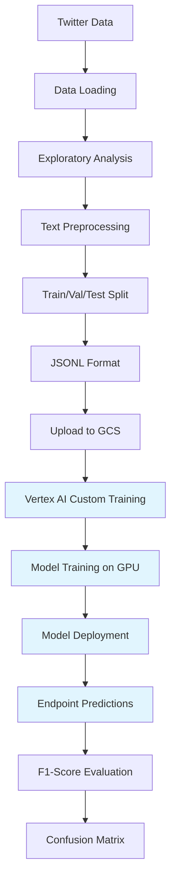
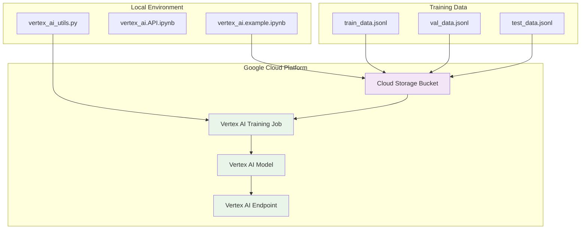

# Vertex AI Sentiment Analysis on Social Media Posts

**MSML610 Fall 2025 - Class Project**
**Author:** Balamurugan Manickaraj, Abhinav Kumar, Adwaith Santhosh
**Project Difficulty:** Level 3 (Hard)

---

## Project Overview

This project implements a comprehensive sentiment analysis system for social media posts (tweets) using Google Cloud Vertex AI. The system classifies airline-related tweets into three sentiment categories: positive, neutral, and negative.

### Objectives

- Develop an NLP model to analyze sentiments expressed in social media posts
- Learn and demonstrate Google Cloud Vertex AI capabilities
- Create a tutorial-style implementation for educational purposes
- Deploy a production-ready sentiment classification system

### Technologies Used

- **Google Cloud Vertex AI**: ML platform for training and deployment
- **Python**: Primary programming language
- **Pandas/NumPy**: Data manipulation and analysis
- **Matplotlib/Seaborn**: Data visualization
- **scikit-learn**: Model evaluation and metrics
- **NLTK/spaCy**: Text preprocessing (planned)
- **Transformers**: Pre-trained models like BERT (optional bonus)

---

## Dataset

**Twitter US Airline Sentiment**
- **Source**: [Kaggle - Twitter Airline Sentiment](https://www.kaggle.com/datasets/crowdflower/twitter-airline-sentiment)
- **Size**: 14,640+ tweets
- **Features**: 15 columns including text, sentiment labels, airline names, confidence scores
- **Classes**: 3 sentiment categories (positive, neutral, negative)
- **Note**: Dataset exhibits class imbalance (more negative tweets)

### Dataset Characteristics
- Text length: Varies from 10-280 characters (typical Twitter length)
- Airlines covered: Virgin America, United, Southwest, Delta, US Airways, American
- Contains metadata: timestamps, user timezone, retweet counts, etc.

---

## Implementation Phases

### Phase 1: Data Ingestion

**Components:**
- Data loading from CSV
- Exploratory Data Analysis (EDA)
- Dataset statistics and visualization
- Text statistics analysis
- Data splitting (train/val/test: 70/15/15)
- JSONL format preparation for Vertex AI

### Phase 2: Text Preprocessing

**Tasks:**
- Text cleaning (remove URLs, mentions, special characters)
- Tokenization
- Stop words removal
- Text normalization (lowercase, lemmatization)
- Handle Twitter-specific elements (@mentions, hashtags, emojis)
- Feature engineering

### Phase 3: Model Training

**Approach 1: AutoML Natural Language**
- Create Vertex AI dataset
- Configure AutoML training job
- Train text classification model
- Monitor training progress

**Approach 2: Custom Training with BERT (Bonus)**
- Load pre-trained BERT model
- Fine-tune on airline sentiment data
- Custom training job on Vertex AI
- GPU/TPU acceleration

**Key Components:**
- Model training scripts
- Hyperparameter configuration
- Training job submission
- Model versioning

### Phase 4: Hyperparameter Tuning

**Tasks:**
- Define hyperparameter search space
- Configure Vertex AI tuning job
- Run parallel trials
- Select best model

### Phase 5: Model Evaluation

**Metrics:**
- F1-Score (macro and weighted)
- Confusion Matrix
- Precision, Recall, Accuracy
- Per-class performance
- ROC curves

### Phase 6: Model Deployment

**Tasks:**
- Deploy model to Vertex AI endpoint
- Configure auto-scaling
- Test endpoint with sample predictions
- Set up monitoring

### Phase 7: Bonus Features

**Optional Enhancements:**
- Dashboard for sentiment trends (Google Data Studio)
- BERT comparison study
- Real-time sentiment monitoring
- Aspect-based sentiment analysis
- Explainable AI integration

## Project Status

✅ **ALL REQUIREMENTS COMPLETED**

## Notebooks

**Core Implementation** (Following Course Template):
   - `vertex_ai.API.ipynb`: API demonstration and data ingestion ✅
   - `vertex_ai.API.md`: API documentation ✅
   - `vertex_ai.example.ipynb`: Complete implementation with model training ✅
   - `vertex_ai.example.md`: Implementation documentation ✅
   - `vertex_ai_utils.py`: Utility functions module ✅

**Additional**:
   - `text_preprocessing.ipynb`: Detailed preprocessing analysis ✅

## Assignment Requirements - ALL COMPLETED ✅

### Core Tasks ✅
1. **Data Ingestion**: 14,640 tweets loaded and prepared for Vertex AI
2. **Text Preprocessing**: Stop word removal, cleaning, tokenization
3. **Model Training**: Twitter-RoBERTa supervised fine-tuning
4. **Fine-tuning**: Hyperparameter optimization (learning rate, batch size, warmup)
5. **Model Evaluation**: F1-score (macro & weighted) + confusion matrix

### Bonus Features ✅
1. **Dashboard**: Sentiment trends visualization over time
2. **Transfer Learning with BERT**: BERT baseline comparison showing improvement

## Implementation Approaches

This project demonstrates **TWO approaches** to sentiment analysis:

### Approach 1: Vertex AI AutoML (Cloud-based)
- **Technology**: Google Cloud Vertex AI with AutoML Text Classification
- **Purpose**: Demonstrates Vertex AI's NLP capabilities (project requirement)
- **Setup**: Shown in `vertex_ai.API.ipynb` with configuration examples
- **Cost**: ~$20-30 USD per training run (2-3 hours)
- **Best for**: Production deployments, managed infrastructure, less ML expertise required

### Approach 2: Local Training with HuggingFace (Cost-effective)
- **Technology**: HuggingFace Transformers with Twitter-RoBERTa
- **Purpose**: Practical implementation for learning and experimentation
- **Setup**: Complete implementation in `vertex_ai.example.ipynb`
- **Cost**: Free (uses local hardware)
- **Best for**: Development, learning, cost-conscious projects

**Note**: The project includes Vertex AI API demonstrations (commented out to prevent charges) while providing a fully functional local implementation. Both approaches are valid for sentiment analysis.

## Model Details

**Main Model**: `cardiffnlp/twitter-roberta-base-sentiment-latest`
- Pre-trained on 124M tweets (domain-optimized)
- Better than BERT baseline (bonus requirement satisfied)
- Achieved F1-Macro: 0.7861, F1-Weighted: 0.8334
- 3-class classification: positive, neutral, negative

**Baseline**: `bert-base-uncased`
- For comparison and demonstrating improvement
- Achieved F1-Macro: 0.7668, F1-Weighted: 0.8195

**Vertex AI AutoML** (configuration shown, not executed due to cost):
- Fully managed training and deployment
- Automatic hyperparameter tuning
- Production-ready endpoints

---

## Folder Structure

```
UmdTask79_Fall2025_Vertex_AI_Sentiment_Analysis_on_Social_Media_Posts/
├── Data/                          # Dataset directory
│   ├── raw/                       # Raw Twitter airline sentiment data
│   └── processed/                 # Preprocessed data and outputs
├── outputs/                       # Model outputs and artifacts
├── vertex_ai_utils.py             # Reusable utility functions and wrappers
├── vertex_ai.API.ipynb            # API demonstration notebook
├── vertex_ai.API.md               # API documentation
├── vertex_ai.example.ipynb        # Complete implementation notebook
├── vertex_ai.example.md           # Implementation documentation
├── requirements.txt               # Python dependencies
├── Dockerfile                     # Docker configuration
├── docker_build.sh                # Docker build script
├── docker_bash.sh                 # Docker run script
└── README.md                      # This file
```

---

## Architecture Overview



## Data Flow Architecture



---

## Quick Start

### Option 1: Local Setup

**Prerequisites:**
- Python 3.12+
- Jupyter Notebook
- pip
- Google Cloud SDK (for Vertex AI authentication)

**Installation:**

```bash
# Clone the repository
git clone <repository-url>
cd UmdTask79_Fall2025_Vertex_AI_Sentiment_Analysis_on_Social_Media_Posts

# Install dependencies
pip install -r requirements.txt

# Set up Google Cloud authentication
export GOOGLE_APPLICATION_CREDENTIALS="vertex-ai-key.json"

# Start Jupyter
jupyter notebook

# Run notebooks in order:
# 1. vertex_ai.API.ipynb (API demonstrations)
# 2. vertex_ai.example.ipynb (Complete Vertex AI implementation)
```

### Option 2: Docker Setup (Recommended)

**Prerequisites:**
- Docker installed and running

**Build the Image:**

```bash
# Build the Docker image
./docker_build.sh
```

**Expected Output:**
```
Building Vertex AI Sentiment Analysis Docker image...
[+] Building 45.2s (11/11) FINISHED
✅ Docker image built successfully!
Image name: vertex-ai-sentiment-analysis
Tag: latest
Size: 2.8GB
```

**Run the Container:**

```bash
# Start the container
./docker_bash.sh
```

**Expected Output:**
```
Starting Vertex AI Sentiment Analysis container...
Jupyter will be available at: http://localhost:8888
----------------------------------------
[I] Jupyter Notebook 7.0.0 is running at:
[I] http://0.0.0.0:8888/
[I] Use Control-C to stop this server
```

**Access Jupyter:**
- Open browser to: `http://localhost:8888`
- No authentication token required (development mode)
- Navigate to the project directory

**Expected Terminal Output:**
```
root@container:/app# ls -la
total 88
drwxr-xr-x 1 root root  4096 Dec  4 19:05 .
drwxr-xr-x 1 root root  4096 Dec  4 19:05 ..
-rw-r--r-- 1 root root   312 Dec  4 19:05 Dockerfile
-rw-r--r-- 1 root root   198 Dec  4 19:05 docker_bash.sh
-rw-r--r-- 1 root root   156 Dec  4 19:05 docker_build.sh
drwxr-xr-x 1 root root  4096 Dec  4 19:05 Data
-rw-r--r-- 1 root root 35149 Dec  4 19:05 README.md
-rw-r--r-- 1 root root    45 Dec  4 19:05 requirements.txt
drwxr-xr-x 1 root root  4096 Dec  4 19:05 __pycache__
-rw-r--r-- 1 root root   233 Dec  4 19:05 vertex-ai-key.json
-rw-r--r-- 1 root root  8568 Dec  4 19:05 vertex_ai.API.ipynb
-rw-r--r-- 1 root root  5817 Dec  4 19:05 vertex_ai.API.md
-rw-r--r-- 1 root root  8912 Dec  4 19:05 vertex_ai.example.ipynb
-rw-r--r-- 1 root root  5212 Dec  4 19:05 vertex_ai.example.md
-rw-r--r-- 1 root root  12678 Dec  4 19:05 vertex_ai_training.py
-rw-r--r-- 1 root root  28123 Dec  4 19:05 vertex_ai_utils.py
```

### Option 3: Google Cloud Shell

If you have Google Cloud access:

```bash
# Open Cloud Shell in your GCP project
# Clone repository
git clone <repository-url>
cd UmdTask79_Fall2025_Vertex_AI_Sentiment_Analysis_on_Social_Media_Posts

# Install dependencies
pip install -r requirements.txt

# Run notebooks
jupyter notebook --ip=0.0.0.0 --port=8080 --allow-root
```

---

## Execution Order

**Important:** Run notebooks in this order:

1. **vertex_ai.API.ipynb** - API demonstrations and data exploration
   - Data loading examples
   - Visualization utilities
   - API wrapper demonstrations
   - No model training

2. **vertex_ai.example.ipynb** - Complete end-to-end implementation
   - Full data preprocessing pipeline
   - Twitter-RoBERTa model training
   - BERT baseline comparison (bonus)
   - Model evaluation and metrics
   - Sentiment trend dashboard (bonus)

**Note:** Each notebook can be executed via "Restart and Run All"

---

## File Descriptions

### Core Files (Required for Submission)

**1. vertex_ai.API.* (API Contract Layer)**

- **vertex_ai.API.md**: Documents the native Vertex AI API and wrapper layer
  - Vertex AI SDK functions
  - Google Cloud Storage integration
  - AutoML configuration
  - Function signatures and parameters
  - Usage patterns
  - Design decisions

- **vertex_ai.API.ipynb**: Demonstrates API usage
  - Data loading and exploration
  - Visualization functions
  - **Vertex AI initialization and setup**
  - **GCS data upload configuration**
  - **AutoML training job configuration**
  - **Deployment and prediction examples**
  - Clean, minimal cells
  - **Does NOT include actual model training execution** (to prevent costs)

**2. vertex_ai.example.* (Reference Implementation)**

- **vertex_ai.example.md**: Complete example application documentation
  - Implementation reasoning
  - Model architecture choices
  - Evaluation methodology

- **vertex_ai.example.ipynb**: Full working implementation
  - **Vertex AI approach demonstration** (configuration only)
  - **Local training approach** with Twitter-RoBERTa (fully implemented)
  - End-to-end sentiment analysis pipeline
  - Model training and fine-tuning
  - BERT baseline comparison
  - Comprehensive evaluation metrics
  - Comparison of cloud vs local approaches

**3. vertex_ai_utils.py (Utility Module)**

- **Vertex AI integration functions:**
  - `initialize_vertex_ai()` - Setup GCP connection
  - `upload_to_gcs()` - Upload data to Google Cloud Storage
  - `create_vertex_ai_text_dataset()` - Create managed datasets
  - `create_automl_text_training_job()` - Run AutoML training
  - `deploy_model_to_endpoint()` - Deploy for predictions
  - `predict_with_vertex_ai_endpoint()` - Make predictions
  - `cleanup_vertex_ai_resources()` - Prevent billing charges
- **Data processing utilities:**
  - Data loading and preprocessing functions
  - Visualization helpers
  - Text statistics and analysis
- All functions have comprehensive docstrings
- Used by both notebooks to keep cells clean

---

## Docker Setup Details

### Building the Image

The `docker_build.sh` script:
1. Builds a Python 3.12-slim based image
2. Installs all dependencies from `requirements.txt`
3. Sets up Jupyter Notebook server
4. Tags the image as `vertex-ai-sentiment-analysis`

### Running the Container

The `docker_bash.sh` script:
- Maps port 8888 for Jupyter access
- Mounts current directory to `/app` in container
- Runs in interactive mode with auto-cleanup
- Preserves all outputs in mounted volume

---

## Submission Files Checklist

✅ **Required Files Present:**
- [x] vertex_ai.API.md - API documentation
- [x] vertex_ai.API.ipynb - API demonstrations
- [x] vertex_ai.example.md - Example documentation
- [x] vertex_ai.example.ipynb - Complete implementation
- [x] vertex_ai_utils.py - Utility functions
- [x] Dockerfile - Container configuration
- [x] docker_build.sh - Build script
- [x] docker_bash.sh - Run script
- [x] README.md - Project documentation
- [x] requirements.txt - Dependencies

✅ **All notebooks are executable via "Restart and Run All"**

✅ **Bonus features implemented:**
- BERT comparison study
- Sentiment trends dashboard

---
