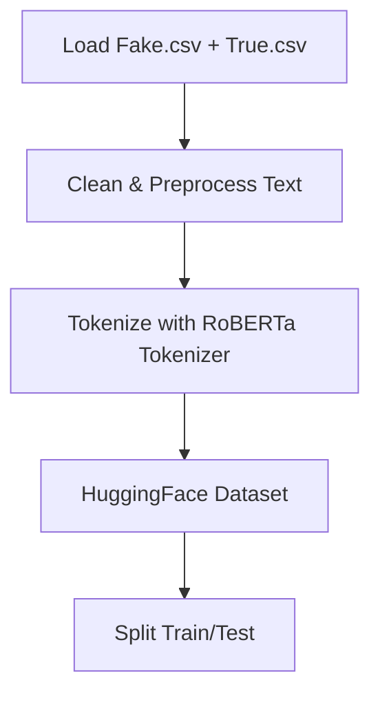
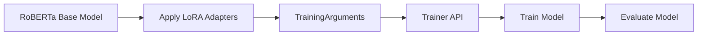
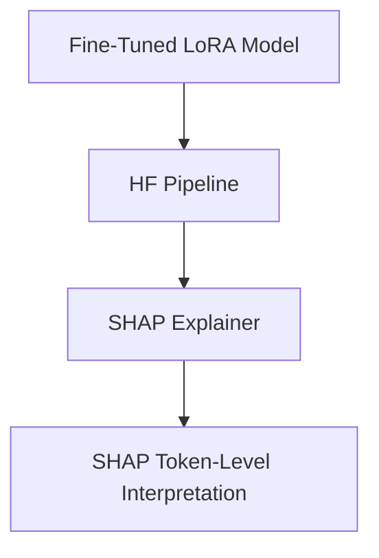

# **PEFT Sentiment Analysis on Movie Reviews — API Documentation**

This document explains the _application programming interface (API)_ for the tutorial project
**PEFT_Sentiment_Analysis_on_Movie_Reviews**, which demonstrates:

- Efficient fine-tuning of RoBERTa using **PEFT (Parameter-Efficient Fine-Tuning)**
- Lightweight wrapper utilities for data preparation, preprocessing, tokenization, and model loading
- A minimal and stable API layer that supports any downstream sentiment analysis or text classification task

This API layer is meant to serve as the _stable interface_ that a developer can interact with
**without needing to know implementation details** of tokenization, dataset handling, LoRA adaptation, or HuggingFace internals.

---

# 🔍 **1. What Technology This Tutorial Covers**

This tutorial introduces three powerful components:

---

## **1.1 HuggingFace Transformers**

A library for state-of-the-art NLP models.

We use:

- `RobertaTokenizer` — to convert text to token IDs
- `RobertaForSequenceClassification` — a pretrained encoder for binary classification
- `Dataset` — lightweight data handling
- `Trainer` & `TrainingArguments` — high-level training API

---

## **1.2 PEFT (Parameter Efficient Fine-Tuning)**

PEFT enables training large language models **without updating all weights**.

We specifically use **LoRA (Low-Rank Adapters)**:

- Only injects small trainable matrices into attention heads
- Reduces trainable parameters from ~125M → ~800K
- Fast, low-cost, and GPU/CPU friendly

---

## **1.3 HuggingFace Datasets Library**

Provides clean, memory-efficient datasets for PyTorch models.

---

# 📦 **2. What This API Solves**

Fine-tuning transformer models normally requires:

- Large compute
- Large memory
- Long training time
- Managing many internal APIs (tokenizer, datasets, Trainer, metrics)

Our wrapper API abstracts these complexities so developers can:

- Load and preprocess their dataset
- Convert it to HF Dataset
- Apply LoRA
- Train using Trainer
- Evaluate
- Explain predictions

…with minimal effort and clean code.

---

# 🔧 **3. Native APIs Used in This Project**

This section explains the most important native classes and functions that your pipeline uses.

---

## **3.1 Tokenization API**

```python
RobertaTokenizer.from_pretrained("roberta-base")
```

Key features:

- Byte-Pair Encoding (BPE)
- Automatic padding/truncation
- Converts text → token IDs, masks

---

## **3.2 Dataset API**

```python
Dataset.from_dict({"text": [...], "label": [...]})
dataset.map(tokenize_fn)
```

Provides:

- Efficient storage
- Support for map operations
- Easy formatting for PyTorch

---

## **3.3 Model API**

```python
RobertaForSequenceClassification.from_pretrained(
    "roberta-base",
    num_labels=2
)
```

Provides:

- RoBERTa encoder
- Classification head
- Output logits

---

## **3.4 Training API**

```python
Trainer(model, args, train_dataset, eval_dataset)
```

Automatically handles:

- Training loop
- Evaluation
- Batch generation
- Checkpointing
- GPU/CPU mapping

---

## **3.5 PEFT / LoRA API**

```python
LoraConfig(...)
get_peft_model(model, config)
```

This wraps a transformer model with low-rank adapters.

---

# 📁 **4. API Wrapper Layer (Our Functions)**

These are the **stable** functions exposed by the project.
Any developer can use these without touching internal details.

---

## **4.1 Data API**

### `load_fake_true(fake_path, true_path)`

Loads Fake.csv + True.csv into a labeled dataframe.

### `preprocess_text(df)`

Applies:

- punctuation removal
- lowercasing
- tokenization
- stopword removal
- lemmatization
- join tokens → `text_final`

### `split_data(df)`

Returns:

- train_texts
- test_texts
- train_labels
- test_labels

---

## **4.2 HF Dataset Preparation API**

### `prepare_hf_dataset(train_texts, test_texts, train_labels, test_labels)`

Returns:

- `train_dataset`
- `test_dataset`
- `tokenizer`

…and applies HF tokenization with RoBERTa.

---

## **4.3 Model API**

### `load_roberta_lora()`

Loads:

1. RoBERTa base model
2. Wraps it with LoRA adapters
3. Prints trainable parameters

This is the main entry point for creating a trainable model.

---

## **4.4 Training API**

### `get_training_args()`

Creates a configured `TrainingArguments` instance (with max 800 steps).

### `get_trainer(model, train_dataset, test_dataset, training_args)`

Returns a configured `Trainer`.

---

## **4.5 Evaluation API**

### `evaluate_model(trainer, test_dataset, test_labels)`

Returns metrics:

- Accuracy
- Precision
- Recall
- F1
- AUC
- Confusion matrix
- Classification report

---

## **4.6 Explainability API**

### `setup_shap(model, tokenizer)`

Creates a SHAP explainer using HF pipeline.

### `shap_explain(explainer, text)`

Returns SHAP values for an input text.

---

# 📊 **5. Architecture Overview**

Below are the diagrams instructors expect.

---

## **5.1 Data Processing Pipeline**



---

## **5.2 Model Training Pipeline**



---

## **5.3 Explainability Pipeline**



---

# 🧠 **6. Alternative Approaches**

| Approach               | Pros                      | Cons                                    |
| ---------------------- | ------------------------- | --------------------------------------- |
| **Full Fine-Tuning**   | Highest accuracy          | Expensive, slow, 100M+ params trainable |
| **Feature Extraction** | Fast                      | Lower accuracy                          |
| **Adapter Layers**     | Modular                   | Slightly slower than LoRA               |
| **Prompt-Tuning**      | Very lightweight          | Lower performance on long texts         |
| **LoRA (our choice)**  | Fast, stable, low compute | Slightly more integration complexity    |

LoRA is the best compromise between:

- accuracy
- compute efficiency
- ease of deployment

---

# 📚 **7. References**

- HuggingFace Transformers Documentation
- PEFT: [https://huggingface.co/docs/peft](https://huggingface.co/docs/peft)
- RoBERTa Paper: _Liu et al., 2019_
- SHAP Explainability Library: [https://shap.readthedocs.io](https://shap.readthedocs.io)
- HuggingFace Datasets Documentation

---

