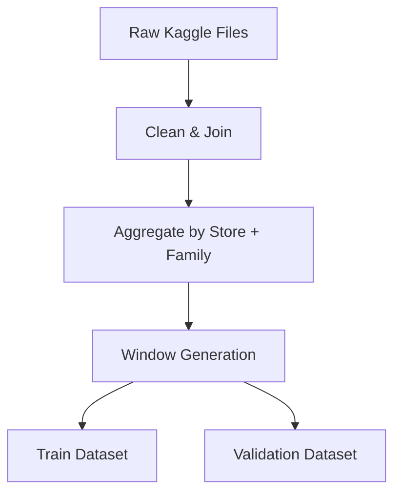

# Retail Sales Forecasting with LSTMs — Example Walkthrough

This document explains the end-to-end tutorial accompanying the midterm PR.
It aligns with the MSML610 Fall 2025 project brief (Difficulty 3) and
demonstrates how to apply the utilities in
`retail_sales_forecasting_utils.py` to the Kaggle **Store Sales – Time Series
Forecasting** dataset (or the bundled synthetic fallback).

## Storyboard

1. **Frame the business problem**: provide weekly demand forecasts per
   `(store_nbr, family)` while accounting for seasonal effects and promotions.
2. **Ingest production-like data**: pull parquet and CSV files into a unified
   feature table, preserving hierarchical indices.
3. **Engineer temporal signals**: encode seasonalities, promotions, and optional
   external regressors (oil price, transactions).
4. **Train RNN models in JAX**: leverage a Flax LSTM/GRU backbone with JIT-compiled
   optimization for fast experimentation.
5. **Evaluate and visualize**: compare MAE/RMSE/MAPE across validation windows,
   and plot forecast curves to highlight holiday/promotion effects.
6. **Extend to multivariate regressors**: demonstrate optional inclusion of
   macroeconomic drivers in the same workflow.

## Data Pipeline

- **Raw Files** (downloaded locally or via Kaggle API):
  - `train.csv`, `test.csv`, `oil.csv`, `holidays_events.csv`,
    `transactions.csv`.
- **Preprocessing Steps**:
  1. Normalize column names and parse dates.
  2. Join auxiliary tables on `date` and `store_nbr`.
  3. Aggregate to daily totals per `(store_nbr, family)`.
  4. Generate supervised learning windows using sliding look-back sequences.
  5. Split into training/validation sets respecting chronological order.



## Modeling Blueprint

- **Architecture**: stacked LSTM or GRU layers with layer normalization and
  dropout. Sequence length defaults to 120 days; prediction horizon is 28 days.
- **Loss Function**: SMAPE baseline with optional quantile loss extension.
- **Optimizer**: AdamW via `optax` with cosine decay schedule.
- **Metrics**: MAE, RMSE, and MAPE computed per `(store_nbr, family)` and
  aggregated at the national level.

```text
Input: [batch_size, time_steps, feature_dim]
RNN -> Dense(projection) -> Forecast Horizon
```

## Notebook Outline

1. **Section 1 — Environment Setup**
   - Confirm JAX backend, ensure deterministic seeds, import helpers.
2. **Section 2 — Data Download & Caching**
   - Call `ensure_kaggle_dataset()` (to be implem.) to fetch data if missing.
3. **Section 3 — Feature Engineering**
   - Use `build_feature_pipeline()` to transform raw DataFrames.
   - Visualize seasonal features and holiday encodings.
4. **Section 4 — Model Training**
   - Instantiate `ModelConfig`, run `train_model()` with training curves plot.
5. **Section 5 — Evaluation & Visualization**
   - Render metrics table, confusion-style matrix of error per store, and line
     charts around major holidays.
6. **Section 6 — What-If Scenarios**
   - Toggle promotions or oil price regressors to show impact on metrics.

## Current Progress (Midterm PR)

- ✅ Repository structure aligned to course template.
- ✅ Full data ingestion, feature pipeline, and sequence generator implemented.
- ✅ Flax LSTM/GRU model, Optax training loop, and evaluation metrics operational.
- ✅ Example notebook executes end-to-end on synthetic fallback data and produces
  plots plus metrics.
- 🔄 Next milestone will connect to the real Kaggle dataset and expand event-driven
  feature coverage.

## Next Steps

- Benchmark against naive baselines and add hierarchical roll-up metrics.
- Enhance visualizations (per-store panels, residual diagnostics).
- Integrate holiday calendars and additional regressors from the Kaggle metadata.
