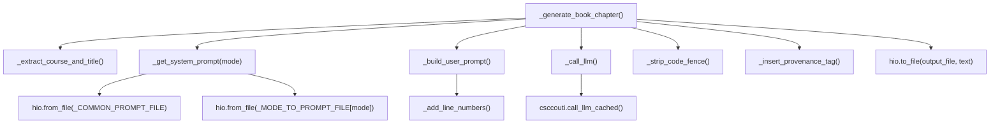
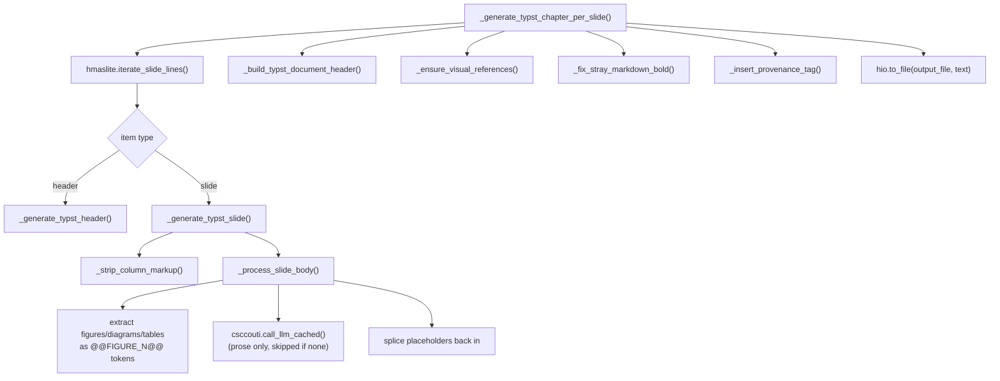

# `gen_book_chapter.py` Architecture

- For usage, see the module docstring in `gen_book_chapter.py`

## Purpose and Role

- `gen_book_chapter.py` converts one lecture source file (`.smd`, the slide/markdown
  format used under `<course>/lectures_source/`) into a draft of a book chapter, via
  an LLM
- Three output formats are supported, selected with `--mode`
  - `springer_latex`: a Springer LaTeX chapter (`.tex`)
  - `typst_aima`: a Typst/AIMA-style chapter (`.typ`)
  - `md`: a plain Markdown chapter (`.md`)

## System Context

```mermaid
graph LR
    User["Person: Course instructor / TA"]
    Script["Container: gen_book_chapter.py CLI"]
    Source["Container: <course>/lectures_source/*.smd"]
    Prompts["Container: prompt.*.md style-guide files"]
    LLM["System: LLM backend (helpers.hllm / helpers.hllm_cli)"]
    Typst["System: run_typst.py (Docker Typst compiler)"]
    Pandoc["System: pandoc (Markdown to PDF)"]
    Output["Container: <course>/book/*.tex|.typ|.md (+ .pdf)"]
    Git["System: Git repository"]

    User -->|invokes with lesson id| Script
    Script -->|reads slides| Source
    Script -->|reads style guide| Prompts
    Script -->|sends prompt, gets chapter text| LLM
    Script -->|writes chapter file| Output
    Script -->|fix_typst_code action, typst_aima| Claude Code (ccp) ]
    Script -->|render_pdf action, typst_aima| Typst
    Script -->|render_pdf action, md| Pandoc
    Script -->|git_add action| Git
```

- Facts: the diagram's edges are the six steps listed in the module docstring
  (generate, `git_add`, `lint`, `fix_typst_code`, `render_pdf`, `open_pdf`)

## Two Generation Paths

- The module has two distinct ways of turning `.smd` source into chapter text, chosen
  by `--mode` inside `_generate_book_chapter()`
  - `springer_latex` and `md` use the whole-document path: the entire numbered source
    is sent to the LLM in one call (`_build_user_prompt()` -> `_call_llm()`)
  - `typst_aima` uses the per-slide path (`_generate_typst_chapter_per_slide()`):
    headings and slides are walked one at a time, and only each slide's prose is sent
    to the LLM; everything else is emitted deterministically by Python
- This split exists because the whole-document LLM call, when asked to also reproduce
  Typst's figure/table/heading syntax verbatim, left artifacts in the output (stray
  `::: columns` markers, `@Tag@` labels); see the comment above the "Per-slide Typst
  generation" section for the rationale (same approach as
  `gen_lecture_commentary.py`)

### Whole-document Path (`springer_latex`, `md`)



- Facts: `_get_system_prompt()` concatenates `prompt.generate_book_chapter_common.md`
  (shared style guide) with the mode-specific file from `_MODE_TO_PROMPT_FILE` (e.g
  `prompt.generate_latex_book_chapter.md`)
- `_build_user_prompt()` adds a header (source path, chapter title, course title,
  and, for `typst_aima` only, the chapter number and import line) before the
  line-numbered source, so the LLM can emit accurate `From: <file>:<line num>`
  provenance comments

### Per-slide Path (`typst_aima`)



- Facts: `_process_slide_body()` replaces every image (`_IMAGE_RE`), diagram fence
  (`_DIAGRAM_FENCE_RE`), and raw-Typst block (`_TYPST_RAW_FENCE_RE`) with a
  `@@FIGURE_N@@` token before the slide body reaches the LLM; each token's rendered
  Typst snippet is spliced back in after the LLM call, so the LLM never sees raw
  figure/table markup, only a one-line "figure manifest" description per token
  (`_build_manifest_block()`)
- A slide body that is nothing but a figure/table skips the LLM call entirely
  (`remaining.strip()` check in `_process_slide_body()`)
- `_ensure_visual_references()` and `_fix_stray_markdown_bold()` are safety nets, run
  once over the whole assembled document, for two ways the LLM can fail to follow the
  prompt: leaving a visual unreferenced in the prose, or emitting Markdown `**bold**`
  instead of `#strong[...]`
  - Assumption: these exist because LLM non-compliance was observed in practice, per
    their docstrings and comments, not because the prompt rules are expected to fail
    often

## Post-generation Actions

- After the chapter file is generated (or found to already exist, if
  `--no_incremental` is not passed), `_main()` runs a fixed sequence of optional
  actions, managed through `helpers.hselect_action` (`hselacti`), consistent with
  other scripts like `run_typst.py`
| Action           | Default | Function                                        | Effect                                          |
| ---------------- | ------- | ----------------------------------------------- | ----------------------------------------------- |
| `git_add`        | off     | `csccouti.git_add_with_retry()`                 | Adds the chapter file to Git                    |
| `lint`           | on      | `_lint_with_lint_text()`                        | Runs `lint_text.py` (dispatches to `typstyle` for `.typ`) |
| `fix_typst_code` | on      | `_fix_typst_code()`                             | Runs Claude Code `/book.fix_rendered_pdf` skill |
| `render_pdf`     | on      | `_render_book_chapter()`                        | Compiles to PDF                                 |
| `open_pdf`       | off     | `_open_book_chapter_pdf()`                      | Opens the compiled PDF in Skim                  |
- Facts: `_VALID_ACTIONS` and `_DEFAULT_ACTIONS` define this table; `--action` /
  `--skip_action` / `--only_action` let a caller override the defaults per invocation
- `_fix_typst_code()` runs before `render_pdf`, not after: `render_pdf` asserts on a
  `typst compile` failure (`hdbg.dfatal()` in `_compile_typst()`), which aborts the
  whole script before a later action could run, so the fix has to happen first for
  `render_pdf` to then compile cleanly. It shells out to `ccp` (see
  `dev_scripts_helpers/ai/ccp`) with the `/book.fix_rendered_pdf <output_file>`
  prompt, which itself drives `run_typst.py` in a loop until there are no compile
  warnings/errors
- `_render_book_chapter()` always passes `--action render_images` to `run_typst.py`
  for `typst_aima`: without it, diagram fences left by
  `_render_diagram_placeholder()` never become real Typst figures, so any `@fig:...`
  cross-reference to them fails to compile

## CLI Entry Point

- `_parse()` builds the `argparse.ArgumentParser`
  - Positional `input`: a lesson spec (`msml610/08.1`) or a direct `.smd` path,
    parsed by `csccouti.parse_lesson_spec()`
  - `--mode` (required): one of `_MODE_TO_EXTENSION`
  - `--output`, `--dry_run`, `--no_incremental`, `--llm_backend`, `--model`,
    `--no_abort_on_warnings`, plus the action flags from `hselacti.add_action_arg()`
    and verbosity from `hparser.add_verbosity_arg()`
- `_main()` resolves the input/output paths, prints the resolved LLM model and the
  action plan up front (before any costly work), generates the chapter (unless
  incremental and already present, or `--dry_run`), then runs the selected actions in
  a `while actions:` loop driven by `hselacti.mark_action()`

## Output Path Convention

- Default output path: `<dir_arg>/book/<basename>.<ext>`, e.g
  `msml610/lectures_source/Lesson10.2-Name.smd` -> `msml610/book/Lesson10.2-Name.typ`
- `--output` overrides this, and `out_dir`/`basename` are then derived from the given
  path instead

## Extensibility Notes

- Adding a new `--mode`: add an entry to `_MODE_TO_EXTENSION` and
  `_MODE_TO_PROMPT_FILE`, and extend `_render_book_chapter()` /
  `_open_book_chapter_pdf()` if the new mode has its own PDF pipeline; the per-slide
  path is `typst_aima`-specific and does not need touching for a whole-document-style
  mode
- Adding a new post-generation action: add it to `_VALID_ACTIONS` (and
  `_DEFAULT_ACTIONS` if it should run by default), then add a branch in the
  action-dispatch loop in `_main()`
- Assumption: the per-slide path's figure/table extraction regexes (`_IMAGE_RE`,
  `_DIAGRAM_FENCE_RE`, `_TYPST_RAW_FENCE_RE`, and so on) are tied to the `.smd`
  source conventions; a new visual construct in that format would need a matching
  extraction regex and placeholder renderer
