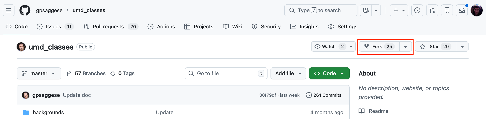

# How to Contribute

Contributions to the repository are done using the Fork and PR method. The steps
are:

1. Create an Issue
2. Fork the repository
3. Sync your fork with upstream
4. Create a new branch on your forked repository
5. Make and commit your changes
6. Create a pull request from your branch to the main repository
7. Wait for the pull request to be reviewed and merged

For more information about forks, see the
[GitHub Docs](https://docs.github.com/en/pull-requests/collaborating-with-pull-requests/working-with-forks/about-forks).

> **Note:** Shell commands below use the `>` prompt convention. See the
> [Conventions](#conventions) section at the bottom for details.

## Prerequisites

Before contributing, make sure you have:

- A [GitHub account](https://github.com)
- Git installed on your machine
- SSH keys configured for GitHub (see
  [GitHub Docs](https://docs.github.com/en/authentication/connecting-to-github-with-ssh))
- Basic familiarity with Git (clone, branch, commit, push)

**1- Create an Issue**

Create an issue to discuss the changes you want to make. Keep a record of the
issue number — you will reference it in your branch name, commit messages, and
pull request.

**2- Fork the repository**



A fork creates a copy of the repository in your GitHub account. This allows you
to make changes without affecting the original repository. Changes can be merged
back by creating a pull request.

This approach reduces noise from multiple commits and branches in the main
repository.

**3- Sync your fork with upstream**

Before creating a branch, add the original repository as an upstream remote and
sync your fork so you start from the latest code:

```bash
> git remote add upstream git@github.com:gpsaggese/umd_classes.git
> git fetch upstream
> git checkout main
> git merge upstream/main
```

**4- Create a new branch on your forked repository**

Clone your forked repository (not the original) and create a new branch that
includes the issue number. For example, for issue #42:

```bash
# Always clone your forked repository, not the original one.
> git clone git@github.com:{your_username}/umd_classes.git umd_classes
> cd umd_classes
> git checkout -b TutorTask{issue_number}_{short_description}
```

Example branch name: `TutorTask42_Add_Postgres_Tutorial`

**Note:** Always include the issue number in the branch name.

**5- Make and commit your changes**

Make your changes on the new branch. Stage and commit them with a message that
references the issue number:

```bash
> git add {file1} {file2}
> git commit -m "{commit message} (gpsaggese/umd_classes#{issue_number})"
> git push origin TutorTask{issue_number}_{short_description}
```

**Note:** The prefix `gpsaggese/umd_classes` is required to link the commit to
an issue in the original repository. If the issue is in your forked repository,
this prefix is not required.

**Note:** Prefer staging specific files (`git add {file}`) rather than `git add .`
to avoid accidentally including unintended changes.

**6- Create a pull request from your branch to the main repository**

Open a pull request from your branch to the main repository. Include the
following line in the pull request description to automatically close the issue
once the PR is merged:

```
Fixes gpsaggese/umd_classes#{issue_number}
```

**Note:** The `Fixes` keyword must appear at the start of a line to trigger
auto-close.

For more information about linking a pull request to an issue, see the
[GitHub Docs](https://docs.github.com/en/issues/tracking-your-work-with-issues/using-issues/linking-a-pull-request-to-an-issue).

**7- Wait for the pull request to be reviewed and merged**

Assign the expected reviewer under the **Reviewers** field (not the Assignees
field) in the pull request. Wait for the review and address any requested
changes before the PR is merged.

If conflicts arise between your branch and the main branch, sync your fork
(Step 3) and rebase or merge main into your branch before requesting a review.

# Conventions

- We indicate the execution of an OS command (e.g., Linux / macOS) from the
  terminal of your computer with:
  ```bash
  > ... Linux command ...
  ```

  E.g.,
  ```bash
  > echo "Hello world"
  Hello world
  ```

- We indicate the execution of a command inside a Docker container with:
  ```bash
  docker> ls
  ```

- We indicate the execution of a Postgres command from the `psql` client with:
  ```bash
  psql>
  ```
