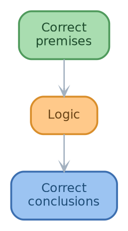
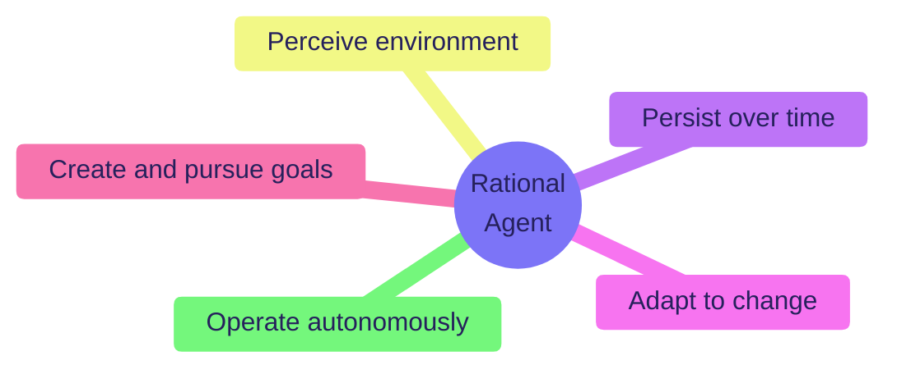

<!-- git_hash=0c2bbccf6-mfd timestamp=20260829_223610 -->

<!-- From: msml610/lectures_source/Lesson01.2-AI_and_Machine_Learning.smd:10 '# AI and Machine Learning' -->

# AI and Machine Learning

<!-- From: msml610/lectures_source/Lesson01.2-AI_and_Machine_Learning.smd:12 '## What Is AI?' -->

## What Is AI?

**ML, AI, and Intelligence.** Machine Learning (ML) is a subset of **Artificial
Intelligence (AI)**. It is often confused with related fields such as deep learning,
large-language models, and predictive analytics. To understand AI, we must first
explore the concept of **human intelligence**. Humans, known as _homo sapiens_, are
distinguished by their intelligence, which has been a subject of inquiry for
thousands of years. Despite the brain's small size, it can comprehend complex
phenomena like the theory of relativity and quantum mechanics. This raises the
question: how does the brain understand, predict, and manipulate a world more complex
than itself?
**Artificial Intelligence.** The term "Artificial Intelligence" was coined in 1956
The goals of AI include understanding human intelligence and creating intelligent
entities. As Richard Feynman famously said, _"What I cannot create, I do not
understand."_ AI applies to any human activity and task, with an impact that
surpasses any historical event. It generates significant economic value, with
projections of trillions in global impact by 2030. However, AI faces many unresolved
problems, unlike disciplines with settled core theories
{width=20%}
**AI Formal Definition.** AI is characterized along two key axes: Thinking vs. Acting
and Human vs. Rational (ideal performance). This results in four definitions of AI:
machines that can think humanly, think rationally, act humanly, and act rationally
The ultimate goal of AI is to build machines that **act rationally**

```text
|          | Human          | Rational         |
|----------|----------------|------------------|
| Thinking | Think humanly  | Think rationally |
| Acting   | Act humanly    | Act rationally   |
```

**1. AI as Thinking Humanly.** To build machines that think like humans, we must
first determine how humans think. This approach allows for the expression of a
precise theory of the human mind as a computer program. However, the workings of the
human mind remain largely unknown, making this an anthropocentric definition
**2. AI as Thinking Rationally.** This approach involves understanding the rules of
**correct thinking**. Logic, which studies the "laws of thought," is a key technique
here. Programs that engage in automatic theorem proving solve problems in logical
notation, though they may run indefinitely if no solution exists



**Thinking Rationally: Challenges.** Formalizing informal knowledge is difficult. For
example, defining a handshake involves complex interactions that are hard to capture
mathematically. Knowledge is often probabilistic, as seen in medical diagnoses
Scalability and the need for interaction with the world are additional challenges
**3. AI as Acting Humanly.** An **agent** perceives and acts to reach a goal. AI aims
to design agents that can act like humans. The **Turing test** is a technique used to
evaluate this capability. A computer passes the Turing test if a human cannot
distinguish its responses from those of a person
{width=25%}
**Turing Test: Pros and Cons.** The Turing test provides an operational definition of
intelligence, avoiding philosophical debates about consciousness. However, it defines
intelligence anthropomorphically and focuses on fooling humans
**4. AI as Acting Rationally.** **Rational agents** do the "right thing" given what
they know. They should operate autonomously, perceive their environment, persist over
time, adapt to change, and pursue goals



**Acting Rationally as Ultimate Goal of AI.** The focus should be on agents acting
rationally, as this is more fundamental than thinking rationally. Rationality is more
objective than human behavior, which is shaped by evolutionary conditions

```text
|          | Human          | Rational         |
|----------|----------------|------------------|
| Thinking | Think humanly  | Think rationally |
| Acting   | Act humanly    | *Act rationally* |
```

**Rationality Is Not Absolute.** AI aims to build agents that do the right thing, but
defining the _right thing_ is complex. For example, moral dilemmas in self-driving
cars highlight the challenges of defining rational actions
**Problems of a Rational Agent.** Rational agents must navigate probabilistic
environments, aiming for the best outcome given uncertainty. The classical answer to
what "best" means involves an objective function, but this is not always
straightforward. Limitations include the cost of acquiring data, computational
demands, and real-time decision-making
**Solution: "Satisficing."** Achieving _good enough_ outcomes instead of _perfect_
ones is a practical approach, as proposed by Herbert Simon

<!-- From: msml610/lectures_source/Lesson01.2-AI_and_Machine_Learning.smd:360 '## What Is Machine Learning?' -->

## What Is Machine Learning?

**Machine Learning: Definitions.** Machine learning is the field that enables
computers to learn without explicit programming. As Arthur Samuel stated, it involves
building machines that perform useful tasks without being explicitly programmed. For
example, a computer can learn to play checkers by playing against itself and
memorizing winning positions. More formally, a program learns from experience $E$
with respect to a task $T$ and a performance measure $P$ if $P(T)$ improves with
experience $E$
{width=20%}
**The 3 Machine Learning Assumptions.** Machine learning addresses practical problems
by gathering datasets, building statistical models, evaluating them, and deploying
them. The three core assumptions are: a pattern exists, it cannot be precisely
defined mathematically, and data is available. Data availability is the most
essential assumption, as progress is impossible without it
**AI vs ML vs Deep Learning.** AI involves machines programmed to reason, learn, and
act rationally. ML allows machines to perform tasks without explicit programming. AI
models that are not ML-based, such as rule-based systems, still qualify as AI. Deep
Learning (DL) is a subset of ML using neural networks with many layers. Large
Language Models (LLMs) are a subset of DL trained on massive text datasets

```tikz
% Define colors.
  \definecolor{AIcolor}{RGB}{244,166,166}    % Red/Pink
  \definecolor{MLcolor}{RGB}{178,226,178}    % Green
  \definecolor{DLcolor}{RGB}{160,214,209}    % Teal
  \definecolor{LLMcolor}{RGB}{198,166,244}   % Purple

  % Draw AI circle
  \fill[AIcolor] (0,0) circle (3);
  \draw (0,0) circle (3);
  \node[above] at (0,2) {\textbf{AI}};

  % Draw ML circle inside AI
  \fill[MLcolor] (0.5,-0.5) circle (2);
  \draw (0.5,-0.5) circle (2);
  \node[above] at (0.5,0.5) {\textbf{ML}};

  % Draw DL circle inside ML
  \fill[DLcolor] (1,-1) circle (1);
  \draw (1,-1) circle (1);
  \node[above] at (1,-0.6) {\textbf{DL}};

  % Draw LLM circle inside DL
  \fill[LLMcolor] (1.2,-1.2) circle (0.6);
  \draw (1.2,-1.2) circle (0.6);
  \node[above] at (1.2,-1.4) {\textbf{LLMs}};
```

**Limits of AI Compared to Human Intelligence (1/2).** AI and ML differ from human
intelligence. Machines do not learn like humans and have different limitations. For
instance, ML models are fragile to input variations and lack transfer learning
capabilities. They require massive data and compute resources and lack common sense
and reasoning
**Limits of AI Compared to Human Intelligence (2/2).** ML models often have opaque
decision-making processes, limiting trust and interpretability. They depend on narrow
objectives and are susceptible to bias and data quality issues. Additionally, they
lack embodiment and physical interaction, which are crucial for human cognition
**Key Takeaways.** AI should focus on **agents acting rationally** rather than
mimicking human thought or behavior. Despite their power, current ML/DL systems fall
short of human intelligence in areas like fragility, transfer learning, data
efficiency, and common-sense reasoning

```{=typst}
#import "/helpers_root/dev_scripts_helpers/typst/umd_references.typ": cite, references
#set text(size: 0.75em)
#references("/msml610/lectures_source/refs.bib")
```