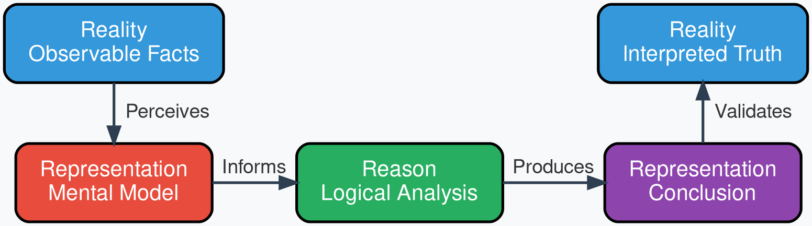

// #############################################################################
# Analytical Sophistication 1

```tikz
% Color definitions
\definecolor{c2c2c2a}{RGB}{44,44,42}
\definecolor{c5f5e5a}{RGB}{95,94,90}
\definecolor{c888780}{RGB}{136,135,128}
\definecolor{cb4b2a9}{RGB}{180,178,169}
\definecolor{cf1efe8}{RGB}{241,239,232}
\definecolor{c444441}{RGB}{68,68,65}
\definecolor{cd3d1c7}{RGB}{211,209,199}

\def\globalscale{1.000000}

\begin{tikzpicture}[
  y=1cm, x=1cm,
  yscale=\globalscale, xscale=\globalscale,
  every node/.append style={scale=\globalscale},
  inner sep=0pt, outer sep=0pt
]

  % Axes
  \path[draw=c2c2c2a,fill,line width=0.0318cm,->] (1.27, 11.9063) -- (1.27, 2.1167);
  \path[draw=c2c2c2a,fill,line width=0.0318cm,->] (1.27, 2.1167) -- (17.4625, 2.1167);

  % Axis labels
  \node[text=c5f5e5a,anchor=south,rotate=90.0] (text2) at (0.8467, 6.8792){Strategic value};
  \node[text=c5f5e5a,anchor=south] (text3) at (9.6254, 1.3816){Analytical sophistication};

  % Maturity curve
  \path[draw=c2c2c2a,line width=0.0454cm]
    (1.7992, 2.4342).. controls (3.1221, 2.4925) and (4.3127, 2.6092) .. (5.371, 2.8134)..
    controls (6.4294, 3.0176) and (7.2231, 3.2802) .. (8.0169, 3.601)..
    controls (8.8106, 3.9219) and (9.3398, 4.272) .. (10.0013, 4.7096)..
    controls (10.6627, 5.1472) and (11.3242, 5.6139) .. (12.065, 6.0515)..
    controls (12.8058, 6.4891) and (13.7054, 6.8975) .. (14.896, 7.3059)..
    controls (15.4252, 7.4518) and (16.3513, 7.5684) .. (17.145, 7.6851);

  % Vertical divider line
  \path[draw=c888780,fill,line width=0.0265cm,dash pattern=on 0.1323cm off 0.1058cm]
    (7.0699, 11.8004) -- (7.0699, 2.1167);

  % Historical view label
  \begin{scope}[shift={(1.0583, -0.5292)}]
    \path[draw=c2c2c2a,line width=0.0318cm,rounded corners=0.1323cm]
      (1.4817, 11.6946) rectangle (5.08, 10.9008);
    \node[text=c2c2c2a,anchor=south] (text4) at (3.2808, 11.1654){Historical view};
  \end{scope}

  % Future view label
  \begin{scope}[shift={(-3.4332, 8.026)}]
    \path[draw=c2c2c2a,line width=0.0318cm,rounded corners=0.1323cm]
      (14.0229, 3.175) rectangle (17.1979, 2.3812);
    \node[text=c2c2c2a,anchor=south] (text5) at (15.6104, 2.6458){Future view};
  \end{scope}

  % Raw data box
  \begin{scope}[shift={(-0.6588, 0.0721)}]
    \path[draw=cb4b2a9,fill=cf1efe8,line width=0.0132cm,rounded corners=0.1058cm]
      (2.3367, 2.2429) rectangle (4.3367, 3.2429);
    \node[text=c444441,anchor=center] (text6) at (3.3367, 2.7429){Raw data};
  \end{scope}

  % Descriptive statistics box
  \begin{scope}[shift={(-0.926, -0.3351)}]
    \path[draw=cb4b2a9,fill=cf1efe8,line width=0.0132cm,rounded corners=0.1058cm]
      (5.2971, 2.8602) rectangle (7.2971, 3.8602);
    \node[text=c444441,anchor=center] (text7) at (6.2971, 3.4852){Descriptive};
    \node[text=c444441,anchor=center] (text8) at (6.2971, 3.2352){statistics};
  \end{scope}

  % Side labels
  \node[text=c5f5e5a,anchor=south] (text9) at (4.2981, 9.5955){What happened?};
  \node[text=c5f5e5a,anchor=south] (text9-9) at (12.2905, 9.7319){What will happen?};

  % Predictive models box
  \begin{scope}[shift={(-0.9855, -1.2198)}]
    \node[text=c5f5e5a,anchor=south] (text10) at (9.4192, 6.2442){What will};
    \node[text=c5f5e5a,anchor=south] (text11) at (9.525, 5.8738){happen?};
    \path[draw=c888780,fill=cd3d1c7,line width=0.0132cm,rounded corners=0.1058cm]
      (8.525, 4.5271) rectangle (10.525, 5.5271);
    \node[text=c2c2c2a,anchor=center] (text12) at (9.525, 5.1521){Predictive};
    \node[text=c2c2c2a,anchor=center] (text13) at (9.525, 4.9021){models};
  \end{scope}

  % Prescriptive model box
  \begin{scope}[shift={(-0.9525, -2.0108)}]
    \node[text=c5f5e5a,anchor=south] (text14) at (12.0798, 8.3078){What should};
    \node[text=c5f5e5a,anchor=south] (text15) at (12.0798, 7.9903){we do?};
    \path[draw=c888780,fill=cd3d1c7,line width=0.0132cm,rounded corners=0.1058cm]
      (11.0385, 6.7231) rectangle (13.0385, 7.7231);
    \node[text=c2c2c2a,anchor=center] (text16) at (12.0385, 7.3481){Prescriptive};
    \node[text=c2c2c2a,anchor=center] (text17) at (12.0385, 7.0981){model};
  \end{scope}

  % Simulation box
  \begin{scope}[shift={(0.2117, -3.7116)}]
    \node[text=c5f5e5a,anchor=south] (text18) at (12.9467, 11.1124){What is the best};
    \node[text=c5f5e5a,anchor=south] (text19) at (12.9467, 10.8213){we can do?};
    \path[draw=c888780,fill=cd3d1c7,line width=0.0132cm,rounded corners=0.1058cm]
      (11.9117, 9.6600) rectangle (13.9117, 10.6600);
    \node[text=c2c2c2a,anchor=center] (text20) at (12.9117, 10.1600){Simulation};
  \end{scope}

  % Optimization box
  \begin{scope}[shift={(0.3969, -2.0339)}]
    \begin{scope}[shift={(0.0, -2.1167)}]
      \node[text=c5f5e5a,anchor=south] (text21) at (15.7163, 12.3296){What is the best};
      \node[text=c5f5e5a,anchor=south] (text22) at (15.7163, 12.0385){course to take?};
      \path[draw=c888780,fill=cd3d1c7,line width=0.0132cm,rounded corners=0.1058cm]
        (14.6369, 10.9565) rectangle (16.6369, 11.9565);
      \node[text=c2c2c2a,anchor=center] (text23) at (15.6369, 11.4565){Optimization};
    \end{scope}
  \end{scope}

\end{tikzpicture}
```

// #############################################################################
# Analytical Sophistication 2

```latex
\usepackage{tikz}
\usetikzlibrary{arrows.meta,positioning}

\begin{document}

\begin{tikzpicture}[
  >={Latex[scale=1.0]},
  box/.style={
    rectangle,
    rounded corners=4pt,
    draw=black,
    thick,
    fill=white,
    text centered,
    minimum width=2.4cm,
    minimum height=0.7cm,
    font=\footnotesize,
    inner sep=3pt
  },
  fbox/.style={
    rectangle,
    rounded corners=4pt,
    draw=black,
    thick,
    fill=white,
    text centered,
    minimum width=2.6cm,
    minimum height=0.95cm,
    font=\footnotesize,
    align=center,
    inner sep=3pt
  }
]

% Axes
\draw[->,thick] (0,0) -- (0,8) node[above,font=\small\bfseries] {Strategic Value};
\draw[->,thick] (0,0) -- (10,0) node[right,font=\small\bfseries] {Analytical Sophistication};

% Dashed vertical line separating past and future views
\draw[dashed,thick,gray] (4.5,-0.3) -- (4.5,7.7);

% Diagonal progression guide (all boxes lie on this line)
\draw[dotted,gray,thick] (0,0.04) -- (9.5,8.18);

% Past View boxes (diagonal: y = 0.857 x + 0.043)
\node[box] (raw)   at (1.0,0.9) {Raw Data};
\node[box] (clean) at (2.4,2.1) {Clean Data};
\node[box] (desc)  at (3.8,3.3) {Descriptive Stats};

% Future View boxes (continuing diagonal); each shows its question in italics
\node[fbox] (pred)  at (5.2,4.5)
  {Predictive Models\\[-1pt]{\scriptsize\itshape ``What will happen?''}};
\node[fbox] (presc) at (6.6,5.7)
  {Prescriptive Models\\[-1pt]{\scriptsize\itshape ``What should we do?''}};
\node[fbox] (sim)   at (8.0,6.9)
  {Simulation / Optimization\\[-1pt]{\scriptsize\itshape ``What's the best we can do?''}};

% Black arrows connecting sequential steps
\draw[->,thick] (raw)   -- (clean);
\draw[->,thick] (clean) -- (desc);
\draw[->,thick] (desc)  -- (pred);
\draw[->,thick] (pred)  -- (presc);
\draw[->,thick] (presc) -- (sim);

% Section labels (below x-axis)
\node[font=\small\bfseries] at (2.0,-0.7) {Past View};
\node[font=\footnotesize\itshape] at (2.0,-1.1) {``What happened?''};
\node[font=\small\bfseries] at (7.0,-0.7) {Future View};
\node[font=\footnotesize\itshape] at (7.0,-1.1) {``What will happen?''};

\end{tikzpicture}

\end{document}
```

# Analytical Sophistication (SVG)

```svg
<svg viewBox="0 0 1010 665" xmlns="http://www.w3.org/2000/svg" font-family="Helvetica, Arial, sans-serif">
  <!--
    Coordinate mapping from TikZ (cm) to SVG (px):
    scale = 50 px/cm, y flipped: svg_y = (630 + 35) - (tikz_y * 50)
    (extra 35px top margin added so the topmost question label isn't clipped)
    x: svg_x = tikz_x * 50
  -->
  <defs>
    <marker id="arrowhead" markerWidth="10" markerHeight="10" refX="8" refY="3" orient="auto" markerUnits="strokeWidth">
      <path d="M0,0 L8,3 L0,6 Z" fill="#2d2d2d"/>
    </marker>
  </defs>

  <rect x="0" y="0" width="1010" height="665" fill="white"/>
  <g transform="translate(0,35)">

  <!-- ============ Axes ============ -->
  <!-- Y axis: from (50, 630) up to (50, 70) with arrow -->
  <line x1="50" y1="630" x2="50" y2="60" stroke="#2d2d2d" stroke-width="1.2" marker-end="url(#arrowhead)"/>
  <!-- X axis: from (50, 630) to (1010, 630) with arrow -->
  <line x1="50" y1="630" x2="990" y2="630" stroke="#2d2d2d" stroke-width="1.2" marker-end="url(#arrowhead)"/>

  <!-- Axis titles -->
  <text x="16" y="350" fill="#6e6e6c" font-size="15" text-anchor="middle" transform="rotate(-90 16 350)">STRATEGIC VALUE</text>
  <text x="520" y="655" fill="#6e6e6c" font-size="15" text-anchor="middle">ANALYTICAL SOPHISTICATION</text>

  <!-- ============ Dashed divider between Historical / Future ============ -->
  <line x1="410" y1="605" x2="410" y2="25" stroke="#aaaaa5" stroke-width="1.3" stroke-dasharray="7,6"/>

  <!-- ============ View tag pills ============ -->
  <!-- Historical view pill -->
  <rect x="67.5" y="0" width="160" height="35" rx="17" ry="17" fill="white" stroke="#3c3c3a" stroke-width="1.2"/>
  <text x="147.5" y="22.5" fill="#2d2d2d" font-size="14" font-weight="bold" text-anchor="middle">HISTORICAL VIEW</text>

  <!-- Future view pill -->
  <rect x="730" y="0" width="145" height="35" rx="17" ry="17" fill="white" stroke="#3c3c3a" stroke-width="1.2"/>
  <text x="802.5" y="22.5" fill="#2d2d2d" font-size="14" font-weight="bold" text-anchor="middle">FUTURE VIEW</text>

  <!-- ============ Maturity curve ============ -->
  <path d="M 77.5,547.5
           C 155,544 222.5,537.5 280,470
           C 337.5,402.5 377.5,386 417.5,362.5
           C 457.5,339 487.5,315 522.5,287.5
           C 557.5,260 592.5,232.5 632.5,207.5
           C 672.5,182.5 727.5,155 800,127.5
           C 842.5,111.5 885,102.5 930,97.5"
        fill="none" stroke="#285a96" stroke-width="2.4"/>

  <!-- ============ Stage 1: Raw data ============ -->
  <rect x="87.5" y="497.5" width="100" height="40" rx="4" ry="4" fill="#f6f7f8" stroke="#c6c8ca" stroke-width="1.2"/>
  <text x="137.5" y="522.5" fill="#2d2d2d" font-size="14" font-weight="bold" text-anchor="middle">Raw data</text>

  <!-- ============ Stage 2: Descriptive statistics ============ -->
  <rect x="242.5" y="432.5" width="100" height="50" rx="4" ry="4" fill="#f6f7f8" stroke="#c6c8ca" stroke-width="1.2"/>
  <text x="292.5" y="453" fill="#2d2d2d" font-size="14" font-weight="bold" text-anchor="middle">Descriptive</text>
  <text x="292.5" y="468" fill="#2d2d2d" font-size="14" font-weight="bold" text-anchor="middle">statistics</text>

  <!-- Question label: What happened? -->
  <text x="137.5" y="402.5" fill="#6e6e6c" font-size="14" font-style="italic" text-anchor="middle">What happened?</text>

  <!-- ============ Stage 3: Predictive models ============ -->
  <rect x="397.5" y="357.5" width="100" height="50" rx="4" ry="4" fill="#e0edf6" stroke="#97bed8" stroke-width="1.2"/>
  <text x="447.5" y="378" fill="#1e466e" font-size="14" font-weight="bold" text-anchor="middle">Predictive</text>
  <text x="447.5" y="393" fill="#1e466e" font-size="14" font-weight="bold" text-anchor="middle">models</text>
  <text x="447.5" y="327.5" fill="#6e6e6c" font-size="14" font-style="italic" text-anchor="middle">What will happen?</text>

  <!-- ============ Stage 4: Prescriptive model ============ -->
  <rect x="552.5" y="277.5" width="100" height="50" rx="4" ry="4" fill="#e0edf6" stroke="#97bed8" stroke-width="1.2"/>
  <text x="602.5" y="298" fill="#1e466e" font-size="14" font-weight="bold" text-anchor="middle">Prescriptive</text>
  <text x="602.5" y="313" fill="#1e466e" font-size="14" font-weight="bold" text-anchor="middle">model</text>
  <text x="602.5" y="247.5" fill="#6e6e6c" font-size="14" font-style="italic" text-anchor="middle">What should we do?</text>

  <!-- ============ Stage 5: Simulation ============ -->
  <text x="777.5" y="139" fill="#6e6e6c" font-size="14" font-style="italic" text-anchor="middle">What is the</text>
  <text x="777.5" y="154" fill="#6e6e6c" font-size="14" font-style="italic" text-anchor="middle">best we can do?</text>
  <rect x="727.5" y="177.5" width="100" height="50" rx="4" ry="4" fill="#e0edf6" stroke="#97bed8" stroke-width="1.2"/>
  <text x="777.5" y="207.5" fill="#1e466e" font-size="14" font-weight="bold" text-anchor="middle">Simulation</text>

  <!-- ============ Stage 6: Optimization ============ -->
  <text x="902.5" y="22.5" fill="#6e6e6c" font-size="14" font-style="italic" text-anchor="middle">What is the best</text>
  <text x="902.5" y="37.5" fill="#6e6e6c" font-size="14" font-style="italic" text-anchor="middle">course to take?</text>
  <rect x="852.5" y="77.5" width="100" height="50" rx="4" ry="4" fill="#e0edf6" stroke="#97bed8" stroke-width="1.2"/>
  <text x="902.5" y="107.5" fill="#1e466e" font-size="14" font-weight="bold" text-anchor="middle">Optimization</text>

  </g>
</svg>
```

# Analytical Sophistication 3

```
\documentclass[border=12pt]{standalone}
\usepackage{tikz}
\usepackage{xcolor}
\usetikzlibrary{positioning, arrows.meta, calc, fit, backgrounds}

\begin{document}

\definecolor{axisInk}{RGB}{45,45,45}
\definecolor{labelInk}{RGB}{110,110,108}
\definecolor{curveInk}{RGB}{40,90,150}
\definecolor{dividerInk}{RGB}{170,170,165}
\definecolor{tagBorder}{RGB}{60,60,58}
\definecolor{histFill}{RGB}{246,247,248}
\definecolor{histBorder}{RGB}{198,200,202}
\definecolor{futFill}{RGB}{224,237,246}
\definecolor{futBorder}{RGB}{151,190,216}
\definecolor{futTextInk}{RGB}{30,70,110}

\begin{tikzpicture}[
  every node/.style={font=\sffamily}
]

% ============ Canvas guides ============
% Plot area roughly x: 0 to 17.6, y: 0 to 11
\def\xmin{0}
\def\xmax{20.2}
\def\ymin{0}
\def\ymax{12.6}
\def\xaxisY{1.4}     % y position of x-axis
\def\yaxisX{1.0}      % x position of y-axis

% ============ Axes ============
\draw[axisInk, line width=0.5pt, -{Latex[length=2.4mm]}] (\yaxisX, \xaxisY) -- (\yaxisX, \ymax);
\draw[axisInk, line width=0.5pt, -{Latex[length=2.4mm]}] (\yaxisX, \xaxisY) -- (\xmax, \xaxisY);

% Axis titles
\node[labelInk, font=\sffamily\small, rotate=90, anchor=south] at (0.32, 7.0) {STRATEGIC VALUE};
\node[labelInk, font=\sffamily\small, anchor=north] at ({(\yaxisX+\xmax)/2}, \xaxisY-0.35) {ANALYTICAL SOPHISTICATION};

% ============ Dashed divider between Historical / Future ============
\def\dividerX{7.35}
\draw[dividerInk, line width=0.5pt, dash pattern=on 3pt off 2.4pt] (\dividerX, 12.1) -- (\dividerX, \xaxisY);

% ============ View tag pills ============
% Historical view pill (centered in left side)
\draw[tagBorder, line width=0.7pt, rounded corners=9pt, fill=white]
  (2.575, 11.9) rectangle (5.775, 12.6);
\node[axisInk, font=\sffamily\bfseries\small] at (4.175, 12.25) {HISTORICAL VIEW};
\node[labelInk, font=\sffamily\small] at (4.175, 11.3) {What happened?};

% Future view pill (centered in right side)
\draw[tagBorder, line width=0.7pt, rounded corners=9pt, fill=white]
  (12.325, 11.9) rectangle (15.225, 12.6);
\node[axisInk, font=\sffamily\bfseries\small] at (13.775, 12.25) {FUTURE VIEW};
\node[labelInk, font=\sffamily\small] at (13.775, 11.3) {What will happen?};

% ============ Maturity curve ============
\draw[curveInk, line width=1.5pt]
  (1.55, 1.65)
  .. controls (3.1, 1.72) and (4.45, 1.85) .. (5.6, 2.15)
  .. controls (6.75, 2.45) and (7.55, 2.78) .. (8.35, 3.25)
  .. controls (9.15, 3.72) and (9.75, 4.2) .. (10.45, 4.75)
  .. controls (11.15, 5.3) and (11.85, 5.85) .. (12.65, 6.35)
  .. controls (13.45, 6.85) and (14.55, 7.4) .. (16.0, 7.95)
  .. controls (16.85, 8.27) and (17.7, 8.45) .. (18.6, 8.55);

% (dot markers removed — boxes already anchor each stage along the curve)

% ============ Stage 1: Raw data ============
\draw[histBorder, line width=0.7pt, rounded corners=4pt, fill=histFill]
  (1.6, 1.2) rectangle (3.6, 2.2);
\node[axisInk, font=\sffamily\small\bfseries] at (2.6, 1.7) {Raw data};

% ============ Stage 2: Descriptive statistics ============
\draw[histBorder, line width=0.7pt, rounded corners=4pt, fill=histFill]
  (4.8, 2.7) rectangle (6.8, 3.7);
\node[axisInk, font=\sffamily\small\bfseries] at (5.8, 3.35) {Descriptive};
\node[axisInk, font=\sffamily\small\bfseries] at (5.8, 3.05) {statistics};

% ============ Stage 3: Predictive models ============
\draw[futBorder, line width=0.7pt, rounded corners=4pt, fill=futFill]
  (8.0, 3.8) rectangle (10.0, 4.8);
\node[futTextInk, font=\sffamily\small\bfseries] at (9.0, 4.45) {Predictive};
\node[futTextInk, font=\sffamily\small\bfseries] at (9.0, 4.15) {models};

% ============ Stage 4: Prescriptive model ============
\draw[futBorder, line width=0.7pt, rounded corners=4pt, fill=futFill]
  (11.2, 5.35) rectangle (13.2, 6.35);
\node[futTextInk, font=\sffamily\small\bfseries] at (12.2, 5.95) {Prescriptive};
\node[futTextInk, font=\sffamily\small\bfseries] at (12.2, 5.65) {model};
\node[labelInk, font=\sffamily\small] at (12.2, 7.0) {What should we do?};

% ============ Stage 5: Simulation ============
\draw[futBorder, line width=0.7pt, rounded corners=4pt, fill=futFill]
  (14.4, 6.7) rectangle (16.4, 7.7);
\node[futTextInk, font=\sffamily\small\bfseries] at (15.4, 7.2) {Simulation};
\node[labelInk, font=\sffamily\small, align=center] at (15.4, 8.0) {What is the\\best we can do?};

% ============ Stage 6: Optimization ============
\draw[futBorder, line width=0.7pt, rounded corners=4pt, fill=futFill]
  (17.6, 8.0) rectangle (19.6, 9.0);
\node[futTextInk, font=\sffamily\small\bfseries] at (18.6, 8.5) {Optimization};
\node[labelInk, font=\sffamily\small, align=center] at (18.6, 9.3) {What is the best\\course to take?};

\end{tikzpicture}

\end{document}
```

// #############################################################################
# Hotel Pricing Paradox

```svg
<?xml version="1.0" encnoding="UTF-8" standalone="no"?>
<svg
   viewBox="0 0 680 470"
   role="img"
   version="1.1"
   id="svg23"
   sodipodi:docname="input.svg"
   inkscape:version="1.4.3 (0d15f75, 2025-12-25)"
   xmlns:inkscape="http://www.inkscape.org/namespaces/inkscape"
   xmlns:sodipodi="http://sodipodi.sourceforge.net/DTD/sodipodi-0.dtd"
   xmlns="http://www.w3.org/2000/svg"
   xmlns:svg="http://www.w3.org/2000/svg">
  <sodipodi:namedview
     id="namedview23"
     pagecolor="#ffffff"
     bordercolor="#000000"
     borderopacity="0.25"
     inkscape:showpageshadow="2"
     inkscape:pageopacity="0.0"
     inkscape:pagecheckerboard="0"
     inkscape:deskcolor="#d1d1d1"
     inkscape:zoom="1.2852941"
     inkscape:cx="340"
     inkscape:cy="235.35469"
     inkscape:window-width="1504"
     inkscape:window-height="1172"
     inkscape:window-x="0"
     inkscape:window-y="25"
     inkscape:window-maximized="0"
     inkscape:current-layer="svg23"
     showgrid="false" />
  <title
     id="title1">Reality vs naive prediction in causal inference for hotel pricing</title>
  <desc
     id="desc1">Two side-by-side panels: the left &quot;Reality&quot; panel shows demand causing both price and occupancy to rise (a confounded correlation); the right &quot;Naive prediction&quot; panel shows that intervening on price will not increase occupancy. A summary bar at the bottom states correlation does not imply causation.</desc>
  <defs
     id="defs2">
    <marker
       id="arrow"
       viewBox="0 0 10 10"
       refX="8"
       refY="5"
       markerWidth="6"
       markerHeight="6"
       orient="auto-start-reverse">
      <path
         d="M2 1L8 5L2 9"
         fill="none"
         stroke="context-stroke"
         stroke-width="1.5"
         stroke-linecap="round"
         stroke-linejoin="round"
         id="path1" />
    </marker>
    <marker
       id="arrow-bold"
       viewBox="0 0 10 10"
       refX="8"
       refY="5"
       markerWidth="7"
       markerHeight="7"
       orient="auto-start-reverse">
      <path
         d="M2 1L8 5L2 9"
         fill="none"
         stroke="context-stroke"
         stroke-width="2"
         stroke-linecap="round"
         stroke-linejoin="round"
         id="path2" />
    </marker>
  </defs>
  <style
     id="style2">
    .t, .ts, .th { font-family: -apple-system, &quot;Segoe UI&quot;, system-ui, sans-serif; fill: #1f2937; }
    .th { font-size: 14px; font-weight: 500; }
    .ts { font-size: 12px; font-weight: 400; }

    .c-purple-fill { fill: #f5f3ff; }
    .c-purple-stroke { stroke: #7c3aed; }
    .c-purple-text { fill: #5b21b6; }

    .c-teal-fill { fill: #f0fdfa; }
    .c-teal-stroke { stroke: #0d9488; }
    .c-teal-text { fill: #115e59; }

    .c-coral-fill { fill: #fef2f2; }
    .c-coral-stroke { stroke: #dc2626; }
    .c-coral-text { fill: #991b1b; }

    .c-gray-fill { fill: #f9fafb; }
    .c-gray-stroke { stroke: #6b7280; }
    .c-gray-text { fill: #374151; }

    .arrow-purple { fill: none; stroke: #7c3aed; stroke-width: 1.5; }
    .arrow-coral-bold { fill: none; stroke: #dc2626; stroke-width: 2.5; }
    .dashed-corr { fill: none; stroke: #0d9488; stroke-width: 1; stroke-dasharray: 5 3; opacity: 0.7; }

    .axis-line { stroke: #9ca3af; stroke-width: 1.5; fill: none; }
    .chart-teal-solid { stroke: #0d9488; stroke-width: 1.8; fill: none; }
    .chart-purple-dashed { stroke: #7c3aed; stroke-width: 1.5; fill: none; stroke-dasharray: 4 3; }
    .chart-coral-solid { stroke: #dc2626; stroke-width: 1.8; fill: none; }
    .chart-teal-dashed { stroke: #0d9488; stroke-width: 1.5; fill: none; stroke-dasharray: 4 3; }

    .panel-divider { stroke: #e5e7eb; stroke-width: 1; }
  </style>
  <rect
     x="42.5"
     y="40"
     width="290"
     height="330"
     fill="none"
     stroke="#7c3aed"
     stroke-width="4"
     rx="8"
     id="rect12"
     style="stroke-width:3;stroke-dasharray:none" />
  <rect
     x="338.89023"
     y="40"
     width="290"
     height="330"
     fill="none"
     stroke="#dc2626"
     stroke-width="4"
     rx="8"
     id="rect13"
     style="stroke-width:3;stroke-dasharray:none" />
  <!-- ============ LEFT PANEL: Reality ============ -->
  <text
     class="th c-purple-text"
     x="182.33409"
     y="58.112122"
     text-anchor="middle"
     id="text2"><tspan
       style="font-weight:bold"
       id="tspan23">Reality</tspan></text>
  <!-- Demand box (purple, top of tree) -->
  <rect
     class="c-purple-fill c-purple-stroke"
     x="140"
     y="75"
     width="80"
     height="36"
     rx="4"
     stroke-width="1.5"
     id="rect2" />
  <text
     class="th c-purple-text"
     x="180"
     y="98"
     text-anchor="middle"
     id="text3">Demand ↑</text>
  <!-- Branching arrows down-left and down-right -->
  <path
     class="arrow-purple"
     d="M 165 111 L 110 158"
     marker-end="url(#arrow)"
     id="path3" />
  <path
     class="arrow-purple"
     d="M 195 111 L 250 158"
     marker-end="url(#arrow)"
     id="path4" />
  <!-- Price box (teal, lower-left) -->
  <rect
     class="c-teal-fill c-teal-stroke"
     x="60"
     y="160"
     width="80"
     height="36"
     rx="4"
     stroke-width="1.5"
     id="rect4" />
  <text
     class="th c-teal-text"
     x="100"
     y="183"
     text-anchor="middle"
     id="text4">Price ↑</text>
  <!-- Occupancy box (teal, lower-right) -->
  <rect
     class="c-teal-fill c-teal-stroke"
     x="220"
     y="160"
     width="100"
     height="36"
     rx="4"
     stroke-width="1.5"
     id="rect5" />
  <text
     class="th c-teal-text"
     x="270"
     y="183"
     text-anchor="middle"
     id="text5">Occupancy ↑</text>
  <!-- Dashed correlation line between Price and Occupancy -->
  <path
     class="dashed-corr"
     d="M 140 178 L 220 178"
     id="path5" />
  <text
     class="ts c-teal-text"
     x="180"
     y="216"
     text-anchor="middle"
     id="text6">Correlated</text>
  <text
     class="ts c-gray-text"
     x="180"
     y="232"
     text-anchor="middle"
     id="text7">(both caused by demand)</text>
  <!-- Mini line chart (Reality): both curves rise with demand -->
  <g
     transform="translate(60,262)"
     id="g12">
    <path
       class="axis-line"
       d="M 0,80 H 240"
       id="path7" />
    <path
       class="axis-line"
       d="M 0,0 V 80"
       id="path8" />
    <!-- price: solid teal, rising -->
    <path
       class="chart-teal-solid"
       d="M 5,70 Q 60,56 120,36 180,16 235,8"
       id="path9" />
    <!-- occupancy: dashed purple, rising in parallel -->
    <path
       class="chart-purple-dashed"
       d="M 5,73 Q 60,60 120,40 180,20 235,13"
       id="path10" />
    <text
       class="ts c-gray-text"
       x="120"
       y="95"
       text-anchor="middle"
       id="text10">Demand →</text>
    <!-- legend -->
    <line
       x1="10"
       y1="10"
       x2="30"
       y2="10"
       stroke="#0d9488"
       stroke-width="1.8"
       id="line10" />
    <text
       class="ts c-teal-text"
       x="35"
       y="13"
       id="text11">Price</text>
    <line
       x1="10"
       y1="26"
       x2="30"
       y2="26"
       stroke="#7c3aed"
       stroke-width="1.5"
       stroke-dasharray="4, 3"
       id="line11" />
    <text
       class="ts c-purple-text"
       x="35"
       y="29"
       id="text12">Occupancy</text>
  </g>
  <!-- Panel enclosing boxes -->
  <!-- Vertical divider -->
  <!-- ============ RIGHT PANEL: Naive prediction (wrong) ============ -->
  <text
     class="th c-coral-text"
     x="482.33414"
     y="58.112122"
     text-anchor="middle"
     id="text13"><tspan
       style="font-weight:bold"
       id="tspan24">Naive prediction (wrong)</tspan></text>
  <!-- Raise price box (coral, top of chain) -->
  <rect
     class="c-coral-fill c-coral-stroke"
     x="420"
     y="75"
     width="120"
     height="36"
     rx="4"
     stroke-width="1.5"
     id="rect14" />
  <text
     class="th c-coral-text"
     x="480"
     y="98"
     text-anchor="middle"
     id="text14">Raise price</text>
  <!-- Bold red downward arrow -->
  <path
     class="arrow-coral-bold"
     d="m 480,112 v 46"
     marker-end="url(#arrow-bold)"
     id="path14" />
  <!-- Sell more rooms? box (coral, bottom of chain) -->
  <rect
     class="c-coral-fill c-coral-stroke"
     x="400"
     y="160"
     width="160"
     height="36"
     rx="4"
     stroke-width="1.5"
     id="rect15" />
  <text
     class="th c-coral-text"
     x="480"
     y="183"
     text-anchor="middle"
     id="text15">Sell more rooms?</text>
  <!-- Big red ✕ -->
  <text
     x="401.85355"
     y="232"
     text-anchor="middle"
     font-family="'-apple-system', system-ui, sans-serif"
     font-size="32px"
     font-weight="700"
     fill="#dc2626"
     id="text16">✕</text>
  <!-- Caption beneath the X -->
  <text
     class="ts c-gray-text"
     x="495.49774"
     y="218.59375"
     text-anchor="middle"
     id="text17">Demand didn't change —</text>
  <text
     class="ts c-gray-text"
     x="491.60736"
     y="232.66812"
     text-anchor="middle"
     id="text18">Occupancy will fall</text>
  <!-- Mini line chart (Naive): price climbs, occupancy flattens then drops -->
  <g
     transform="translate(360,262.16591)"
     id="g23">
    <path
       class="axis-line"
       d="M 0,80 H 240"
       id="path18" />
    <path
       class="axis-line"
       d="M 0,0 V 80"
       id="path19" />
    <!-- price: solid coral, climbing -->
    <path
       class="chart-coral-solid"
       d="M 5,70 Q 60,55 120,38 180,21 235,25"
       id="path20" />
    <!-- occupancy: dashed teal, flat then falling -->
    <path
       class="chart-teal-dashed"
       d="m 5,48 75,2 q 60,3 100,14 40,11 55,12"
       id="path21" />
    <text
       class="ts c-gray-text"
       x="120"
       y="95"
       text-anchor="middle"
       id="text21">Time after price hike →</text>
    <!-- legend -->
    <line
       x1="10"
       y1="0"
       x2="30"
       y2="0"
       stroke="#dc2626"
       stroke-width="1.8"
       id="line21" />
    <text
       class="ts c-coral-text"
       x="35.553787"
       y="2.4560637"
       id="text22">Price</text>
    <line
       x1="10"
       y1="16"
       x2="30"
       y2="16"
       stroke="#0d9488"
       stroke-width="1.5"
       stroke-dasharray="4, 3"
       id="line22" />
    <text
       class="ts c-teal-text"
       x="35"
       y="19"
       id="text23">Occupancy</text>
  </g>
</svg>
```

// Lesson03.1-Knowledge_representation.txt

# L03.1_Grounding


